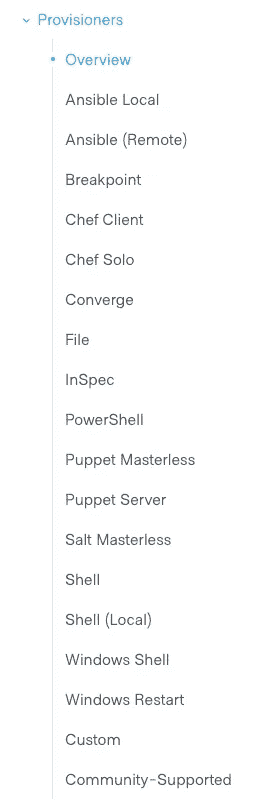

# 如何构建定制的 ami 来提升您的基础设施

> 原文：<https://levelup.gitconnected.com/how-to-build-tailored-amis-to-level-up-your-infrastructure-5129878dbccd>


戴维·莱夫克在 [Unsplash](https://unsplash.com?utm_source=medium&utm_medium=referral) 上拍摄的照片

在每个人的基础设施之旅中，总有一天你必须构建自己的 AWS AMIs。您不必在每次调配实例时都进行配置，而是创建一个预加载了以下内容的映像:

*   所需的应用程序/工具/脚本
*   用所有最新的软件包打补丁
*   操作系统的安全强化
*   关于您的环境的信息，以便它可以联机并立即开始工作。
*   等等…

我不认为我必须向任何人推销为什么以上所有的东西都很好。它还可以节省您的时间和精力，因为它只在创建映像本身时执行一次，而不是针对每个实例。

自定义图像的另一个好处是“宠物”与“羊”的概念。当您的映像预加载了您需要的所有内容后，您可以根据需要销毁和重建您的服务器。您的服务器变成了绵羊，可以根据需要更换。相比之下，服务器每次构建时都需要重新配置。不要在需要的时候摧毁服务器/宠物，你必须照顾好它们以及随之而来的所有困难(例如，不断地打补丁、更新、出于安全原因的加固等等)

平心而论，您可以通过使用诸如 Puppet、Nomad 或 Ansible 之类的东西来减少普通图像的痛苦。这种方法的问题是这些工具在构建时运行。因此，当服务器启动时，这些工具将需要 10–20 分钟来配置它。相比之下，定制映像可以立即使用，或者需要一两分钟才能使用。

现在我们已经了解了一些问题和好处，我们需要设计如何构建我们的自定义映像。

在构建自定义映像时，就像任何自动化一样，我们希望确保做出明智的决策。我们需要生产这样的东西:

*   使用方便
*   能够自动化
*   可攀登的
*   易于更新
*   安全的
*   DRY —减少/消除复制和粘贴代码的需要

对于我们的自定义图像，这是外观的轮廓:

*   我们将创建一个基础映像，其中包含所有服务器类型所需的所有一般依赖项(例如修补、监控工具、操作系统强化)。
*   所有其他映像将使用基础映像作为起点，然后添加特定功能映像所需的任何其他工具/应用程序/配置(例如 bastion 服务器、Kubernetes 节点)。
*   所有图像/ami 将由一个中央 AWS 帐户托管。从中央帐户，图像将与我们的其他 AWS 帐户共享。这使我们能够从单个帐户管理映像，减少了配置时间，有助于保持干燥，并且总体上使该设置更易于使用/管理。
*   打包程序将用于创建图像
*   Ansible 将用于配置图像
*   Terraform 将在构建时引导从映像创建的实例。
*   图像将不包含任何秘密/API 密钥/密码。这些将由 Terraform 作为引导过程的一部分提供。这更安全，也使图像更具可扩展性。

Packer、Ansible 和 Terraform 将在各自的专门章节中进行解释。我还将在“让我们开始构建吧！”中包含代码或参考资料，可以帮助您开始使用自定义图像部分。

# 包装工人

对于那些不熟悉的人来说， [Packer](https://www.packer.io/) 是 Hashicorp 家族的一员(所以你知道这将会很神奇)。它通过以下方式自动创建机器映像:

*   创建临时实例
*   根据您提供的说明配置临时实例
*   从临时实例创建映像
*   终止临时实例

**注**:从 Packer 1 . 5 . 0 开始，Packer 中增加了对 HCL 的支持。下面所有的例子都是在 HCL 中。如果您有一个较旧版本的 Packer，并且不想升级，那么您需要将示例转换成相关的 JSON。[这个文档可以帮助你从 JSON 过渡到 HCL](https://www.packer.io/guides/hcl/from-json-v1) 。

# Ansible

Ansible 是一个服务器配置工具。想想像木偶，木偶螺栓，厨师，盐等工具…你会在同一个球场。它允许您使用代码配置您的服务器。“封隔器”部分的要点之一是:

> 根据您提供的说明配置临时实例

当通过 Packer 配置您的映像时，您可以使用所谓的置备程序。看一下 Packer 的文档，您会发现有许多选项:



包装供应商

我们选择使用“Ansible ”,因为我们已经有一个 Ansible 代码库来配置/维护我们现有的“pet”。如果你已经在使用厨师、木偶、盐等等，我强烈建议你使用相关的供应器。这将允许您重用现有的代码，并利用您已经拥有的技能。

唯一的警告是，我建议避免任何像“Shell”或“Windows Shell”这样的提供程序。虽然编写一个快速的 bash 脚本或等效程序可能很诱人，但它就是不可伸缩，并且最终会变得太复杂而难以管理。

举个例子，我可以通过使用[这个角色](https://github.com/dev-sec/ansible-os-hardening)来强化我的图像。想象一下，管理同样的事情需要多少行 bash 代码？此外，即使您编写了 bash 来匹配这个角色，您也必须维护所有这些脚本，以确保它们符合最佳实践。使用 Ansible 角色只需要 5 分钟，由供应商维护。bash 脚本可能需要几个小时，然后增加了额外的开销，因为我必须维护它们。

正如您将在下面的示例代码中看到的，我们还使用了“Inspec”。这个置备程序允许我们验证我们的映像是否得到了适当的强化。向您的自动化添加验证测试总是一件好事。在这种情况下，你的秘密小组会很感激。

# 将（行星）地球化（以适合人类居住）

如前所述，我们不打算在映像中存储任何秘密/密码/API 密钥。这出于几个原因是可取的，即安全性和可配置性。尽管有了这个需求，我们还是需要一些东西来提供服务器的秘密/配置。因为 Terraform 负责支撑我们的服务器，所以在构建时使用它来提供必要的信息是有意义的。

虽然 Terraform 在这一过程中发挥了非常重要的作用，但它的作用相当小而且非常明显。当您准备一个实例时，AWS 和其他提供者让您能够指定“用户数据”。

> [当您在 Amazon EC2 中启动一个实例时，您可以选择将用户数据传递给该实例，该实例可用于执行常见的自动化配置任务，甚至在实例启动后运行脚本。](https://docs.aws.amazon.com/AWSEC2/latest/UserGuide/user-data.html)

使用这种机制，我们计划让 Terraform 做两件简单的事情:

*   创建一个包含服务器所需的所有配置/秘密的 bash 脚本
*   执行将加载机密并配置服务器的安装脚本。

现在我们已经检查了设计和所有主要组件，我们可以开始了！

# 让我们开始建造吧！

首先，我们将创建一个“packer”目录，以及两个名为“base-image”和“assets”的子目录。

```
mkdir -p packer/{assets,base-image}
```

将来，当我们创建更多图像时，它们将被简单地添加到它们自己的文件夹中。“assets”目录将用于存储依赖项，如我们的 Ansible 代码。这种结构将使组织我们的文件变得容易，也使通过 CI/CD 实现自动化变得非常容易。

在`base-image`目录中，我们将创建两个文件:

*   variables.pkr.hcl —正如您可以推断的那样，这将存储我们的变量
*   base.pkr.hcl —这是我们定义如何构建映像的文件。

注意:这些文件的名称对 Packer 来说无关紧要，但是它们使我们更容易组织我们的内容。

## 变量. pkr.hcl

在 Packer 中使用变量很容易。我们的变量文件如下所示:

```
variable "ami-description" {
  type = string
  default = "My custom Ubuntu Image"
}variable "aws_access_key" {
  type = string
  default = ""
}variable "aws_secret_key" {
  type = string
  default = ""
}variable "aws_profile" {
  type = string
  default = "myAWSProfile"
}variable "aws_acct_list" {
  type = list(string)
  default = [
    #acctA
    "000000000000",
    #acctB
    "111111111111"
}variable "destination_regions" {
  type = list(string)
  default = [
    "us-west-1",
    "us-west-2"]
}variable "fmttime" {
  type = string
  default = "{{isotime \"2006-01-02-150405\"}}"
}variable "source_image_name" {
  type = string
  default = "ubuntu/images/hvm-ssd/ubuntu-bionic-18.04-amd64-server-"
}variable "ssh_user" {
  type = string
  default = "ubuntu"
}
```

一旦定义，变量可以很容易地在 Packer 中使用格式`${varnamehere}`引用。在这个特殊的例子中，我想指出几件事:

*   我们正在定义一个 aws_profile。密钥和访问密钥被有意定义为空白。此配置将使用您的 AWS 配置文件进行身份验证。如果您想使用访问/密钥，请省略 profile 变量。
*   “aws_acct_list”变量将用于告诉 Packer 我们的映像应该共享的所有帐户。
*   “destination_regions”列表将告诉 Packer 我的图像应该出现在哪些区域。

如前所述，以上所有内容将允许我们从一个集中的 AWS 帐户控制我们的图像，同时提供从我们的子帐户的访问。

## base . pkr . HCl-源部分

base.pkr.hcl 文件将定义我们想要构建的映像以及我们想要如何配置它。

我们通过指定一个`source`部分来开始我们的文件。本节将包含创建临时实例所需的所有信息。这个文件的第二个也是最后一个部分是`build`部分。这部分代码将让 Packer 知道应该如何定制临时映像。

这是完整的源代码部分。如果你能看到整个画面，我们的目标会更容易实现

```
source "amazon-ebs" "example" {
  ami_name = "custom/ubuntu-${var.fmttime}"
  ami_description = "${var.ami-description}"
  ami_users = "${var.aws_acct_list}"
  access_key = "${var.aws_access_key}"
  secret_key = "${var.aws_secret_key}"
  profile = "${var.aws_profile}"
  region = "us-west-1"
  instance_type = "t3.small"
  ami_regions = "${var.destination_regions}"
  associate_public_ip_address = true
  communicator = "ssh"
  ssh_username = "${var.ssh_user}"vpc_filter {
    filters = {
      "tag:Name": "myVPC",
      "isDefault": "false"
    }
  }
  subnet_filter {
    filters = {
      "state": "available",
      "tag:Name": "*public*"
    }
    random = true
  }source_ami_filter {
    filters = {
      name = "${var.source_image_name}*"
      virtualization-type = "hvm"
      root-device-type = "ebs"
    }
    owners = [
      "099720109477"]
    most_recent = true
  }run_tags = {
    OS_Version = "Ubuntu"
  }tags = {
    OS_Version = "Ubuntu"
    Name = "custom/ubuntu-${var.fmttime}"
  }}
```

大多数这些设置都是不言自明的。我们正在为图像命名、提供描述、定义标签等。图像名称将包含时间戳，看起来类似于`custom/ubuntu-2020-01-20-185613`。这种命名约定将确保所有图像都是唯一的，并使它们可排序。

我们应该扩展一些设置:

`ami_users`用于告诉 Packer 哪些 AWS 帐户应该可以访问您的自定义映像。这与我们之前定义的`aws_acct_list`变量有关。

```
variable "aws_acct_list" {
  type = list(string)
  default = [
    #acctA
    "000000000000",
    #acctB
    "111111111111"
}
```

如果您只有一个 AWS 帐户，可以忽略此设置。

`aws_regions`决定结果 AMI 应复制到哪个区域。如果只在单个区域中操作，可以省略该变量。即使您在一个地区，我仍然建议您保持这种状态，以便在灾难恢复场景中，您的映像已经准备好并在等待。

VPC 和子网过滤器用于确定将在其中创建临时实例的 VPC 和子网。这些值可以是硬编码的，也可以创建一个过滤器来动态查找它们。如果您在 AWS 中有一个“默认”VPC，也可以省略这一部分。我们选择使用过滤器，以防我们重新调配我们的 VPC:

```
vpc_filter {
  filters = {
    "tag:Name": "myVPC",
    "isDefault": "false"
  }
}
subnet_filter {
  filters = {
    "state": "available",
    "tag:Name": "*public*"
  }
  random = true
}
```

我们将为 VPC 和子网匹配 AWS“Name”标记。**注意**:您需要 SSH 访问临时实例，所以确保您相应地定义了您的 VPC/子网。

源 AMI 是临时实例启动时使用的映像。我们想确保我们有最新的 Ubuntu 映像可用，使用 source_ami_filter 允许我们这样做。

```
source_ami_filter {
  filters = {
    name = "${var.source_image_name}*"
    virtualization-type = "hvm"
    root-device-type = "ebs"
  }
  owners = [
    "099720109477"]
  most_recent = true
}
```

我们正在寻找一个以`ubuntu/images/hvm-ssd/ubuntu-bionic-18.04-amd64-server-`开头的图像，我们想要最新的图像，并且这个图像必须来自 Ubuntu 的 AWS 帐户(account #: `099720109477`)。

使用这种方法，任何时候 Ubuntu 发布一个新的映像，我们的构建过程都会自动使用它。

## base . pkr . HCl-构建部分

一旦使用来自`source`部分的信息构建了临时实例，打包程序将使用`build`部分提供的步骤配置实例。

```
build {
  sources = [
    "source.amazon-ebs.example"
  ]provisioner "ansible" {
    user = "${var.ssh_user}"
    playbook_file = "../assets/ansible/provision-base-server.yml"
    extra_arguments = [ "--extra-vars", "os_ignore_users: [\"${var.ssh_user}\"] os_filesystem_whitelist: [\"squashfs\"]" ]
  }//  provisioner "inspec" {
//    inspec_env_vars = [ "CHEF_LICENSE=accept"]
//    profile = "https://github.com/dev-sec/linux-baseline"
//  }
}
```

因为我们的大部分配置来自 Ansible，所以我们的构建部分非常简单。我们告诉 Packer 启动我们的 Ansible 剧本。我还包括了 Inspec provisioner 的代码以供参考，但没有对它进行注释。提醒一下，Inspec 将验证您的映像是否已经过加固。这与我们用来加固服务器的 [ansible-role](https://github.com/dev-sec/ansible-os-hardening) 协同工作。我们把它注释掉了，因为我们的自定义设置导致普通验证失败，所以它将在未来的迭代中被调整。

这就是你在打包机端需要的全部。

# Ansible

如前所述，Ansible 允许您以自动化的方式配置服务器。我不会过多地进入这一部分，因为自定义图像根据其定义必须适合您的用例。我确实想强调几个重要的模式，并向您介绍我的方法，您可以从它开始。Packer 的剧本大概是这样的:

```
- hosts: all
  become: yes
  become_user: root
  become_method: sudoroles:
    - { role: update-pkgs, tags: ["updatepkgs"] }
    - { role: install-monitoring, tags: ["monitoring"] }
    - { role: aws-inspector, tags: ["inspector"] }
    - { role: install-secops-tool, tags: ["secops"] }
    - { role: dev-sec.os-hardening, tags: ["os-hardening"]}
    - { role: haveged, tags: ["haveged"] }
    - { role: post-provisioner, tags: ["post"] }
```

我们正在更新服务器上的包，安装监控/安全工具，强化映像，并安装“haveged”来在服务器上生成熵(也是一件安全的事情)。

如果你不熟悉 Ansible 或者想知道我在这些角色中做什么，这里有一个例子。

```
---
- name: Ubuntu | Upgrade all current packages
  apt:
    update_cache: true
    upgrade: dist
    allow_unauthenticated: true
  when: ansible_os_family in ['Debian', 'Ubuntu']- name: Ubuntu | Install Unattended-upgrades
  apt:
    update_cache: true
    name: unattended-upgrades
    state: present
  when: ansible_os_family in ['Debian', 'Ubuntu']- name: Ubuntu | Configure Unattended-upgrades
  copy:
    src: 50unattended-upgrades.conf
    dest: /etc/apt/apt.conf.d/50unattended-upgrades
    owner: root
    group: root
    mode: 0644
  when: ansible_os_family in ['Debian', 'Ubuntu']- name: Ubuntu | Configure Unattended-upgrades Timing
  copy:
    src: 20auto-upgrades.conf
    dest: /etc/apt/apt.conf.d/20auto-upgrades
    owner: root
    group: root
    mode: 0644
  when: ansible_os_family in ['Debian', 'Ubuntu']
```

此示例来自更新包角色。它本质上使用 apt-get 来确保所有的包都是最新的。然后，我们还会安装和配置“无人值守升级”,这样服务器就会定期自动更新。

在 Ansible 中，我主要想关注的是“后置备者”角色。如前所述，我们不想在这些图像上存储任何敏感信息。后供应器是一种允许 Terraform 在构建时注入秘密并引导我们的服务器的机制。

当创建这个角色时，我们不想将地形与我们的图像紧密结合。这意味着 Terraform 不必知道配置 image Y 所需的 20 个脚本，或者配置 image X 所需的 10 个脚本，相反，Terraform 只需启动一个脚本，其余的将自动发生。

这个脚本就是我们的`install.sh`:

```
**#!/usr/bin/env bash**for f in /opt/custom/postbuild-scripts/*
do
  if [ ! -d "$f" ]; then
   echo "Executing - $f"
    ${f}
  fi
done
```

如您所见，该脚本非常简单，它将遍历`/opt/custom/postbuild-scripts/*`目录中的所有脚本并执行它们。如果我们愿意，我们还可以在这个脚本中添加额外的检查/逻辑/工具(这是拥有集中式脚本的另一个好处)。

发布置备程序负责将安装和发布置备脚本复制到映像中。这种方法的美妙之处在于，当您从基本映像构建新映像时，您可以向该目录添加额外的脚本。也许你的基础映像有 5 个脚本，然后你的堡垒映像又增加了 5 个。Terraform 只执行单个脚本，并不关心是否有 10 个、20 个或 1000 个脚本。

postbuild-scripts 目录中的脚本也相当简单，因为 Ansible 已经做了大量的工作。

```
**#!/usr/bin/env bash** set -euo pipefail
source /opt/custom/vars.shsed -i "s/ENTERLICENSEKEY/${monitoring_license_key}/" /etc/monitoring.ymlsystemctl restart monitoring-agent
```

我们所有的脚本都来源于一个`vars.sh`脚本，它包含了配置服务器所需的所有信息。该脚本由 Terraform 在运行`install.sh`之前创建。我们将很快介绍该文件是如何创建的。

## 建立形象

有了 Ansible 和 Packer，您就可以正式构建您的第一个映像了！这部分很简单。从基本映像目录中，您可以运行`packer build .`。构建过程需要一些时间来完成它的工作。至少你可以期待 10-15 分钟，它可能会更长，取决于你在你的服务器上做什么。

您正式拥有了自定义图像！

## 将（行星）地球化（以适合人类居住）

我们已经完成了 99%,现在我们只需要用我们的新映像启动和引导一个实例。

到现在为止，你应该已经意识到，如果可以避免的话，我不喜欢硬编码。Terraform 的第一步是创建一个数据资源，它将为我查找 AMI ID。

```
data "aws_ami" "base_ami" {
  most_recent      = true
  owners           = ["111111111111"]filter {
    name   = "name"
    values = [var.base_image_name]
  }
}
```

`owners`字段应该用您的图片所在的 AWS 账号进行更新。接下来，我们创建一个用户模板，传递我们需要的秘密。

```
data "template_file" "base_user_data" {
  template = file("${path.module}/templates/base.userdata.sh.tpl")
  vars = {
    tool1_base_dn          = var.tool1_base_dn
    tool1_bind_user        = var.tool1_bind_user
    tool1_bind_passwd      = var.tool1_bind_passwd
    tool1_api_key          = var.tool1_api_key
    hostname               = "${var.cluster_name}-bastion"
    monitoring_license_key = var.monitoring_key
  }
}
```

上面提到的模板是我们创建`vars.sh`和开始`install.sh`的地方。

```
#!/bin/bash
set -euo pipefail# pull all the tf passed in vars and put into a file for other scripts to source
cat > /opt/custom/vars.sh <<'EOF'
#!/bin/bash
export tool1_base_dn="${tool1_base_dn}"
export tool1_bind_user="${tool1_bind_user}"
export tool1_bind_passwd="${tool1_bind_passwd}"
export tool1_api_key="${tool1_api_key}"
export hostname="${hostname}"
export monitoring_license_key="${monitoring_license_key}"
EOF/opt/custom/install.sh
```

最后，在定义实例时，传入 user_data，就大功告成了！

```
resource "aws_instance" "example" {
  ami           =  data.aws_ami.base_ami.id
  instance_type = "t3.small"
  key_name      = var.base_ssh_key
  subnet_id     = aws_subnet.public_a.id
  vpc_security_group_ids = [
  aws_security_group.example.id]user_data =  base64encode(data.template_file.base_user_data.rendered)
}
```

# 结论

如前所述，使用自定义图像有很多好处，但前提是您能够自动化并充分利用它们。如果你经历了整个过程，你应该有一个坚实的起点来开始你的旅程。接下来的步骤是将它添加到您的 CI/CD 中，并开始创建使用基本映像作为其源的其他映像。事情正在好转，前途无量！

为了获得无限的故事，你还可以考虑注册[](https://blog.rhel.solutions/membership)**成为中等会员，只需 5 美元。如果您使用* [*我的链接*](https://blog.rhel.solutions/membership) *注册，我会收到一小笔佣金(无需您额外付费)。**