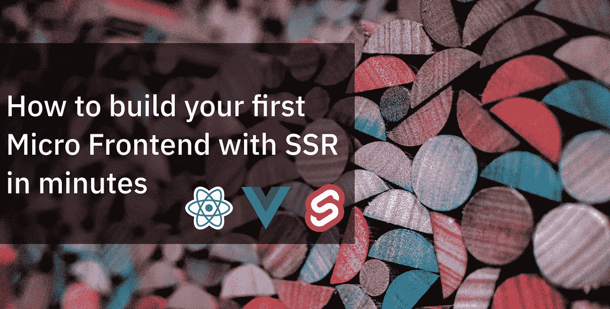
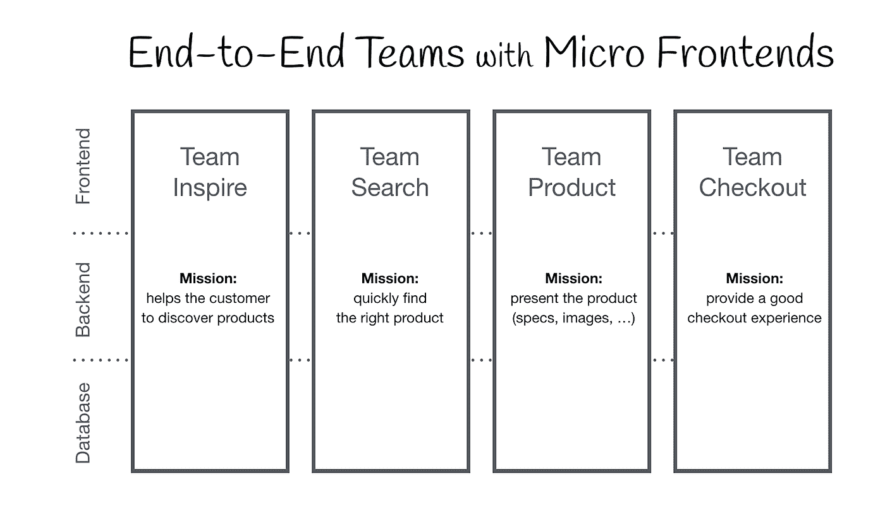
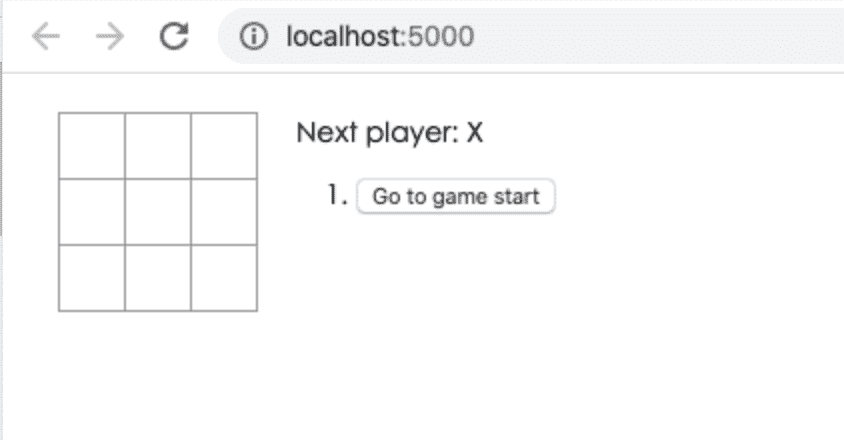
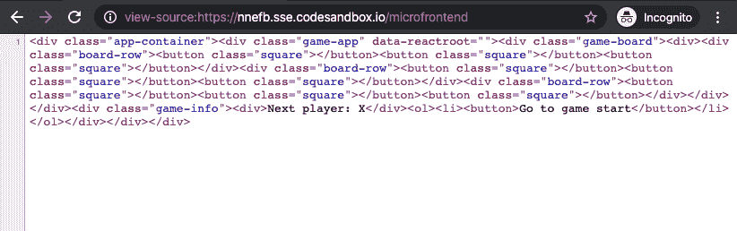
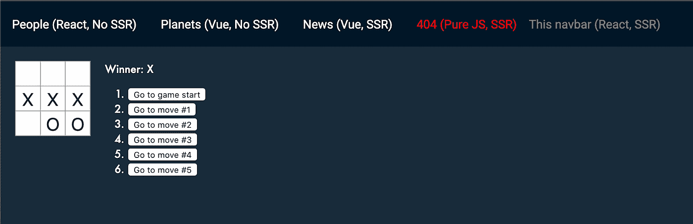

# 如何在几分钟内用 SSR 构建您的第一个微前端

> 原文：<https://levelup.gitconnected.com/how-to-build-your-first-micro-frontend-with-ssr-in-minutes-95cd57788529>



当前的趋势是构建一个功能丰富、功能强大的浏览器应用程序，也称为单页应用程序，它位于微服务架构之上。随着时间的推移，前端层(通常由单独的团队开发)会增长，并且变得更加难以维护。这就是我们所说的[前端巨石](https://www.youtube.com/watch?v=pU1gXA0rfwc)。几年前，我们在 Namecheap 面临所有相关的挑战。所以我们决定进一步发展[微前端](https://martinfowler.com/articles/micro-frontends.html)。



Michael Geers @ micro-frodends . org

目前，我们已经使用 3 种不同的框架(Vue.js、React & Angular)在生产中运行微前端 2 年了。实际上 namecheap.com 的[主页是由几个应用程序组成的。我们现在使用的方法与 Zalando 在](https://www.namecheap.com/)[裁缝](https://github.com/zalando/tailor)中使用的方法非常相似。我现在不会解释我们当前方法的所有利弊，因为这不是本文的目标🙂重要的是，最近我们决定向前迈出一步&提出一种更加灵活的&性能方法。

因此，我们构建了[同构布局生成器(ILC)](https://github.com/namecheap/ilc)——一个完整的解决方案，用于将微前端组合到支持 SSR 的 SPA 中。别忘了看看 GitHub，看看它的所有特性，让我们转向这篇文章的主要目标——创建你的第一个微前端。

# 我们需要先用 SSR 反应 app

正如你可能已经猜到的，要构建一个新的微前端，我们首先需要有常规的应用程序。希望我已经为你亲爱的读者做了所有的脏活。

所以你可以去 github.com/StyleT/ilc-learning-react 这里拿。或者你可以使用[codesandbox.io/s/github/StyleT/ilc-learning-react](https://codesandbox.io/s/github/StyleT/ilc-learning-react)让它在云中为你运行。我建议使用 [codesandbox.io](https://codesandbox.io/s/github/StyleT/ilc-learning-react) 来消除我们前进过程中可能出现的所有本地环境相关问题。

一旦你启动了这个应用程序，试着玩几局井字游戏😎



# 使应用程序适应 ILC

为了使应用程序与 ILC 一起正确工作，我们需要使其符合 [ILC 到 App 接口](https://github.com/namecheap/ilc/blob/cdf6afaa73c3dd7358036ebb0fae3cf0b0ec391f/docs/ilc_app_interface.md)。幸运的是，这很容易，浏览源代码并解决我为你放置的所有注释。

一旦你完成这项工作，重启应用程序并尝试打开`/microfrontend`路线。你应该得到`200 OK`响应代码&一些 SSR 标记。



> **注意**:如果有任何问题，请尝试切换到 repo 中的“step_1-ILC_integration”分支，它已经为您完成了所有更改。

# 配置 ILC 以处理新应用程序

在这一步中，我们将使用我们的公共演示网站和"[开发“生产”](https://github.com/namecheap/ilc/blob/cdf6afaa73c3dd7358036ebb0fae3cf0b0ec391f/docs/develop_at_production.md) " ILC 功能来完成任务。我们这样做只是为了简单起见。然而，您可以使用本地运行的 ILC 获得非常相同的结果。

为了让你的新花式微前端工作，我们需要先确定你的`**publicPath**` & `**ssrPath**`。

## 如果你使用 codesandbox.io *(推荐方法)*

*   你的`publicPath`会有点像`https://abcde.sse.codesandbox.io/public/`。检查你的虚拟浏览器的地址栏。
*   而你的`ssrPath`将会是`https://abcde.sse.codesandbox.io/microfrontend`

## 如果您在本地运行应用程序

*   你的`publicPath`会是`*http://127.0.0.1:5000/public/*`。
*   而您的`ssrPath`将是`*http://XXX.XXX.XXX.XXX:5000/microfrontend*`，在这里您需要用您机器的真实公共 IP 地址替换 XXX。如果你的网络提供商让你使用 NAT，你可以使用像 https://ngrok.com/这样的服务来获得一个。

一旦您弄清楚了所有的细节——让我们为您更改 ILC 配置。为此，您需要打开[demo.microfrontends.online/nosuchpath](http://demo.microfrontends.online/nosuchpath)并在浏览器控制台中执行以下代码:

```
var publicPath = 'https://abcde.sse.codesandbox.io/public/';
var ssrPath = 'https://abcde.sse.codesandbox.io/microfrontend';var overrideConfig = encodeURIComponent(JSON.stringify({
    apps: {
        '@portal/myapp': {
            spaBundle: publicPath + 'client.js',
            cssBundle: publicPath + 'style.css',
            ssr: {
                src: ssrPath,
                timeout: 10000,
            },
            props: { publicPath },
            kind: 'primary',
        },
    },
    routes: [{
        routeId: 555,
        route: '/nosuchpath',
        slots: {
            body: {
                appName: '@portal/myapp'
            }
        }
    }]
}));

document.cookie = `ILC-overrideConfig=${overrideConfig}; path=/;`
```

代码执行后刷新页面。如果你做的一切都正确——你应该能够看到你的应用程序在一个公共的 ILC 演示网站上运行。

> 如果这对你不起作用——确保`ssrPath`不仅可以从你的机器上访问(使用[https://reqbin.com/](https://reqbin.com/))，而且 JS/CSS 链接确实可以从你的机器上工作。



现在试着使用顶部的工具条在不同的页面之间切换。看到不仅服务器端渲染工作，而且客户端。禁用 JS，看看页面没有它是什么样子。

如果它能和其他应用程序一起很好地工作——我祝贺亲爱的读者🎉你刚刚建立了你的第一个微前端。

如果它对你不起作用，请在下面留下评论或 PM 我，这样我可以试着帮助你&提高这篇文章的效果。

# 摘要

我们刚刚把最简单的 React 应用程序变成了一个微前端，我希望你能顺利完成。正如你所看到的，有了合适的工具链，这并不像你想象的那么难。

同样值得一提的是，这篇文章并没有涵盖这个过程的很多特性，但是如果它能从社区获得足够的反馈，我将会写更多关于如何在合理的时间内实际构建和发布更复杂的微前端的文章。

**故事续:** [用 SSR 构建微前端——路由](/building-micro-frontend-with-ssr-part-2-routing-d86480de8894)