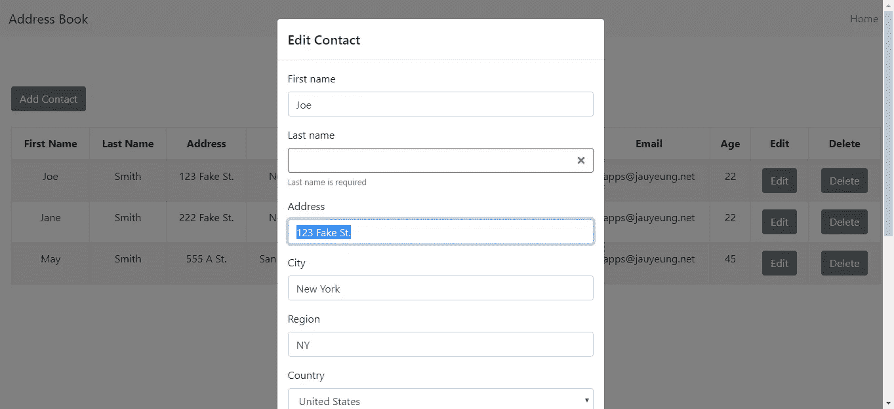
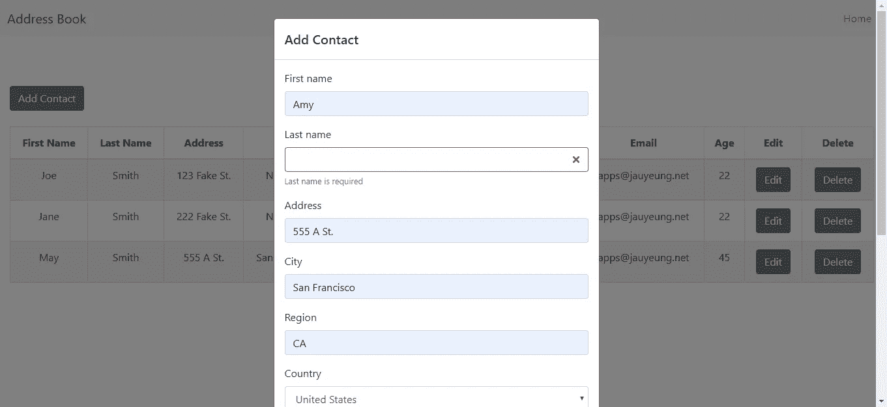
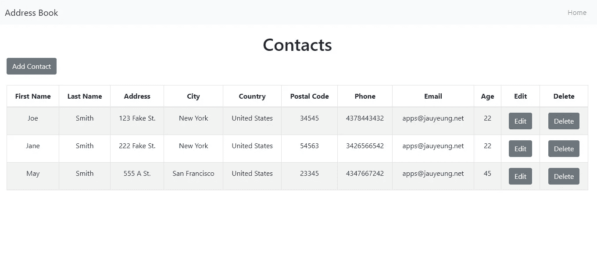

# 如何用 Reactstrap 构建 React UI

> 原文：<https://levelup.gitconnected.com/how-to-build-your-react-ui-with-reactstrap-cc461880ff6>



**现在在**[**http://jauyeung.net/subscribe/**](http://jauyeung.net/subscribe/)**订阅我的邮件列表。**

**在推特上关注我**[**https://twitter.com/AuMayeung**](https://twitter.com/AuMayeung)

React 是一个用于构建交互式前端 web 应用的简单库。它有一个简单的 API，完全专注于视图层。React 的核心是组件架构，它允许开发者构建模块化和直观的 web 应用。Bootstrap 是 Twitter 做的 UI 框架，提供默认的 CSS 和 UI 元素。通过创建与引导 UI 元素相匹配的组件，React 对其进行了调整。Reactstrap 是提供 Boostrap 风格的 React 组件的库之一。

在这个故事中，我们将使用 Reactstrap 以及 Formik 和 Yup 构建一个地址簿应用程序，该应用程序无缝集成以构建表单。首先，我们使用 Create React App 来搭建应用程序。我们运行`npx create-react-app address-book`来创建包含初始文件的 app 项目文件夹。

该应用程序将有一个主页来显示联系人，并让我们打开一个模式来添加联系人。将会有一个表格显示所有的联系人以及编辑和删除按钮。这些联系人将被存储在一个中央 Redux 存储中，以便于访问。React 路由器将用于路由。联系人将保存在后端，并通过使用 [JSON 服务器包](https://github.com/typicode/json-server)的 API 进行访问。

为了安装我们上面提到的库，我们运行`npm i axios bootstrap formik reactstrap react-redux react-router-dom yup`。Axios 是我们用来向后端发出 HTTP 请求的 HTTP 客户端。`react-router-dom`是 React Router for web 最新版本的包名。

现在我们已经安装了所有的库，我们可以开始构建应用程序了。除非另有说明，否则所有文件都将保存在`src`文件夹中。首先，我们在 Redux 商店工作。我们在`src`文件夹中创建一个名为`actionCreator.js`的文件，并添加以下内容:

```
import { SET_CONTACTS } from './actions';const setContacts = (contacts) => {
    return {
        type: SET_CONTACTS,
        payload: contacts
    }
};export { setContacts };
```

这是用于在商店中存储联系人的动作创建器。

我们创建了另一个名为`actions.js`的文件，并添加了用于分派动作的常量:

```
const SET_CONTACTS = 'SET_CONTACTS';export { SET_CONTACTS };
```

在`App.js`中，我们用以下内容替换现有内容:

```
import React, { useState } from "react";
import { Router, Route, Link } from "react-router-dom";
import HomePage from "./HomePage";
import { createBrowserHistory as createHistory } from "history";
import "./App.css";
import {
  Collapse,
  Navbar,
  NavbarToggler,
  NavbarBrand,
  Nav,
  NavItem,
  NavLink,
} from "reactstrap";
const history = createHistory();function App() {
  const [isOpen, setIsOpen] = useState(false);
  const toggle = () => {
    setIsOpen(!isOpen);
  };
  return (
    <div className="App">
      <Router history={history}>
        <Navbar color="light" light expand="md">
          <NavbarBrand href="/">Address Book</NavbarBrand>
          <NavbarToggler onClick={toggle} />
          <Collapse isOpen={isOpen} navbar>
            <Nav className="ml-auto" navbar>
              <NavItem>
                <NavLink href="/">Home</NavLink>
              </NavItem>
            </Nav>
          </Collapse>
        </Navbar>
        <Route path="/" exact component={HomePage} />
      </Router>
    </div>
  );
}export default App;
```

我们使用 Reactstrap 提供的`Navbar`组件来添加顶栏。它与`NavToggler`组件和`Collapse`组件一起响应。

在`App.css`中，我们将现有代码替换为:

```
.App {
  text-align: center;
}
```

这会使文本居中。

接下来，我们需要创建一个 Formik 表单将使用的输入组件，因为 Reactstrap 没有内置的 form Formik 表单处理程序支持。在`src`文件夹中，添加一个`input.js`并添加以下内容:

```
import React from "react";
import { Input, FormFeedback } from "reactstrap";const input = ({ field, form: { touched, errors }, ...props }) => {
  return (
    <div>
      <Input
        invalid={!!(touched[field.name] && errors[field.name])}
        {...field}
        {...props}
        value={field.value || ""}
      />
      {touched[field.name] && errors[field.name] && (
        <FormFeedback>{errors[field.name]}</FormFeedback>
      )}
    </div>
  );
};export default input;
```

我们在这里使用 Reactstrap 中的`Input`组件接受输入，使用`FormFeedback`组件显示表单验证错误。`touched`和`errors`道具将从 Formik `Field`组件传入。

接下来，我们需要一个国家列表来填充联系人表单的国家下拉列表。在`src`文件夹中创建一个名为`export.js`的文件，并添加:

```
export const COUNTRIES = [
  "Afghanistan",
  "Albania",
  "Algeria",
  "Andorra",
  "Angola",
  "Anguilla",
  "Antigua &amp; Barbuda",
  "Argentina",
  "Armenia",
  "Aruba",
  "Australia",
  "Austria",
  "Azerbaijan",
  "Bahamas",
  "Bahrain",
  "Bangladesh",
  "Barbados",
  "Belarus",
  "Belgium",
  "Belize",
  "Benin",
  "Bermuda",
  "Bhutan",
  "Bolivia",
  "Bosnia &amp; Herzegovina",
  "Botswana",
  "Brazil",
  "British Virgin Islands",
  "Brunei",
  "Bulgaria",
  "Burkina Faso",
  "Burundi",
  "Cambodia",
  "Cameroon",
  "Canada",
  "Cape Verde",
  "Cayman Islands",
  "Chad",
  "Chile",
  "China",
  "Colombia",
  "Congo",
  "Cook Islands",
  "Costa Rica",
  "Cote D Ivoire",
  "Croatia",
  "Cruise Ship",
  "Cuba",
  "Cyprus",
  "Czech Republic",
  "Denmark",
  "Djibouti",
  "Dominica",
  "Dominican Republic",
  "Ecuador",
  "Egypt",
  "El Salvador",
  "Equatorial Guinea",
  "Estonia",
  "Ethiopia",
  "Falkland Islands",
  "Faroe Islands",
  "Fiji",
  "Finland",
  "France",
  "French Polynesia",
  "French West Indies",
  "Gabon",
  "Gambia",
  "Georgia",
  "Germany",
  "Ghana",
  "Gibraltar",
  "Greece",
  "Greenland",
  "Grenada",
  "Guam",
  "Guatemala",
  "Guernsey",
  "Guinea",
  "Guinea Bissau",
  "Guyana",
  "Haiti",
  "Honduras",
  "Hong Kong",
  "Hungary",
  "Iceland",
  "India",
  "Indonesia",
  "Iran",
  "Iraq",
  "Ireland",
  "Isle of Man",
  "Israel",
  "Italy",
  "Jamaica",
  "Japan",
  "Jersey",
  "Jordan",
  "Kazakhstan",
  "Kenya",
  "Kuwait",
  "Kyrgyz Republic",
  "Laos",
  "Latvia",
  "Lebanon",
  "Lesotho",
  "Liberia",
  "Libya",
  "Liechtenstein",
  "Lithuania",
  "Luxembourg",
  "Macau",
  "Macedonia",
  "Madagascar",
  "Malawi",
  "Malaysia",
  "Maldives",
  "Mali",
  "Malta",
  "Mauritania",
  "Mauritius",
  "Mexico",
  "Moldova",
  "Monaco",
  "Mongolia",
  "Montenegro",
  "Montserrat",
  "Morocco",
  "Mozambique",
  "Namibia",
  "Nepal",
  "Netherlands",
  "Netherlands Antilles",
  "New Caledonia",
  "New Zealand",
  "Nicaragua",
  "Niger",
  "Nigeria",
  "Norway",
  "Oman",
  "Pakistan",
  "Palestine",
  "Panama",
  "Papua New Guinea",
  "Paraguay",
  "Peru",
  "Philippines",
  "Poland",
  "Portugal",
  "Puerto Rico",
  "Qatar",
  "Reunion",
  "Romania",
  "Russia",
  "Rwanda",
  "Saint Pierre &amp; Miquelon",
  "Samoa",
  "San Marino",
  "Satellite",
  "Saudi Arabia",
  "Senegal",
  "Serbia",
  "Seychelles",
  "Sierra Leone",
  "Singapore",
  "Slovakia",
  "Slovenia",
  "South Africa",
  "South Korea",
  "Spain",
  "Sri Lanka",
  "St Kitts &amp; Nevis",
  "St Lucia",
  "St Vincent",
  "St. Lucia",
  "Sudan",
  "Suriname",
  "Swaziland",
  "Sweden",
  "Switzerland",
  "Syria",
  "Taiwan",
  "Tajikistan",
  "Tanzania",
  "Thailand",
  "Timor L'Este",
  "Togo",
  "Tonga",
  "Trinidad &amp; Tobago",
  "Tunisia",
  "Turkey",
  "Turkmenistan",
  "Turks &amp; Caicos",
  "Uganda",
  "Ukraine",
  "United Arab Emirates",
  "United Kingdom",
  "United States",
  "United States Minor Outlying Islands",
  "Uruguay",
  "Uzbekistan",
  "Venezuela",
  "Vietnam",
  "Virgin Islands (US)",
  "Yemen",
  "Zambia",
  "Zimbabwe",
];
```

该文件将由`ContactForm`组件导入。

现在我们有了创建联系表单的所有部分。创建一个名为`ContactForm.js`的文件，并添加以下代码:

```
import React from "react";
import { Formik, Field } from "formik";
import * as yup from "yup";
import { COUNTRIES } from "./exports";
import PropTypes from "prop-types";
import { addContact, editContact, getContacts } from "./requests";
import { connect } from "react-redux";
import { setContacts } from "./actionCreators";
import {
  Button,
  Form,
  FormGroup,
  Label,
  Input,
  FormFeedback,
} from "reactstrap";
import input from "./input";const schema = yup.object({
  firstName: yup.string().required("First name is required"),
  lastName: yup.string().required("Last name is required"),
  address: yup.string().required("Address is required"),
  city: yup.string().required("City is required"),
  region: yup.string().required("Region is required"),
  country: yup
    .string()
    .required("Country is required")
    .default("Afghanistan"),
  postalCode: yup
    .string()
    .when("country", {
      is: "United States",
      then: yup
        .string()
        .matches(/^[0-9]{5}(?:-[0-9]{4})?$/, "Invalid postal code"),
    })
    .when("country", {
      is: "Canada",
      then: yup
        .string()
        .matches(
          /^[A-Za-z]\d[A-Za-z][ -]?\d[A-Za-z]\d$/,
          "Invalid postal code"
        ),
    })
    .required(),
  phone: yup
    .string()
    .when("country", {
      is: country => ["United States", "Canada"].includes(country),
      then: yup
        .string()
        .matches(/^[2-9]\d{2}[2-9]\d{2}\d{4}$/, "Invalid phone nunber"),
    })
    .required(),
  email: yup
    .string()
    .email("Invalid email")
    .required("Email is required"),
  age: yup
    .number()
    .required("Age is required")
    .min(0, "Minimum age is 0")
    .max(200, "Maximum age is 200"),
});function ContactForm({
  edit,
  onSave,
  setContacts,
  contact,
  onCancelAdd,
  onCancelEdit,
}) {
  const handleSubmit = async evt => {
    const isValid = await schema.validate(evt);
    if (!isValid) {
      return;
    }
    if (!edit) {
      await addContact(evt);
    } else {
      await editContact(evt);
    }
    const response = await getContacts();
    setContacts(response.data);
    onSave();
  }; return (
    <div className="form">
      <Formik
        validationSchema={schema}
        onSubmit={handleSubmit}
        initialValues={contact || {}}
      >
        {({
          handleSubmit,
          handleChange,
          handleBlur,
          values,
          touched,
          isInvalid,
          errors,
        }) => (
          <Form noValidate onSubmit={handleSubmit}>
            <FormGroup>
              <Label>First name</Label>
              <Field name="firstName" type="text" component={input} />
            </FormGroup>
            <FormGroup>
              <Label>Last name</Label>
              <Field name="lastName" type="text" component={input} />
            </FormGroup>
            <FormGroup>
              <Label>Address</Label>
              <Field name="address" type="text" component={input} />
            </FormGroup>
            <FormGroup>
              <Label>City</Label>
              <Field name="city" type="text" component={input} />
            </FormGroup>
            <FormGroup>
              <Label>Region</Label>
              <Field name="region" type="text" component={input} />
            </FormGroup><FormGroup>
              <Label>Country</Label>
              <Field
                name="country"
                component={({ field, form: { touched, errors }, ...props }) => {
                  return (
                    <div>
                      <Input
                        invalid={!!(touched[field.name] && errors[field.name])}
                        {...field}
                        {...props}
                        type="select"
                        value={field.value || ""}
                      >
                        {COUNTRIES.map(c => (
                          <option key={c} value={c}>
                            {c}
                          </option>
                        ))}
                      </Input>
                      {touched[field.name] && errors[field.name] && (
                        <FormFeedback>{errors[field.name]}</FormFeedback>
                      )}
                    </div>
                  );
                }}
              />
              <FormFeedback type="invalid">{errors.country}</FormFeedback>
            </FormGroup><FormGroup>
              <Label>Postal Code</Label>
              <Field name="postalCode" type="text" component={input} />
            </FormGroup><FormGroup>
              <Label>Phone</Label>
              <Field name="phone" type="text" component={input} />
            </FormGroup><FormGroup>
              <Label>Email</Label>
              <Field name="email" type="text" component={input} />
            </FormGroup><FormGroup>
              <Label>Age</Label>
              <Field name="age" type="text" component={input} />
            </FormGroup>
            <Button type="submit" style={{ marginRight: "10px" }}>
              Save
            </Button>
            <Button type="button" onClick={edit ? onCancelEdit : onCancelAdd}>
              Cancel
            </Button>
          </Form>
        )}
      </Formik>
    </div>
  );
}ContactForm.propTypes = {
  edit: PropTypes.bool,
  onSave: PropTypes.func,
  onCancelAdd: PropTypes.func,
  onCancelEdit: PropTypes.func,
  contact: PropTypes.object,
};const mapStateToProps = state => {
  return {
    contacts: state.contacts,
  };
};const mapDispatchToProps = dispatch => ({
  setContacts: contacts => dispatch(setContacts(contacts)),
});export default connect(
  mapStateToProps,
  mapDispatchToProps
)(ContactForm);
```

我们使用 Formik 的`Field`组件，它让我们处理输入值的变化，并在输入时设置它们。在每个`Field`组件的`component`属性中，我们传递我们在`input.js`中添加的 Reactstrap 输入，或者对于国家下拉列表，我们传递一个类型为`select`的`Input`组件，其中国家选项作为选择输入的子元素。我们传入了输入验证模式，即使用 Yup 库创建的`schema`对象，这样我们就可以在 Formik 表单中使用它。表单验证将由验证模式自动处理，因为我们使用 Formik 的表单字段作为输入。

`handleSubmit`函数获取存储在`evt`对象中的表单数据，如果数据有效就保存它，然后在 Redux store 中设置联系人。并且调用从`HomePage`组件传来的`onSave`函数，以便我们通知`HomePage`组件保存联系人已经完成，以便它刷新页面。

接下来，我们创建主页。在`src`文件夹中创建一个名为`HomePage.js`的文件，并添加:

```
import React from "react";
import { useState, useEffect } from "react";
import {
  Button,
  Modal,
  ModalHeader,
  ModalBody,
  ButtonToolbar,
  Table,
} from "reactstrap";import ContactForm from "./ContactForm";
import "./HomePage.css";
import { connect } from "react-redux";
import { getContacts, deleteContact } from "./requests";function HomePage() {
  const [openAddModal, setOpenAddModal] = useState(false);
  const [openEditModal, setOpenEditModal] = useState(false);
  const [initialized, setInitialized] = useState(false);
  const [selectedContact, setSelectedContact] = useState({});
  const [contacts, setContacts] = useState([]); const openModal = () => {
    setOpenAddModal(true);
  }; const closeModal = () => {
    setOpenAddModal(false);
    setOpenEditModal(false);
    getData();
  };const cancelAddModal = () => {
    setOpenAddModal(false);
  }; const editContact = contact => {
    setSelectedContact(contact);
    setOpenEditModal(true);
  }; const cancelEditModal = () => {
    setOpenEditModal(false);
  }; const getData = async () => {
    const response = await getContacts();
    setContacts(response.data);
    setInitialized(true);
  }; const deleteSelectedContact = async id => {
    await deleteContact(id);
    getData();
  }; useEffect(() => {
    if (!initialized) {
      getData();
    }
  }); return (
    <div className="home-page">
      <h1>Contacts</h1>
      <Modal isOpen={openAddModal}>
        <ModalHeader>Add Contact</ModalHeader>
        <ModalBody>
          <ContactForm
            edit={false}
            onSave={closeModal.bind(this)}
            onCancelAdd={cancelAddModal}
          />
        </ModalBody>
      </Modal><Modal isOpen={openEditModal}>
        <ModalHeader>Edit Contact</ModalHeader>
        <ModalBody>
          <ContactForm
            edit={true}
            onSave={closeModal.bind(this)}
            contact={selectedContact}
            onCancelEdit={cancelEditModal}
          />
        </ModalBody>
      </Modal>
      <ButtonToolbar>
        <Button variant="outline-primary" onClick={openModal}>
          Add Contact
        </Button>
      </ButtonToolbar>
      <br />
      <Table striped bordered hover>
        <thead>
          <tr>
            <th>First Name</th>
            <th>Last Name</th>
            <th>Address</th>
            <th>City</th>
            <th>Country</th>
            <th>Postal Code</th>
            <th>Phone</th>
            <th>Email</th>
            <th>Age</th>
            <th>Edit</th>
            <th>Delete</th>
          </tr>
        </thead>
        <tbody>
          {contacts.map(c => (
            <tr key={c.id}>
              <td>{c.firstName}</td>
              <td>{c.lastName}</td>
              <td>{c.address}</td>
              <td>{c.city}</td>
              <td>{c.country}</td>
              <td>{c.postalCode}</td>
              <td>{c.phone}</td>
              <td>{c.email}</td>
              <td>{c.age}</td>
              <td>
                <Button
                  variant="outline-primary"
                  onClick={editContact.bind(this, c)}
                >
                  Edit
                </Button>
              </td>
              <td>
                <Button
                  variant="outline-primary"
                  onClick={deleteSelectedContact.bind(this, c.id)}
                >
                  Delete
                </Button>
              </td>
            </tr>
          ))}
        </tbody>
      </Table>
    </div>
  );
}const mapStateToProps = state => {
  return {
    contacts: state.contacts,
  };
};export default connect(
  mapStateToProps,
  null
)(HomePage);
```

在这个页面上，我们有一个列出联系人数据的表格，我们添加了添加、编辑和删除联系人的按钮。为了切换 Reactstrap 模式，我们分别设置了`openAddModal`和`openEditModal`标志。

表格和按钮由 Reactstrap 提供。

我们使用`useEffect`的回调函数在初始加载期间获取数据，然后在数据加载后通过调用`getData`函数将`initalized`标志设置为`true`以阻止其再次获取数据。

我们将`closeModal`函数传递给`onSave` prop，这样它将在`ContactForm`组件中的数据保存后关闭模态。我们用`ContactForm`的`onCancelEdit`道具传入相同的函数。

在`index.js`中，我们将现有代码替换为:

```
import React from 'react';
import ReactDOM from 'react-dom';
import './index.css';
import App from './App';
import * as serviceWorker from './serviceWorker';
import { contactsReducer } from './reducers';
import { Provider } from 'react-redux'
import { createStore, combineReducers } from 'redux'const addressBookApp = combineReducers({
    contacts: contactsReducer,
})const store = createStore(addressBookApp)ReactDOM.render(
    <Provider store={store}>
        <App />
    </Provider>
    , document.getElementById('root'));// If you want your app to work offline and load faster, you can change
// unregister() to register() below. Note this comes with some pitfalls.
// Learn more about service workers: [https://bit.ly/CRA-PWA](https://bit.ly/CRA-PWA)
serviceWorker.unregister();
```

我们合并了 reducers 并创建了 store，然后用`Provider`组件将它注入到我们的应用程序中，这样我们就可以在任何地方使用它。

接下来，我们为 Redux 存储添加减速器。在`src`文件夹中添加一个名为`reducers.js`的文件，并添加:

```
import { SET_CONTACTS } from './actions';function contactsReducer(state = {}, action) {
    switch (action.type) {
        case SET_CONTACTS:
            state = JSON.parse(JSON.stringify(action.payload));
            return state;
        default:
            return state
    }
}export { contactsReducer };
```

这是我们存储联系人的缩减器，我们通过调用组件中的`mapDispatchToProps`函数提供的属性来发送这些联系人。

然后我们创建一个名为`requests.js`的文件，并添加:

```
const APIURL = '[http://localhost:3000'](http://localhost:3000');
const axios = require('axios');export const getContacts = () => axios.get(`${APIURL}/contacts`);export const addContact = (data) => axios.post(`${APIURL}/contacts`, data);export const editContact = (data) => axios.put(`${APIURL}/contacts/${data.id}`, data);export const deleteContact = (id) => axios.delete(`${APIURL}/contacts/${id}`);
```

这些是向后端发出 HTTP 请求以保存和删除联系人的函数。

现在，我们可以通过在 Windows 上运行`set PORT=3001 && react-scripts start`或在 Linux 上运行`PORT=3006 react-scripts start`来运行应用程序。

为了启动后端，我们通过运行`npm i json-server`来安装`json-server`包。然后转到我们的项目文件夹并运行:

```
json-server --watch db.json
```

在`db.json`中，将文本改为:

```
{
  "contacts": [
  ]
}
```

这使得`requests.js`中定义的`contacts`端点可用。

你完了！我们现在已经构建了以下内容:

