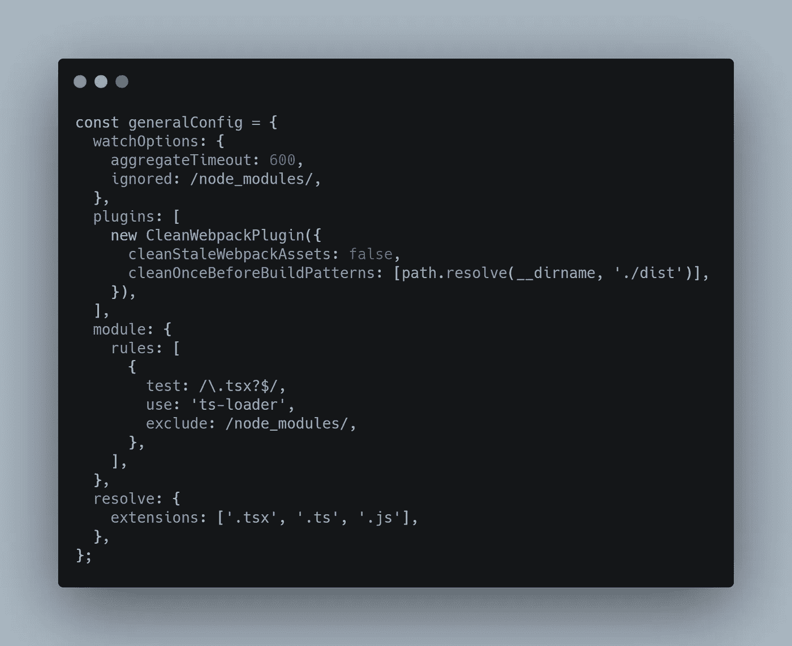

# 如何用 Webpack 为 NodeJS 和 Browser 捆绑你的库

> 原文：<https://levelup.gitconnected.com/how-to-bundle-your-library-for-both-nodejs-and-browser-with-webpack-3584ec8197eb>


照片由 [engin akyurt](https://unsplash.com/@enginakyurt?utm_source=unsplash&utm_medium=referral&utm_content=creditCopyText) 在 [Unsplash](https://unsplash.com/s/photos/target?utm_source=unsplash&utm_medium=referral&utm_content=creditCopyText) 上拍摄

最近，我决定更多地参与开源社区，因为我的空闲时间有限，我认为我应该在空闲时间创建库和有用的存储库。

对他们中的一些人来说，在 Webpack 中为项目建立一个工具链，如果不是更多，那么至少和构建库本身一样耗时和困难。

最有趣的案例与我最近发布的模块有关，它只不过是一个简单的 API 包装器( [REST](https://restfulapi.net/) )。

这种情况的特殊之处在于，该模块必须能够在 NodeJS 和浏览器环境中使用。因此，我想要一个工具链来创建一个单一的构建，一个针对两个目标的发行版。


# TL；速度三角形定位法(dead reckoning)

如果你只是想看看 Webpack 的配置，那么这里有指向我构建的库的[链接](https://github.com/GeorgianStan/js-climacell-api),或者如果你想从头开始，这里有指向只包含样板文件的 Github repo 的[链接](https://github.com/GeorgianStan/framework-for-building-libraries)。

> 本文假设您对 webpack 和 npm 有一些经验

## 问题是

`NodeJS`是 JavaScript 的运行时环境，所以无论您在浏览器中运行什么 JS 代码，都可以在 NodeJS 中执行。

但是，有一些浏览器 API 在 NodeJS 中是不可用的。

如前所述，这个包装器是为 REST API 构建的，因此它必须能够发送请求。在浏览器中，我们为此使用了`XMLHttpRequest`或`Fetch`，但它们都是浏览器 API，在 NodeJS 中不可用。

在这种情况下，需要为使用`fetch`或`XMLHttpRequest`的浏览器创建一个输出，并为使用类似内容的 NodeJS 创建一个输出。

## 代码实现

为了实现的一致性，我决定对 web 使用`fetch API`，对 NodeJS 使用一个轻量级的 fetch 包装器`node-fetch`。

在代码级别，将有一个`Main.ts`，它将包含所有的模块逻辑，另外两个`browser.ts`和`node.ts`，它们将扩展主类，并使用用于发出请求的所需对象调用其构造函数。


[生](https://carbon.now.sh/?bg=rgba%28171%2C+184%2C+195%2C+1%29&t=seti&wt=none&l=javascript&ds=true&dsyoff=20px&dsblur=68px&wc=true&wa=true&pv=56px&ph=56px&ln=false&fl=1&fm=Hack&fs=14px&lh=133%25&si=false&es=2x&wm=false&code=%252F%252F%2520-------------------------main.ts---------------------%250Aexport%2520default%2520class%2520MyLibrary%2520extends%2520Main%2520%257B%250A%2520%2520constructor%28%29%2520%257B%250A%2520%2520%2520%2520super%28require%28%27node-fetch%27%29%29%253B%250A%2520%2520%257D%250A%257D%250A%250A%252F%252F%2520-------------------browser.ts-----------------------%250Aexport%2520default%2520class%2520MyLibrary%2520extends%2520Main%2520%257B%250A%2520%2520constructor%28%29%2520%257B%250A%2520%2520%2520%2520super%28window.fetch.bind%28window%29%29%253B%250A%2520%2520%257D%250A%257D%250A%250A%252F%252F%2520----------------------main.ts-----------------------%250Aexport%2520class%2520Main%2520%257B%250A%2520%2520%2523fetch%253A%2520any%253B%250A%250A%2520%2520constructor%28fetch%253A%2520any%29%2520%257B%250A%2520%2520%2520%2520this.%2523fetch%2520%253D%2520fetch%253B%250A%2520%2520%257D%250A%257D%250A)

## Webpack 配置

对于 Webpack，正如他们的[文档](https://webpack.js.org/concepts/targets/)所建议的，将导出两个对象。每个目标一个。

在`webpack.config.js`中，我们将为两个目标提供一个通用配置，在这里我们定义通用规则，比如 TypeScript 的编译规则。



[生](https://carbon.now.sh/?bg=rgba%28171%2C+184%2C+195%2C+1%29&t=seti&wt=none&l=javascript&ds=true&dsyoff=20px&dsblur=68px&wc=true&wa=true&pv=56px&ph=56px&ln=false&fl=1&fm=Hack&fs=14px&lh=133%25&si=false&es=2x&wm=false&code=const%2520generalConfig%2520%253D%2520%257B%250A%2520%2520watchOptions%253A%2520%257B%250A%2520%2520%2520%2520aggregateTimeout%253A%2520600%252C%250A%2520%2520%2520%2520ignored%253A%2520%252Fnode_modules%252F%252C%250A%2520%2520%257D%252C%250A%2520%2520plugins%253A%2520%255B%250A%2520%2520%2520%2520new%2520CleanWebpackPlugin%28%257B%250A%2520%2520%2520%2520%2520%2520cleanStaleWebpackAssets%253A%2520false%252C%250A%2520%2520%2520%2520%2520%2520cleanOnceBeforeBuildPatterns%253A%2520%255Bpath.resolve%28__dirname%252C%2520%27.%252Fdist%27%29%255D%252C%250A%2520%2520%2520%2520%257D%29%252C%250A%2520%2520%255D%252C%250A%2520%2520module%253A%2520%257B%250A%2520%2520%2520%2520rules%253A%2520%255B%250A%2520%2520%2520%2520%2520%2520%257B%250A%2520%2520%2520%2520%2520%2520%2520%2520test%253A%2520%252F%255C.tsx%253F%2524%252F%252C%250A%2520%2520%2520%2520%2520%2520%2520%2520use%253A%2520%27ts-loader%27%252C%250A%2520%2520%2520%2520%2520%2520%2520%2520exclude%253A%2520%252Fnode_modules%252F%252C%250A%2520%2520%2520%2520%2520%2520%257D%252C%250A%2520%2520%2520%2520%255D%252C%250A%2520%2520%257D%252C%250A%2520%2520resolve%253A%2520%257B%250A%2520%2520%2520%2520extensions%253A%2520%255B%27.tsx%27%252C%2520%27.ts%27%252C%2520%27.js%27%255D%252C%250A%2520%2520%257D%252C%250A%257D%253B)

`NodeJS`的一种配置具有以下属性:


[RAW](https://carbon.now.sh/?bg=rgba%28171%2C+184%2C+195%2C+1%29&t=seti&wt=none&l=javascript&ds=true&dsyoff=20px&dsblur=68px&wc=true&wa=true&pv=56px&ph=56px&ln=false&fl=1&fm=Hack&fs=14px&lh=133%25&si=false&es=2x&wm=false&code=const%2520nodeConfig%2520%253D%2520%257B%250A%2520%2520entry%253A%2520%27.%252Fsrc%252Fnode.ts%27%252C%250A%2520%2520target%253A%2520%27node%27%252C%250A%2520%2520externals%253A%2520%255BnodeExternals%28%29%255D%252C%250A%2520%2520output%253A%2520%257B%250A%2520%2520%2520%2520path%253A%2520path.resolve%28__dirname%252C%2520%27.%252Fdist%27%29%252C%250A%2520%2520%2520%2520filename%253A%2520%27node.js%27%252C%250A%2520%2520%2520%2520libraryTarget%253A%2520%27umd%27%252C%250A%2520%2520%2520%2520libraryExport%253A%2520%27default%27%252C%250A%2520%2520%257D%252C%250A%257D%253B)

这里值得一提的是:

*   `target`设置为`node`
*   `externals` —这里我们使用`webpack-node-externals` [模块](https://www.npmjs.com/package/webpack-node-externals)来定义不应该捆绑的外部模块(在我们的例子中是`node-fetch)`)。

同时，我们将有一个具有以下属性的浏览器配置:


[原始](https://carbon.now.sh/?bg=rgba%28171%2C+184%2C+195%2C+1%29&t=seti&wt=none&l=javascript&ds=true&dsyoff=20px&dsblur=68px&wc=true&wa=true&pv=56px&ph=56px&ln=false&fl=1&fm=Hack&fs=14px&lh=133%25&si=false&es=2x&wm=false&code=const%2520browserConfig%2520%253D%2520%257B%250A%2520%2520entry%253A%2520%27.%252Fsrc%252Fbrowser.ts%27%252C%250A%2520%2520target%253A%2520%27web%27%252C%250A%2520%2520output%253A%2520%257B%250A%2520%2520%2520%2520path%253A%2520path.resolve%28__dirname%252C%2520%27.%252Fdist%27%29%252C%250A%2520%2520%2520%2520filename%253A%2520%27browser.js%27%252C%250A%2520%2520%2520%2520libraryTarget%253A%2520%27umd%27%252C%250A%2520%2520%2520%2520globalObject%253A%2520%27this%27%252C%250A%2520%2520%2520%2520libraryExport%253A%2520%27default%27%252C%250A%2520%2520%2520%2520umdNamedDefine%253A%2520true%252C%250A%2520%2520%2520%2520library%253A%2520%27LibraryName%250A%2520%2520%257D%252C%250A%257D%253B)

这里值得一提的是:

*   `target`设定为`web`
*   `umdNamedDefine` & `library`这是必需的，因为我们有一个默认的导出，因此，在使用脚本标签添加库的 web 场景中，我们需要使用预定义的已知值连接到全局对象窗口(这些属性基本上允许我们访问库— `window.LibraryName`)

最后，连接上述所有组件，并基于`dev`或`production`模式进行一些配置。


[RAW](https://carbon.now.sh/?bg=rgba%28171%2C+184%2C+195%2C+1%29&t=seti&wt=none&l=javascript&ds=true&dsyoff=20px&dsblur=68px&wc=true&wa=true&pv=56px&ph=56px&ln=false&fl=1&fm=Hack&fs=14px&lh=133%25&si=false&es=2x&wm=false&code=%250Amodule.exports%2520%253D%2520%28env%252C%2520argv%29%2520%253D%253E%2520%257B%250A%2520%2520if%2520%28argv.mode%2520%253D%253D%253D%2520%27development%27%29%2520%257B%250A%2520%2520%2520%2520generalConfig.devtool%2520%253D%2520%27cheap-module-source-map%27%253B%250A%2520%2520%257D%2520else%2520if%2520%28argv.mode%2520%253D%253D%253D%2520%27production%27%29%2520%257B%250A%2520%2520%257D%2520else%2520%257B%250A%2520%2520%2520%2520throw%2520new%2520Error%28%27Specify%2520env%27%29%253B%250A%2520%2520%257D%250A%250A%2520%2520Object.assign%28nodeConfig%252C%2520generalConfig%29%253B%250A%2520%2520Object.assign%28browserConfig%252C%2520generalConfig%29%253B%250A%250A%2520%2520return%2520%255BnodeConfig%252C%2520browserConfig%255D%253B%250A%257D%253B%250A)

## NPM 构型

在我们的情况下，我们将有两个主文件`browser.js`和`node.js`，因此可以从`package.json`中省略以下属性

```
"main": "./dist/file-name.js", 
"types": "./dist/file-name.d.ts", 
"files": [ "dist" ],
```

并且只在`scripts`属性中添加构建命令


[原始](https://carbon.now.sh/?bg=rgba%28171%2C+184%2C+195%2C+1%29&t=seti&wt=none&l=application%2Fjson&ds=true&dsyoff=20px&dsblur=68px&wc=true&wa=true&pv=56px&ph=56px&ln=false&fl=1&fm=Hack&fs=14px&lh=133%25&si=false&es=2x&wm=false&code=%2520%2520%2522scripts%2522%253A%2520%257B%250A%2520%2520%2520%2520%2522expose%253Acmd%2522%253A%2520%2522mv%2520-v%2520dist%252F*%2520.%252F%2522%252C%250A%2520%2520%2520%2520%2522start%253Adev%2522%253A%2520%2522webpack%2520--mode%253Ddevelopment%2520--watch%2520--progress%2522%252C%250A%2520%2520%2520%2520%2522build%253Aprod%2522%253A%2520%2522webpack%2520--mode%253Dproduction%2522%252C%250A%2520%2520%2520%2520%2522prepublishOnly%2522%253A%2520%2522webpack%2520--mode%253Dproduction%2520%2526%2526%2520npm%2520run%2520expose%253Acmd%2522%252C%250A%2520%2520%257D%252C)

`prepublishOnly`是一个钩子，将在`npm`发布包之前执行。这里，我们简单地在生产模式下构建应用程序，并运行命令`expose:cmd`，该命令将运行`mv -v dist/* ./*`(将所有文件从`dist`文件夹移动到当前级别)

因为我们在`package.json`中省略了属性`main`，由于我们有两个主文件，我们需要使用以下语法导入库:


[生](https://carbon.now.sh/?bg=rgba%28171%2C+184%2C+195%2C+1%29&t=seti&wt=none&l=application%2Fjson&ds=true&dsyoff=20px&dsblur=68px&wc=true&wa=true&pv=56px&ph=56px&ln=false&fl=1&fm=Hack&fs=14px&lh=133%25&si=false&es=2x&wm=false&code=%252F%252F%2520-%2520for%2520browser%250Aimport%2520MyLibrary%2520from%2520%27package-name%252Fdist%252Fbrowser%27%253B%250A%250A%252F%252F%2520-%2520for%2520nodejs%250Aimport%2520MyLibrary%2520from%2520%27package-name%252Fdist%252Fnode%27%253B)

为了消除在导入路径中使用`dist`的需要，我们需要将文件从`dist`文件夹移动到包的源文件夹(与`pacakge.json`在同一层)。

下面是为什么`prepublishOnly`中的`expose:cmd`脚本会挂钩。

# 包裹

有了正确的工具集，构建库会容易得多。

如果你想了解更多关于发布到 npm 的信息，你可以查看相关的[文章](https://itnext.io/how-to-build-and-publish-npm-packages-with-webpack-dea19bb14627?source=your_stories_page-------------------------------------)。