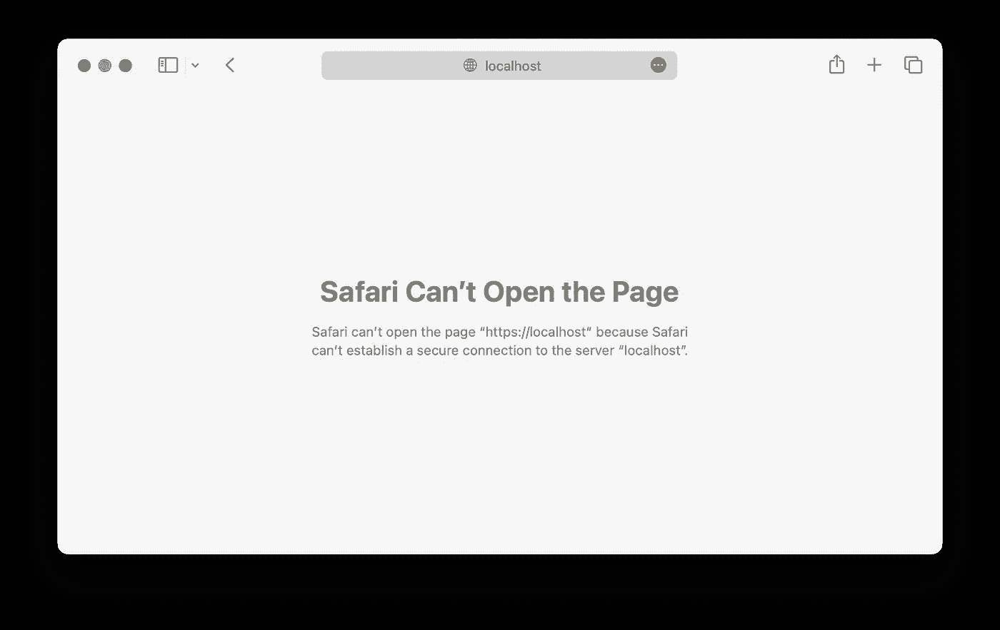
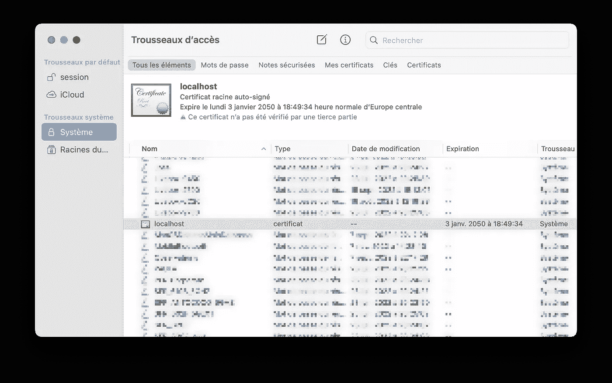
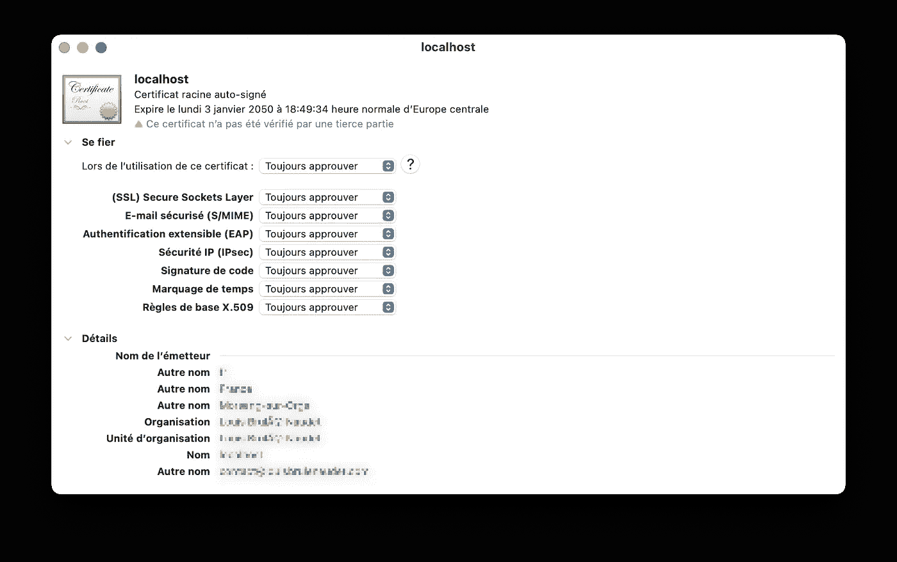
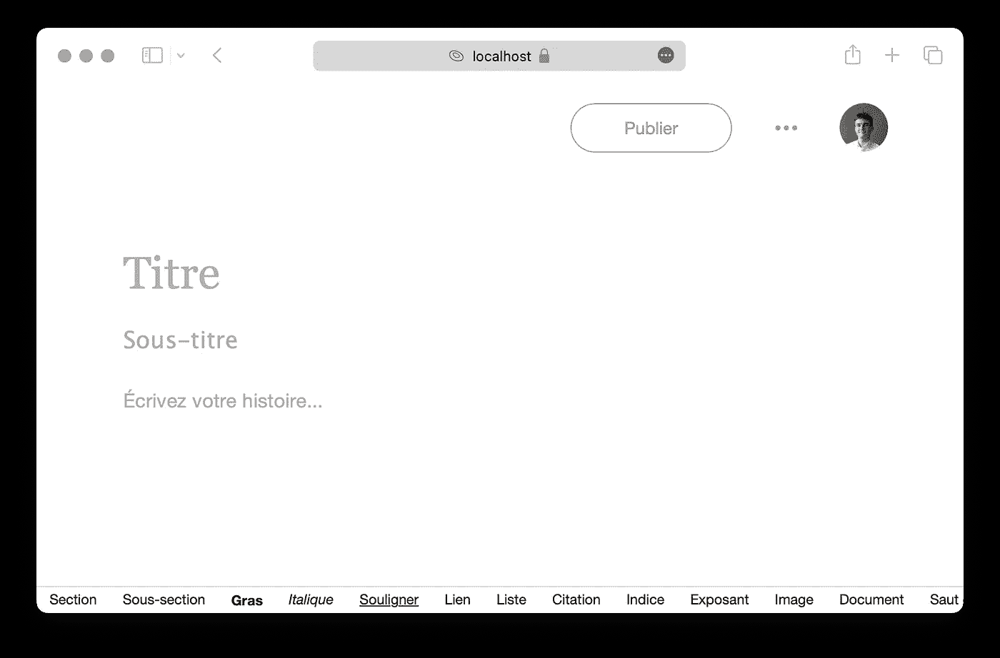

# 如何绕过“Safari 无法建立到服务器 localhost 的安全连接”安全限制

> 原文：<https://levelup.gitconnected.com/how-to-bypass-the-safari-cant-establish-a-secure-connection-to-the-server-localhost-security-8260877ad44c>

## 有时，即使有有效的证书，您在本地服务器上的站点也可能无法在 Safari 上访问，尤其是在重大更新后的开发者版本中。本教程旨在提供一种快速简单的解决方案，通过更改钥匙串中的系统设置来绕过这种类型的限制。

限制对本地服务器的访问是苹果公司实施的安全政策的一部分，以防止恶意代码渗入系统。这种保护非常重要，不应该在全局范围内禁用，而应该根据影响本地服务器的证书单独处理。

亚历山大·沙托夫在 [Unsplash](https://unsplash.com?utm_source=medium&utm_medium=referral) 上拍摄的照片

然而，Safari 的重大更新可能会挑战浏览器对证书的验证，并且会给开发人员带来问题，因为解决该问题会浪费不必要的时间。

Safari 无法打开页面(localhost)。

为此，第一步是打开钥匙串，并在“系统”子菜单和“所有项目”类别中找到与本地服务器相关联的证书:

钥匙串中的本地主机证书位置。

识别证书后，双击证书行，需要为“使用此证书时”选择“始终信任”选项:

“使用此证书时”选项的“始终信任”选项。

更改完成后，由于设置对安全策略的敏感性，MacOS 将要求输入密码以确认更改。验证完成后，只需在 web 浏览器上刷新相关页面，查看更改是否生效。在证书不续订的情况下，此设置应该是永久的，并在您的 Safari 版本更新期间保持不变。

Safari 现在提供本地主机。

但是，请记住，如果在所有已注册的证书上全面实施此设置，可能会对您的系统造成风险，并且应该仅在受限的开发活动中应用于本地服务器。

感谢阅读，

路易·布鲁莱·诺代，

 [## 路易·布鲁莱·诺代

### 商务和财政法研究硕士(巴黎-多芬大学)，概念专业…

louisbrulenaudet.com](https://louisbrulenaudet.com)