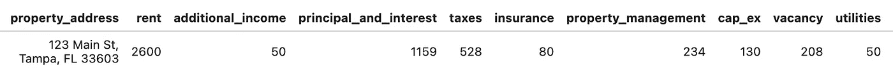
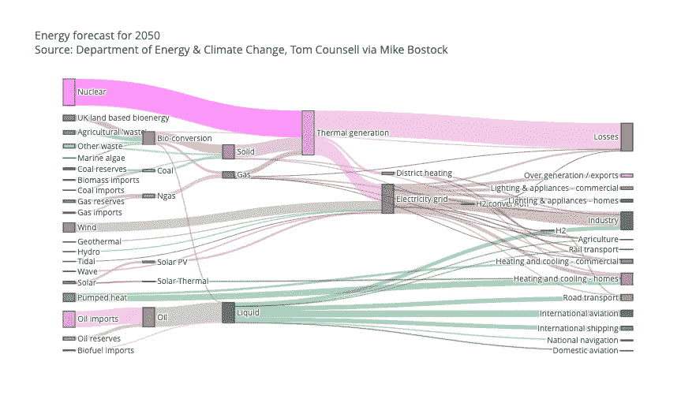
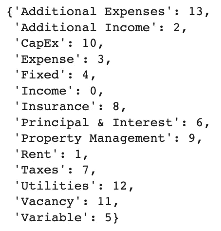
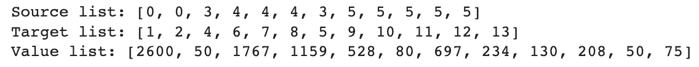
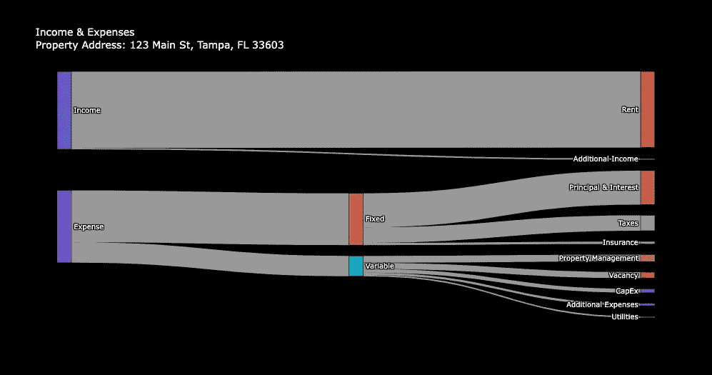

# 如何计算现金流并在 Python 中可视化

> 原文：<https://levelup.gitconnected.com/how-to-calculate-cash-flow-and-visualize-it-in-python-9305c4cb190f>

## 计算房地产现金流的 Python 教程


[来源](https://www.google.com/url?sa=i&url=https%3A%2F%2Fzaitoon.com.pk%2Fwhy-to-invest-in-property%2F&psig=AOvVaw0_iTaOqIVY-7LZGc90WQy6&ust=1649283625952000&source=images&cd=vfe&ved=0CAoQjRxqFwoTCPi567v6_fYCFQAAAAAdAAAAABAw)

H 如何计算一个楼盘是否会成功？房地产投资者用来判断投资是否合理的最重要指标之一是现金流**。本文将讨论如何计算现金流，以及如何在 Python 中将其可视化。**

****

## **什么是现金流？**

> **[现金流](https://learn.roofstock.com/blog/real-estate-cash-flow)描述了资金在租赁物业中的流动方式，类似于水流过瀑布的方式。— [车顶支架](https://learn.roofstock.com/blog/rental-property-cash-flow-analysis)**

**简单来说现金流就是**月收入——月支出**。剩余金额是你每月获利的数目。**

## **为什么我们想要正的现金流？**

****

**为了让你的投资产生效益，它需要**为你产生回报**。每月现金流通过创造一个被动收入流来做到这一点。**

**以下是现金流的好处:**

*   *****现金流创造更多机会。*** 将一项投资的利润再投资到另一项投资中是成倍增加你财务状况的好方法。**
*   *****现金流创造安全*。你每月的额外收入可以帮助你建立一个更大的储蓄储备，以保护你不被意外的生活开支(如医疗账单、汽车保养等)所困扰。).****

## **如何计算现金流？**

**让我们从等式开始:**

****现金流** **=总租金收入——所有费用和现金储备****

**这里有一个现实生活中的例子，如何计算我在佛罗里达州河景市拥有的一处房产的每月现金流。**

****月收入:****

*   **租金:2300 美元**
*   **宠物费:50 美元**
*   **月总收入:2350 美元**

****月费用:****

*   **抵押贷款:1120 美元(本金和利息)**
*   **财产税:430 美元**
*   **保险:75 美元**
*   **采购经理人指数:100 美元**
*   **HOA:100 美元**
*   **物业管理:0 美元**
*   **空置储备:115 美元(我租金收入的 5%，可根据风险承受能力调整)**
*   **维修储备金:115 美元(我租金收入的 5%，可根据风险承受能力调整)**
*   **每月总支出:2055 美元**

****月现金流= 2，350 美元—2，055 美元= 295 美元****

**我的目标是每月 300 美元的现金流。目标月现金流没有神奇的数字。然而，我想说的是，每月至少要有 100 美元的现金流。**

**好了，我们来回顾一下如何使用 Python*可视化*现金流！**

## **先决条件**

**你自己的 Python 环境或者谷歌账户。**

## **支持视频**

**请跟随我的 Python 教程来计算和可视化现金流。**

**[YouTube AnalyticsAriel](https://www.youtube.com/channel/UCKkUCaKNlfYBJAm-OGBRyYw)**

# **Python 教程**

**如果你没有现有的 Python 环境，那么我强烈建议首先用**克隆笔记本**(在文章的底部)。**

**这将允许您在 Google Colab 中运行 Python 代码(免费！).它是一个基于云的环境，让您无需在本地安装 Python 就可以运行代码。**

# **一.安装包**

**第一步是安装必要的软件包:**

```
!pip install plotly **-**q
```

*   ****plotly** 允许我们交互图表——参见基本图表[此处](https://plotly.com/python/basic-charts/)。**

# **二。导入包**

**接下来，导入必要的包。**

```
**import** plotly.graph_objects **as** go
**import** pandas **as** pd
```

# **三。数据加载**

**让我们读入样本属性的数据。这些数据是 CSV 格式的，在 Github 上公开发布。**

**我们可以用熊猫读入 CSV 文件。这将把我们的 CSV 文件转换成 dataframe(包含行和列的表格)。**

```
df **=** pd**.**read_csv(
'https://raw.githubusercontent.com/analyticsariel/public-data/main/cash_flow_data.csv')
df**.**head()
```

**该数据集包含月收入和支出的信息。**

****

**[Github](https://github.com/analyticsariel/projects/blob/master/REICalculations_CashFlow.ipynb)**

**接下来，我们将每个收入和支出值赋给一个变量。我们选择数据帧中的列并定位第一个值(第一行)。**

```
*# assign variables to values in table*
property_address **=** df['property_address']**.**iloc[0]
rent **=** df['rent']**.**iloc[0]
additional_income **=** df['additional_income']**.**iloc[0]
principal_and_interest **=** df['principal_and_interest']**.**iloc[0]
taxes **=** df['taxes']**.**iloc[0]
insurance **=** df['insurance']**.**iloc[0]
property_management **=** df['property_management']**.**iloc[0]
cap_ex **=** df['cap_ex']**.**iloc[0]
vacancy **=** df['vacancy']**.**iloc[0]
utilities **=** df['utilities']**.**iloc[0]
additional_expenses **=** df['additional_expenses']**.**iloc[0]
```

**我们可以创建**总**收入和支出变量。比如**总收入**就是房租+附加 _ 收入。**

**这些新变量将允许我们查看支出和收入的*流程*。**

```
*# summary variables*
total_income **=** rent **+** additional_income
fixed_expense **=** principal_and_interest **+** taxes **+** insurance
variable_expense **=** property_management **+** cap_ex **+** vacancy **+** utilities **+** additional_expenses
total_expense **=** fixed_expense **+** variable_expense
```

# **四。转换**

**我们想要创建一个 Sankey 图来可视化我们的收入和支出，类似于下面的 [Plotly 示例](https://plotly.com/python/sankey-diagram/):**

****

**[阴谋地](https://plotly.com/python/sankey-diagram/)**

**相对于其他[图形表达](https://plotly.com/python/plotly-express/)可视化而言，桑基图是一种复杂程度更高的图表。**

> **桑基图通过定义 [source](https://plotly.com/python/reference/sankey/#sankey-link-source) 来表示源节点，定义 [target](https://plotly.com/python/reference/sankey/#sankey-link-target) 来表示目标节点，定义[值](https://plotly.com/python/reference/sankey/#sankey-link-value)来设置流量，定义[标签](https://plotly.com/python/reference/sankey/#sankey-node-label)来显示节点名称。— [Plotly Express Sankey 描述](https://plotly.com/python/sankey-diagram/)**

**我们需要三个组件来创建我们的桑基图-**

1.  ****节点** —起点(即收入)**
2.  ****目标** —结束点，节点的子组件(即租金)**
3.  ****值** —流量之间的值(即 2600 美元)**

**让我们从创建所有标签的列表开始。然后，我们将把每个标签分配给一个整数，我们将在流程中引用它。**

```
*# create list of labels for the chart*
label_list **=** [ "Income",
               "Rent", 
               "Additional Income",
               "Expense", 
               "Fixed",
               "Variable",
               "Principal & Interest",
               "Taxes",
               "Insurance", 
               "Property Management", 
               "CapEx",
               "Vacancy",
               "Utilities",
               "Additional Expenses",
               ]
*# append an index number to each element in the list*
label_dict **=** {}
**for** i **in** range(len(label_list)):
  label_dict[label_list[i]] **=** i
label_dict
```

**输出:**

****

**接下来，我们创建一个*嵌套列表*来定义我们的节点- >目标- >价值流。**

```
*# create sub list for each node -> target -> value*
sankey_list **=** [
  *# income*
  ["Income", "Rent", rent], 
  ["Income", "Additional Income", additional_income], 
  *# expenses [fixed]*
  ["Expense", "Fixed", fixed_expense], 
  ["Fixed", "Principal & Interest", principal_and_interest], 
  ["Fixed", "Taxes", taxes], 
  ["Fixed", "Insurance", insurance],
  *# expenses [variable]*
  ["Expense", "Variable", variable_expense], 
  ["Variable", "Property Management", property_management], 
  ["Variable", "CapEx", cap_ex], 
  ["Variable", "Vacancy", vacancy], 
  ["Variable", "Utilities", utilities], 
  ["Variable", "Additional Expenses", additional_expenses],
]
```

**为了绘制我们的数据，我们需要传递三个列表。**

**对于*源*和*目标*列表，我们需要传递分配给每个标签的整数值。值列表检索嵌套列表中的最后一个元素。**

```
*# create sublists from the sankey list*
source_list **=** [label_dict[x[0]] **for** x **in** sankey_list]
target_list **=** [label_dict[x[1]] **for** x **in** sankey_list]
value_list **=** [x[2] **for** x **in** sankey_list]

print('Source list:', source_list)
print('Target list:', target_list)
print('Value list:', value_list)
```

**输出:**

****

# **动词 （verb 的缩写）形象化**

**我们可以使用 [Plotly 指标](https://plotly.com/python/indicator/)来可视化现金流**

```
fig **=** go**.**Figure(go**.**Indicator(
    mode **=** "number+delta",
    value **=** total_income **-** total_expense,
    number **=** {'prefix': "Cash Flow - $"},
    domain **=** {'x': [0, 1], 'y': [0, 1]})
)

fig**.**update_layout(height**=**300)

fig**.**show()
```

**输出:**

****

**接下来，我们通过绘制源、目标和值列表来创建 Sankey 图。**

```
*# create figure*
fig **=** go**.**Figure(data**=**[go**.**Sankey(
    *# nodes*
    node **=** dict(
      pad **=** 15,
      thickness **=** 20,
      line **=** dict(color **=** "black", width **=** 0.5),
      label **=** label_list, *# cash flow parameters*
      hovertemplate**=**'%{label} has total value $%{value}',
    ),
    *# links*
    link **=** dict(
      source **=** source_list, *# start node*
      target **=** target_list, *# end node*
      value **=** value_list *# value of end node*
  ))])

fig**.**update_layout(
    hovermode **=** 'x',
    title**=**"Income & Expenses<br>Property Address: {}"**.**format(property_address),
    *# optional for black background*
    font**=**dict(size **=** 10, color **=** 'white'),
    plot_bgcolor**=**'black',
    paper_bgcolor**=**'black'
)

fig**.**show()
```

**输出:**

****

# **结论**

**桑基图是可视化多流(如现金流)的好方法。这可以帮助个人快速发现增加收入或减少现金流支出的机会。**

**查看我的 [YouTube 频道——AnalyticsAriel](https://youtube.com/c/analyticsariel),了解更多关于房地产数据来源和数据分析的见解！**

# **克隆笔记本**

**[](https://github.com/analyticsariel/projects/blob/master/calculators/cash_flow_calculator.ipynb) [## projects/cash _ flow _ calculator . ipynb at master analytics Ariel/projects

### https://analyticsariel.com/.通过在 GitHub 上创建帐户，为 analyticsariel/projects 开发做出贡献。

github.com](https://github.com/analyticsariel/projects/blob/master/calculators/cash_flow_calculator.ipynb) 

# 来源

[](https://plotly.com/python/sankey-diagram/) [## 桑基

### 链接和节点有自己的 hovertemplate，其中可以显示特定于链接或节点的属性。要添加更多…

plotly.com](https://plotly.com/python/sankey-diagram/) [](https://sparkrental.com/visualizing-rental-cash-flow-4-graphs-showing-how-landlords-money-moves/) [## 房地产现金流- 3 幅图片展示了租赁利润的实际运作方式

### 房地产现金流与“正常”月份发生的事情无关。在一个“正常”的月份里，你的花费可能会…

sparkrental.com](https://sparkrental.com/visualizing-rental-cash-flow-4-graphs-showing-how-landlords-money-moves/)**