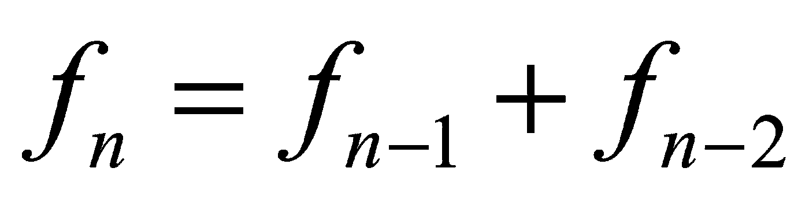
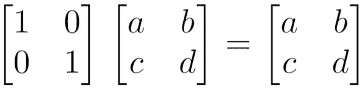
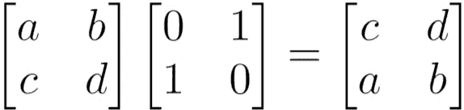
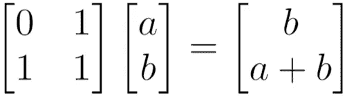
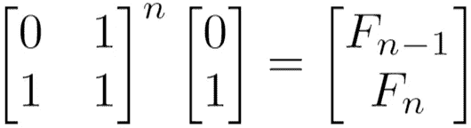
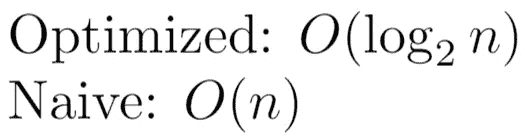

# 如何计算对数时间内的斐波那契数列

> 原文：<https://levelup.gitconnected.com/how-to-calculate-the-fibonacci-sequence-in-logarithmic-time-abde842f5a39>


朱莉安娜·马尔他在 [Unsplash](https://unsplash.com?utm_source=medium&utm_medium=referral) 上拍摄的照片

著名的斐波那契问题的天真解是指数型的，大多数人可以在线性时间内解决它。但是我们能做得更好吗？绝对的。

# 什么是斐波那契问题？

这是一个经典的问题，第 n 项是前两项之和。前两项是 1 和 1。第三个是 2，第四个是 3，然后是 5，8 等等。



# 一般是怎么解决的？

最常见的是，人们倾向于使用一个简单的递归解决方案来调用前两项的函数。显然，这是非常低效的，并且以指数时间运行(每个函数调用分支成两个大小为 n-1 或 n-2 的独立函数调用)。

```
// calculates nth term of fibonacci, 1 indexed
Procedure Fib_Naive(**int** n):
    **if**(n < 3):
        **return** 1;
        end_if
    **return** Fib_Naive(n-1) + Fib_Naive(n-2)
end_Fib_Naive
```

# 斐波那契，改进

一个更好的方法是要么用一个递归函数来记忆，要么用一个临时变量来保存前两项。

或者，我们可以只保留一个 *temp* 变量，并对其进行迭代编程，这是更可取的，因为递归通常比迭代解决方案耗时更长(这是因为被推送到调用堆栈的调用需要额外的汇编代码指令)。

```
// calculates nth term of fibonacci, 1 indexed
Procedure Fib(**int** n):
        **if**(n < 3): **return** 1; **int** prev = 1;
        **int** cur = 1;
        **for** i = 3...n:
            **int** temp = cur;
            cur += prev;
            prev = temp;
        end_for**return** cur;
end_Fib
```

# 一种新方法

在我们开始之前，让我们考虑一下基本的线性代数，好吗？

回想一下单位矩阵，它的对角线设置为 1，每隔一个条目设置为 0:



一个矩阵乘以一个单位矩阵就是它本身，反过来也是如此如上图。

如果我们交换单位矩阵的两行，并将其乘以另一个矩阵，这相当于交换另一个矩阵的相同两行:



这个矩阵称为置换矩阵(中间)

现在假设我们在上面的置换矩阵的右下角条目上加一个 1，然后乘以一个 2x1 向量(a，b)。会发生什么？根据矩阵乘法的规则，这将交换前两行，并将结果矩阵的最底部条目设置为(a+b)。



我们现在可以回到手头的问题上来。还记得我们对斐波那契问题的迭代解法吗？在这个等式中， *a* 表示前一个元素(第 *(n-1)个*元素)，而 *b* 表示当前元素。

上面的矩阵乘法方程做的完全一样。

事实证明，如果我们将左边的矩阵提升到 n 次方，并乘以(0，1)，我们将获得斐波那契数列的第 n 个元素。



# 这怎么是对数？

两个字:[反复平方](https://algorithmist.com/wiki/Repeated_squaring)。而不是把左矩阵乘以 n 次，我们可以用矩阵乘法的前几个乘积来更快的达到我们的答案。

矩阵的 8 次幂可以通过对原始矩阵求平方来计算，然后求平方以获得 4 次幂，然后再求平方。这比将同一个矩阵相乘 8 次要快。

因此，我们获得以下性能分析:



为了减少混乱(因为用代码实现这个可能很棘手)，这里是一个实际的 Java 实现(不像前面的例子那样是伪代码)。

没有任何矩阵，但它仍然利用前面讨论的重复平方来实现我们的对数性能:

```
public int fib(int N) {
        if(N == 0) return 0;
        int[] sol = fibHelp(N);

        return sol[1];
    }

    public int[] fibHelp(int n) {
        if(n == 1) {
            return new int[] {0,1};
        }
        int m = n/2;

        int[] temp = fibHelp(m);

        int fPrev = temp[0];
        int fCur = temp[1];

        int prev = (fPrev * fPrev) + (fCur * fCur);
        int cur = fCur * (2 * fPrev + fCur);
        int next = prev + cur;

        if(n % 2 == 0) { 
            return new int[] {prev, cur};
        }
        else {
            return new int[] {cur, next};
        }
    }
```

***注意:**虽然说我们已经大大减少了计算时间，并且这种实现被广泛接受为对数实现，但我们必须考虑一个问题:算术的时间复杂性。

[已知最快的乘法算法](https://hal.archives-ouvertes.fr/hal-02070778)执行速度为 O(n log(n))。所以，算术运算的次数在技术上是*而不是承诺的*。然而，我们的递归深度是对数的，如下面的代码示例所示。