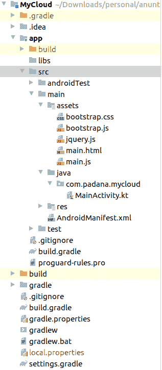

# 如何从 JavaScript 调用 Android 函数

> 原文：<https://levelup.gitconnected.com/how-to-call-android-functions-from-javascript-3f7628340374>

你有没有想过如何从 JavaScript 调用纯 Android Kotlin(或者 Java)函数？

有一些框架已经在为你做这件事了，比如 Ionic 或者 React Native，还有 Apache Cordova。我现在不打算谈论它们，因为我喜欢从零开始建造东西，我对自己建造的东西更有信心。

当我第一次想构建快速的 android 应用程序时，我搜索了使用 web 技术构建 android 应用程序的解决方案。我过去使用 Android 框架(Java 和后来的 Kotlin ),我知道构建一个漂亮的界面可能是一场噩梦。

此外，我不想构建两个不同的应用程序，一个用于 android，一个用于 web。所以，我开始寻找解决办法。最简单的是 Ionic 框架，所以我直接跳了进去。后来，在项目期间，我需要一些核心的 android 功能，比如从设备上读取所有图像和视频。嗯，在这种情况下，爱奥尼亚就像是一个令人头疼的**。所以，再一次，开始寻找解决方案。

最后，经过大量的研究和测试，我把所有的钱都放在了普通 JavaScript(使用任何你想要的 JS 库，比如 jQuery)和 android 原生调用上。

现在，如何从 JavaScript 调用一个原生 Android 函数？这很简单。

首先，我必须创建一个新的 Android 项目。我不会展示创建一个项目的每个步骤，你所要做的就是安装 Android Studio 并按照向导创建一个新项目。

当你有了这个项目，你必须在 **src** 下创建一个名为 **assets** 的文件夹，在那里你将放置你所有的 **html** 、 **css** 和 **js** 相关文件。文件夹结构如下所示:

如你所见，我已经创建了一些资产，bootstrap.css、bootstrap.js、jquery.js、main.html 和 main.js，最重要的是**main.html**和 **main.js** ，其他的只是帮助者库。

**显示来自 JavaScript 的原生 toast 消息**

首先，我必须创建一个按钮，它将调用一个 JavaScript 函数来执行操作。我的 html 应该是这样的:

如您所见，我创建了一个普通的 html 按钮，它调用函数 *showToast()* 。

让我们定义一下 *showToastFunction()* :

目前，我们的功能是空的。让我们把 JavaScript 和 android 结合起来。从 js 调用原生函数真的很有趣，也很容易。

**与 Android Kotlin 集成**

我们现在在 Android 源代码中拥有的只是类 **MainActivity.kt** 。即使这只是一个演示项目，我也会尽量尊重干净的编码标准。因此，为了能够从 JavaScript 调用 android 函数，我将创建一个新的内部类，名为 **JsWebInterface** ，它将接收一个 *context:Context* 作为构造函数。

在这个类中，我将创建一个名为 **makeToast 的方法(message: String？，lengthLong: Boolean)** 用 *@JavaScriptInterface* 注释，它告诉 android 容器将这个函数暴露给 **WebView** 。

最后，在我来自 *MainActivity* 类的 *onCreate()* 方法中，我将实例化一个指向我的*main.html*的新 *WebView* 客户端，并将 JavaScript 接口设置为指向我们的类。

故事讲完了，让我们看看代码。

**主要活动**类别:

**JsWebInterface** 类:

我们最终的 Android**main activity . kt**会是这样的:

最后，我们必须对我们的 JavaScript 函数进行一些更改，以便从 JavaScript 调用我们的*make toast()**函数。我们最终的代码看起来会像这样:*

*其中 **androidApp** 是我们将*jsweb interface**类粘合到 android *WebView* 对象时给它起的名字。**

**如您所见，从 JavaScript 调用 android 原生函数非常简单，即使您没有太多 Android 框架经验，也会非常有趣。**

****PS:** 如果你曾经需要一个正常运行时间监控工具，只需检查 [RoboMiri](https://robomiri.com) 。最好的免费正常运行时间监测服务。**