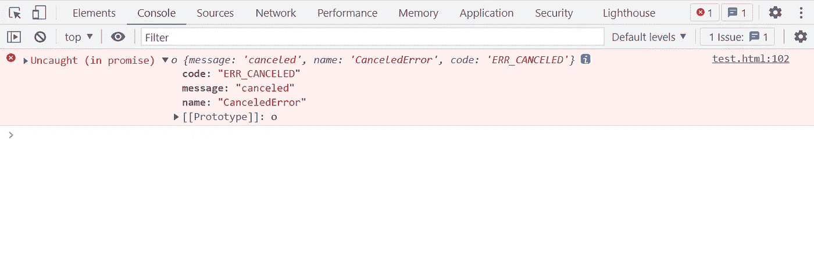

# 如何在 JavaScript 中取消请求

> 原文：<https://levelup.gitconnected.com/how-to-cancel-a-request-in-javascript-67f98bd1f0f5>

## 更好的解决方案


托马斯·詹森在 [Unsplash](https://unsplash.com?utm_source=medium&utm_medium=referral) 上拍摄的照片

本文将向您展示如何在 XMLHttpRequest、Fetch 和公共第三方库`[axios](https://github.com/axios/axios)`中取消请求。

在开始之前，有必要再次简要描述一下 Ajax。是**异步 JavaScript 和 XML** 的简称。杰西·詹姆斯·加勒特(Jesse James Garrett)在 2005 年创造了这个术语，用来描述一种结合了多种现有技术的“新”方法。所以不是单独的技术。这种方法使 web 应用程序能够快速、渐进地更新用户界面，而无需重新加载整个浏览器页面。

XMLHttpRequest 和 Fetch 是目前浏览器提供的两种获取资源的 API。axios 是一个流行的三方承诺请求库，内部使用 XMLHttpRequest。

# 取消 XMLHttpRequest 请求

如果请求已经发送，那么`**XMLHttpRequest.abort()**`方法会中止请求。当一个请求被中止时，它的`[readyState](https://developer.mozilla.org/en-US/docs/Web/API/XMLHttpRequest/readyState)`被更改为`XMLHttpRequest.UNSENT` (0)，并且请求的`[status](https://developer.mozilla.org/en-US/docs/Web/API/XMLHttpRequest/status)`代码被设置为 0。

例如:

```
const xhr = new XMLHttpRequest();xhr.open('GET', '[http://127.0.0.1:3000/api/get'](http://127.0.0.1:3000/api/get'), true);
xhr.send();setTimeout(() => {
 **xhr.abort();**
}, 1000);
```

下图是 Chrome DevTools 中网络中正常请求和取消请求的比较。


# 取消提取请求

如果你想取消一个获取请求，你需要使用 [AbortController](https://developer.mozilla.org/en-US/docs/Web/API/AbortController) API。可以使用构造函数创建新的 AbortController 对象。它有一个只读属性`AbortController.signal`，这是一个 [AbortSignal](https://developer.mozilla.org/en-US/docs/Web/API/AbortSignal) 对象实例，可用于与 DOM 请求(如 fetch 请求)通信或中止该请求。

它还有一个方法`AbortController.abort()`，该方法中止获取请求、任何响应体和流的使用。

例如:

```
**const controller = new AbortController();**void (async function () {
    const response = await fetch('[http://127.0.0.1:3000/api/get'](http://127.0.0.1:3000/api/get'), {
        **signal: controller.signal,**
    });
    const data = await response.json();
})();setTimeout(() => {
    **controller.abort();**
}, 1000);
```

下面是一个对比:


注意`controller.abort()`支持传递可选参数`reason`。指示操作中止的原因。在上面的例子中，我们没有指定它，那么它将被设置为“abor terror”`[DOMException](https://developer.mozilla.org/en-US/docs/Web/API/DOMException)`。

而且我们也没有捕捉到使用`try...catch`等，那么你会在控制台得到这样的错误。


# 取消 Axios 请求

而在 Axios 中，从`v0.22.0`开始，支持`[AbortController](https://developer.mozilla.org/en-US/docs/Web/API/AbortController)`以 fetch API 方式取消请求:

```
**const controller = new AbortController();**
const API_URL = '[http://127.0.0.1:3000/api/get'](http://127.0.0.1:3000/api/get');void (async function () {
    const response = await axios.get(API_URL, {
        **signal: controller.signal,**
    });
    const { data } = response;
})();setTimeout(() => {
    **controller.abort();**
}, 1000);
```

下面是一个对比:


以下是未捕获的错误:



不过，Axios 目前支持取消请求的`CancelToken`方法，但它已被标记为不推荐使用。更多信息，请参见[官方文档](https://axios-http.com/docs/cancellation)。

*今天就到这里。我是 Zachary，我将继续输出与 web 开发相关的故事。如果你喜欢这样的故事，想支持我，请考虑成为* [*中会员*](https://medium.com/@islizeqiang/membership) *。每月 5 美元，你可以无限制地访问媒体内容。如果你通过* [*我的链接*](https://medium.com/@islizeqiang/membership) *报名，我会得到一点佣金。*

你的支持对我很重要——谢谢。