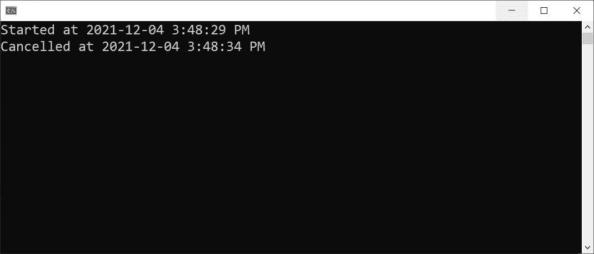
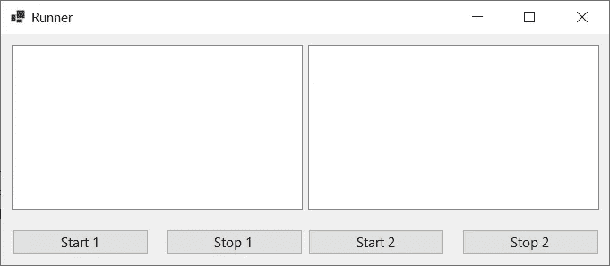
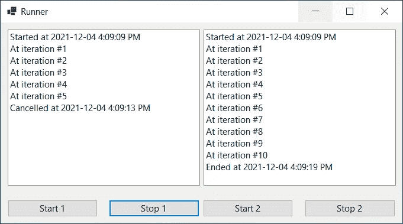

# 如何在单独的请求/命令中取消正在运行的进程。NET C#

> 原文：<https://levelup.gitconnected.com/how-to-cancel-a-running-process-in-a-separate-request-command-in-net-c-2ca8fb733618>

## 提示和技巧

## 了解如何在单独的请求中取消已经运行的进程。NET C#

马库斯·温克勒在 [Unsplash](https://unsplash.com/?utm_source=unsplash&utm_medium=referral&utm_content=creditCopyText) 上的照片

我的一个朋友正在做一个独特的项目，他需要能够取消一个长时间运行的过程，但在一个单独的请求。奇怪吗？也许吧，但它已经发生了。让我告诉你更多…

他正在开发一个带有大量 3D 建模的 Web 应用程序。该应用程序应该用于为某个产品构建 3D 模型，最终用户应该能够以某种格式下载该模型。

然而，建模过程本身是如此繁重，需要大量的处理。这就是为什么最终用户应该提供一些输入，触发建模过程，并且在某个时候，当模型可以下载时，他应该收到一封电子邮件。

到目前为止，还可以。但是，如果最终用户决定对输入进行一些更改，他可以开始一个新的建模过程，但是已经运行的过程怎么办呢？让它在服务器上运行是明智的吗？？？

 [## 🔥订阅艾哈迈德的时事通讯🔥

### 订阅艾哈迈德的时事通讯📰直接获得最佳实践、教程、提示、技巧和许多其他很酷的东西…

medium.com](https://medium.com/subscribe/@eng_ahmed.tarek) 

照片由 [Jukan Tateisi](https://unsplash.com/@tateisimikito?utm_source=unsplash&utm_medium=referral&utm_content=creditCopyText) 在 [Unsplash](https://unsplash.com/?utm_source=unsplash&utm_medium=referral&utm_content=creditCopyText) 上拍摄

# 逐步地

好了，我要在这里解释的不是火箭科学。不过，还是一步一步来吧。

首先，让我指出以下几点:

1.  一些最佳实践可能会被忽略/丢弃，以便将主要焦点转移到本文所涉及的其他概念上。
2.  我们不会创建一个完整的 Web 应用程序，因为这会包含很多干扰。我们将只使用控制台和 Windows 窗体应用程序。
3.  本文中包含的代码仅用于演示和解释。在进入生产代码之前，您需要应用一些重构和清理。
4.  我将在本文中解释的技术带来了一些挑战。我会在适当的时候告诉你更多关于这些挑战的信息。

# 当你无法控制的时候

假设我们有一个简单的**控制台应用程序**。我们有一个`TooLongProcess`方法，完全执行起来需要一些时间。

在这里，我们通过循环 10 次来模拟这种情况，每次迭代我们等待一秒钟。

然后，调用这个`TooLongProcess`方法应该如下:

运行此命令，最终会得到以下结果:

很好，但是现在，让我问你，你对已经运行的`TooLongProcess`有控制力吗？

答案很简单，不。一旦`TooLongProcess`方法中的代码启动，我们就无法控制它。

# 让我们来控制一下

现在，我们想要做一些改变，以便我们获得对已经运行的`TooLongProcess`的控制。

为了实现这一点，我们将对`TooLongProcess`方法本身进行如下修改:

现在，如您所见，`TooLongProcess`方法现在需要一个传入的`CancellationToken`参数。在循环内部，我们检查传入的取消令牌是否被取消。如果是，我们就退出循环，并记录一条消息，说明该过程已被取消。

然后，调用这个`TooLongProcess`方法应该如下所示:

现在，我们必须通过一个`CancellationTokenSource`创建一个取消令牌，并将其传递给`TooLongProcess`方法。然后我们等待 5 秒钟，然后取消令牌。

运行此命令，最终会得到以下结果:

太好了，现在我们可以取消已经运行的`TooLongProcess`。然而，我们仍然在最初启动`TooLongProcess`的相同上下文/范围内这样做。

如果我想从另一个范围取消已经运行的`TooLongProcess`该怎么办？

如果`TooLongProcess`驻留在一个 Web API 项目中，而最终用户在另一个时间做出了取消流程的决定，该怎么办？

可能是通过一个完全独立的请求。

# 新技术

为了解释这种技术，我们不打算创建一个完整的 Web API 或 Web 应用程序项目，因为这会产生更多的干扰。

相反，我们将创建一个简单的 Windows 窗体应用程序。应用程序应该如下所示:

一个简单的表单，有 2 个`ListBox`控件和 4 个`Button`控件。

主要思想是，当我们单击“Start 1”按钮时，一个长时间运行的过程将开始，它将一直登录到第一个列表框中。每当我们点击“停止 1”按钮，已经运行的进程将被取消。

这是我们模拟两个完全独立的请求的方式，就好像这些请求是从 Web 应用程序的 UI 触发的，而运行的进程实际上是一个托管在不同服务器上的 Web API。

这同样适用于“开始 2”和“停止 2”按钮。

运行应用程序时，您应该会看到类似这样的内容:

这里发生的是，我们几乎同时点击了“开始 1”和“开始 2”，然后在 5 秒钟后我们点击了“停止 1”。因此，进程 1 提前停止，而进程 2 在 10 秒后成功结束。

为了能够跟进文章的其余部分，您可以访问这个库 上的 [**代码。**](https://github.com/AhmedTarekHasan/ProcessCancellation)

# 代码

现在，我们来看看如何实现这一点。为简单起见，所有代码都将包含在`Form`代码中，正如您所见。然而，在现实世界中，这并不是好的做法。

首先，我来解释一下主旨。

正如我们之前商定的，当我们单击“Start 1”按钮时，应该会启动进程 1。这里我们将传入一个我们所学过的`CancellationToken`,这样我们就可以控制这个过程。

然而，即使在“开始 1”逻辑的上下文/范围之外，我们仍然需要做一些事情来控制。

要做到这一点，保留对某些内容的引用是合乎逻辑的，这些内容使我们能够取消传入的令牌，即使是从另一个范围。

此外，我们需要在“Start 1”和“Stop 1”之间有一些共同点，以便“Stop 1”知道如何访问我们为“Start 1”保留的引用。

此外，我们需要记住，当使用 Web 应用程序时，我们保留的引用应该是我们可以序列化并通过 HTTP 请求来回传递的内容。

因此，虽然`CancellationToken`(或`CancellationTokenSource`)本身就是我们需要的引用，但我们不能依赖它作为通过 HTTP 请求来回发送的东西。

话虽如此，最好的办法是在创建取消令牌的时候创建一些 id，然后这个 Id 应该作为通过 HTTP 请求来回发送的密钥。并且，知道了 Id，应该给我们提供访问实际的`CancellationToken`(或者`CancellationTokenSource`)的途径。

因此，现在，让我们检查一下代码，看看我们能注意到什么:

1.  我们定义了`private Guid m_Process1`和`private Guid m_Process2`来保持`Guid`用于进程 1 和进程 2。
2.  这些现在是静态的，但是在现实世界中，这些`Guid`值应该被动态地创建并发送给 API 调用者，以便它们可以在以后需要时用于取消。
3.  我们还定义了`private Dictionary<Guid, CancellationTokenSource> m_TokensCatalog`作为目录，我们将在其中保存每个`Guid`及其相关的`CancellationTokenSource`。
4.  在现实世界中，这是应该在服务器上保存和维护的东西。我有一个关于这方面的笔记，我会在这篇文章的结尾告诉你。所以，确保你不会错过它。
5.  在`BtnStart1_Click`事件处理程序中，我们正在创建`CancellationTokenSource`，在目录中添加一条记录，并调用`TooLongProcess`方法，传入创建的取消令牌。
6.  同样的逻辑也适用于`BtnStart2_Click`事件处理程序。
7.  在`BtnStop1_Click`事件处理程序中，我们使用 Id 和目录来访问适当的`CancellationTokenSource`，然后在其上触发`Cancel`方法。
8.  同样的逻辑也适用于`BtnStop2_Click`事件处理程序。

简单吧？

# 挑战

你可能会注意到一些你不喜欢的东西。

正如我们在上一节中所解释的，特别是在第 4 点上，我们保存`CancellationTokenSource`引用的目录保存在服务器上，以便我们以后可以使用它们来取消。

这可不好。为什么？因为现在我们的 API 不是无状态的，而是有状态的。

换句话说，要实现的最佳目标是，每个请求都不应该拥有关于其他先前或后续请求的任何知识。这样，我们可以应用更多的增强和概念，比如使用**负载平衡器**。

然而，现在在服务器上保存了参考目录之后，这就不再有效了。

例如，如果“开始 1”请求被定向到“服务器 1”，为了使取消起作用，“停止 1”请求也应该被定向到“服务器 1”，否则，它不起作用。

我现在要问你的问题是，你认为事情这样不符合逻辑吗？

好吧，我来解释一下。首先，你的目标是我们有能力在某个服务器上取消一个已经运行的进程。所以，逻辑上应该和某个服务器有一些耦合。

然而，我们不喜欢的是，我们认为我们只有两个选择:

1.  失去希望，放弃整个取消运行过程的事情。
2.  使整个应用程序有状态。

但是，我认为这不是真的。我认为您仍然可以让您的应用程序保持无状态，并且能够取消正在运行的进程。然而，要做到这一点，您需要在负载平衡器上做更多的工作。

您的负载平衡器应该负责保存和维护一个将请求 Id 映射到服务器 Id 的目录。然后，当带有某个请求 Id 的取消请求到来时，负载均衡器知道将取消请求定向到哪个服务器。最后，一旦某个服务器收到取消请求，其余的将和以前一样。

[陈京达](https://unsplash.com/@jingdachen?utm_source=unsplash&utm_medium=referral&utm_content=creditCopyText)在 [Unsplash](https://unsplash.com/?utm_source=unsplash&utm_medium=referral&utm_content=creditCopyText) 上的照片

# 最后的话

好了，现在你知道我们在说什么了。不过，不知道大家怎么看。

我非常希望得到您的反馈，如果您以前遇到过同样的需求？你对此做了什么？你喜欢什么？你不喜欢什么？…

就这样，希望你觉得读这个故事和我写它一样有趣。

# 希望这些内容对你有用。如果您想支持:

如果您还不是**媒介**的会员，您可以使用 [**我的推荐链接**](https://medium.com/@eng_ahmed.tarek/membership) ，这样我可以从**媒介**中获得您的一部分费用，您无需支付任何额外费用。
▎订阅 [**我的简讯**](https://medium.com/subscribe/@eng_ahmed.tarek) 将最佳实践、教程、提示、技巧和许多其他很酷的东西直接发送到您的收件箱。

# 其他资源

这些是你可能会发现有用的其他资源。

 [## 中的分层树形数据。NET C#

### 为分层树形数据及其相关操作设计一个数据结构。NET C#

levelup.gitconnected.com](/hierarchical-tree-form-data-in-net-c-d2a868fcb756)  [## 里解释的利斯科夫替代原理。NET C#

### 真正理解中 SO(L)ID 原理的 Liskov 替换原理。NET C#

levelup.gitconnected.com](/the-liskov-substitution-principle-explained-in-net-c-2a838b8a5155) 