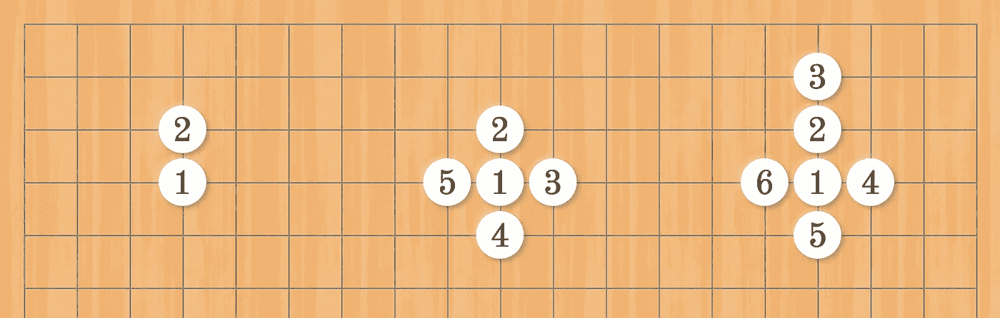
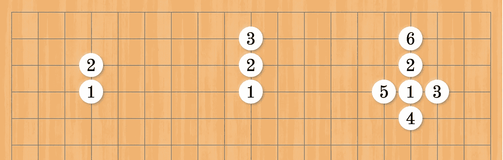

# 如何用搜索算法捕捉龙

> 原文：<https://levelup.gitconnected.com/how-to-capture-a-dragon-with-search-algorithms-715c3c288baa>

搜索算法入门:深度优先和广度优先。


由 [Clint Bustrillos](https://unsplash.com/@clintbustrillos?utm_source=medium&utm_medium=referral) 在 [Unsplash](https://unsplash.com?utm_source=medium&utm_medium=referral) 上拍摄的照片

如果你只是为了考试和技术面试而学习算法，那么算法可能是一场噩梦。如果在学习算法的同时还能玩得开心，岂不是轻松很多？本文将通过示例引导您完成基本的搜索算法，以实现一个传统的棋盘游戏。

# 玩围棋

围棋是两个人的完美信息博弈。围棋的规则很简单；然而，合法游戏位置的数量是天文数字，使得棋盘游戏特别受数学家和计算机科学家的欢迎。

根据詹姆斯·戴维斯(James Davies)的《围棋规则和要素》(Rules and Elements of Go)，围棋的规则如下所示。

```
1\. The board is empty at the onset of the game (unless players agree to place a handicap).2\. Black makes the first move, after which White and Black alternate.3\. A move consists of placing one stone of one's own color on an empty intersection on the board.4\. A player may pass their turn at any time.5\. A stone or solidly connected group of stones of one color is captured and removed from the board when all the intersections directly adjacent to it are occupied by the enemy. (Capture of the enemy takes precedence over self-capture.)6\. No stone may be played so as to recreate a former board position.7\. Two consecutive passes end the game.8\. A player's area consists of all the points the player has either occupied or surrounded.9\. The player with more area wins.
```

本文将讨论规则 5。具体来说，我们将回答以下问题:

> 计算机程序如何识别一组相连的石头？

# 捕捉一条龙

当你在棋盘上水平或垂直排列相邻的单色棋子时，它们形成一组。有足够多的相连石头的群体也称为龙。

## 深度优先搜索

以编程方式实现这一点的一种方法是采用深度优先搜索算法。考虑下面的三个例子来演示下面的深度优先搜索:



DFS 的示例

第一个例子是当我们的算法找到一个邻居到我们的起始节点的顶部。第二个示例显示了它探索每个方向的顺序。第三个例子是我们算法的关键——它在回溯之前尽可能远地探索一个分支中的连接石头，并继续前进到下一个分支。

对于深度优先搜索算法的更正式的定义:

```
DFS(graph, node, group)
  add node to group
  for each neighbor in the neighbors of node
    if neighbor is not in the group
      recursively call DFS(graph, neighbor, group)
```

你可以把棋盘想象成一个图形，把每块石头想象成一个节点。这个群，或称龙，是图上一系列相连的节点。寻找龙的行为是简单地遍历图来寻找所有连接的节点。

下面是 JavaScript 中深度优先搜索算法的一个例子，以及一个使用 [Jest 测试框架](https://jestjs.io/)演示如何与类交互的伴随测试。

需要注意的一个实现细节是，这个示例使用 [Set](https://developer.mozilla.org/en-US/docs/Web/JavaScript/Reference/Global_Objects/Set) 作为底层数据结构来存储一个组，确保每个值都是唯一的，并防止代码陷入循环。

[](/how-to-make-a-go-board-with-css-ac4cba7d0b72) [## 如何用 CSS 制作围棋棋盘

### CSS 网格，线性梯度，神经形态，以及围棋历史中的一个瞬间。

levelup.gitconnected.com](/how-to-make-a-go-board-with-css-ac4cba7d0b72) 

## 广度优先搜索

与深度优先搜索中尽可能远地探索一个方向相反，广度优先搜索是一种替代算法，它在移动到下一个节点之前探索当前节点的所有可能的边。



BFS 的例子

与深度优先搜索不同，由于算法的递归性质，深度优先搜索通常与堆栈数据结构相关联，下面的伪代码使用队列数据结构迭代地实现宽度优先搜索。

```
BFS(graph, node, group)
  let Q be a queue
  add node to Q
  while Q is not empty
    remove the first node from Q and let it be the current node
    add current node to group
    for each neighbor in the neighbors of current node
      if neighbor is not in the group
        add neighbor to Q
```

完整的 JavaScript 实现:

# 你的行动

虽然深度优先和宽度优先的搜索算法足以捕捉龙，但不幸的是，如果每次你采取新的行动时都必须搜索整个棋盘，你会太累而无法对它们采取任何行动。

敬请关注下一期*如何用全新的算法和数据结构捕捉龙*。