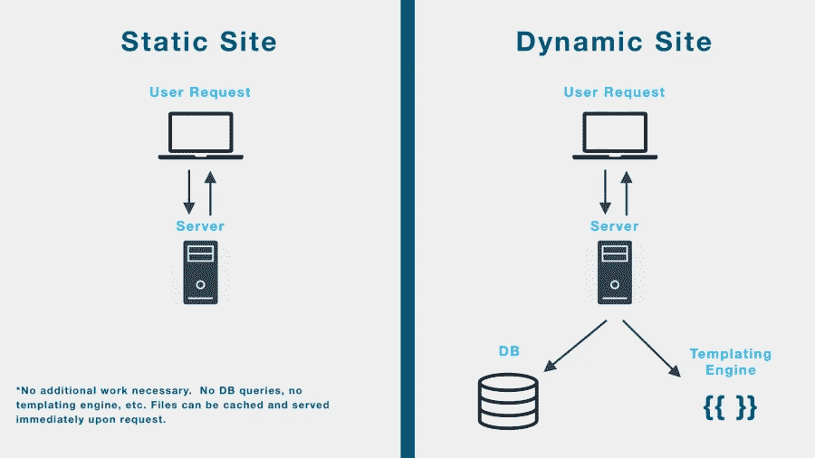
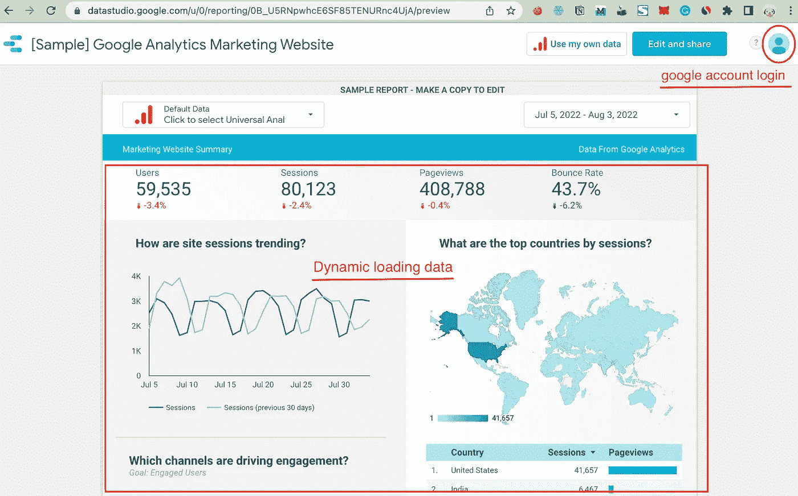

# 使用 Golang 捕获包含动态内容和所需登录的页面的屏幕截图

> 原文：<https://levelup.gitconnected.com/how-to-capture-a-screenshot-for-a-required-login-dynamic-html-af792edd9b15>


照片由[里里](https://unsplash.com/@rirri01?utm_source=medium&utm_medium=referral)在 [Unsplash](https://unsplash.com?utm_source=medium&utm_medium=referral) 上拍摄

捕捉一个需要登录的页面的截图有时比你想象的要困难。

我推荐这款名为 [chromedp](https://github.com/chromedp/chromedp) 的网络自动化工具来完成这项任务。

# 什么是 Chromedp

> 一种更快、更简单的方式来驱动支持 Chrome DevTools 协议的浏览器。'

简单来说，chromedp 是一个高级 Chrome DevTools 协议客户端，它使用 CDP 简化了浏览器的驱动。

它是一个用于 Go 的库，允许您自动处理网页，例如:

*   网页抓取
*   单击一个元素
*   填写并提交表格
*   下载文件和图像
*   捕获页面的 pdf
*   获取特定元素和整个浏览器视口的屏幕截图
*   评估 javascript 并检索结果

# 一些概念

在我们进入实际代码之前，让我们澄清一些概念。

## 静态网站



图片来自[来源](https://chandulanethmal.github.io/programming/web/Static-Dynamic-Websites/)

静态网站只有简单的静态资源文件，如服务器上托管的图像、CSS 和 JavaScript。

当用户访问静态网站时，浏览器向服务器请求特定页面。然后，web 服务器将网页直接发送到浏览器，而不进行修改。

## 动态网站

动态网站不一样；它们包含代码生成的内容，并且不是静态的。

有两种类型的动态网站:

*   客户端脚本(JavaScript)驱动的网站
*   服务器端脚本(PHP、Python、Ruby 等。)驱动的网站

## 必需的登录网站

要求登录的网站是指要求用户登录后才能访问的网站。

Gmail 是需要登录的网站的一个例子。


斯蒂芬·菲利普斯-Hostreviews.co.uk 在 [Unsplash](https://unsplash.com?utm_source=medium&utm_medium=referral) 上拍摄的照片

# 弄脏手

我们今天的目标网站是谷歌分析营销[网站](https://datastudio.google.com/u/0/reporting/0B_U5RNpwhcE6SF85TENURnc4UjA/preview)，它跟踪一系列指标，如下所示。

完整的代码是[这里](https://gist.github.com/jerryan999/47bf118092655084ebfb9d17cdfcd606?file=full_code.go)



1.  我们需要首先安装必要的软件包。

```
go get -u github.com/chromedp/chromedp
```

2.主要的屏幕截图功能定义如下。

*   导航到目标网页。
*   根据目标参数模拟视口大小。
*   睡 10 秒。
*   截图。

3.截图调用部分很好理解。

4.在 chromedp 对象的初始化中，有两点需要注意。

*   Chrome 可执行路径被设置为默认的 chrome 路径。
*   用户数据目录也被设置为您的默认用户数据目录，在浏览器中输入`chrome://version`即可获得。

想了解更多？查看 chromedp [文档](https://pkg.go.dev/github.com/chromedp/chromedp)！

我希望你喜欢读这篇文章。如果你愿意支持我成为一名作家，可以考虑注册[成为](https://jerryan.medium.com/membership)的媒体会员。你还可以无限制地访问媒体上的每个故事。