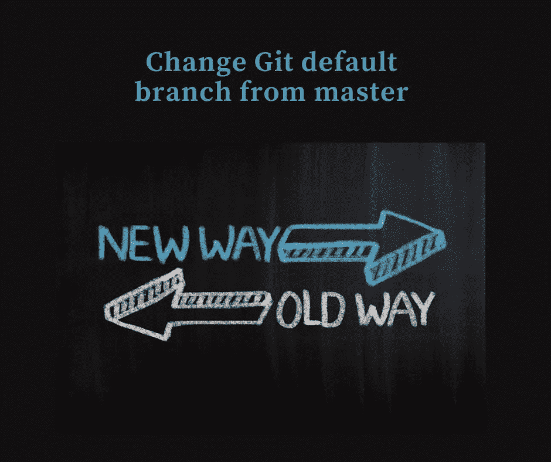
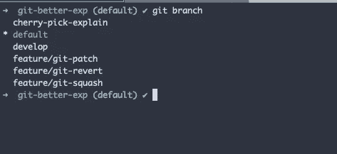
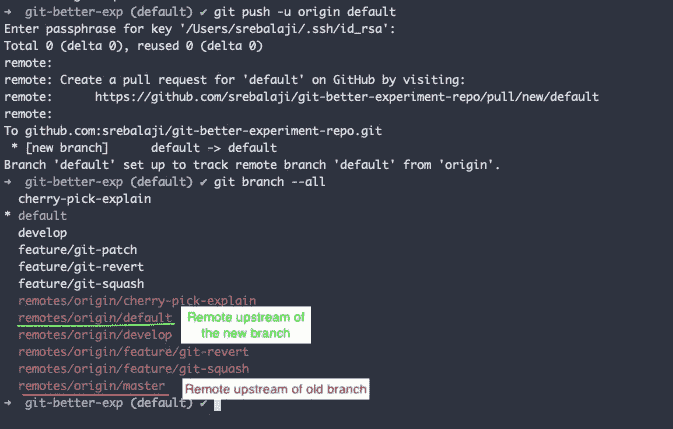
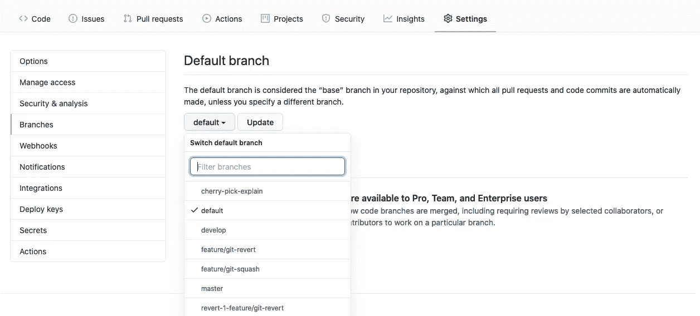
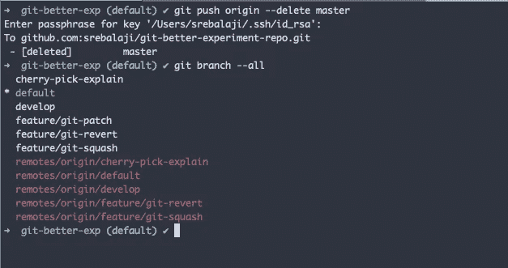
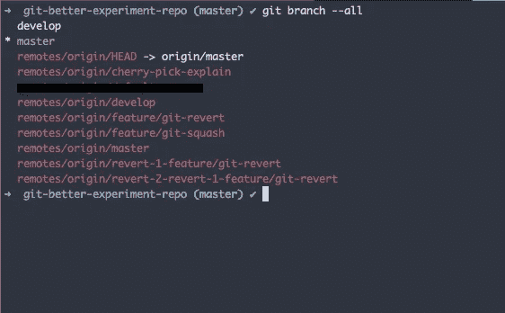

# 如何从主服务器更改 git 默认分支

> 原文：<https://levelup.gitconnected.com/how-to-change-git-default-branch-from-master-3933afab08f9>



最近，有许多关于将默认分支**主**重命名为其他名称的建议。这主要是由于主从隐喻。

有[证据](https://git.github.io/rev_news/2020/07/29/edition-65/)表明其意在提及**原版拷贝**或**原版录音。**而且也不打算主从。

但我认为这是人们的观点，他们应该被授权做出这种改变。

那么让我们看看如何将默认的 git 分支 ***主*** 改为 ***默认*** (你可以使用你喜欢的名字)

**在开始之前，我必须告诉你，我已经在多个回购中尝试过了，它工作得很好，没有任何突破性的变化。如果你没有足够的信心，那么叉你的回购，并尝试第一次。**

## 先决条件

1.  确保您的 CI/CD 流程不会被中断。
2.  确保您已经合并了针对**主机的所有 PRs。**其他 PRs 正常

## 重命名默认分支有三个步骤

1.  更改分支名称
2.  为新分支机构设置远程上游跟踪
3.  在 repo 主机中更改新的分支名称(Github，Gitlab)

## 更改分支名称

```
git branch -m master default
```

上面的命令只是将默认分支重命名为名称 **default。**

**-m** 属性用于在不影响分支历史的情况下重命名分支名称。



现在，默认分支在本地发生了变化，但在远程没有发生变化。

## 为新分支机构设置远程上游跟踪

```
git push -u origin default
```

上述命令会将新分支推送到远程。

**-u** 属性用于设置分支的上游跟踪。



正如你所看到的，上游是为新的分支设置的。但是，对旧上游的引用仍然存在于本地。

## 在回购主机中更改新的分支名称

在本教程中，我们来考虑一下 Github。但是同样的选项在 Gitlab，Bitbucket 也有。

在 Github 中，进入设置->分支。您可以在那里更改默认分支。



就这样，你完了。

但是请记住，旧分支的上游仍然存在。不会影响你的工作流程。但你应该删除它，以保持你的回购干净。

要删除旧分支的上游，您可以使用

```
git push origin --delete master
```



如您所见，旧的远程流已被删除。

现在，在本地主机和远程主机上都完成了更改。让我们看看如何把这些带给已经在使用回购的其他人。

我的意思是会有其他人使用这个回购。他们必须做一些改变来完成流程。



正如你所看到的，分支机构**主机构**仍然存在于已经在使用回购协议的其他机构的本地。

## 对于已经在使用回购的人来说，有三个步骤

1.  把所有的树枝都拿来
2.  更新上游遥控器的头部
3.  重命名默认分支

## 把所有的树枝都拿来

```
git fetch
```

上述命令将把所有远程分支提取到本地。

## 更新上游远程头

```
git remote set-head origin -a
```

上述命令将向远程主机查询 HEAD upstream，并在本地更新该 upstream。

## 重命名默认分支

```
git branch -m master default
```

这个和旧的一样。我们只是移动分支，而不影响分支的历史。

由于我们在上一步中已经将远程设置为上游，因此新的分支发生了变化，并与远程同步。

现在这个人可以使用默认的分支了。

正如我前面所说的，我已经在我的多个回购中试过了，它工作得很好，没有任何突破性的变化。这一开始看起来可能会令人困惑，但是如果你理解这个过程并多次阅读，你就会熟悉了。

如果你有任何疑问或被困在某个地方，你可以联系我。

感谢您的阅读。希望你学到了新东西:)

如果你来了这么久，我想你会对 Git 很感兴趣。可以订阅我的简讯[**GitBetter**](https://gitbetter.substack.com/)**获取 Git 的招数、技巧、高级话题。**