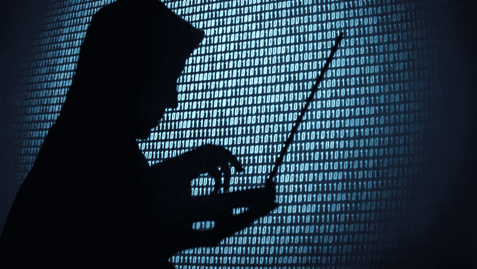
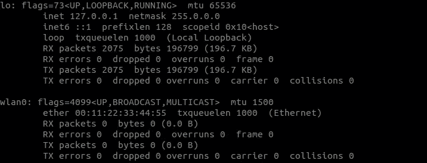
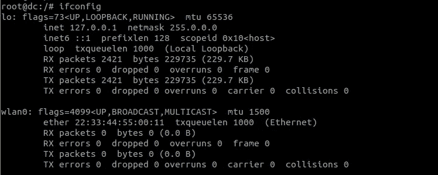

# 如何更改 MAC 地址

> 原文：<https://levelup.gitconnected.com/how-to-change-mac-address-120ffce66965>



MAC 地址代表**媒体访问控制**。它是由设备制造商设置的特定于设备的唯一地址。世界上没有两台设备具有相同的 MAC 地址。即使您将设备连接到另一台电脑，MAC 地址也不会改变。它用于识别网络中的设备，并根据 MAC 地址传输数据包。

# 您应该更改 MAC 地址的原因

更改 MAC 地址将使您在网络上匿名，允许您冒充其他设备，并允许您绕过某些限制。

# 更改 MAC 地址

*   让我们检查连接到我的网络的网络设备。运行以下命令:

```
$ ifconfig
```

输出应该如下所示:



我们可以看到 2 个网络设备`lo`和`wlan0`
我们希望更改 wi-fi 适配器的 MAC 地址，即`wlan0`。在`wlan0`中，我们看到`ether 00:11:22:33:44:55`这是我们的 MAC 地址。

在改变之前，我们需要

1.  把 wifi 接口拉下来。
2.  更改 MAC 地址
3.  打开 wifi 界面

运行以下一组命令

```
$ ifconfig wlan0 down
$ ifconfig wlan0 hw ether 22:33:44:55:00:11
$ ifconfig wlan0 up
```

现在，如果我运行`ifconfig`，我们可以看到我的 MAC 地址已经更改为我们指定的 MAC 地址。



> 注意:当我们重新启动时，MAC 地址将恢复为制造商设置的原始 MAC 地址，因为我们只是更改网络内存中的 MAC 地址，而不是物理 MAC 地址。

> 这里邀请您探索我们的博客平台[](https://www.thegeekyminds.com/)**。一个让您了解软件开发和技术领域最新发展的一站式平台。我们在 [**的极客头脑**](https://www.thegeekyminds.com/) 旨在写一些你实际上可以用来提高工作效率和充实你的职业生活的内容。**
> 
> **邀请您在[**https://thegeekyminds.com**](https://thegeekyminds.com/)通过我们的平台。并订阅我们的时事通讯，以便在我们每次发布新帖子时收到电子邮件。我们承诺不会向您的收件箱发送垃圾邮件。点击下面的按钮订阅我们的时事通讯**

**[](https://forms.wix.com/4444cf13-7653-460d-9b32-f2e4e65544d1:c2184260-1ab5-4c6a-a37d-53de0778afa0)**