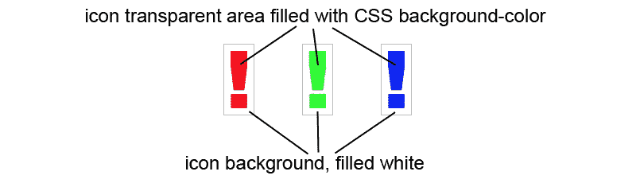

# 如何用 CSS 改变图标的颜色

> 原文：<https://levelup.gitconnected.com/how-to-change-the-color-of-icons-with-css-f505ce8b9fdc>

## 许多动态着色网站图标的方法


图文来源由[作者](https://medium.com/@the_tech_maker)

几乎每个网站上都有图标，当你将鼠标悬停在图标上或激活某项功能时，图标会改变颜色。实现这一点的老方法是交换图像。为此，我们需要创建两个图标相同但颜色不同的图像，并用 javascript 交换它们:

```
<script>
    var myImage = document.getElementById("my_image");
    myImage.onmouseover = mouseOver;
    myImage.onmouseout = mouseOut;

    function mouseOver() { 
      myImage.src = "my_image_active.png";
    }
    function mouseOut() { 
      myImage.src = "my_image.png";
    }
</script>
```

# 如何用 CSS 和背景图片做到这一点

使用

或

或你选择的任何其他元素，并设置背景图像:

```
html:
<div class="my_image"><div>CSS:
.my_image {
  width: 100px;
  height: 100px;
  background-image: url(my_image.png);
  background-repeat: no-repeat;
  background-position: center;
}.my_image:hover {
  background-image: url(my_image_active.png);
}
```

我们仍然需要两幅图像，但是代码要简单得多。

# 在两种以上的颜色之间变化

我所展示的方法效果很好，但是如果我们需要为图标使用三种甚至更多的颜色呢？想想用户可以在多种颜色主题中选择的网站。当然，我们可以创建许多图像，每当客户想要改变它们时，我们可以重新创建所有的图像。

但是，如果我们可以用一个简单的 CSS 背景颜色来实现这一点呢？

首先，我们使图像透明，并简单地用白色填充它的背景。



作者提供的图片

```
HTML:CSS:
#my_image (
  background-color: red;
}#my_image:hover (
  background-color: blue;
}
```

# 如果我们页面的背景颜色改变了怎么办？


图文由[作者](https://medium.com/@the_tech_maker)

在我的上一个项目中，我面临着这个问题。我创建了一个网站，模拟 B2B 客户的移动应用程序。

客户应该能够将每个应用程序元素的颜色与他们的公司设计相匹配。一旦所有颜色都固定下来，应用程序开发人员就将颜色代码复制到应用程序源代码中进行编译。

这样，图标和背景的颜色可以根据我们 1600 多万个值中的任何一个进行定制。我的任务是找到一个涵盖所有选项的解决方案。经过一番思考，我找到了解决办法:

**SVG 是 a 答案**！

你所要做的就是将 SVG 代码嵌入到你的 HTML 中，给它一个 CSS 类名，并使用 CSS 属性“fill”:

```
HTML:
<div>
  <svg class="myIcon" >
    <path d="M0,0h10.195v7.828L8.227,23.555H1.922L0,7.828V0z     M0.352,25.945h9.516v8.414H0.352V25.945z"/>
  </svg>
</div>CSS:
.myIcon {
  fill: red;
}
```

现在你可以用 javascript 来改变颜色值，比如用颜色选择器或者你自己的脚本。

**注意**:如果您为 SVG 使用 IMG 标签，这就不起作用了。如果您这样做，就不能更改 SVGs 颜色:

```

```

# 改变图标颜色的另一种方法

如果您已经为图标设置了字体，例如 Awesome 字体或 Googles Material 字体，那么非常简单:包含字体和相应的样式表，然后将图标代码粘贴到 HTML 中:

```
HTML:
<i class="fa-solid fa-my-icon"></i>CSS:
.fa-my-icon {
  color: red;
}
```

希望您可以在自己的 web 项目中使用这里显示的选项之一。

编码快乐！