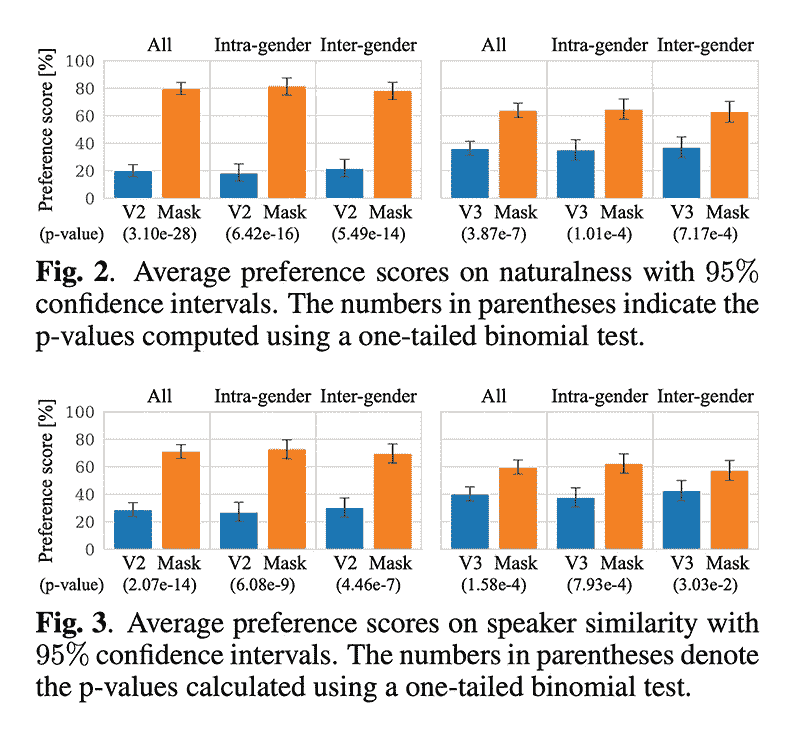

# 如何在 WSL2 上使用 MaskCycleGAN-VC 的 PyTorch 实现来改变声音

> 原文：<https://levelup.gitconnected.com/how-to-change-voices-using-a-pytorch-implementation-of-maskcyclegan-vc-on-wsl2-8bdfeb1faecb>

## 深度学习

## 漂亮简单的教程，一步一步的指导


图片由[安德烈·萨金塞夫](https://unsplash.com/@zvandrei)

## 预览:

| [GitHub](https://github.com/GANtastic3/MaskCycleGAN-VC) | [论文](https://arxiv.org/pdf/2102.12841.pdf) | [音频样本](http://www.kecl.ntt.co.jp/people/kaneko.takuhiro/projects/maskcyclegan-vc/index.html) |

## 总结:

这个库将一个说话者的声音转换成另一个说话者的声音。可以在不同男声之间，不同女声之间，男女声之间变换声音，反之亦然。它还可以使用说出他们自己的句子的每个说话者的非并行数据来训练模型，而不是需要说出相同句子的说话者的并行数据。

## 目录:

1.  [知识库背景](#8a97)
2.  [安装要求](#0313)
3.  [安装仓库](#e328)
4.  [预处理数据集](#0d0f)
5.  [训练模型](#012e)
6.  [恢复训练](#735b)
7.  [测试模型](#3106)
8.  [使用自定义数据集测试模型](#159e)

## 附录:

1.  [教程:人工智能设置](#50ec)
2.  [教程:人工智能课程](#c3c2)
3.  [教程:人工智能知识库](#e533)

## 存储库背景:

**MaskCycleGAN-VC:**cycle gan-VC2 的扩展，它使用非并行语音转换来训练语音转换器，而不需要说出相同句子的说话者的数据。它使用一种称为填充帧的新型辅助任务，将时间掩模应用于输入 mel-spectrogram，并鼓励转换器根据周围的帧填充缺失的帧。

*   它受到了其他领域方法的启发，如计算机视觉中的图像修复和自然语言处理中的文本填充。
*   它在自然度和说话人相似度方面的得分高于当时公认的基准 CycleGAN-VC2 和 CycleGAN-VC3。



图片由 [MaskCycleGAN-VC](https://arxiv.org/pdf/2102.12841.pdf) 提供

## 安装要求:

这一节是关于安装操作系统运行特定存储库所需的各种软件。它可以包括更新包管理器、下载包管理器、安装包管理器以及向包管理器授予权限。它还可能涉及对所需的任何程序执行相同的过程。

```
**# open the bash shell on windows**
1\. press “⊞ windows”
2\. enter “wsl” into the search bar
3\. click “wsl”**# update the information about linux programs**
sudo apt update**# upgrade the linux programs**
sudo apt --yes upgrade**# set the windows account username**
username=$(wslvar username)**# install the linux programs** sudo apt install --yes axel unzip git ffmpeg**# install the youtube downloader**
sudo axel --num-connections 10 --output /usr/local/bin/yt-dlp [https://github.com/yt-dlp/yt-dlp/releases/latest/download/yt-dlp](https://github.com/yt-dlp/yt-dlp/releases/latest/download/yt-dlp)**# grant permissions to the youtube downloader** 
sudo chmod a+rx /usr/local/bin/yt-dlp**# download the miniconda package manager** sudo axel --num-connections 10 --output /mnt/c/users/${username}/downloads/miniconda.sh [https://repo.anaconda.com/miniconda/Miniconda3-4.7.12.1-Linux-x86_64.sh](https://repo.anaconda.com/miniconda/Miniconda3-4.7.12.1-Linux-x86_64.sh)**# install the miniconda package manager using the default settings**
sudo /mnt/c/users/${username}/downloads/miniconda.sh**# grant permissions to the miniconda package manager**
sudo chown -R $USER:$USER ~/miniconda3**# update the python program information**
conda update --all --yes**# install virtualenv to create virtual environments**
python -m pip install virtualenv**# reload the bash configuration file**
source ~/.bashrc
```

## 安装存储库:

这一节是关于准备在 python 中运行的存储库。它包括下载存储库、创建虚拟环境、激活虚拟环境以及安装必要的 python 程序。它还可能涉及从源代码安装存储库，以及使用特定的 python 包管理器、python 版本和 python 程序版本。

```
**# set the windows account username** username=$(wslvar username)**# navigate to the desktop directory**
cd /mnt/c/users/$username/desktop/**# install the maskcyclegan****-vc** **repository**
git clone [https://github.com/GANtastic3/MaskCycleGAN-VC.git](https://github.com/GANtastic3/MaskCycleGAN-VC.git)**# navigate to the maskcyclegan****-vc** **repository** cd MaskCycleGAN-VC**# create the python virtual environment** 
conda env create -f environment.yml**# activate the python virtual environment**
conda activate MaskCycleGAN-VC**# install an additional python program**
conda install --channel conda-forge --yes librosa
```

## 预处理数据集:

本节是关于准备要加载到模型中的数据集。它包括下载、解包和将数据分成训练集、验证集和测试集。它可能涉及扩充数据、规范化数据、转换数据以及将数据转换成其他格式。它还包括删除不必要的、重复的和不一致的数据。

```
**# download the training set**
axel --insecure --output vcc2018_database_training.zip https://datashare.ed.ac.uk/bitstream/handle/10283/3061/vcc2018_database_training.zip**# download the evaluation set**
axel --insecure --output vcc2018_database_evaluation.zip https://datashare.ed.ac.uk/bitstream/handle/10283/3061/vcc2018_database_evaluation.zip**# download the reference data**
axel --insecure --output vcc2018_database_reference.zip https://datashare.ed.ac.uk/bitstream/handle/10283/3061/vcc2018_database_reference.zip**# make the dataset subdirectory**
mkdir -p datasets/vcc2018/**# unzip the training set**
unzip vcc2018_database_training.zip -d datasets/vcc2018/**# unzip the evaluation set**
unzip vcc2018_database_evaluation.zip -d datasets/vcc2018/**# unzip the reference data**
unzip vcc2018_database_reference.zip -d datasets/vcc2018/**# move the reference data to the evaluation subdirectory**
mv -v datasets/vcc2018/vcc2018_reference/* datasets/vcc2018/vcc2018_evaluation/**# remove the reference data subdirectory** rm -rf datasets/vcc2018/vcc2018_reference/**# preprocess the training set** python data_preprocessing/preprocess_vcc2018.py --data_directory datasets/vcc2018/vcc2018_training --preprocessed_data_directory datasets/vcc2018_preprocessed/vcc2018_training --speaker_ids VCC2SF1 VCC2SF2 VCC2SF3 VCC2SF4 VCC2SM1 VCC2SM2 VCC2SM3 VCC2SM4 VCC2TF1 VCC2TF2 VCC2TM1 VCC2TM2**# preprocess the evaluation set** python data_preprocessing/preprocess_vcc2018.py --data_directory datasets/vcc2018/vcc2018_evaluation --preprocessed_data_directory datasets/vcc2018_preprocessed/vcc2018_evaluation --speaker_ids VCC2SF1 VCC2SF2 VCC2SF3 VCC2SF4 VCC2SM1 VCC2SM2 VCC2SM3 VCC2SM4 VCC2TF1 VCC2TF2 VCC2TM1 VCC2TM2**# make the voices subdirectory**
mkdir -p /mnt/c/users/${username}/desktop/maskcyclegan-vc/datasets/vcc2018/vcc2018_voices/**# create a sample file for each of the 12 different voices**
cp /mnt/c/users/${username}/desktop/maskcyclegan-vc/datasets/vcc2018/vcc2018_training/vcc2sf1/10001.wav /mnt/c/users/${username}/desktop/maskcyclegan-vc/datasets/vcc2018/vcc2018_voices/VCC2SF1.wav; cp /mnt/c/users/${username}/desktop/maskcyclegan-vc/datasets/vcc2018/vcc2018_training/vcc2sf2/10001.wav /mnt/c/users/${username}/desktop/maskcyclegan-vc/datasets/vcc2018/vcc2018_voices/VCC2SF2.wav; cp /mnt/c/users/${username}/desktop/maskcyclegan-vc/datasets/vcc2018/vcc2018_training/vcc2sf3/20001.wav /mnt/c/users/${username}/desktop/maskcyclegan-vc/datasets/vcc2018/vcc2018_voices/VCC2SF3.wav; cp /mnt/c/users/${username}/desktop/maskcyclegan-vc/datasets/vcc2018/vcc2018_training/vcc2sf4/20001.wav /mnt/c/users/${username}/desktop/maskcyclegan-vc/datasets/vcc2018/vcc2018_voices/VCC2SF4.wav; cp /mnt/c/users/${username}/desktop/maskcyclegan-vc/datasets/vcc2018/vcc2018_training/vcc2sm1/10001.wav /mnt/c/users/${username}/desktop/maskcyclegan-vc/datasets/vcc2018/vcc2018_voices/VCC2SM1.wav; cp /mnt/c/users/${username}/desktop/maskcyclegan-vc/datasets/vcc2018/vcc2018_training/vcc2sm2/10001.wav /mnt/c/users/${username}/desktop/maskcyclegan-vc/datasets/vcc2018/vcc2018_voices/VCC2SM2.wav; cp /mnt/c/users/${username}/desktop/maskcyclegan-vc/datasets/vcc2018/vcc2018_training/vcc2sm3/20001.wav /mnt/c/users/${username}/desktop/maskcyclegan-vc/datasets/vcc2018/vcc2018_voices/VCC2SM3.wav; cp /mnt/c/users/${username}/desktop/maskcyclegan-vc/datasets/vcc2018/vcc2018_training/vcc2sm4/20001.wav /mnt/c/users/${username}/desktop/maskcyclegan-vc/datasets/vcc2018/vcc2018_voices/VCC2SM4.wav; cp /mnt/c/users/${username}/desktop/maskcyclegan-vc/datasets/vcc2018/vcc2018_training/vcc2tf1/10001.wav /mnt/c/users/${username}/desktop/maskcyclegan-vc/datasets/vcc2018/vcc2018_voices/VCC2TF1.wav; cp /mnt/c/users/${username}/desktop/maskcyclegan-vc/datasets/vcc2018/vcc2018_training/vcc2tf2/10001.wav /mnt/c/users/${username}/desktop/maskcyclegan-vc/datasets/vcc2018/vcc2018_voices/VCC2TF2.wav; cp /mnt/c/users/${username}/desktop/maskcyclegan-vc/datasets/vcc2018/vcc2018_training/vcc2tm1/10001.wav /mnt/c/users/${username}/desktop/maskcyclegan-vc/datasets/vcc2018/vcc2018_voices/VCC2TM1.wav; cp /mnt/c/users/${username}/desktop/maskcyclegan-vc/datasets/vcc2018/vcc2018_training/vcc2tm2/10001.wav /mnt/c/users/${username}/desktop/maskcyclegan-vc/datasets/vcc2018/vcc2018_voices/VCC2TM2.wav;**# store the wav files in the voices subdirectory**
voices_file_list=$(ls /mnt/c/users/${username}/desktop/maskcyclegan-vc/datasets/vcc2018/vcc2018_voices/ | awk -v username="$username" '{print "c:\\users\\"username"\\desktop\\maskcyclegan-vc\\datasets\\vcc2018\\vcc2018_voices\\"$0}')**# open the wav files in windows media player**
"/mnt/c/program files (x86)/windows media player/wmplayer.exe" /Task NowPlaying $voices_file_list
```

## 训练模型:

本节是关于训练模型使用指定的设置进行预测。它可以包括指定预处理数据集位置、预训练模型位置和保存位置。它可以包括指定时期数、学习率和批量大小。它还可能涉及指定存储库特有的各种其他设置。

```
**# change "VCC2SM1" to one of the 12 speaker ids**
speaker_a_id="VCC2SM1"**# change "VCC2SF1" to one of the 12 speaker ids**
speaker_b_id="VCC2SF1"**# train the model**
python -W ignore::UserWarning -m mask_cyclegan_vc.train --name mask_cyclegan_vc_${speaker_a_id}_${speaker_b_id} --seed 0 --save_dir results/ --preprocessed_data_dir datasets/vcc2018_preprocessed/vcc2018_training/ --speaker_A_id ${speaker_a_id} --speaker_B_id ${speaker_b_id} --epochs_per_save 50 --epochs_per_plot 10000 --num_epochs 6172 --batch_size 1 --decay_after 1e4 --sample_rate 22050 --num_frames 64 --max_mask_len 25 --gpu_ids 0
```

## 继续培训:

本节是关于从指定的检查点继续训练过程。它可以包括指定检查点位置、类型和纪元编号。它可能涉及指定相同的设置，以便从指定的检查点训练相同的模型。它还可以包括指定不同的设置来微调模型和实现各种训练技术。

```
**# continue training the model**
python -W ignore::UserWarning -m mask_cyclegan_vc.train --name mask_cyclegan_vc_${speaker_a_id}_${speaker_b_id} --seed 0 --save_dir results/ --preprocessed_data_dir datasets/vcc2018_preprocessed/vcc2018_training/ --speaker_A_id ${speaker_a_id} --speaker_B_id ${speaker_b_id} --epochs_per_save 50 --epochs_per_plot 10000 --num_epochs 6172 --batch_size 1 --decay_after 1e4 --sample_rate 22050 --num_frames 64 --max_mask_len 25 --gpu_ids 0 --continue_train
```

## 测试模型:

本节是关于使用具有指定设置的训练模型来处理验证集中的数据。它可以包括检查日志文件以找到具有最低验证损失值的纪元编号。它可以包括指定检查点位置、类型和纪元编号。它还可能涉及指定存储库特有的各种其他设置。

```
**# find the epoch number with the lowest "d_loss" value**
awk “/epoch:/” results/mask_cyclegan_vc_${speaker_a_id}_${speaker_b_id}/mask_cyclegan_vc_${speaker_a_id}_${speaker_b_id}.log | awk “NR % 50 == 0”**# replace "500" with the epoch number from the last step**
epoch=500**# test the model**
python -W ignore::UserWarning -m mask_cyclegan_vc.test --name mask_cyclegan_vc_${speaker_a_id}_${speaker_b_id} --save_dir results/ --preprocessed_data_dir datasets/vcc2018_preprocessed/vcc2018_evaluation --gpu_ids 0 --speaker_A_id ${speaker_a_id} --speaker_B_id ${speaker_b_id} --ckpt_dir results/mask_cyclegan_vc_${speaker_a_id}_${speaker_b_id}/ckpts --load_epoch ${epoch} --model_name generator_A2B**# review the results** explorer.exe "c:\users\\${username}\desktop\MaskCycleGAN-VC\results\mask_cyclegan_vc_${speaker_a_id}_${speaker_b_id}\converted_audio"
```

## 使用自定义数据集测试模型:

本节是关于使用具有指定设置的训练模型来处理自定义数据集中的数据。它可能涉及查找、下载、转换和转化自定义数据集中的数据。它可以包括指定检查点位置、类型和纪元编号。它还可能涉及指定存储库特有的各种其他设置。

```
**# select a youtube video that's less than 30 seconds**
1\. visit the y[outube](https://www.youtube.com/) website
2\. find a video with good sound quality**# change the url to the url of the selected youtube video**
url=[https://www.youtube.com/watch?v=V1QidirATFc](https://www.youtube.com/watch?v=V1QidirATFc)**# make the custom dataset subdirectory**
mkdir datasets/vcc2018/vcc2018_evaluation/CUSTOM**# download the youtube video as a wav file** yt-dlp --extract-audio --audio-format wav -o "datasets/custom/session/%(title)s.%(ext)s" ${url}**# preprocess the custom dataset subdirectory**
python data_preprocessing/preprocess_vcc2018.py --data_directory datasets/vcc2018/vcc2018_evaluation --preprocessed_data_directory datasets/vcc2018_preprocessed/vcc2018_evaluation --speaker_ids CUSTOM**# test the model using the custom dataset**
python -W ignore::UserWarning -m mask_cyclegan_vc.test --name mask_cyclegan_vc_${speaker_a_id}_${speaker_b_id} --save_dir results/ --preprocessed_data_dir datasets/vcc2018_preprocessed/vcc2018_evaluation --gpu_ids 0 --speaker_A_id CUSTOM --speaker_B_id ${speaker_b_id} --ckpt_dir results/mask_cyclegan_vc_${speaker_a_id}_${speaker_b_id}/ckpts --load_epoch ${epoch} --model_name generator_A2B**# review the results**
explorer.exe "c:\users\\${username}\desktop\MaskCycleGAN-VC\results\mask_cyclegan_vc_${speaker_a_id}_${speaker_b_id}\converted_audio"
```

> "最后，记得订阅并按住鼓掌按钮，以获得定期更新和帮助."

## 附录:

这个博客的存在是为了提供完整的解决方案，回答你的问题，加速你与人工智能相关的进步。它提供了设置计算机和完成 fastai 课程前半部分所需的一切。它将让你接触到人工智能子领域中最先进的知识库。它也将涵盖 fastai 课程的后半部分。

## 教程:人工智能设置

本节提供了设置电脑所需的一切。

```
**# linux**
01\. [install and manage multiple python versions](https://medium.com/p/916990dabe4b)
02\. [install the nvidia cuda driver, toolkit, cudnn, and tensorrt](https://medium.com/p/cd5b3a4f824)
03\. [install the jupyter notebook server](https://medium.com/p/b2c14c47b446)
04\. [install virtual environments in jupyter notebook](https://medium.com/p/1556c8655506)
05\. [install the python environment for ai and machine learning](https://medium.com/p/765678fcb4fb)
06\. [install the fastai course requirements](https://medium.com/p/116415a9df22/)**# wsl 2**
01\. [install windows subsystem for linux 2](https://medium.com/p/cbdd835612fb)
02\. [install and manage multiple python versions](https://medium.com/p/1131c4e50a58)
03\. [install the nvidia cuda driver, toolkit, cudnn, and tensorrt](https://medium.com/p/9800abd74409) 
04\. [install the jupyter notebook server](https://medium.com/p/7c96b3705df1)
05\. [install virtual environments in jupyter notebook](https://medium.com/p/3e6bf456041b)
06\. [install the python environment for ai and machine learning](https://medium.com/p/612240cb8c0c)
07\. [install ubuntu desktop with a graphical user interface](https://medium.com/p/95911ee2997f)
08\. [install the fastai course requirements](https://medium.com/p/15a77fc7e301/)**# windows 10**
01\. [install and manage multiple python versions](https://medium.com/p/4876738e7aa0)
02\. [install the nvidia cuda driver, toolkit, cudnn, and tensorrt](https://medium.com/p/af58647b6d9a/)
03\. [install the jupyter notebook server](https://medium.com/p/e8f3e9436044)
04\. [install virtual environments in jupyter notebook](https://medium.com/p/5c189856479)
05\. [install the python environment for ai and machine learning](https://medium.com/p/23c34b2baf12)
06\. [install the fastai course requirements](https://medium.com/p/90236724f881/)**# mac** 01\. [install and manage multiple python versions](https://medium.com/p/ca01a5e398d4)
02\. [install the jupyter notebook server](https://medium.com/p/2a276f679e0)
03\. [install virtual environments in jupyter notebook](https://medium.com/p/e3de97491b3a)
04\. [install the python environment for ai and machine learning](https://medium.com/p/2b2353d7bcc3)
05\. [install the fastai course requirements](https://medium.com/p/90fdd524bc82)
```

## 教程:人工智能课程

本部分包含每课结束时对问卷的回答。

```
**# fastai course** 01\. [chapter 1: your deep learning journey q&](https://medium.com/p/6f266bdb1340/)a
02\. [chapter 2: from model to production q&a](https://medium.com/p/5a0902207f5b)
03\. [chapter 3: data ethics q&a](https://medium.com/p/501bb37ca30d)
04\. [chapter 4: under the hood: training a digit classifier q&a](https://medium.com/p/89077906197e/)
05\. [chapter 5: image classification q&a](https://medium.com/p/aa7cacdeab1/)
06\. [chapter 6: other computer vision problems q&a](https://medium.com/p/aa7cacdeab1/)
07\. [chapter 7: training a state-of-the-art model q&a](https://medium.com/p/6f6dcc83dd9f/)
08\. [chapter 8: collaborative filtering deep dive q&a](https://medium.com/p/52d3583d626b/)
```

## 教程:人工智能库

这个部分包含不同子领域中的最先进的知识库。

```
**# repositories related to audio** 01\. [raise audio quality using nu-wave](https://medium.com/p/e3dd979056e0/)
02\. [change voices using maskcyclegan-vc](https://medium.com/p/8bdfeb1faecb/)
03\. [clone voices using real-time-voice-cloning toolbox](https://medium.com/p/7b8609438001/)**# repositories related to images**
01\. [achieve 90% accuracy using facedetection-dsfd](https://medium.com/p/9c9fefb3f863/)
```