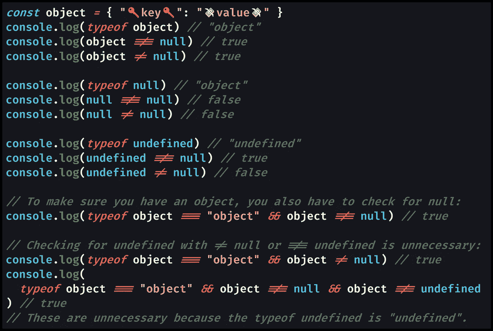
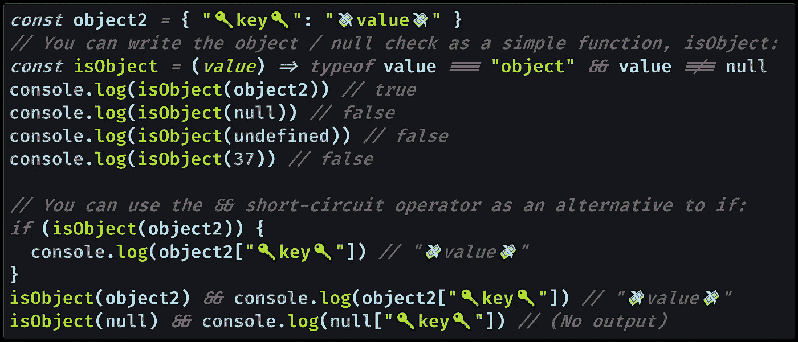

# 如何在 Javascript 中检查对象(对象空值检查)

> 原文：<https://levelup.gitconnected.com/how-to-check-for-an-object-in-javascript-object-null-check-3b2632330296>

## 当您在 JavaScript 中检查一个对象时，您还需要包含一个`null`检查，因为`typeof null`是`"object"`。

照片由[坎德拉](https://unsplash.com/@chhndra?utm_source=medium&utm_medium=referral)在 [Unsplash](https://unsplash.com?utm_source=medium&utm_medium=referral) 上拍摄

# JavaScript 中的对象/空值检查

JavaScript 中有一个长期存在的错误，这意味着对一个对象的每次检查都需要对`null` : `typeof null === "object"`进行检查。

通常，您将使用三重等式运算符 ( `===`或`!==`)来[检查](https://medium.com/javascript-in-plain-english/how-to-check-for-null-in-javascript-dffab64d8ed5) `[null](https://medium.com/javascript-in-plain-english/how-to-check-for-null-in-javascript-dffab64d8ed5)`，以确保所讨论的值绝对不为空:`object !== null`。该代码检查变量`object`没有值`null`。

一些开发人员更喜欢双重等式运算符(`==`或`!=`)，也称为松散等式运算符。写`object != null`会让[同时检查](https://medium.com/coding-at-dawn/how-to-check-for-undefined-in-javascript-bcedd62c8ad) `[undefined](https://medium.com/coding-at-dawn/how-to-check-for-undefined-in-javascript-bcedd62c8ad)`和`null`。

`typeof undefined`是您所期望的(字符串`"undefined"`)，所以`typeof object === "object"`将保证您要么有一个对象，要么有一个`null`值；你不能有一个`undefined`值。

在对 JavaScript 对象进行类型检查时，选择`object !== null`还是`object != null`是你的个人偏好。

许多开发人员总是使用`===`三重相等操作符来避免他们的 JavaScript 代码中的任何混乱，因为`==`松散相等操作符将执行[类型强制](https://developer.mozilla.org/en-US/docs/Glossary/Type_coercion)并且[有自己的规则](https://algassert.com/visualization/2014/03/27/Better-JS-Equality-Table.html)。

为了明确在检查对象时同时检查`null`和`undefined`，必须用`&&`(逻辑 and)操作符:`object !== null && object !== undefined`指定这两种检查。

不过，实际上，您只需要*检查`null`JavaScript 对象。是 ol ' JavaScript Object Null Check([自 1995](https://auth0.com/blog/a-brief-history-of-javascript/) )。*

[查看原始代码](https://gist.github.com/djD-REK/c814a40cc884a6aea1d74a415fb45c01)作为 GitHub 要点

是的，这有点荒谬，但是在普通 JavaScript 中检查对象时，必须检查`null`。这就是生活。

[查看原始代码](https://gist.github.com/DoctorDerek/324485b20b9fffa9648dd17bb374d189)作为 GitHub 要点

我们可以写一个 [ES6 箭头函数](https://developer.mozilla.org/en-US/docs/Web/JavaScript/Reference/Functions/Arrow_functions)来检查一个对象:`const isObject = (value) => typeof value === "object" && value !== null`。

然后，我们可以使用那个函数来有条件地运行代码，在同一行上使用`[&&](https://medium.com/p/7ee0e8dc8bc8)`[短路操作符](https://medium.com/p/7ee0e8dc8bc8)，我将在后面讨论。

该函数将保证您拥有某种类型的对象，但是确定哪种类型的对象更复杂。

# 检查 JavaScript 中的对象类型

找出您拥有的 JavaScript 对象的类型是一个完全不同的问题，有很多解决方案:

*   使用`.constructor`属性，我在关于[的文章中讨论了如何在 JavaScript](https://medium.com/javascript-in-plain-english/how-to-check-for-an-array-in-javascript-6ad20f7a0e21) 中检查数组。
*   [JavaScript](https://medium.com/p/c90dd3686bfa)更好的类型检查方法是使用全局函数`Object.getPrototypeOf()`来获取对象的原型。
*   [Javascript](https://medium.com/javascript-in-plain-english/the-best-way-to-type-check-in-vanilla-js-55197b4f45ec)中类型检查的“最佳方法”是`Object.prototype.toString.call()`，但它也有缺陷。
*   您可以使用 [TypeScript](https://www.typescriptlang.org/) 或 [Flow](https://flow.org/) 将[完全转换为类型检查，并切换到“构建时静态类型分析”。](https://en.wikipedia.org/wiki/Punt_(gridiron_football))

如果你想知道你有一个典型的对象`{}`、`Date`还是`RegExp`，你需要选择其中的一个方法。

至少对于[检查数组](https://medium.com/javascript-in-plain-english/how-to-check-for-an-array-in-javascript-6ad20f7a0e21)有`Array.isArray()`方法，它既能正确工作又易于阅读。😅 **phew** 💨

使用`typeof`检查对象(而不是像[字符串](https://medium.com/javascript-in-plain-english/how-to-check-for-an-array-in-javascript-6ad20f7a0e21)或[数字](https://medium.com/javascript-in-plain-english/how-to-check-for-a-number-in-javascript-8d9024708153)这样的原始值)比确定您拥有什么类型的对象更简单。当你开始处理 JavaScript 的[原型继承](https://developer.mozilla.org/en-US/docs/Web/JavaScript/Inheritance_and_the_prototype_chain)链时，确定对象类型会变得模糊不清。

# 短路操作符(`&&` ) +对象/空检查

最后一点，你会经常看到类型检查和`&&`(逻辑 AND)“短路操作符”一起使用，因为任何附加了`&&`的额外代码在[一个假值](https://medium.com/coding-at-dawn/what-are-falsy-values-in-javascript-ca0faa34feb4)之后都不会执行。

我们在代码示例中看到了这一点，其中您不需要检查`typeof object === "object"`后面的`undefined`，因为如果`typeof`返回`"undefined"`，代码将不会继续执行。这意味着你只需要检查在`typeof`表达式之后的`null`，因为`typeof`返回的对象意味着一个对象或者一个`null`值。

类似于`Array.isArray(array) && array.length > 0 && console.log(array[0])`的代码并不少见——它会检查一个数组，确保它不为空，然后`console.log()`检查它的第一个项目。

在 JavaScript 中，您可以安全地编写`typeof object === "object" && object !== null && object.property && console.log(object.property)`。只有当`object`变量是一个带有关键字`.property`的对象时，这才会`console.log()`为`object.property`值。

如果在最后一个`&&`之前有任何值返回 falsy，JavaScript 将停止运行该行代码，防止类似`"null has no properties"`的潜在`[TypeError](https://developer.mozilla.org/en-US/docs/Web/JavaScript/Reference/Global_Objects/TypeError)`。

综上所述，当您在 JavaScript 中检查对象时，JavaScript Object Null Check 可以在一行中与`&&`一起使用。

我希望这有助于您检查对象的类型，包括一些选项来确定您正在处理的对象的类型。

**快乐编码！**🌠 **( ‿ )** 🌠

德里克·奥斯汀博士是《职业编程:如何在 6 个月内成为一名成功的 6 位数程序员 》一书的作者，该书现已在亚马逊上架。