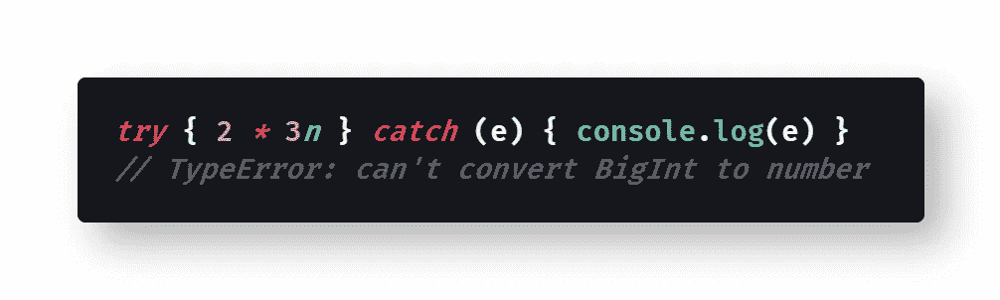
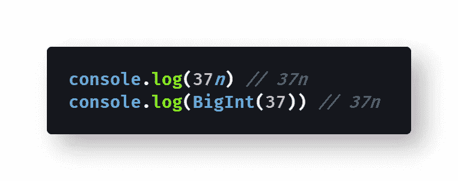
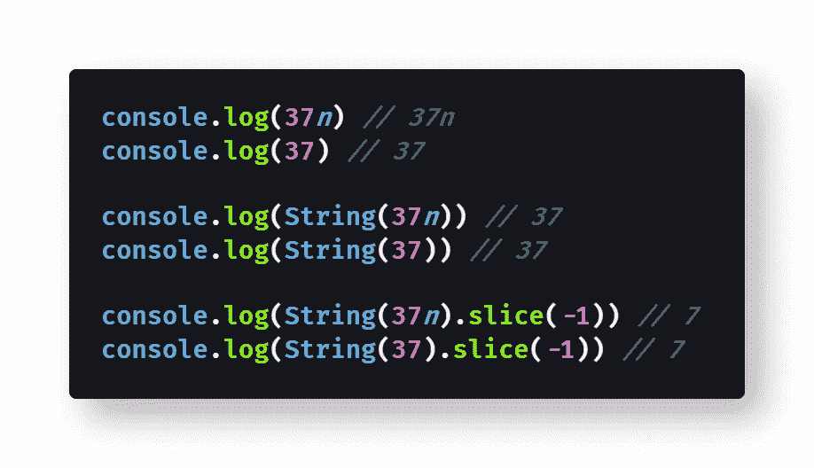
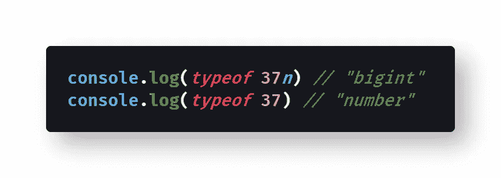
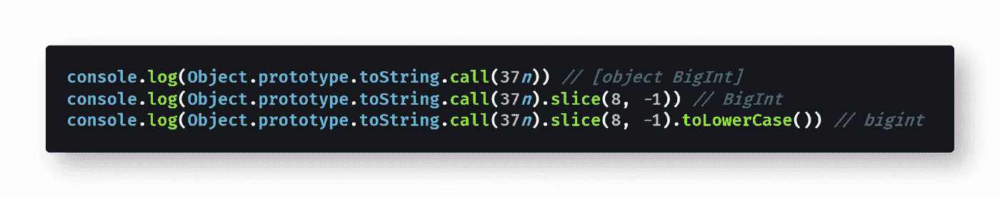

# 如何在 JavaScript 中检查一个数字是否是 BigInt

> 原文：<https://levelup.gitconnected.com/how-to-check-if-a-number-is-a-bigint-in-javascript-6d658be6e89c>

## BigInt 是一种较新的基本类型，可用于任意大小的整数，不像 JavaScript 的默认数字类型。以下是如何检查你是否在使用一个 BigInt，而不是一个数字。

照片由[法兰克诉](https://unsplash.com/@franckinjapan?utm_source=medium&utm_medium=referral)在 [Unsplash](https://unsplash.com?utm_source=medium&utm_medium=referral) 拍摄

J avaScript 有一个很棒的新的[原语类型](https://developer.mozilla.org/en-US/docs/Glossary/Primitive)，叫做 [BigInt](https://developer.mozilla.org/en-US/docs/Web/JavaScript/Reference/Global_Objects/BigInt) ，它允许[任意精度](https://en.wikipedia.org/wiki/Arbitrary-precision_arithmetic)的整数数学，位数不限。

> "`**BigInt**`是一个内置对象，提供了一种表示大于 2⁵ - 1 的整数的方法，这是 JavaScript 可以用`[Number](https://developer.mozilla.org/en-US/docs/Web/JavaScript/Reference/Global_Objects/Number)`原语可靠表示的最大数字，由`[Number.MAX_SAFE_INTEGER](https://developer.mozilla.org/en-US/docs/Web/JavaScript/Reference/Global_Objects/Number/MAX_SAFE_INTEGER)`常量表示。`**BigInt**`可用于任意大的整数。”— [MDN 文档](https://developer.mozilla.org/en-US/docs/Web/JavaScript/Reference/Global_Objects/BigInt)

BigInt 是 ES2020 的一个特性，当它还是第四阶段提案(T21)的时候就开始得到浏览器的支持。它是目前大多数现代浏览器(不是 Safari 或 Internet Explorer)中可用的[，包括](https://caniuse.com/#feat=bigint) [Chrome 的 V8 引擎](https://v8.dev/blog/bigint)。

不幸的是，您不能混合使用 [JavaScript 数字原语](https://developer.mozilla.org/en-US/docs/Web/JavaScript/Reference/Global_Objects/Number)和 BigInts:

[查看原始代码](https://gist.github.com/djD-REK/7097f10b20f8aead139b4dda656ecf8f)作为 GitHub 要点

因为试图同时使用数字和 bigint 会导致一个[类型错误](https://developer.mozilla.org/en-US/docs/Web/JavaScript/Reference/Global_Objects/TypeError)，你需要确保你的 bigint 确实是 bigint。

但是你怎么知道一个变量是一个 BigInt 而不是一个数字呢？

# 寻找字母`n`

确定你是否在使用 BigInt 的最简单的方法是在你的代码中寻找数字后面的字母`n`。

字母`n`表示该值是一个 BigInt ( `37n`，而不是一个数字(`37`)。

例如，您可以通过在数字后面加上字符`n`来创建一个 BigInt，或者通过用一个数值调用 [BigInt 包装器](https://developer.mozilla.org/en-US/docs/Web/JavaScript/Reference/Global_Objects/BigInt/BigInt)来创建:

查看原始代码作为 GitHub 的要点

然而，字母`n`只在控制台输出中显示，如果使用`[BigInt.prototype.toString()](https://developer.mozilla.org/en-US/docs/Web/JavaScript/Reference/Global_Objects/BigInt/toString)`方法将 BigInt 转换为字符串，则不会显示。

> "`**toString()**`方法返回一个代表指定的`[BigInt](https://developer.mozilla.org/en-US/docs/Web/JavaScript/Reference/Global_Objects/BigInt)`对象的字符串。尾随的“n”不是字符串的一部分。— [MDN 文档](https://developer.mozilla.org/en-US/docs/Web/JavaScript/Reference/Global_Objects/BigInt/toString)

这意味着你不能选择字符串[的最后一个字符作为子字符串](https://medium.com/coding-at-dawn/how-to-select-a-range-from-a-string-a-substring-in-javascript-1ba611e7fc1) g，寻找字母`n`。没用的:

[查看原始代码](https://gist.github.com/djD-REK/f1902786413abe91aa2247708a97302c)作为 GitHub 要点

当然，当处理一个可能有几百位数长的数字时，您无论如何都不会想要检查整个字符串。

JavaScript 中有两种可靠的检查 BigInts 类型的方法:`typeof`关键字和`Object.prototype.toString.call()`方法。

# 使用`typeof`关键字

T 幸运的是，`[typeof](https://medium.com/better-programming/how-to-check-data-types-in-javascript-using-typeof-424d0520a329)`[关键字](https://medium.com/better-programming/how-to-check-data-types-in-javascript-using-typeof-424d0520a329)对于 BigInt 原语类型正常工作，返回字符串`"bigint"`。

让我们来看看它是如何工作的:

[查看原始代码](https://gist.github.com/djD-REK/3f840933e758ab0ffd53c2713ad9aa00)作为 GitHub 要点

关键字`typeof`并不总是可靠的，任何记得 JavaScript 中的`[typeof](https://medium.com/javascript-in-plain-english/how-to-check-for-null-in-javascript-dffab64d8ed5)`[null 是](https://medium.com/javascript-in-plain-english/how-to-check-for-null-in-javascript-dffab64d8ed5) `["object"](https://medium.com/javascript-in-plain-english/how-to-check-for-null-in-javascript-dffab64d8ed5)` [的人都可以证明这一点。](https://medium.com/javascript-in-plain-english/how-to-check-for-null-in-javascript-dffab64d8ed5)

事实上，使用`typeof`表示数字会返回`"number"`表示`[NaN](https://medium.com/coding-in-simple-english/how-to-check-for-nan-in-javascript-4294e555b447)` [(非数字)](https://medium.com/coding-in-simple-english/how-to-check-for-nan-in-javascript-4294e555b447)和`[Infinity](https://medium.com/swlh/what-is-infinity-in-javascript-%EF%B8%8F-1faf82f100bc)`，正如我在 JavaScript 中用简单英语写的:

 [## 如何在 JavaScript 中检查数字

### 数字是 JavaScript 中的一种基本类型，但是仅仅使用 typeof 并不能区分数字和 NaN 或 Infinity。

medium.com](https://medium.com/javascript-in-plain-english/how-to-check-for-a-number-in-javascript-8d9024708153) 

令人欣慰的是，`typeof`对 bigint 很有用，因为 bigint 没有像`[-0](https://medium.com/coding-at-dawn/is-negative-zero-0-a-number-in-javascript-c62739f80114)` [(负零)](https://medium.com/coding-at-dawn/is-negative-zero-0-a-number-in-javascript-c62739f80114)`NaN`或`Infinity`这样的怪癖。

# 使用`Object.prototype.toString.call()`方法

当然，的中，你也可以使用[最好的方式在 JavaScript](https://medium.com/javascript-in-plain-english/the-best-way-to-type-check-in-vanilla-js-55197b4f45ec) 中输入 check，即`Object.prototype.toString.call()`方法。

它很长，但是对于 BigInt 值非常有用:

[查看原始代码](https://gist.github.com/djD-REK/4c50157cec5265ee0188c361c8c48ad3)作为 GitHub 要点

如您所料，这里的输出是字符串`"[object BigInt]"`，可以使用[切片方法](https://medium.com/coding-at-dawn/how-to-select-a-range-from-a-string-a-substring-in-javascript-1ba611e7fc1)将其简化为`"BigInt"`或`"bigint"`。

`Object.prototype.toString.call()`方法的优势在于，它会给出 JavaScript 中任何原语或类的实际名称。

换句话说，它对日期、数组、数字和 BigInts 都是一样的——这使得它对于 JavaScript 中的所有类型检查都是可靠和通用的。

# 结论

你可能已经在代码中使用了 ES2020 特性 BigInt，因为 Chrome、Firefox 和 Edge 已经支持它了。

一旦你开始使用 bigint，你将需要知道如何对它们进行类型检查，因为 bigint 和 numbers 不能混用。

为了检查以确保您使用的是 BigInt 值，我建议您使用`typeof`关键字，它将返回`"bigint"`。

一种替代方法是`Object.prototype.toString.call()`方法，它更灵活、更健壮，但是对于检查 BigInts 来说可能有些过头了。

编码快乐！😎💻📐⌨️💯🖥️🤩

# 进一步阅读

*   [Faraz Kelhini](https://medium.com/u/1a6d3d2733d0?source=post_page-----6d658be6e89c--------------------------------) 在 Smashing Magazine 中有一份关于 BigInts [的详尽指南:](https://www.smashingmagazine.com/2019/07/essential-guide-javascript-newest-data-type-bigint/)

 [## JavaScript 最新数据类型的基本指南:BigInt - Smashing Magazine

### 在 JavaScript 中，数字类型不能安全地表示大于 2⁵的整数值。这种限制迫使…

www.smashingmagazine.com](https://www.smashingmagazine.com/2019/07/essential-guide-javascript-newest-data-type-bigint/) 

*   [Javascript 吉普🚙💨](https://medium.com/u/f9ffc26e7e69?source=post_page-----6d658be6e89c--------------------------------)涵盖了高级编码中的 BigInt 方法[:](/learn-bigint-in-javascript-df9b61bc19ef)

 [## 学习 JavaScript 中的 BigInt

### 了解如何在 JavaScript 中使用 BigInt 存储大数。

levelup.gitconnected.com](/learn-bigint-in-javascript-df9b61bc19ef) 

*   [Valeri Karpov](https://medium.com/u/3e058d64a4ab?source=post_page-----6d658be6e89c--------------------------------) 在他的博客上讨论了 BigInts [的用途和局限性:](http://thecodebarbarian.com/an-overview-of-bigint-in-node-js.html)

 [## Node.js 中的 BigInt 概述

### BigInt 是一种新的 JavaScript 原始类型，可以存储任意大的整数…

thecodebarbarian.com](http://thecodebarbarian.com/an-overview-of-bigint-in-node-js.html) 

*   凯尔(凯尔·辛普森)在 FrontEndMasters 有一个关于 BigInt [的视频课程:](https://frontendmasters.com/courses/deep-javascript-v3/bigint/)

 [## 了解 BigInt -深度 JavaScript 基础，v3

### “BigInt”一课的文字记录[00:00:00]> >凯尔·辛普森:记住 BigInt，他们是原始类型。所以当你…

frontendmasters.com](https://frontendmasters.com/courses/deep-javascript-v3/bigint/) 

*   达斯汀·菲斯特在他的个人博客上对比金茨[做了一个很好的介绍:](https://dustinpfister.github.io/2019/09/06/js-bigint/)

 [## 超过最大安全整数的 javaScript 中的 BigInt 基础

### 所以 javaScript 中的常规数字类型在处理非常大的数字时会有一些限制…

Dustin fister . github . io](https://dustinpfister.github.io/2019/09/06/js-bigint/) 

[Derek Austin](https://www.linkedin.com/in/derek-austin/)博士是《职业编程:如何在 6 个月内成为一名成功的 6 位数程序员 》一书的作者，该书现已在亚马逊上架。