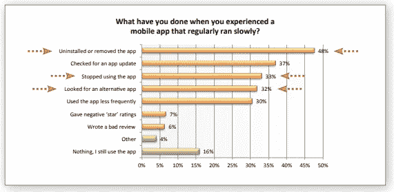
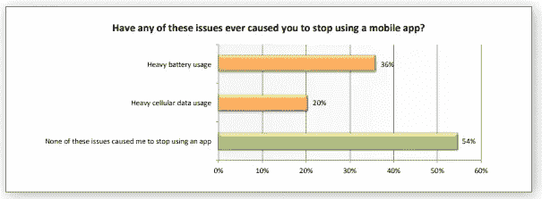

# 如何为您的移动应用选择更安全的 Analytics SDK

> 原文：<https://levelup.gitconnected.com/how-to-choose-a-safer-analytics-sdk-for-your-mobile-app-aeb3d87e0965>

***作者 Ronnie Sternberg，SafeDK*** 的联合创始人兼首席商务官

随着移动应用程序的使用率每年越来越高，移动应用程序分析 SDK 被广泛传播。实际上，根据研究机构 Nester 的数据，预计到 2024 年底，全球移动分析市场[将达到 60 亿美元。毫不奇怪，分析 SDK 是 android 应用中最受欢迎的 SDK，这是有充分理由的。](http://research-live.com/article/news/mobile-analytics-markets-to-reach-6bn-by-2024/id/5028142)

移动应用分析 SDK 正在为移动应用行业创造奇迹，为希望了解其应用或用户情况的移动应用开发者提供了巨大优势，使他们能够跟踪几乎任何他们想要的东西。没有这些必要的工具，应用程序开发人员将被蒙在鼓里。有了它们，可能性是无穷的。

尽管一切皆有可能，但并非一切都是安全的。你看，第三方 SDK(包括分析 SDK)是应用程序开发人员集成在其应用程序中的外部代码，因此，它们可能会给应用程序带来各种风险。由于有各种分析 SDK 可供选择，并且有不同的方法来评估分析 SDK，因此选择一个“安全”的 SDK 是重中之重。

下面列出了您用于移动应用程序的 analytics SDKs 中存在的 4 种风险，以及将这些风险降至最低以保护您的应用程序安全的方法:

# 1.用户隐私数据—应用商店隐私限制和 GDPR

一些 SDK 有收集用户隐私数据的恶劣习惯，当这种情况发生时，你的应用程序可能在技术上违反了 Google Play 商店的隐私限制、 [App Store 的新隐私政策](https://www.zdnet.com/article/apple-looks-to-plug-app-store-privacy-hole-with-new-personal-data-policy/)和 GDPR。是的，我们知道，GDPR 起义也让我们颤抖。如果 SDK 收集了实际上不应该收集的数据(无论是意外还是故意的)，您可能需要处理后果。GDPR 已经警告 Fidzup 和 Teemo SDKs 停止在未经用户同意的情况下收集他们的私人数据(位置)。虽然官方警告可能看起来不那么可怕，但 2000 万欧元的罚款肯定会让你起鸡皮疙瘩。(编者注:你可以在这里阅读更多关于 [Appsee 的 GDPR 合规性)。](https://www.appsee.com/gdpr?cpnid=701b0000000Wd7c&utm_source=medium&utm_medium=link&utm_campaign=how_to_choose_a_safer_analytics_sdk_safedk&utm_content=gdpr)

**对于这种数据泄露威胁，您应该做些什么？**

*   总是仔细检查运行简单谷歌网络搜索的特定 SDK 的有效性，或者在 SafeDK 的 [SDK Marketplace](http://www.safedk.com/) 中检查开发者对这些 SDK 的评论。
*   询问 analytics SDK 您正在考虑他们正在收集哪些数据。
*   也询问你正在考虑的 SDK 关于他们正在采取的安全措施。毕竟，这是你用户的隐私。
*   值得看看 SDK 所请求的权限。
*   使用 SDK 管理解决方案实时监控 SDK。这种解决方案可以为您提供有关用户数据访问的实时警报，并允许您实时关闭不符合要求的 SDK。
*   [下载这份免费而完整的 GDPR 手机应用指南](http://gdpr.safedk.com/GDPR_Guide/?utm_source=blog&utm_medium=social&utm_campaign=GDPR_Guide)，其中包含了你需要了解和遵守的一切。

# 2.违反 Google Play / iTunes 政策

除了违反商店的隐私限制，还有更多限制需要注意，如支付，UX 或用户界面等。事实上，从 Google Play 或 iTunes 中退出非常容易，在应用程序中集成不可靠的 analytics SDK 会导致违反他们政策中列出的一些条款和条件。由于 App Store 和 Google Play 更新其内容策略的频率，违规可能会作为诚实的错误发生。

**你可以采取哪些措施来确保 SDK 遵守商店政策？**

*   先看以下政策。它们相当直接: [Google Play 开发者政策](https://play.google.com/about/developer-content-policy.html)和[App Store 审查指南](https://developer.apple.com/app-store/review/guidelines/)。与您正在考虑的 analytics SDK 的支持团队讨论这些政策，并确保他们了解并遵循最新发布的政策。每当 Google Play 或 iTunes 更新其政策时，重复此检查。
*   使用此 [X 射线](http://www.safedk.com/#xray)工具扫描与您的应用相似的应用，并揭示它们实现了哪些分析 SDKs 它可能会帮助你找到可靠的 SDK(我们愿意认为排名靠前的应用程序正在验证他们正在实现的 SDK，尽管我们不能确定这一点)。

# 3.权限是关闭的

用户讨厌安装的请求权限部分；我们都知道。虽然在大多数情况下，操作应用程序需要权限请求，但一些分析软件开发工具包可能会将不需要的权限添加到列表中。当你更新你的应用程序时，这个问题可能会进一步恶化，因为你的售后市场(现有的安装基础)可能不会获得它应该获得的自动更新(当添加新权限时)。

你如何将这种副产品减到最少？

您需要与 analytics SDK 支持团队一起仔细检查他们是否在实施后向您的应用程序添加了更多权限。如果您正在考虑的 analytics SDK 包含的权限超过了 SDK 增值运营所需的权限，您应该认真考虑在其他地方寻找增强您应用的方法。

# 4.应用程序崩溃、运行缓慢和电池耗尽

Analytics SDKs 以各种方式增强了您的应用，但有时——像所有其他第三方工具一样——它们会造成伤害，因此会适得其反……为什么？

SDK 会让你的应用崩溃或冻结——这对用户来说是一个非常不愉快的结果。令人不快的是，根据 [Dimensional Research](https://techbeacon.com/sites/default/files/gated_asset/mobile-app-user-survey-failing-meet-user-expectations.pdf) 的一项调查，53%的用户卸载或删除了一个有严重问题的手机应用程序，如崩溃、死机或出错。崩溃也会降低你的 [Google Play 发现潜力](https://variety.com/2018/gaming/news/developers-sudden-drop-downloads-on-google-play-store-1202861850/)防止你的应用被发现。没错，崩溃的原因有很多，SDK 只是其中之一，但根据我们的经验，SDK 崩溃实际上是 50%的应用程序崩溃的原因！！！那太多了。

至于崩溃的其他原因，在考虑分析 SDK 时，考虑提供某种崩溃记录的解决方案是一个好主意。此功能将允许您查看崩溃会话并重现崩溃。

SDK 还可以通过增加启动时间来显著降低应用程序的速度，这是另一个严重影响用户的令人不快的结果。Dimensional Research 的调查显示，“61%[的用户]预计应用程序在 4 秒或更短时间内启动”，“49%的用户预计应用程序在 2 秒或更短时间内响应”。当这些期望没有得到满足时，就会产生保留的后果，如下图所示:

还有电池耗尽这个恼人的问题。你看，SDK 可以贪婪地吸干用户的电池电量。当问及应用程序对电池和数据使用的影响对他们来说是否重要时，Dimensional Research 的调查也给出了一个令人不安的统计数据:似乎“超过三分之一的用户(36%)实际上已经因为大量使用电池而停止使用移动应用程序”。

**你如何防止这种情况在你的应用中发生？**

这里的最佳解决方案是初始预防。除了明显的检查和调查，您应该在实施之前运行，用[应用内 SDK 保护](http://www.safedk.com/in_app_protection)解决方案包装您的应用，并获得性能缺陷的实时警报。这将帮助您重新获得对应用程序代码和性能的控制。

# 摘要

您应该根据需要使用尽可能多的分析 SDK，以确保您的应用成功。毕竟，这些工具在很大程度上促成了这种成功，为您提供了关于用户的无价见解，确保您不会在黑暗中磕磕绊绊。当接近这些 SDK 并试图确定选择哪一个时，除了选择在产品和价格方面最合适的 SDK 之外，您还必须意识到风险并采取适当的措施来降低风险，并选择更安全的 analytics SDK，这一点至关重要。请记住，没有什么是 100%安全的，无论是你的应用程序代码还是你用应用程序实现的外部代码，但有一些方法可以将风险降至最低，并为你的用户提供最佳体验。

