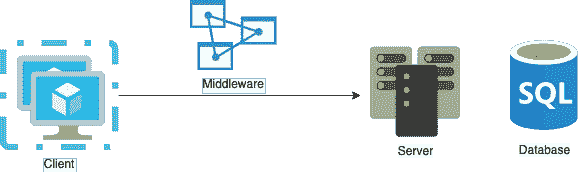
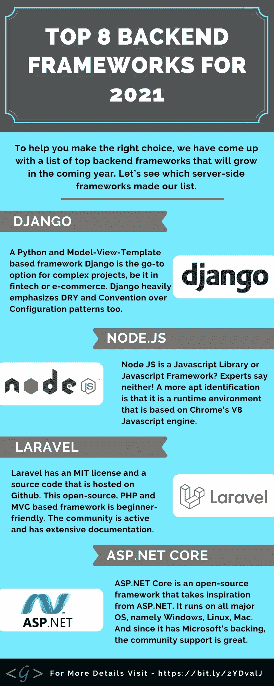

# 如何为你的副业项目选择一套技术

> 原文：<https://levelup.gitconnected.com/how-to-choose-a-tech-stack-for-your-side-project-ffc9f2f31f39>

## 在开始编码之前你可能要考虑的事情

克里斯托夫·高尔在 [Unsplash](https://unsplash.com/photos/m_HRfLhgABo) 上拍摄的照片

好吧，伙计们，这不是一篇技术文章，因为我只想讨论我在为我的副业项目选择技术堆栈时的思维过程。很多人问我“下一步我应该学哪种语言”等问题，我认为这取决于几个变量，我将在下面进一步探讨。

## **你还在找工作吗**

一些最流行的后端框架:

[https://statisticsanddata . org/data/most-popular-back end-frameworks-2012-2021/](https://statisticsanddata.org/data/most-popular-backend-frameworks-2012-2021/)

这些是一些比较有名的，虽然我可能会取代 Laravel，并添加一些像 Go，Java，Rust 或任何正在获得动力并变得越来越受欢迎的东西。但最重要的是，如果你刚刚起步，想找一份工作，你只想从一堆工作中选择一个，然后开始写代码。我知道很多人讨厌 JavaScript，但是如果你选择 Nodejs，这是一个 JavaScript 框架，那么你可以使用另一个框架进行前端开发，并且只使用一种语言体验两个世界，这可能不是最糟糕的想法，而且它肯定会帮助你更容易地找到工作。

在选择前端语言和数据库时也是如此。

一些流行的前端框架:

*   脸书创造的 React 在过去的几年里赢得了很多粉丝，你不会错的。
*   **Angular** —有点像企业框架，但 Angular 仍然是一个流行的框架。
*   **Vue.js** —虽然 React 非常轻量级，但 Angular 却完全相反。而 Vue.js 介于两者之间，通常受到开发人员社区的欢迎。
*   **Flutter**——四个框架中唯一不使用 JavaScript 的框架。Flutter 是由 Google 创建的，它使用了一种叫做 Dart 的语言。该框架越来越受欢迎，在这一点上，你选择学习它可能不会出错。

## 你有一份工作，但没什么经验？

好吧，如果你已经有工作了，你会怎么做？嗯，这要视情况而定——如果你有少量的经验，并且你还在学习正确地编码，我建议你选择你正在为你的副业项目工作的相同的语言。

这将让你巩固对语言的理解，并在此过程中获得更多知识，因为你肯定会遇到工作中不会遇到的问题。

你对这门语言理解得越多，你的工作生活就会变得越容易，你甚至可能获得晋升，因为你的技能将会迅速提高。

这也适用于你为副业选择的所有技术。因此，如果你在工作场所使用 NodeJS、React 和 MongoDB，只需用这三者构建一个项目。熟能生巧(或者至少在开发方面非常好)。

## 你已经有了一份工作，你对自己使用的语言很有信心

在这一点上，我认为你可以更自由地选择，这取决于你的主要目标是什么。如果你对自己的技能有经验和信心，你可能会想开发一个你想从中赚钱的应用程序或某种软件。太好了！因此，您将尝试考虑不同堆栈和您需要分配的资源(时间或金钱)之间的权衡。

如果你只是想进一步提高你的技能或者只是探索新的东西，你可以选择一个你没有接触过的技术，看看你是否喜欢它。

或者，如果你打算在某个时候换工作，并对你想要的新工作有一个想法，你可以看看公司使用什么技术，并在你的业余时间收集这些技术，以便做好准备。

## 结论

总之，我认为如果你刚刚起步，并试图进入这个行业，你可能会想坚持什么工作，并学习一些需求高的东西。

如果你已经得到了这份工作，抵制住跳入新技术的诱惑，直到你确信你完全理解了那些给你带来面包的技术。

最后，如果你有经验，确保你知道你想开始的副业项目的目标是什么。如果你只是想玩玩，你的选择可能并不重要，但是如果你已经找到了一份工作，那就去学习他们使用的技术。如果你想开发一个应用程序，并把它放在 App Store 上——花点时间来评估哪种技术栈最适合你试图解决的问题。

 [## 通过我的推荐链接加入 Medium-Ivan Stoev

### 作为一个媒体会员，你的会员费的一部分会给你阅读的作家，你可以完全接触到每一个故事…

medium.com](https://medium.com/@ivan.zstoev/membership)