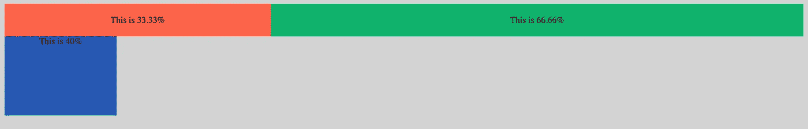
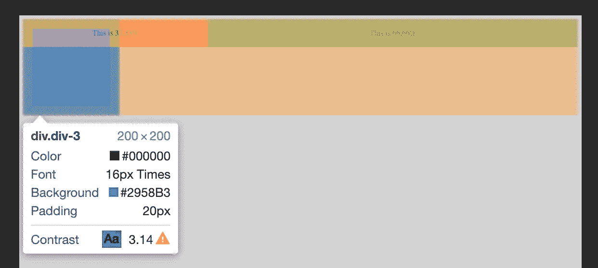
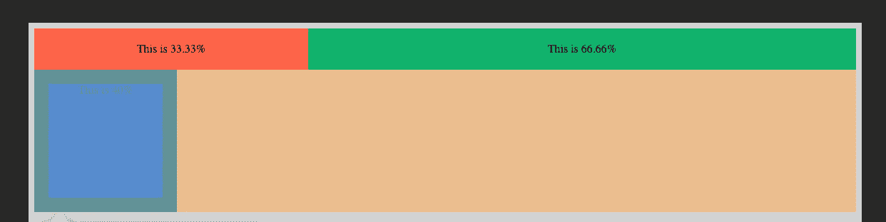

# 如何清除 CSS 中的浮动

> 原文：<https://levelup.gitconnected.com/how-to-clear-floats-in-css-269f05f411da>

在这个[故事](https://medium.com/@kabir4691/use-css-float-property-to-create-columns-6fc2c8d2aa0)中，我们将看到如何使用浮动在页面上创建列。然而，使用浮动有一个警告:您需要在使用浮动后清除它们。让我们用一个例子来看看为什么需要这样做。

```
<body>
    <div class="div-1">This is 33.33%</div>
    <div class="div-2">This is 66.66%</div>
</body>div {
    display: inline-block;
    padding: 20px;
    text-align: center;
}
.div-1 {
    width: 33.33%;
    background: #FF6347;
}
.div-2 {
    width: 66.66%;
    background: #0EB36D;
}
```


上面的例子显示了两个 div，分别占据了屏幕宽度的三分之一和三分之二。让我们看看当我们试图在它们下面添加第三个大小为 200x200 像素的 div 时会发生什么，但是没有 float 属性。

```
<body>
    <div class="div-1">This is 33.33%</div>
    <div class="div-2">This is 66.66%</div>
    <div class="div-3">This is the third div</div>
</body>div {
    display: inline-block;
    padding: 20px;
    text-align: center;
}
.div-1 {
    width: 33.33%;
    background: #FF6347;
    float:left;
}
.div-2 {
    width: 66.66%;
    background: #0EB36D;
    float:left;
}
.div-3 {
    width: 200px;
    height: 200px;
    background: #2958B3;
}
```



我们可以看到第三个 div 似乎出现在前两个 div 的下面。让我们检查页面以进一步理解。



我们可以看到第三个 div 确实没有出现在两个 div 的下面，这是 HTML 的正常流程。相反，它将自己对齐到页面的起始位置，就好像前两个 div 不存在一样。发生这种情况的原因是，当您对 HTML 中的元素应用 float 时，该元素将从页面的正常流程中移除。这导致在它之后出现的其余元素渗入其空间。为了克服这个问题，我们需要`clear`浮动，以便浏览器正确地呈现剩余的元素。让我们来看看同样的一些方法:

# **清除下一个元素的浮点**

我们可以将 clear: both 属性添加到紧随浮动元素之后的元素中，如下所示

```
.div-3 {
    width: 200px;
    height: 200px;
    background: #2958B3;
    clear: both;
}
```



我们可以看到，第三个 div 元素的行为符合预期，它将自己放置在前两个 div 的下面。这是因为通过应用`clear: both`属性，您告诉浏览器浮动属性从该点开始不再有效，页面的正常流动可以恢复。

然而，将 clear 属性单独应用于 proceeding 元素并不能每次都解决浮动的问题。考虑以下情况，浮动元素包含在父主元素中。

```
<body>
    <main>
        <div class="div-1">This is 33.33%</div>
        <div class="div-2">This is 66.66%</div>
    </main>
    <div class="div-3">This is the third div</div>
</body>div {
    display: inline-block;
    padding: 20px;
    text-align: center;
}
.div-1 {
    width: 33.33%;
    background: #FF6347;
    float:left;
}
.div-2 {
    width: 66.66%;
    background: #0EB36D;
    float:left;
}
.div-3 {
    width: 200px;
    height: 200px;
    background: #2958B3;
}
```

如果您尝试运行上面的代码并检查页面，您可以看到父元素' main '的高度是 0px，即使它内部有一些占用空间的元素。这是因为，在 proceeding 元素中缺少 clear: both 属性的情况下，父 main 元素没有检索回它的样式。因此，为了让父元素重新获得它的样式，我们必须设法包含浮动，而不是清除它们。包含浮动有不同的方法。然而，我们要看三个最流行的:用 clear: both 放置一个空的 div，溢出技术和 clearfix 技术。

# 放置一个空 div

在这个方法中，我们在父元素的结束标记之前放置一个空的 div，并将其样式设置为 clear: both。

```
<body>
    <main>
        <div class="div-1">This is 33.33%</div>
        <div class="div-2">This is 66.66%</div>
        <div class-"clear></div>
    </main>
    <div class="div-3">This is the third div</div>
</body>div {
    display: inline-block;
    padding: 20px;
    text-align: center;
}
.div-1 {
    width: 33.33%;
    background: #FF6347;
    float:left;
}
.div-2 {
    width: 66.66%;
    background: #0EB36D;
    float:left;
}
.div-3 {
    width: 200px;
    height: 200px;
    background: #2958B3;
}
.clear {
    clear: both;
}
```

以这种方式包含 float 效率不高，因为每次使用 float 时都需要添加一个空的 div 元素。此外，使用额外的空 div 在语义上也是不正确的。

# 溢出技术

在这个方法中，我们将`overflow: auto`属性应用于父元素，并将其样式设置为 clear: both。

```
<body>
    <main>
        <div class="div-1">This is 33.33%</div>
        <div class="div-2">This is 66.66%</div>
    </main>
    <div class="div-3">This is the third div</div>
</body>main {
    overflow: auto;
}div {
    display: inline-block;
    padding: 20px;
    text-align: center;
}
.div-1 {
    width: 33.33%;
    background: #FF6347;
    float:left;
}
.div-2 {
    width: 66.66%;
    background: #0EB36D;
    float:left;
}
.div-3 {
    width: 200px;
    height: 200px;
    background: #2958B3;
}
```

这种方法也有一些缺点。添加 overflow 属性可能会在 Internet Explorer 中添加滚动条。我们可以通过设置`overflow: hidden`来解决这个问题。然而，这反过来又会导致某些样式(如阴影部分)不可见。

# 清晰定位技术

这是迄今为止最有效也是最流行的包含浮动的方法。在这个方法中，我们创建一个包含特定规则的 CSS 类，然后将该类应用于包含浮动元素的父元素。让我们把这个类命名为“clearfix”。

```
<body>
    <main class="clearfix">
        <div class="div-1">This is 33.33%</div>
        <div class="div-2">This is 66.66%</div>
    </main>
    <div class="div-3">This is the third div</div>
</body>div {
    display: inline-block;
    padding: 20px;
    text-align: center;
}
.div-1 {
    width: 33.33%;
    background: #FF6347;
    float:left;
}
.div-2 {
    width: 66.66%;
    background: #0EB36D;
    float:left;
}
.div-3 {
    width: 200px;
    height: 200px;
    background: #2958B3;
}.clearfix: before, .clearfix: after {
    content: "";
    display: table;
}
.clearfix: after {
    clear: both;
}
```

在上面的代码中，我们在 clearfix 类上使用 before 和 after 的伪元素，在它所应用的元素之上和之下创建动态内容。为了隐藏元素，我们还将内容设置为空字符串。

此外，我们将 display 属性设置为 table，以使它们成为跨越整个页面宽度的块级元素，包括类的上面和下面。将 display 属性设置为 block 也可以，但是我们将它作为 table 来应用，以确保在旧浏览器上的向后兼容性。

这些动态创建的伪元素以隐藏的方式放置在内容的上方和下方，并确保浮动正确地包含在元素本身的范围内。我们还将 clear: both 属性应用于 after 元素，以确保下一个元素不会缠绕在浮动的元素周围。