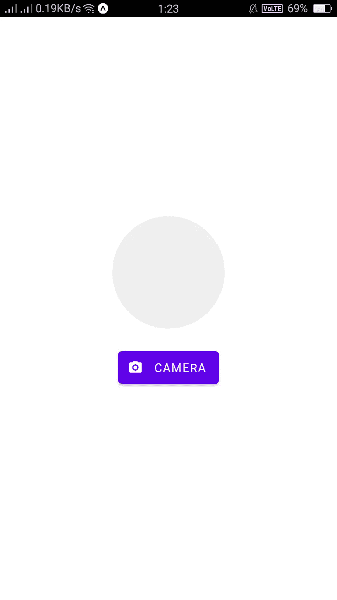
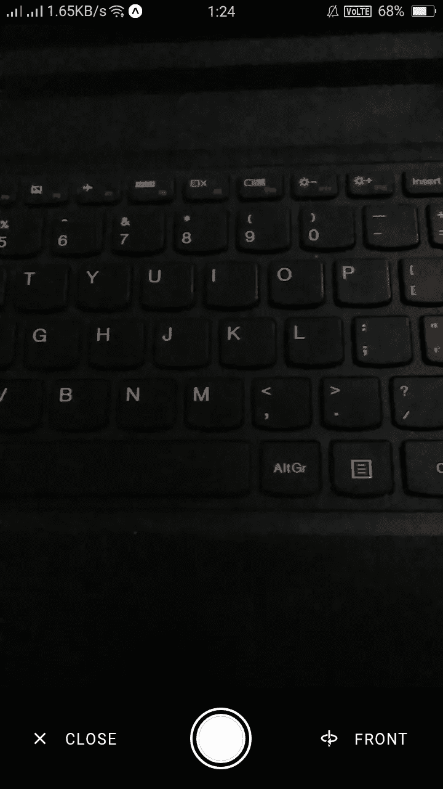
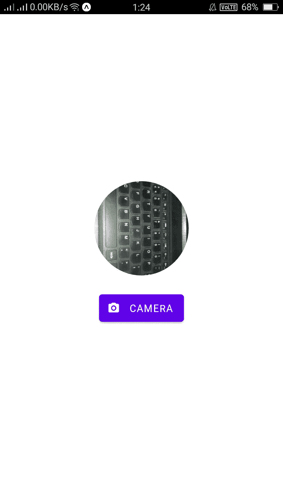

# 如何使用 expo-camera for android 点击 React Native 中的图像

> 原文：<https://levelup.gitconnected.com/how-to-click-images-in-react-native-using-expo-camera-for-android-1fbc1181473d>

**在任何应用程序中添加图像**都是基本功能。为此，我们将使用一个名为`[expo-camera](https://docs.expo.io/versions/latest/sdk/camera/)`的简单库。这支持各种相机功能，如变焦，自动对焦，白平衡和闪光模式等。

让我们开始吧，首先你需要使用 **expo-cli** 设置移动应用程序。为此，您可以使用 expo 按照[设置 react native app。](https://reactnative.dev/docs/environment-setup)

如果您正确设置了开发环境，只需转到您安装应用程序的路径，使用 **expo start** 或 **npm start 启动应用程序。** 如果没有错误，您将会看到您申请的**二维码**。现在，从 play store 将 [expo 应用](https://play.google.com/store/apps/details?id=host.exp.exponent&hl=en_IN)安装到您的 android 手机上。安装完成后，打开 app，扫描**二维码**。

在这之后，你的屏幕上会出现如下图。


React 本机应用程序(App.js)的开始屏幕

现在，使用以下命令在 React 本地项目中安装 [expo-camera](https://docs.expo.io/versions/latest/sdk/camera/) :

```
expo install expo-camera
```

你也可以使用 *npm* 或*纱线来完成。*

现在，打开文件夹结构，打开 **App.js** 文件，粘贴以下代码:

```
import React, { useState, useEffect } from "react";
import {
  Modal,
  Text,
  TouchableOpacity,
  View,
  Image,
} from "react-native";
import { Camera } from "expo-camera";
import { Button } from "react-native-paper";const CameraModule = (props) => {
   const [cameraRef, setCameraRef] = useState(null);
   const [type, setType] = useState(Camera.Constants.Type.back);return (
    <Modal
      animationType="slide"
      transparent={true}
      visible={true}
      onRequestClose={() => {
        props.setModalVisible();
      }}
    >
      <Camera
        style={{ flex: 1 }}
        ratio="16:9"
        flashMode={Camera.Constants.FlashMode.on}
        type={type}
        ref={(ref) => {
          setCameraRef(ref);
        }}
      >
        <View
          style={{
            flex: 1,
            backgroundColor: "transparent",
            justifyContent: "flex-end",
          }}
        >
          <View
            style={{
              backgroundColor: "black",
              flexDirection: "row",
              alignItems: "center",
              justifyContent: "space-between",
            }}
          >
            <Button
              icon="close"
              style={{ marginLeft: 12 }}
              mode="outlined"
              color="white"
              onPress={() => {
              props.setModalVisible();
              }}
            >
              Close
            </Button> <TouchableOpacity
              onPress={async () => {
                if (cameraRef) {
                  let photo = await cameraRef.takePictureAsync();
                  props.setImage(photo);
                  props.setModalVisible();
                }
              }}
            >
              <View
                style={{
                  borderWidth: 2,
                  borderRadius: 50,
                  borderColor: "white",
                  height: 50,
                  width: 50,
                  display: "flex",
                  justifyContent: "center",
                  alignItems: "center",
                  marginBottom: 16,
                  marginTop: 16,
                }}
              >
                <View
                  style={{
                    borderWidth: 2,
                    borderRadius: 50,
                    borderColor: "white",
                    height: 40,
                    width: 40,
                    backgroundColor: "white",
                  }}
                ></View>
              </View>
            </TouchableOpacity> <Button
              icon="axis-z-rotate-clockwise"
              style={{ marginRight: 12 }}
              mode="outlined"
              color="white"
              onPress={() => {
                setType(
                  type === Camera.Constants.Type.back
                    ? Camera.Constants.Type.front
                    : Camera.Constants.Type.back
                );
              }}
            >
           {type === Camera.Constants.Type.back ? "Front" : "Back "}
            </Button>
          </View>
        </View>
      </Camera>
    </Modal>
  );
};export default function ImagePickerExample() { const [image, setImage] = useState(null);
  const [camera, setShowCamera] = useState(false);
  const [hasPermission, setHasPermission] = useState(null);useEffect(() => {
    (async () => {
      const { status } = await Camera.requestPermissionsAsync();
      setHasPermission(status === "granted");
    })();
  }, []);if (hasPermission === null) {
    return <View />;
  }
  if (hasPermission === false) {
    return <Text>No access to camera</Text>;
  }return (
    <View style={{ flex: 1, justifyContent: "center", alignItems: "center" }}>
      <View
        style={{
          backgroundColor: "#eeee",
          width: 120,
          height: 120,
          borderRadius: 100,
          marginBottom: 8,
        }}
      >
        <Image
          source={{ uri: image }}
          style={{ width: 120, height: 120, borderRadius: 100 }}
        />
      </View> <Button
        style={{ width: "30%", marginTop: 16 }}
        icon="camera"
        mode="contained"
        onPress={() => {
          setShowCamera(true);
        }}
      >
        Camera
      </Button> {camera && (
        <CameraModule
          showModal={camera}
          setModalVisible={() => setShowCamera(false)}
          setImage={(result) => setImage(result.uri)}
        />
      )}
    </View>
  );
}
```

> (注意:-我正在使用一个 UI 库 [react-native-paper](https://callstack.github.io/react-native-paper/getting-started.html) ，使用时可以使用任何你喜欢的其他库)。

现在，你的屏幕有如下内容:



粘贴代码(App.js)后

要打开摄像机，只需点击**摄像机**按钮:



点击相机按钮后，你会看到这样的东西

这就是**世博相机**的工作原理。


现在，让我们看看代码是如何工作的:

```
import React, { useState, useEffect } from "react";import { Modal, Text, TouchableOpacity, View, Image} from "react-native";**import { Camera } from "expo-camera";**import { Button } from "react-native-paper";
```

以上是所需库的导入。

现在，创建功能组件 **CameraModule。**

```
const CameraModule = (props) => {
  const [cameraRef, setCameraRef] = useState(null);
  const [type, setType] = useState(Camera.Constants.Type.back);return (
    <Modal
      animationType="slide"
      transparent={true}
      visible={true}
      onRequestClose={() => {
        props.setModalVisible();
      }}
    >
      <Camera
        **style={{ flex: 1 }}
        ratio="16:9"
        flashMode={Camera.Constants.FlashMode.on}
        type={type}
        ref={(ref) => {
          setCameraRef(ref);
        }}**
      >
        <View
          style={{
            flex: 1,
            backgroundColor: "transparent",
            justifyContent: "flex-end",
          }}
        >
          <View
            style={{
              backgroundColor: "black",
              flexDirection: "row",
              alignItems: "center",
              justifyContent: "space-between",
            }}
          >
            <Button
              icon="close"
              style={{ marginLeft: 12 }}
              mode="outlined"
              color="white"
              onPress={() => {
                props.setModalVisible();
              }}
            >
              Close
            </Button> <TouchableOpacity
              onPress={async () => {
                if (cameraRef) {
                  let photo = await cameraRef.takePictureAsync();
                  props.setImage(photo);
                  props.setModalVisible();
                }
              }}
            >
              <View
                style={{
                  borderWidth: 2,
                  borderRadius: 50,
                  borderColor: "white",
                  height: 50,
                  width: 50,
                  display: "flex",
                  justifyContent: "center",
                  alignItems: "center",
                  marginBottom: 16,
                  marginTop: 16,
                }}
              >
                <View
                  style={{
                    borderWidth: 2,
                    borderRadius: 50,
                    borderColor: "white",
                    height: 40,
                    width: 40,
                    backgroundColor: "white",
                  }}
                ></View>
              </View>
            </TouchableOpacity> <Button
              icon="axis-z-rotate-clockwise"
              style={{ marginRight: 12 }}
              mode="outlined"
              color="white"
              onPress={() => {
                setType(
                  type === Camera.Constants.Type.back
                    ? Camera.Constants.Type.front
                    : Camera.Constants.Type.back
                );
              }}
            >
          {type === Camera.Constants.Type.back ? "Front" : "Back "}
            </Button>
          </View>
        </View>
      </Camera>
    </Modal>
  );
};
```

在上面的代码中，**相机**组件有如下属性:样式、比率、flashMode、类型和 ref。

看下面了解道具:

1.  风格:这可以用于你的相机应用的风格。
2.  ratio:表示预览纵横比的字符串(默认为 4:3)。
3.  闪光灯模式:使用常量`Camera.Constants.flashMode.(on/off)` **拍照时，设备上的闪光灯会打开。**
4.  类型:通过使用`Camera.Constants.Type.(front/back)`提供的常量来选择相机类型，即前置或后置。
5.  参考:使用相机曝光的方法如:`CameraRef.takePictureAsync()`。

相机应用程序中还可以使用更多属性。参见文档 [expo-camera](https://docs.expo.io/versions/latest/sdk/camera/) 。

现在，让我们来看看如何拍照。在*可触摸不透明* **t** 里面是**摄像机。这给了我们不同的方法，其中之一是**“takePictureAsync()”。**这种方法可以用来拍照。**

在这个组件上，我们提供了一个异步函数，从 **cameraRef** 中调用 **takePicturesAsync()** 方法。
所以现在我们有了*照片*变量里面的图像。它有一个 uri(图像的 url ),并在 **setImage** 函数中传递了 *photo* 变量，以便稍后我们可以使用这个 uri 来显示我们的图像。

```
 <TouchableOpacity
              onPress={async () => {
                if (cameraRef) {
                  let photo = await cameraRef.takePictureAsync();
                  props.setImage(photo);
                  props.setModalVisible();
                }
              }}
            >
              <View
                style={{
                  borderWidth: 2,
                  borderRadius: 50,
                  borderColor: "white",
                  height: 50,
                  width: 50,
                  display: "flex",
                  justifyContent: "center",
                  alignItems: "center",
                  marginBottom: 16,
                  marginTop: 16,
                }}
              >
                <View
                  style={{
                    borderWidth: 2,
                    borderRadius: 50,
                    borderColor: "white",
                    height: 40,
                    width: 40,
                    backgroundColor: "white",
                  }}
                ></View>
              </View>
            </TouchableOpacity>
```

现在，创建一个改变摄像机类型的按钮，为此可以使用“ **setType** ”功能来改变摄像机类型。

```
 <Button
              icon="axis-z-rotate-clockwise"
              style={{ marginRight: 12 }}
              mode="outlined"
              color="white"
              onPress={() => {
                setType(
                  type === Camera.Constants.Type.back
                    ? Camera.Constants.Type.front
                    : Camera.Constants.Type.back
                );
              }}
            >
          {type === Camera.Constants.Type.back ? "Front" : "Back "}
            </Button>
```

现在看看下面的**返回**功能，这里我们创建了一个**相机**按钮和一个圆形来显示图像。现在我们将使用上面创建的**<camera module/>**组件，这个 **CameraModule** 有一个属性 **setImage** ，它包含一个图像 uri 并在图像变量中设置该图像 uri。

将图像 uri 传递给 ** source ** prop，您可以看到圆圈内的图片。

```
return (
    <View style={{ flex: 1, justifyContent: "center", alignItems: "center" }}>
      <View
        style={{
          backgroundColor: "#eeee",
          width: 120,
          height: 120,
          borderRadius: 100,
          marginBottom: 8,
        }}
      >
        <Image
          **source={{ uri: image }}**
          style={{ width: 120, height: 120, borderRadius: 100 }}
        />
      </View> <Button
        style={{ width: "30%", marginTop: 16 }}
        icon="camera"
        mode="contained"
        onPress={() => {
          setShowCamera(true);
        }}
      >
        Camera
      </Button> {camera && (
        <CameraModule
          showModal={camera}
          setModalVisible={() => setShowCamera(false)}
          setImage={(result) => setImage(result.uri)}
        />
      )}
    </View>
  );
```

如果你正确地按照上面的步骤操作，在拍照后，你会看到如下的图片:



这就是你如何使用
**expo-camera** 库在 react native app 中拍照。

希望这篇文章对你有帮助。