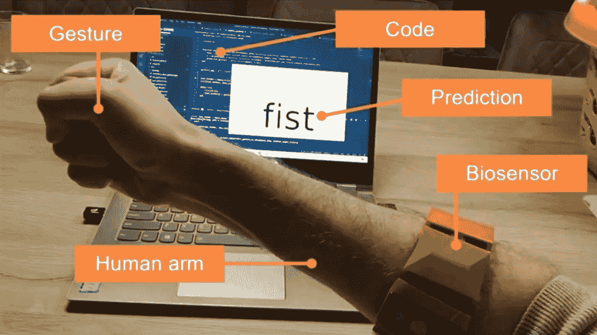
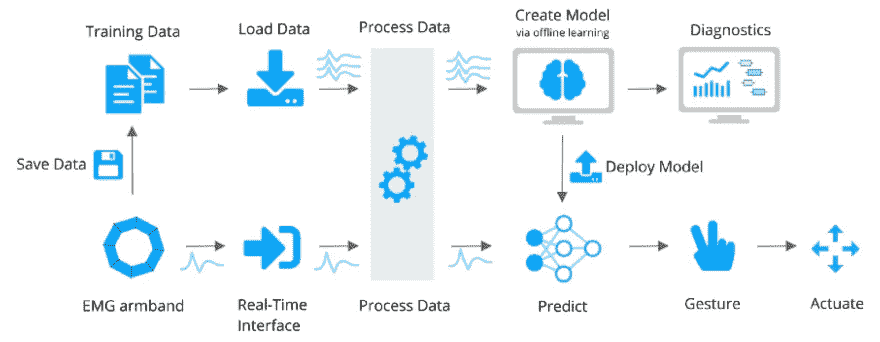
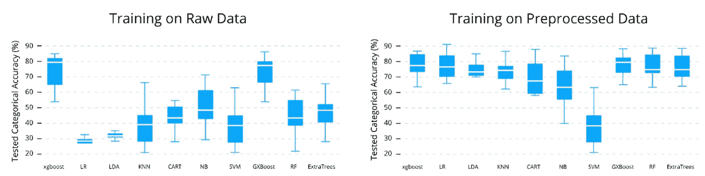
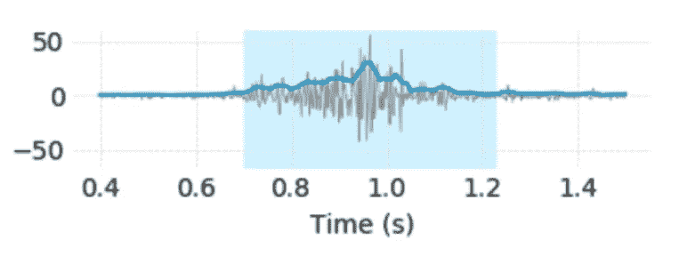
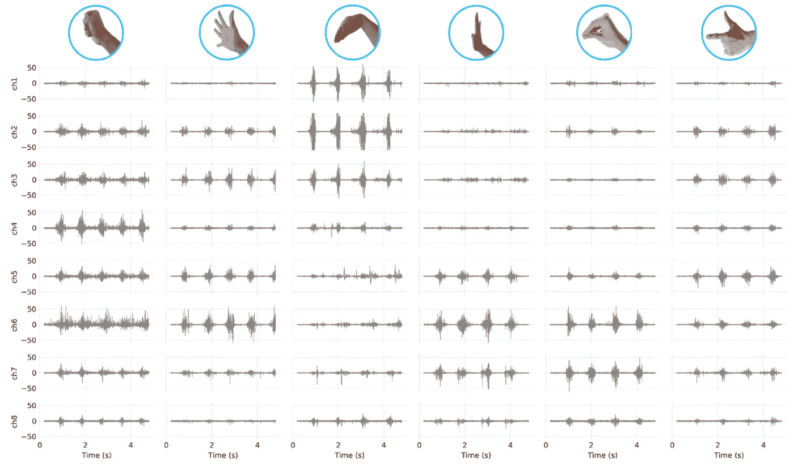
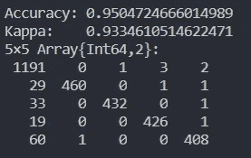

# 如何在 40 小时内从头开始编写生物信号控制系统的代码

> 原文：<https://levelup.gitconnected.com/how-to-code-a-biosignal-control-system-from-scratch-in-40-hours-54290c1eb0c7>

## 在 Julia 和 BrainFlow 中使用我自己的生物信号进行快速的个人机器学习

在之前的一个创业项目中，我花了一年多的时间努力构建一个负担得起的手势检测应用程序。这个想法是为了帮助截肢者获得更多负担得起的仿生手臂和康复服务。上个月，我通过切换软件堆栈，在很短的时间内从头开始了这个项目。

从本质上说，这是关于使用非常规的身体信号来控制物理和数字世界。最容易控制的是笔记本电脑上的视频游戏。这就是我的目标。最终结果如下所示:

我估计这花了我大约 40 个小时，因为我花了一个月的时间在这上面，每天晚上只有 60 分钟。

我们开始吧，好吗？

# 该系统

我有一个简单的整个系统概述如下。我将在文章的剩余部分详细介绍，但是“系统架构”可以分为两个主流。

上游包括:

1.  收集并保存一堆手势的数据。这是机器学习所需的数据。
2.  用你最喜欢的编程语言加载所有手势的数据。我会用朱莉娅来做这件事。
3.  处理数据并将其分成训练样本。
4.  适合一些不错的 ML 模型。
5.  可选地；做一些很酷的数据可视化。

随后在实时预测期间:

1.  获取单个数据样本。
2.  就像训练时一样处理它。
3.  用你的模型预测数据上的一个手势。
4.  做点什么，在这种情况下；可视化一些文本，或按一个按钮。
5.  在下一个数据样本上快速重复。

(专业提示:第二部分使用高性能语言。)

# 该设备

获得一个好的生物传感器来测量你的 EMG(肌电图)肌肉信号实际上是困难和昂贵的部分。过去，地中海实验室的 Myo 臂章很受欢迎，但不幸的是，它们消失了。给我这种 DIY EMG 黑客留下了一点真空。就我个人而言，我可以获得 OYMotion gForce Pro 臂章，但不幸的是，他们在中国以外还没有良好的物流，所以它不是超级容易获得的。你可以浏览 [BrainFlow 的入门](https://brainflow.org/get_started/?)指南，查看所有集成的脑电图、肌电图和其他生物传感设备，自己做出选择。

# 代码

在 BrainFlow 之前，我们必须编写定制的 c 代码来获取臂章数据，将其连接到 Python，并在那里进行所有的信号处理。我之前项目的代码是[这里](https://github.com/matthijscox/symbionic)。

我用 BrainFlow 替换了自定义的 c 代码，并将我所有的旧 Python 代码转换成 Julia，看看我是否能够重现结果，并最终获得足够的性能来进行实时预测。你可以在 [BrainFlowML.jl](https://github.com/matthijscox/BrainFlowML.jl) 中看到这一切

# 数据采集

从生物传感器获取数据是 BrainFlow 的几行简单代码。确保您的设备已打开，然后开始传输并获取一些电路板数据:

# 数据可视化

在进入所有的机器学习之前，观察数据是很重要的。你可以通过捕捉一些样本数据，存储它，然后绘制它。那很好。但是对于生物传感器来说，没有什么比实时传输数据更神奇的了。然而，我们在这里谈论的是 8 个通道 600 赫兹的流，一个简单的绘图包不可能处理这样的数据速率？

我过去确实遇到过那个问题。大多数绘图包是用于静态数据或简单的动画。不过不用担心，Julia 有自己的高性能绘图和动画包: [Makie.jl](https://github.com/JuliaPlots/Makie.jl) 。

我已经在我的[实时生物信号数据可视化博文](https://brainflow.org/2021-01-04-data-visualization/)中描述了如何设置它。但是结果却很惊人！我要给你看:

实时看到自己的生物信号对我来说仍然很神奇！有了这个设置，我现在可以可视化任何生物传感器数据。我正忙着用其他设备研究我自己的脑电波，但那是另一篇博文。

我继续使用我自己的生物信号可视化包来快速检查生物传感器设备是否正常工作以及信号是否良好。如果其中一个传感器没有接触到我的皮肤，或者传导太低，我会在实时信号中看到它。然后，我可以相应地调整设备，或者稍微运动一下，制造一些汗液，以便更好地传导；)

# 机器学习库

在深入研究信号处理之前，让我简要介绍一下我目前对 Julia 机器学习包的探索。

还有 [Flux.jl](https://github.com/FluxML/Flux.jl) ，类似 TensorFlow 和 PyTorch，只不过是用纯 Julia 写的，代码行相对较少。它绝对牛逼优雅，但我不需要深度学习就能完成工作，所以我不会在这里使用它。还有 [TensorFlow.jl](https://github.com/malmaud/TensorFlow.jl) 如果你真的还想在朱莉娅。

然后就是 [MLJ.jl](https://github.com/alan-turing-institute/MLJ.jl) 。这是一个自动化的机器学习包，可以整合所有的 Julia ML/DL 算法，包括 Flux。绝对很神奇，但我现在不需要。

因为过去我们已经研究过 Python 中不同的算法。事实证明，通过一些良好的预处理，大多数分类算法对这些数据都工作得很好。我以前和一个学生一起测试过这个:

对单个人的测试数据预测手势的分类准确性。通过交叉验证获得预测结果的分布。

所以现在我只会从 DecisionTrees.jl 中选择一个简单的随机森林。当我需要比较和调整算法来压缩最后的准确率时，我肯定会回到 MLJ 和 Flux。

# 数据管道

任何有经验的数据工程师都可以告诉你，大部分 AI/ML 的工作都是在所有的数据处理中参与的，而不是在机器学习中。

实际上，我们将有两条数据管道，一条用于收集和训练模型，另一条用于进行实时分类。但是它们应该使用相同的信号处理。为此，我们将使用数字信号处理包 [DSP.jl](https://github.com/JuliaDSP/DSP.jl) 。BrainFlow 本身也有数据过滤功能，所以那些也可以用。

OYMotion 臂带自带过滤功能，所以原始信号相当不错。我所做的只是去趋势数据，换句话说，删除一个常数偏移。如果您有另一个电子滤波和屏蔽较少的设备，您可能希望应用 50 或 60 Hz 左右的带阻滤波器(取决于您的地理位置)，或者带通滤波器来消除低频和高频噪声。

来自我的臂带的一个通道的 EMG 信号示例。深蓝色线是平滑的包络函数，浅蓝色阴影区域是我估计手势发生的地方。

在另一篇博文中，我解释了我们如何使用希尔伯特变换来捕捉 EMG 信号的包络函数。这个可以在 DSP.jl 中找到。我还用 savgol 滤镜平滑了一下。这两个步骤都有助于检测实际手势并将其从背景噪声中分离出来。文献中有更复杂的策略，但我现在将坚持我所知道的。

# 收集数据。

我没有任何关于这个生物传感器数据的数据库，所以我必须自己收集。幸运的是，我们不需要太多的数据。我收集了每个手势 30 秒的数据；左移，右移，握拳，展开。这很无聊，我只是多次做出大致相同的手势，但有一些变化，有时是快速的拳头，有时是握着拳头，然后是有力的拳头，然后是较弱的版本。

你可以在我的 BrainFlowML repo 中找到一个收集数据的简单脚本，名为[brain flow _ data _ gathering . JL](https://github.com/matthijscox/BrainFlowML.jl/blob/main/test/testdata/brainflow_data_gathering.jl)。主要部分是要求您做出一些手势的循环:

这很简单:

*   record_gesture 连接 BrainFlow 并显示进度条。
*   然后将数据转换成数据帧。
*   将数据存储在 csv 文件中。

我把几个手势每 30 秒的数据存储在。csv 文件，你也可以在我的 github repo 里找到例子。以下是 6 个不同手势的示例图，臂带中有每个通道的信号。

OYMotion 臂带的 8 个通道/传感器的所有手势的原始数据样本(如上图所示)。不同的手势显示出明显不同的行为，可以用来对它们进行分类(已经被你的人脑所识别)。

这个简单方法的唯一缺点是，只有当我一直戴着这个设备时，预测才会起作用。如果我移动它或者脱下它再戴上它，精确度会显著下降。对于这个演示来说，这很好，但是对于一个真正的应用程序来说，您需要通过对在各种条件下收集的更多数据样本进行训练来获得更加健壮的东西。

# 训练算法。

总之，所以我收集数据，立即处理它，并在上面安装一个随机的森林模型。在此期间，我确保不要改变设备在我手臂上的位置。

训练过程中最复杂的部分是标记数据，以指示手势开始的位置和我的手臂处于静止位置的位置。为此，我在平滑包络函数上使用了一些经验阈值。它工作得相当不错，但并不完美。

接下来，我必须将数据分割成时间长度相等的样本，因为我们将在最终预测中使用这些样本。

在将数据传递给随机森林算法之前，我这样:

*   用每个相应的手势标记数据。
*   把数据分成一堆样本。
*   处理每个样本(只需去除趋势和平滑)。
*   使适合

要了解更多信息，请参阅我的[数据科学文章](http:// https://link.medium.com/w0Ill99L3db)，我已经用 Python 完成了所有这些步骤。你也可以看我的[例子茱莉亚剧本](https://github.com/matthijscox/BrainFlowML.jl/blob/main/test/random_forest.jl)。如果你想看一些代码，我大概是这样做的:

作为最后的检查，你可以看看准确性，并作出混淆矩阵。除了一次拟合，你还可以进行交叉验证，用这种方式来检查准确性。这两个选项在 DecisionTrees.jl 中都有。为了优化超参数，您需要转到 MLJ.jl，但是我发现准确率超过 85%,这对于这个演示来说已经足够了。

混淆矩阵可以帮助您查看是否有任何严重的错误分类发生。你可以在下面看到一个例子。第一栏是‘无手势’的预测。你可以看到这些是最常见的，1191 次它正确地将一个“无手势”分类，偶尔它会错误地将一个“无手势”分类为另一个手势。例如，29 次它将其分类为第一个手势(我的手向左移动)。那些经常被预测为“无手势”的并不令人担忧，它们可能是我的自动标记方法的产物。

朱莉娅·REPL 出版的混淆矩阵示例

最后，我将训练好的模型存储在磁盘上，这样它就不会意外丢失。我用可以直接保存 Julia 类型的 [JLD2.jl](https://github.com/JuliaIO/JLD2.jl) 来做这个。还有其他方法，但这个很好。

# 实时检测。

这是我过去从未成功过的部分，通过使用训练过的模型进行预测，很容易实时地对手势进行分类。但是如果你有一门高性能的语言，它实际上是相当琐碎的。你可以看到我的示例脚本 [realtime_predict.jl](https://github.com/matthijscox/BrainFlowML.jl/blob/main/test/realtime_predict.jl) 。它所做的只是:

*   加载训练好的模型。
*   通过 BrainFlow 连接。
*   用一些文字制作一个情节。
*   连续循环预测手势。基于预测更新文本。

结果看起来像这样:

我计算了整个数据处理流程的时间。用时不到 3 毫秒。整整三毫秒来收集脑流数据，平滑数据并进行分类。实际上，大多数时间都浪费在 savgol 过滤器上，因为我没有尝试优化这段代码。

这意味着我只有 3 毫秒的延迟。一些人评论说，如果你仔细观看视频，你可以看到它在我自己的手移动之前检测手势！我从来没有想到手写 Python 代码会有这样的性能。

# 统治世界

现在，您已经了解了如何用自己的生物信号检测手势。接下来，你可以控制任何物理或数字物体，比如我在博客顶部展示的视频游戏。那个比较琐碎，只是让代码按一个按钮，而不是打印文本。控制一个仿生手臂(我最初的目标)有点复杂，但这些传感概念是相同的。天空才是极限！你会用这项技术建造什么？

*如果你从事类似的工作，并想与我分享想法，或者如果你想自己开始，请随时在* [*LinkedIn*](https://nl.linkedin.com/in/matthijscox) *上与我联系。*