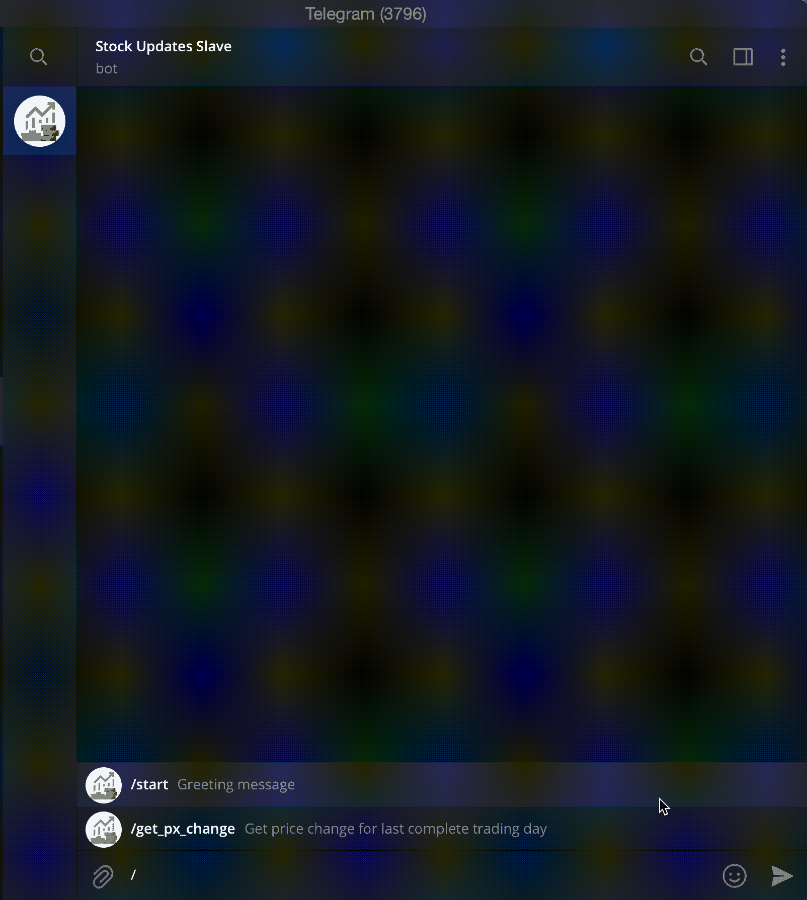

# 如何用纯 Python 编写一个电报机器人来获取股票价格更新

> 原文：<https://levelup.gitconnected.com/how-to-code-a-telegram-bot-to-get-stock-price-updates-in-pure-python-c35d3c44b04c>

## 创建您自己的个人股票更新奴隶

> 我将在本文中提到的电报机器人是[股票更新从属服务器](https://t.me/stock_updates_bot)，源代码可以在这个 [GitHub 库](https://github.com/davidcjw/stockM)上找到。


照片由[克里斯蒂安·威迪格](https://unsplash.com/@christianw?utm_source=medium&utm_medium=referral)在 [Unsplash](https://unsplash.com?utm_source=medium&utm_medium=referral) 上拍摄

您可能会想， ***为什么我们甚至需要一项服务来更新我们的投资组合持有情况*** ？事实是，我们大多数人都忙于日常生活和经纪平台，我们订阅了这些服务，但他们的推送通知是以电子邮件或移动应用提醒的形式出现的，我们几乎从来不愿意点击或打开。电报机器人提醒因此更有用，因为它被集成到我们更有可能点击的日常信息应用程序中。



我的电报机器人演示(作者 GIF)

在我们开始之前，这里有一些构建这个简单电报机器人的先决条件:

1.  初级到中级 Python
2.  对 API 工作原理的基本理解
3.  电报帐户
4.  Heroku 帐户(用于部署)
5.  GitHub 帐户(用于部署)
6.  SQL Alchemy(可选，用于数据库目的)[ **未涵盖**
7.  AWS 帐户(可选，用于无服务器 CRON 作业)[ **不包括**

事不宜迟，我们开始吧！

首先，我们需要一个 API 来获取我们心目中的股票的价格变化。为了简单起见，我们将使用[***y finance***](https://github.com/ranaroussi/yfinance)，一个在 *Yahoo 财务* API 被停用。它的 API 是用 Python 编写的，我们还将为 Telegram API 使用一个基于 Python 的库，称为[***Python-Telegram-bot***](https://github.com/python-telegram-bot/python-telegram-bot)。

我们将首先基于 *yfinance* API 创建一个简单的脚本来获取输入报价机的价格变动。接下来，我们将设置电报处理器来监听对机器人的请求。

**步骤 1** :创建一个脚本，使用 *yfinance* 获取价格变化

下面的脚本接受一个*收报机*作为输入，一个*回看*周期作为可选参数，并返回一个*元组*，该元组由第一个指数的百分比变化和第二个指数的百分比变化的收盘值列表(主要用于提取准确的价格，如果需要的话)组成。

**第二步**:用[机器人父亲](https://t.me/BotFather)创建一个电报机器人

按照机器人上的说明来设置你的机器人(*是的，你正在使用一个机器人来创建一个机器人*——即 ***机器人异常*** )。最后，您将获得一个访问 HTTP API 所需的 bot 令牌。记下这个记号。我们将在下一步中使用它。

**步骤 3** :将这个令牌导出为一个环境变量，这样我们的应用程序以后就可以使用它了。

从命令行运行:

```
export TELEGRAM_BOT_TOKEN=<YOUR_BOT_TOKEN_HERE>
```

**第四步**:创建一个`telegram_bot_app.py`就是我们的电报机器人

这个电报机器人只有一个命令——*get _ px _ change*——使用`/`命令启动。在 telegram 上，要获得 *AMZN* ticker 的价格变化，通过`python -m telegram_bot_app`在本地提供应用程序后运行`/get_px_change AMZN`。

**第五步**:将该命令注册在电报上，以便用户更直观的知道该命令的存在

通过`/setcommands`返回*机器人*登记该命令 *get_px_change* 。包含一个像 *start* 这样的命令来通知用户如何使用你的机器人也是值得的。

> **FYI** :命令处理程序以`/`开头，出现在命令列表中。
> 
> **注意**:代替命令处理程序，对话处理程序也可以和键盘标记一起使用(如上面的 GIF 所示)。后者可能更直观，更方便用户导航。
> 
> **更多注意事项**:最好的做法是用错误处理器来处理未识别的命令。

**第 6 步**:将脚本放在 *GitHub* 仓库中，以便于在 *Heroku* 上部署

然而，在我们可以在 Heroku 上部署之前，我们需要定义我们的环境。为此，我们需要两个新文件:

a) **Procfile** —它告诉 *Heroku* 应用程序的类型，以及设置环境后要运行的命令。它将只包含这一行:

```
web: python -m telegram_bot_app
```

b) **requirements.txt** —这定义了典型的基于 Python 的应用程序的环境需求。它应该是这样的:

```
pandas==1.0.1
numpy==1.18.1
yfinance==0.1.54
python-telegram-bot==13.1
```

文件夹结构应该如下所示:

```
.
├── telegram_bot_app.py
├── ticker.py
├── Procfile
└── requirements.txt
```

将这些文件推送到主/主分支上的一个 *GitHub* 存储库中。

**第七步**:在 *Heroku* 上部署该应用

如果你没有一个 *Heroku* 的帐号，创建一个并安装 [Heroku 命令行界面](https://devcenter.heroku.com/articles/heroku-cli) (CLI)。

a)接下来，通过 CLI 创建一个新项目:

```
heroku create <project_name>
```

b)将电报机器人令牌设置为环境变量。

```
heroku config:set TELEGRAM_BOT_TOKEN=<YOUR_BOT_TOKEN_HERE>
```

c)修改您的`telegram_bot_app.py`来监听 webhook 事件。

d)将您的 *GitHub* repo 推至 *Heroku* 遥控器。注意 *Heroku* 只会在你推进到主分支或者主分支的时候建造。从您的 git repo 中，运行以下命令:

```
git push heroku master
```

***瞧*** ！这就是你自己的基于 Python 的电报机器人！当然，您可以通过添加更多功能和更多命令/消息处理程序来扩展这个机器人的功能。

如果你想每天更新你的投资组合，请查看我的 [***股票更新奴隶***](https://t.me/stock_updates_bot)

对于更高级的用户，请随意查看我的 [git 库](https://github.com/davidcjw/stockM)，了解我如何建立一个 *PostgreSQL 数据库*来跟踪用户投资组合和/或观察列表中的股票，以及他/她的订阅状态。如果你订阅了我的机器人，它还支持你的观察列表和/或投资组合的双日更新(推送通知)。这是通过使用*AWSλ*的*无服务器 CRON 作业*设置来完成的。Heroku 还支持计划作业，因此这也是一种选择。

## 结束语

最后，如果你喜欢这篇文章，并想了解更多，请考虑为这篇文章鼓掌(高达 50！)如果您有任何反馈，请留下您的评论。谢谢大家！

如果你喜欢我的内容，并且*没有*订阅 Medium，请考虑支持我，并通过我在这里的推荐链接[订阅(*注:你的一部分会员费将作为推荐费*分摊给我)。](https://davidcjw.medium.com/membership)