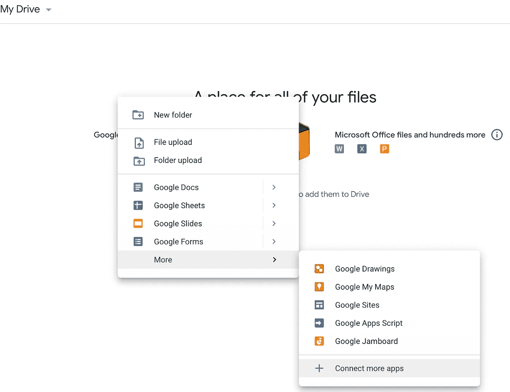
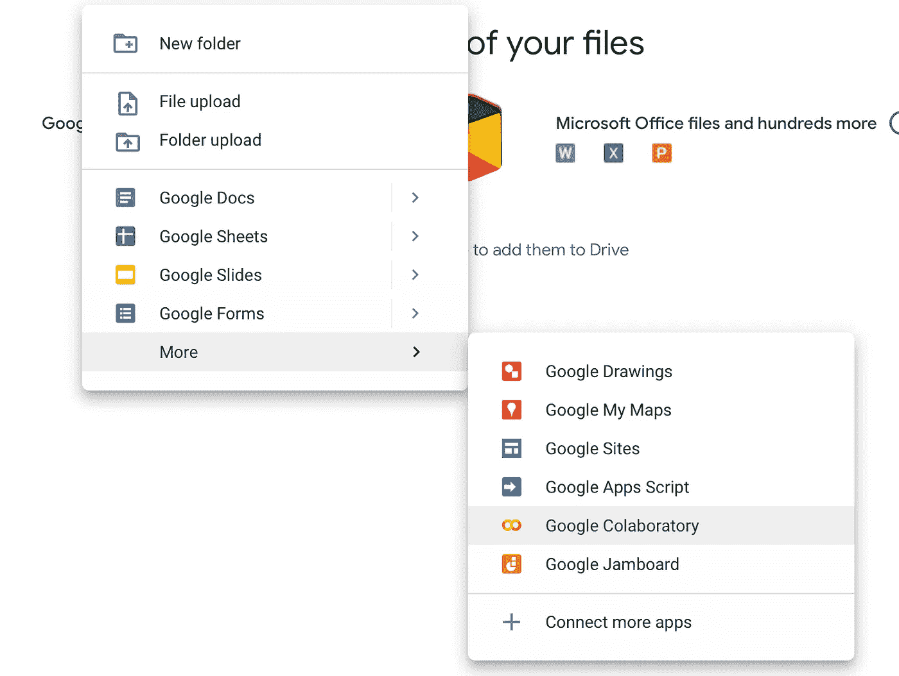
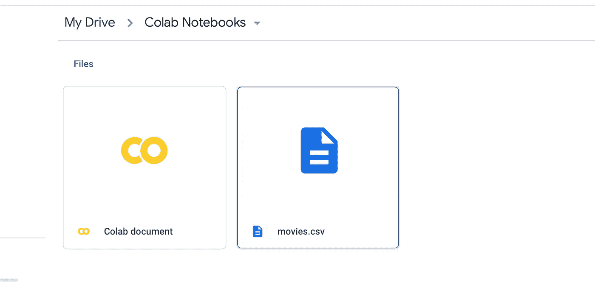
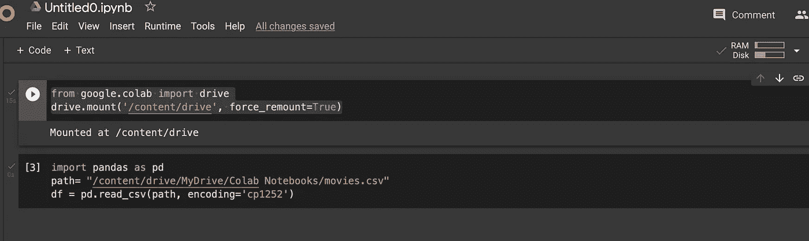
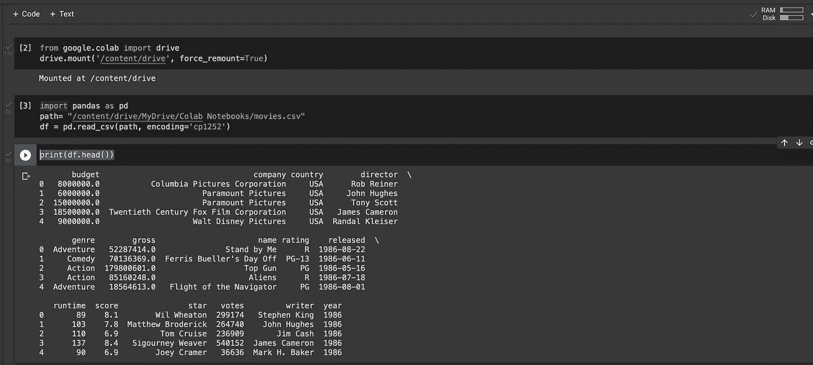
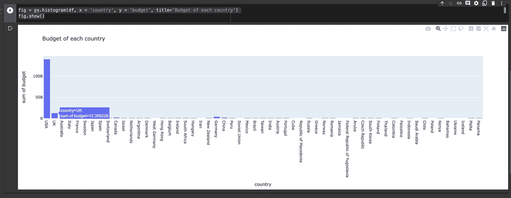

# 如何用谷歌合作实验室编码和绘图

> 原文：<https://levelup.gitconnected.com/how-to-code-and-graph-101-in-google-colaboratory-with-pictures-cdfb724a5f8b>

## 完全指南

## Google 合作实验室:编写 Python 代码的新的更好的方法


照片由 [Fotis Fotopoulos](https://unsplash.com/@ffstop?utm_source=medium&utm_medium=referral) 在 [Unsplash](https://unsplash.com?utm_source=medium&utm_medium=referral) 上拍摄

***在***[***2017***](https://colab.research.google.com)***中，用 Python 编程实现了技术进化和进步的巨大飞跃*** 。Google 为 Python 创建了一个 web IDE，在 Jupyter 笔记本环境下，在云上进行机器学习。这一进步被称为 [*谷歌合作实验室。*](https://research.google.com/colaboratory/faq.html) 这篇文章是关于用谷歌合作实验室进行编码和绘图及其优缺点的。如果你想学习如何用最新最简单的方式编码，或者为企业制作图表，这篇文章是为你准备的。

Google Colaboratory 是 Google Drive 的扩展，就像 google docs、sheets 和 slides 一样。 ***在 Colab 中，你可以编写可执行的 Python 代码，拥有 google drive 拥有的所有好处，比如共享、在线保存、与他人实时处理同一文档。另外，你不需要安装任何程序来编码，因为一切都在云上。***

**这个工具有编程史上最重大的 pro。你不需要高规格的电脑来编码。这些年来，由于对编码能力的巨大需求，程序员们被认为拥有最好的高规格计算机。Google Colaboratory 是一个网络和云工具；你可以在任何设备上编码。我没有夸大其词；你可以在 2008 年的电脑上运行；如果你受限制的话，你甚至可以在手机上运行它。这就是这个工具如此非凡的原因。任何人都可以在其中运行代码，此外，它还具有本文中提到的所有其他优点。**

在你的硬盘上安装谷歌协作实验室扩展的最简单的方法是右击你的硬盘，选择连接更多应用。然后你搜索 Colab，点击安装，如下图所示。



埃米利奥·赛恩斯·威廉姆斯的截图


埃米利奥·赛恩斯·威廉姆斯的截图

将 Colab 安装到您的驱动器后，*您可以再次右键单击并选择 Google Colaboratory 选项来打开 Colab 文档。*



截图由[埃米利奥·赛恩斯·威廉姆斯](https://medium.com/u/798e6d281b9d?source=post_page-----cdfb724a5f8b--------------------------------)

现在您已经打开了一个 Colab 文档，您可以执行任何想要的 python 代码；对于这篇文章，我们想制作图表。首先，我们需要将您想要的数据以 CSV 格式导入到驱动器中。为 google Collab 创建一个文件夹，并将 CSV 文件添加到该文件夹中，如下所示。对于本文，我使用的例子是一个包含网飞所有电影数据的电影 CSV。使用你自己的 CSV 或你想在这部分绘制的信息，可能是你的业务、个人账户或其他任何东西；如果你没有，你可以在网上下载一个，用它来测试这个。



截图由[埃米利奥·赛恩斯·威廉姆斯](https://medium.com/u/798e6d281b9d?source=post_page-----cdfb724a5f8b--------------------------------)

创建文件夹后，在 Colab 文档中，您必须运行此代码将 CSV 数据导入到文档中。它应该是这样的

```
from google.colab import drivedrive.mount(‘/content/drive’, force_remount=True)import pandas as pdpath= “/content/drive/MyDrive/Colab Notebooks/movies.csv”df = pd.read_csv(path, encoding=’cp1252')
```



埃米利奥·赛恩斯·威廉姆斯截图

**如您所见，第二段代码设置了一条到达 CSV 的路径；你所要做的就是把“movie.csv”这个名字替换成你正在使用的 csv 的名字**。然后用左边的 play 按钮运行这两个代码；它将请求您的许可，这样，您的 CSV 就被导入到文档中了。

你现在所要做的就是代码图，这非常简单，图形会显示 CSV 中的信息。

在这之后，复制/粘贴这个并运行它；它应该是这样的

```
print(df.head())
```



埃米利奥·赛恩斯·威廉姆斯截图

此命令打印并显示 CSV 中的信息；我们用它来确认文件是否被正确导入，并在图表中找到 x 和 y 值。下面你可以找到制作图表的代码。

```
fig = px.histogram(df, x = ‘country’, y = ‘budget’, title=’Budget of each country’)fig.show()
```



埃米利奥·赛恩斯·威廉姆斯截图

在这个例子中，我随机选择了预算和国家的值。可以看到，你会手动把自己 CSV 的 x 和 y 值放到代码里；如果要更改标题，请在标题部分键入不同的标题。我可以选择许多其他值，如运行时间或分数，并进行其他组合来制作不同的图形；这完全取决于你想展示什么信息。有五十多种不同类型的图表，甚至有些带有动画，你可以通过简单地将它们从这个网站复制/粘贴到你的文档中，用你的数据进行编码和绘图。https://plotly.com/python/T2

就是这样，非常简单快速。你必须将数据导入到文档中，并从链接中获得图形代码。您可以使用 Python 将您的业务、公司和个人财务数据实现为 50 多种不同的图表。

如果你喜欢这篇文章，请关注我的帐户。