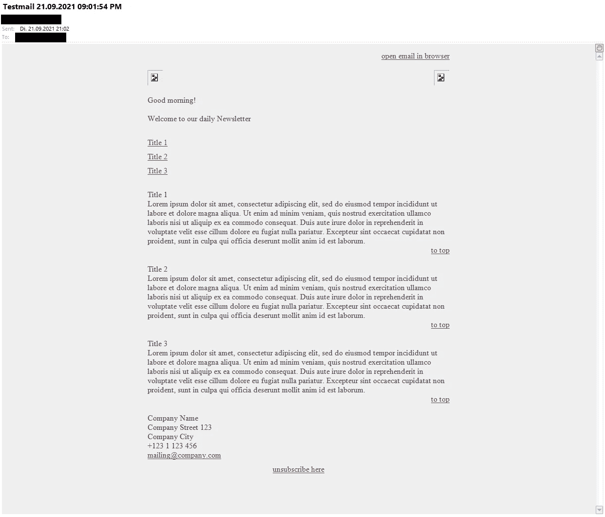

# 如何编写 HTML 邮件代码(第 1 部分)

> 原文：<https://levelup.gitconnected.com/how-to-code-html-emails-part-1-81f030a104c7>

## 关于邮件客户端的 HTML 编码你应该知道的事情


作者提供的图片

# 邮件客户端

我编写的大部分模板都是针对 B2B 客户的。所以我可以依靠他们公司的 IT 部门来安装和支持他们的计算机。在大多数情况下，他们在台式机和笔记本电脑上使用 Microsoft Office with Outlook，甚至在苹果电脑上也是如此。对于移动设备，他们有苹果邮件或安卓邮件客户端。

在极少数情况下，他们使用 Lotus Notes，有时也使用其他移动客户端。

# Microsoft Outlook

如前所述，Outlook 是我们必须处理的最常用的客户端。从 Outlook 2007 开始，就使用了微软 Word 的渲染引擎，这是现代浏览器无法比拟的；特殊的 CSS 实现是低劣的。有了 Outlook 2010，它变得好了一点点，但只是一点点！

此外，出于安全原因，不支持 Javascript、表单元素和视频嵌入。但我认为这并不坏，想象一下如果这行得通，营销人员或垃圾邮件发送者会怎么做；-)

# Microsoft Outlook 的 HTML 回到 90 年代

好吧，CSS 不好用，尤其是宽度和高度属性只对表格有效。所以我们不得不使用许多具有过时属性的嵌套表格，比如单元格间距、单元格填充、对齐、宽度、高度等等。

下面是一个典型的、非常简单的电子邮件 HTML 代码:

作者代码

在 Outlook 中，生成的电子邮件如下所示:



Outlook 2010，作者截图

标题图像被破坏是因为“[http://www.myserver.com/mail_header_left.png](http://www.myserver.com/mail_header_left.png)”只是伪代码！但是现在对于 HTML 来说:

首先，看看页面颜色设置的属性。20 多年前，它们是给网页着色所必需的，今天它们被弃用了，在任何情况下都不应该使用。

甚至 Outlook 也可以处理这些基本颜色功能的 CSS。所以你可以把它们排除在外，但是也许一些外国客户无论如何都需要它们，所以我总是把它们作为后备。这就是有时所说的“恐慌代码”；-)

接下来是第一个。该表用于通过“对齐”属性将邮件内容居中，并通过“宽度”属性将宽度设置为 620px。如你所见，没有 px 的值只是“620”！否则 Outlook 将忽略该值，使邮件与窗口一样宽！所有其他表都嵌套在该表中。

在“一些美好的问候”的中，有一个标签也已被弃用。但是它适用于所有客户端，比如中的颜色属性。我在这里使用它只是为了说明，因为 Outlook 非常好地支持 CSS“font-family ”,所以它不是强制性的。

我认为代码的其余部分很容易理解，并且我已经加入了许多注释。一个有趣的是带有“高度”属性的空格(没有“px”)。为了安全起见，这是在块之间插入空格的好方法，总是有效的！

# Outlook 以外的其他客户端怎么样

我谈了很多关于 Outlook 的内容，并向您展示了我们可以使用哪些被否决的 web 技术来使电子邮件看起来像是设计师的规范。

好消息是所有其他邮件客户端和浏览器仍然支持不推荐使用的代码。如果它在 Outlook 中有效，那么它在任何地方都有效。

最好使用不推荐使用的代码和现代 CSS，这样可以两全其美。

# 我们必须牢记或忍受的事情

我一直在努力解决一些奇怪的事情，当一切都完成并上线时，客户给出了反馈。

其中之一是 Outlook 中非常长的表中不需要的空间。Outlook 试图插入分页符；你可以在这里找到详细的解释:“ [Email on Acid](https://www.emailonacid.com/blog/article/email-development/horizontal_spacing_issues_in_outlook_2007_and_2010/) ”

正如您在我的代码示例中看到的，块“articles”是一个，每篇文章都在一个中。如果你只有几篇文章，没有问题。但是当有更多时，可能会出现分页符。

为了避免分页，只需将单个表格拆分为多个表格，每个表格对应一篇文章:

```
<!-- articles -->
<table cellspacing="0" cellpadding="0" width="100%">
  <tr>
    <td>
      <a name="text1">Title 1</a>
    </td>
  </tr>
  <tr>
    <td>
      Lorem ipsum ...
    </td>
  </tr>
  <tr>
    <td align="right">
      <a href="#anchor_toc">to top</a>
    </td>
  </tr>
  <tr>
    <td height="20">
    </td>
  </tr>
</table>

<table cellspacing="0" cellpadding="0" width="100%">  
  <tr>
    <td>
      <a name="text2">Title 2</a>
    </td>
  </tr>
  <tr>
    <td>
      Lorem ipsum ...
    </td>
  </tr>
  <tr>
    <td align="right">
      <a href="#anchor_toc">to top</a>
    </td>
  </tr>
</table><!-- and so on -->
```

另一个问题存在于高分辨率屏幕，如 2K、4K 或视网膜。Outlook 以更大的字体呈现。我有一个和文本栏一样宽的标题图像，但是在这些高分辨率显示器上，图像看起来比文本栏小。

你可以在 uplers.com 找到很好的解释和解决方案。不幸的是，我不能让他们的解决方案工作，但我不能测试它很长时间，我没有高分辨率的屏幕。如果你找到了解决办法，请告诉我。

出问题的不仅仅是 Outlook，还有 iOS 中的 Apple Mail。苹果的移动客户端不会跳转到邮件中的锚。这几天刚用 iOS 14.7.1 测试，不跳！当我第一次注意到这个问题时，我尝试使用 id 而不是命名锚点，但都不起作用。

```
<a name="text1">
or
<a id="text1">
```

**好消息:
今天有同事告诉我 iOS 15 终于支持锚点了！我现在无法测试，但我会相信他。**

# CSS 呢

在我的下一个邮件故事中，我将写下我使用邮件客户端 CSS 的经历，尤其是 Outlook。你会发现，知道自己能做什么，不能做什么，其实并没有那么复杂。

所以请期待第 2 部分即将到来！

如果你有任何问题，不要犹豫与我联系。我很乐意帮助你。

快乐邮件编码！