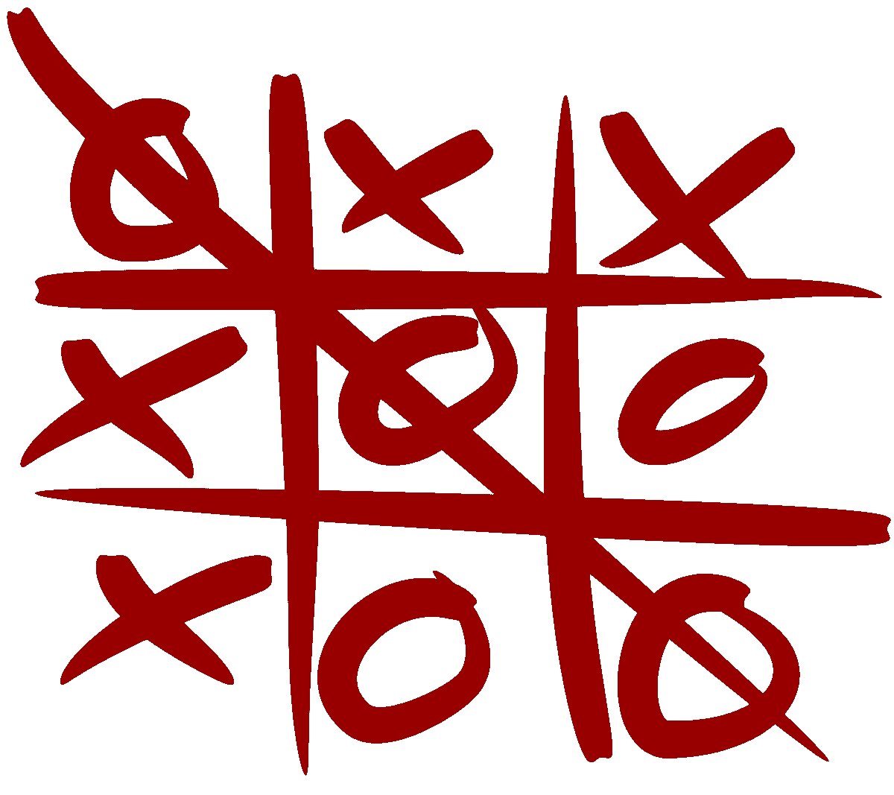
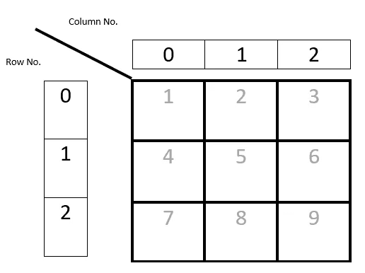
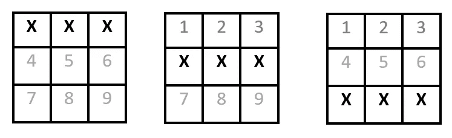
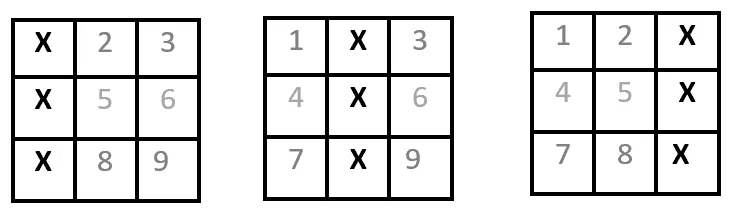
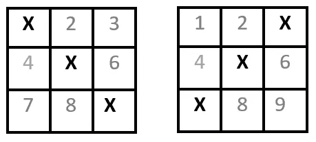
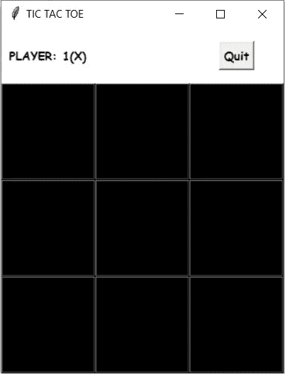
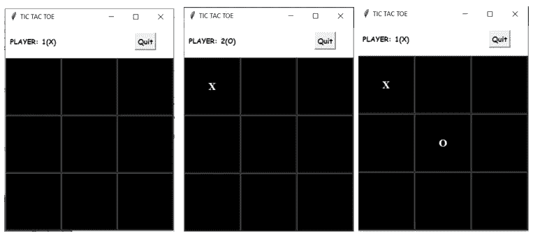
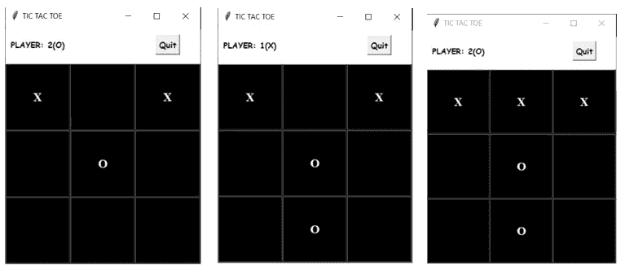
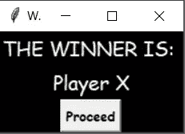

# 如何使用 Tkinter 在 Python 中编写井字游戏代码

> 原文：<https://levelup.gitconnected.com/how-to-code-tic-tac-toe-in-python-using-tkinter-e7f9ce510bfb>



图片来源:[https://en.wikipedia.org/wiki/File:Tic_tac_toe.svg](https://en.wikipedia.org/wiki/File:Tic_tac_toe.svg)

在这篇文章中，我们将用一个漂亮的 GUI 来编写经典的纸笔游戏。我们将用 Python 对其进行编码，并将 Tkinter 用于接口。所以让我们开始吧！

# 这是什么游戏？

井字游戏是一种双人游戏，每位玩家都有一个符号(X 或 O ),轮流在一个 *3x3 格子*上标记他们的符号。如果任何玩家在一行、一列或一条对角线上连续 3 次获得他们的符号，则该玩家获胜。



样本网格-框中的数字仅供参考。

正如我们在这里看到的，我们有一个 3x3 的网格。每位选手将轮流上场。假设参与人 X 先选择了盒子 1。因此，网格[0][0]的值将为 x。玩家 O 现在将进入下一个位置，如果他选择了盒子 5，网格[1][1]的值将为 O。这将持续到所有盒子都被填满或出现赢家。让我们看看获胜的条件是什么。

# 获胜条件

如果任何 3 个连续的盒子有相同的值(X 或 O ),那么我们就有一个赢家。因此，我们总共有 8 个获胜条件——行 3 个，列 3 个，对角线 2 个。

# 行获胜条件



行中标条件- X 符号仅供参考

行获胜条件(X 只是举例)

因此，条件的框值为:

1.  1=2=3，即网格[0][0]=网格[0][1]=网格[0][2]
2.  4=5=6，即网格[1][0]=网格[1][1]=网格[1][2]
3.  7=8=9，即网格[2][0]=网格[2][1]=网格[2][2]

# 栏目获奖条件



列中标条件- X 仅供参考

因此，获胜条件的方框值为:

1.  1=4=7，即网格[0][0]=网格[1][0]=网格[2][0]
2.  2=5=8，即网格[0][1]=网格[1][1]=网格[2][1]
3.  3=6=9，即网格[0][2]=网格[1][2]=网格[2][2]

# 对角获胜条件



对角线获胜条件— X 仅供参考

所以获胜的条件是:

1.  1=5=9，即网格[0][0]=网格[1][1]=网格[2][2]
2.  3=5=7，即网格[0][2]=网格[1][1]=网格[2][0]

所以现在我们列出了所有的 8 个获胜条件。**注意获胜条件的行和列值很重要，因为我们将在代码中使用它们。**

# 用 Python 编码

我们将需要编码游戏的下列功能:

1.  游戏界面——一个用户可以玩游戏的窗口
2.  检查赢家——在每一步棋之后，我们都需要检查赢家
3.  更改值——每次移动后，我们都需要更新用户看到的 GUI
4.  显示获胜者-显示获胜者的窗口
5.  退出-一个退出游戏的功能

我们需要做的第一件事是导入 *tkinter* 库*。*

然后我们初始化两个重要的变量——count 和 board。

*计数*变量记录已经玩了多少次。每转一次，*计数*变量增加 1。

正如在获胜条件中看到的，我们有一个 3x3 的网格。在编码时，我们将把这个网格转换成一个名为 *board* 的二维数组，有 3 行 3 列。

```
from tkinter import *
from tkinter import messagebox
count=0
board=[[‘’,’’,’’,],
 [‘’,’’,’’,],
 [‘’,’’,’’,]]
```

# TicTacToeGUI():游戏窗口

现在我们需要创建用户界面。为此，我们有一个函数 TicTacToeGUI()。



游戏窗口

我们有 9 个方形按钮，它们组合在一起形成一个方形矩阵。在顶部，我们将显示轮到哪个玩家了。第一个玩家是 X，所以在顶部显示为**玩家:1(X)** 。每走一步，玩家都会改变。所以在一个回合之后，顶部将会有**玩家:2(O)** 。每当用户想退出时，我们还提供一个退出按钮。最初，按钮的文本值为空。每当用户点击一个按钮进行播放，按钮的文本就会变成玩家的值(X 或 O)。

为了进行这种放置，我们将窗口的布局保持为网格的形式。第 0 行第 0 列有播放器，第 0 行第 3 列有退出按钮。接下来的 3 行和 3 列将有游戏按钮。

```
def TicTacToeGUI():
    global t
    t=Tk()
    t.title("TIC TAC TOE")
    t.configure(bg="white")  
    #Making the background of the window as white#Displaying the player
    l1=Label(t,text="PLAYER: 1(X)",height=3,font=("COMIC SANS MS",10,"bold"),bg="white")
    l1.grid(row=0,column=0)#Quit button
    exitButton=Button(t,text="Quit",command=Quit,font=("COMIC SANS MS",10,"bold"))
    exitButton.grid(row=0,column=2)#Grid buttons
    b1=Button(t,text="",height=4,width=8,bg="black",activebackground="white",fg="white",font="Times 15 bold",command=lambda: changeVal(b1,0,0))
    b2=Button(t,text="",height=4,width=8,bg="black",activebackground="white",fg="white",font="Times 15 bold",command=lambda: changeVal(b2,0,1))
    b3=Button(t,text="",height=4,width=8,bg="black",activebackground="white",fg="white",font="Times 15 bold",command=lambda: changeVal(b3,0,2))
    b4=Button(t,text="",height=4,width=8,bg="black",activebackground="white",fg="white",font="Times 15 bold",command=lambda: changeVal(b4,1,0))
    b5=Button(t,text="",height=4,width=8,bg="black",activebackground="white",fg="white",font="Times 15 bold",command=lambda: changeVal(b5,1,1))
    b6=Button(t,text="",height=4,width=8,bg="black",activebackground="white",fg="white",font="Times 15 bold",command=lambda: changeVal(b6,1,2))
    b7=Button(t,text="",height=4,width=8,bg="black",activebackground="white",fg="white",font="Times 15 bold",command=lambda: changeVal(b7,2,0))
    b8=Button(t,text="",height=4,width=8,bg="black",activebackground="white",fg="white",font="Times 15 bold",command=lambda: changeVal(b8,2,1))
    b9=Button(t,text="",height=4,width=8,bg="black",activebackground="white",fg="white",font="Times 15 bold",command=lambda: changeVal(b9,2,2))b1.grid(row=2,column=0)
b2.grid(row=2,column=1)
b3.grid(row=2,column=2)b4.grid(row=3,column=0)
b5.grid(row=3,column=1)
b6.grid(row=3,column=2)b7.grid(row=4,column=0)
b8.grid(row=4,column=1)
b9.grid(row=4,column=2)
```

我们可以看到，我们有 9 个按钮 b1、b2、b3、b4、b5、b6、b7、b8、b9，窗口 *t* 是网格格式。您可以将按钮编号及其行和列值与我们在上面看到的示例网格中给出的编号相关联。

按钮的初始文本值为空白，高度为 4，宽度为 8。背景颜色为黑色，文本为白色。活动背景是白色的，即当我们点击一个按钮时，颜色变成白色。

每点击一个按钮，就会调用一个函数 changeVal。对此的陈述是:command=lambda:changeVal()。

# changeVal():改变按钮的值并更新面板

每当玩家点击按钮时，我们需要改变按钮的文本，并在板上添加玩家的符号。changeVal 函数正是这样做的。该函数的参数有*按钮、boardValRow、boardValCol* 对应的按钮变量、按钮所在行的值和按钮所在列的值。

```
#Changes the value of the button
def changeVal(button,boardValRow,boardValCol):
    global count#Checking if button is available
    if button["text"]=="":
        if count%2==0:
            button["text"]="X"
            l1=Label(t,text="PLAYER: 2(O)",height=3,font=("COMIC 
               SANS MS",10,"bold"),bg="white").grid(row=0,column=0)
            board[boardValRow][boardValCol]="X"
        else:
            button["text"]="O"
            l1=Label(t,text="PLAYER: 1(X)",height=3,font=("COMIC
               SANS MS",10,"bold"),bg="white").grid(row=0,column=0)
            board[boardValRow][boardValCol]="O"
        count=count+1
        if count>=5:
            checkWinner()
    else:
        messagebox.showerror("Error","This box already has a value!")
```

在改变按钮的文本之前，我们需要检查按钮是否可用，因为有时用户可能会意外地点击已经播放过的按钮。所以我们首先检查按钮文本值是否为空。如果不是，则显示一个错误。

如果按钮可用，我们将显示玩家的符号。为了检查轮到哪个玩家，我们使用了 *count* 变量。如上所述，在每一轮之后，我们增加*计数*变量，每个玩家交替游戏。因此，每当*计数*为偶数时，将轮到玩家 X，每当该值为奇数时，将轮到玩家 O。因此，根据玩家的不同，我们改变按钮的文本，然后我们还必须更新下一个轮到哪个玩家。所以每当我们改变一个按钮的值为 X，我们显示下一个玩家是 O，反之亦然。

开始时，我们制作了一个 2D 阵列*板*，它是实际板的代表。所以每次回合后，每当我们改变一个按钮的值，我们也改变*棋盘*数组。我们使用变量 boardValRow 和 boardValCol 来访问数组，并将值更改为符号:board[board valrow][board valcol]= symbol。

现在我们已经完成了必要的更改，我们将 count 递增 1，并调用 check winner 函数来查看是否有任何获胜者。对于一个赢家来说，一个玩家必须至少玩过 3 次。由于一名玩家在每轮交替后开始游戏，前 4 轮没有赢家，所以我们在*计数≥5* 后调用检查赢家函数。

# checkWinner():检查获胜者

在这个函数中，我们基本上检查了我们在上面部分(获胜条件)中详细看到的获胜条件的所有棋盘值。我们对这两个符号进行检查。

**平手条件**:当所有 9 个位置都被选中，仍然没有获胜者时，将出现平手。所以当变量*计数*为 9 时，就会出现平局。

我们调用函数 displayWinner 来显示获胜者，或者如果是平局。

```
#Checks for the winner        
def checkWinner():
    global count,board
    if (board[0][0]==board[0][1]==board[0][2]=="X" or board[1]
        [0]==board[1][1]==board[1][2]=="X" or board[2][0]==board[2]
        [1]==board[2][2]=="X" or board[0][0]==board[1][0]==board[2]
        [0]=="X" or board[0][1]==board[1][1]==board[2][1]=="X" or 
        board[0][2]==board[1][2]==board[2][2]=="X" or
        board[0][0]==board[1][1]==board[2][2]=="X" or board[0]
        [2]==board[1][1]==board[2][0]=="X"):
            displayWinner("Player X")
    elif (board[0][0]==board[0][1]==board[0][2]=="O" or board[1]
          [0]==board[1][1]==board[1][2]=="O" or board[2][0]     
           ==board[2][1]==board[2][2]=="O" or
          board[0][0]==board[1][0]==board[2][0]=="O" or board[0]  
          [1]==board[1][1]==board[2][1]=="O" or board[0]
          [2]==board[1][2]==board[2][2]=="O" or board[0]
          [0]==board[1][1]==board[2][2]=="O" or board[0]
          [2]==board[1][1]==board[2][0]=="O"):
            displayWinner("Player O")
    elif count==9:
        displayWinner("NONE! IT IS A TIE!")
```

*if* 条件与我们上面看到的条件完全相同，但是如果您愿意，您可以使用 *for* 循环来循环通过电路板。

# displayWinner():在新窗口中显示赢家/平局

这个函数有一个 winner 参数，带有 winner 符号。我们创建一个新窗口，显示获胜者或平局。

我们有一个按钮进行，点击后将调用破坏功能，这将破坏游戏窗口和赢家窗口。

```
#Displays the winning condition
def displayWinner(winner):
    global t,winnerWindow,ID    
    winnerWindow=Tk()
    winnerWindow.title("Winner Window")
    winnerWindow.configure(bg="Black")
    l1=Label(winnerWindow,text="THE WINNER IS: ",font=("COMIC SANS 
    MS",15),bg="Black",fg="White")
    l1.pack()
    l2=Label(winnerWindow,text=winner,font=("COMIC SANS 
    MS",15),bg="Black",fg="White")
    l2.pack()
    bproceed=Button(winnerWindow,text="Proceed",font=("COMIC SANS 
    MS",10,"bold"),command=destruct)
    bproceed.pack()
```

# destruct():破坏游戏和赢家窗口

```
#Destructs the winner window and game window
def destruct():
 global t,winnerWindow
 t.destroy()
 winnerWindow.destroy()
```

# Quit():结束游戏

在 GUI 函数中，我们有一个名为*的按钮。*此功能会破坏游戏窗口，但在此之前会确认用户是否仍想退出。如果用户说是，那么我们破坏游戏。我们使用 *messagebox* 库来显示消息

```
def Quit():
 global t 
 msg=messagebox.askquestion(“Confirm”,”Are you want to Quit? You still have chances!”)
 if msg==’yes’:
 t.destroy()
```

以下是游戏的一些截图:



在第一个图像中，轮到 X 了，因此在顶部显示玩家:1(X)。在第二个图像中，X 播放，在第三个图像中，O 播放。



在第一幅图像中，X 再次游戏，在第二幅图像中，O 游戏，在最后一幅图像中，X 游戏并获胜。

之后，获胜者将显示在另一个窗口中。



Winner 窗口

在这里查看完整的代码: