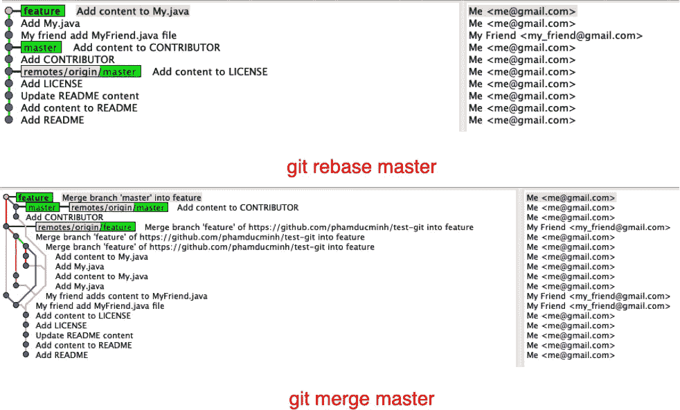

# 如何使用 Git 进行协作而不把事情弄糟

> 原文：<https://levelup.gitconnected.com/how-to-collaborate-using-git-without-messing-things-up-7111f6ae8285>

Git 工作流是我在一起工作时经常使用的


由 [Unsplash 上的](https://unsplash.com?utm_source=medium&utm_medium=referral)制作者 [NESA 拍摄](https://unsplash.com/@nesabymakers?utm_source=medium&utm_medium=referral)

> ***TL；DR*** *:当你和你的合作者在同一个分支工作时，总是使用:* `**git pull --rebase**`和`**git rebase master**`

Git 已经成为数百万公司、项目和开发者中使用最多的版本源代码控制。没什么好说的，Git 的分支管理是**“杀手级特性”**，这无疑让 Git 在 VCS 社区中脱颖而出。

> “分支意味着你偏离了开发的主线，继续工作而不打乱主线。”—第三章。Git 分支，Pro Git，斯科特·沙孔和本·施特劳布

如果您是 git 新手，我建议您阅读下面的链接，然后关注我的主题会更容易:

[](https://git-scm.com/book/en/v2/Getting-Started-What-is-Git%3F) [## Git——Git 是什么？

### 简而言之，Git 是什么？这是需要理解的一个重要部分，因为如果你理解了什么是 Git 和…

git-scm.com](https://git-scm.com/book/en/v2/Getting-Started-What-is-Git%3F) [](https://git-scm.com/book/en/v2/Git-Branching-Basic-Branching-and-Merging) [## Git —基本的分支和合并

### 切换到您的生产分支。创建一个分支来添加修补程序。测试完成后，合并热修复分支，然后…

git-scm.com](https://git-scm.com/book/en/v2/Git-Branching-Basic-Branching-and-Merging) [](https://git-scm.com/book/en/v2/Git-Branching-Rebasing) [## Git —重置基础

### 在 Git 中，将一个分支的变更集成到另一个分支有两种主要方式:合并和 rebase。在这个…

git-scm.com](https://git-scm.com/book/en/v2/Git-Branching-Rebasing) 

今天，我将向您展示 git 工作流，这是我在处理主题/功能分支时经常使用的工作流。无论我是独自工作还是与两个(包括我)或更多的团队成员一起工作。通过使用此工作流程，您将获得以下好处:

*   有一个干净的线性 git 历史
*   重写历史更容易
*   让您的编码审查人员的生活更轻松

所以让我们开始吧！

# 方案

假设我的项目有一个名为 **master** 的主分支，它包含了所有的产品代码。一天，我的团队领导决定我和我的同事一起开发一个新功能。带着所有的渴望，我们中的一个人开始从 master 分支并创建一个新的**功能**分支，将其推到远程，我的同事将检查它。现在我们都在同一个页面上，**“新鲜”**特色分支。没有什么能阻止我们，我们开始工作，在我们自己的本地机器上提交更改。


哇，我太努力了，我需要把我的工作推到远程，让世界认识到“我有多辛苦！”。然后我使用命令`git push origin feature`，并且:


```
$ git push origin feature
To [[](https://github.com/phamducminh/test-git.git)...]
 ! [rejected]        feature -> feature (non-fast-forward)
error: failed to push some refs to [...]
hint: Updates were rejected because the tip of your current branch is behind
hint: its remote counterpart. Integrate the remote changes (e.g.
hint: 'git pull ...') before pushing again.
hint: See the 'Note about fast-forwards' in 'git push --help' for details.
```

啊，有人在我之前推了一下，没关系，让我们通过键入`git pull origin feature`来拉动:


```
Merge branch 'feature' of [[](https://github.com/phamducminh/test-git)...] into feature# Please enter a commit message to explain why this merge is necessary,
# especially if it merges an updated upstream into a topic branch.
#
# Lines starting with '#' will be ignored, and an empty message aborts
# the commit.
```

再说一遍，这是什么，我应该关心。没关系，一切都很好。终于可以把工作推到远程了。

```
$ git push origin feature
To [[](https://github.com/phamducminh/test-git.git)...]
   d440b7a..393dedb  feature -> feature
```

但是当我看着历史，我想知道“它是多么丑陋！”，有些提交像**“添加我的. Java”**或者**“添加内容到我的. Java”**是重复的。


“将…的分支‘特征’合并成特征”太难看了

## 让事情变得更糟

另一边，我的同事还在工作，当他决定将工作推到远程时，他遇到了和我一样的问题，这使他在`git push`之前做了一个`git pull`。以下是特征分支的历史:


多好的历史啊！

## 让事情变得更糟

假设我们需要将主分支的最新代码更新到我们的特征分支上。显然，我们**通过使用`git merge master`命令将**主合并到特征分支中。git 历史看起来像这样:


将主文件合并到特征分支后的历史记录

看着这个历史，对于评审者来说很难，当然，我们自己也很难找出哪些提交属于我们正在工作的特性。

# 解决办法

为了解决我们上面遇到的问题，当我们被拒绝推送至远程时，我们不使用`git pull`，而是使用`git pull --rebase origin feature`。`git pull`和`git pull --rebase`的区别在于:

*   `git pull` = `git fetch` + `git merge`
*   `git pull --rebase` = `git fetch` + `git rebase`

下面是`git rebase`的工作原理:

> 它的工作方式是转到两个分支的共同祖先(您所在的分支和您正在重新基础的分支)，获取您所在的分支的每次提交所引入的差异，将这些差异保存到临时文件中，将当前分支重置为与您正在重新基础的分支相同的提交，最后依次应用每个更改。

让我们开始吧:

```
$ git pull --rebase origin feature
remote: Enumerating objects: 4, done.
remote: Counting objects: 100% (4/4), done.
remote: Compressing objects: 100% (2/2), done.
remote: Total 3 (delta 0), reused 3 (delta 0), pack-reused 0
Unpacking objects: 100% (3/3), done.
From [https://github.com/phamducminh/test-git](https://github.com/phamducminh/test-git)
 * branch            feature    -> FETCH_HEAD
   974b471..141f40e  feature    -> origin/feature
**First, rewinding head to replay your work on top of it...
Applying: Add My.java
Applying: Add content to My.java**
```

首先，它保存我的两个提交**“添加我的. java”**和**“向我的. Java 添加内容”**，将我的当前特性分支重置为与远程分支相同的提交**“我的朋友添加 MyFriend.java 文件”**，然后依次重新应用我的两个提交。

下面是我做`git pull --rebase origin feature`后的结果。历史看起来比仅使用`git pull`时更清晰。


在另一边，我的同事发出同样的命令:


此外，当我需要将主分支的最新代码更新到我们的特性分支时，我可以使用相同的策略。我不用`git merge master`，而是用`git rebase master`。

```
$ git rebase master
First, rewinding head to replay your work on top of it...
Applying: My friend add MyFriend.java file
Applying: Add My.java
Applying: Add content to My.java
```

线性历史看起来像这样:



**注意:不要改变存储库之外的提交的基础。**这意味着如果你的特征分支已经被合并到主分支中(通过`git merge feature`命令)，那么就不要再改变它的基础。

# 结论

当你和你的同事仍然在同一个特性分支上工作时，总是做`git pull --rebase.`

当您需要将特征分支上的工作与主分支上的最新工作同步时，请务必执行`git rebase master`

感谢阅读到目前为止。我希望你能喜欢我的工作流程，并能在你的项目中明智地利用它。

祝你快乐！