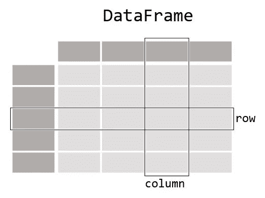
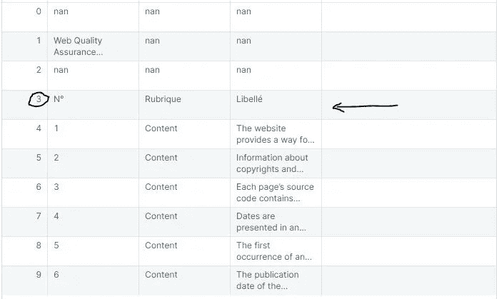

# 如何用熊猫收集数据

> 原文：<https://levelup.gitconnected.com/how-to-collect-data-with-pandas-5fbff0a9cbf4>

## TL；DR:使用 Python 从文件和网站中提取数据

每个数据科学相关项目的第一步——即使你计划在 Google Sheets 中显示一些统计数据——是收集数据。

数据可以是数据库等结构化数据，也可以是社交媒体图片和视频等非结构化数据。一旦收集了这些数据，在企业可以使用这些数据来做出决策之前，需要对其进行**处理**和**转换成信息**。

在本文中，您将学习如何使用一个名为[熊猫](https://pandas.pydata.org/)的流行 Python 库从许多流行的数据源中提取数据。

如果您不了解 Python，您可以阅读我专门为您创建的这篇文章:

[](/the-basics-of-python-for-data-science-7f9662e921d1) [## 数据科学的 Python 基础

### Python 的安装和主要概念

levelup.gitconnected.com](/the-basics-of-python-for-data-science-7f9662e921d1) 

我将首先介绍熊猫图书馆，然后解释如何从多个来源提取数据。

不要犹豫，直接联系您感兴趣的数据源:

*   [如何从 CSV 文件中提取数据](/how-to-collect-data-with-pandas-5fbff0a9cbf4#7ca3)
*   [如何从 Excel 文件中提取数据](/how-to-collect-data-with-pandas-5fbff0a9cbf4#f9c3)
*   [如何从网站提取数据](/how-to-collect-data-with-pandas-5fbff0a9cbf4#7e2b)
*   [(加分)如何从 JSON 文件中提取数据](/how-to-collect-data-with-pandas-5fbff0a9cbf4#3585)
*   [(加分)将数据帧转换成另一种格式](/how-to-collect-data-with-pandas-5fbff0a9cbf4#fc10)


**如何用熊猫 Python 库收集数据**，摄影[徐世阳](https://unsplash.com/@ltmonster?utm_source=medium&utm_medium=referral)

# Pandas，一个操作数据框的库

**pandas** 是一个快速、强大、灵活且易于使用的开源数据分析和操作工具，构建于 [Python](https://www.python.org/) 编程语言之上。

这个库的大部分都集中在一个名为“DataFrame”的对象上，您可以将它与 Excel 电子表格进行比较。

`[**DataFrame**](https://pandas.pydata.org/docs/reference/api/pandas.DataFrame.html#pandas.DataFrame)`是一个二维数据结构，可以在列中存储不同类型的数据(包括字符、整数、浮点值、分类数据等等):



一个数据框架，来自[熊猫文献](https://pandas.pydata.org/docs/getting_started/intro_tutorials/01_table_oriented.html)

你使用 Python 包管理器 [pip](https://pip.pypa.io/en/stable/installation/) 安装它:

```
pip install pandas
```

## 如何创建熊猫数据框

您可以根据列表或 Python 字典创建数据框:

## 你能从数据帧中获得什么信息？

访问关于*数据帧*的主要信息的最简单方法是执行 [**describe()** 函数](https://pandas.pydata.org/docs/reference/api/pandas.DataFrame.describe.html)。您将获得一组关于所考虑数据集的统计信息:

*   条目数(注明“*计数*”)；
*   平均值(标注“*表示*”)；
*   标准差(记录为“*STD*”)；
*   最小值和最大值(注明“*最小值*”、“*最大值*”)；
*   第一、第二和第三四分位数(记为 *25%* 、 *50%* 和*75%*)；

> 不可能计算非数字列或变量的这些属性，例如产品的名称和描述。

使用*列*属性列出可用变量，并使用 [**rename()** 函数](https://pandas.pydata.org/docs/reference/api/pandas.DataFrame.rename.html)重命名这些列:

## 在数据帧中查找信息

您像管理字典一样管理*数据框架*，因此很容易从*数据框架*中获取一列或多列，或者只获取一定数量的行。

看看如何从我为您准备的*数据框架*中选择具体的列(*您将在下一节*中加载):

如果您筛选一些行，比如前 10 行，以获得数据的概览:

特定于数据框的函数允许您通过仅显示几行(前几行)来了解被操作的数据集。

为此，使用 [**头()**功能](https://pandas.pydata.org/docs/reference/api/pandas.DataFrame.head.html)。

> 你认为 [**tail()** 函数](https://pandas.pydata.org/docs/reference/api/pandas.DataFrame.tail.html)有什么作用？

## 使用 query()函数过滤信息

[**query()** 函数](https://pandas.pydata.org/docs/reference/api/pandas.DataFrame.query.html)允许您根据适用于不同列(或变量)的条件过滤*数据框架*中的信息。

例如，要检索“供应品”类别的所有订单:

```
orders_furniture = super_store.query('Category == "Furniture"')
```

或者，金额在 10 美元到 50 美元之间的所有订单:

```
sales = super_store.query('Sales > 10 and Sales < 50')
```

如果你懂 SQL，这个函数使用类似的语言。

如果您不知道，SQL 并不难，您可以从我主要为您写的文章开始:

[](/how-to-learn-sql-10-minutes-a-day-bbe023c01470) [## 如何学习 SQL，每天 10 分钟

### 这是我作为首席技术/数据保持最新状态的方法。

levelup.gitconnected.com](/how-to-learn-sql-10-minutes-a-day-bbe023c01470) 

# 如何从 CSV 文件中提取数据

您可能想知道如何自己访问超级商店数据。

现在，您将学习如何从 CSV 文件加载数据😉

大多数公司将其数据存储在文件或数据库中，您可以从中获得导出。

您可以从任何数据中获取 CSV 文件(用于“逗号分隔值”)。像 Excel 这样的著名软件以及大多数软件都提供了以这种格式导出的选项。—所有数据库。

pandas 的库有 [read_csv()函数](https://pandas.pydata.org/pandas-docs/stable/reference/api/pandas.read_csv.html)来从这个文件类型创建一个*数据帧*。

## 分离器的选择

CSV 文件用逗号分隔变量，但有时您会发现文件使用了不同的分隔符。在这种情况下，使用 **read_csv()** 函数的 **sep** 参数定义“分隔符”。

查看“people.csv”文件的内容:

```
lastname;firstname;age
andrieu;mickaël;36
doe;john;27
karembeu;adriana;44
```

以及装载的结果，不使用和使用 **sep** 调节器:

## 编码选择

有时你会在两个不同的环境之间得到一个文件(例如，Windows 和 Mac OSX)，你会遇到特殊字符的问题。

在这种情况下，如果您知道源文件的编码，那么您可以使用**编码**参数在 **read_csv()** 函数中指定它:

> 由于正确的编码，像表情符号这样的特殊字符将被正确呈现。

## 优化数据帧加载的性能

如果要处理的文件非常大，包含数百万行，那么定义您想要在您的*数据框架*中加载多少行可能会很有趣。

定义参数 **nrows** 和**skipows**就足以确定要检索多少行以及从哪一行开始装载。

您定义文件行，其中标题(列名)使用了**标题**参数。*一个技巧*是使用 [**range()** 函数](https://docs.python.org/3/tutorial/controlflow.html#the-range-function)来消除除第一行之外的所有行:

# 如何从 Excel 文件中提取数据

**Excel 文件(扩展名为。xls 或者。xlsx)是公司里最受欢迎的。**

熊猫图书馆完全有能力阅读这些文件。这一次您将使用另一个在互联网上可用的 Excel 文件，它是一个开源版本:版本 4 中的 Opquast 存储库。

> 您可以下载它并运行下一篇文章中建议的命令。

就像有 **read_csv()** 函数读取 csv 文件一样，这次你用 [**read_excel()** 函数](https://pandas.pydata.org/docs/reference/api/pandas.read_excel.html?highlight=read_excel)加载 excel 文件。

该功能读取两个*。xlsx* 和*。xls* 文件，但是对于。xls 文件(Excel 2007/2010 版本的 Excel 文件)，必须下载 [xlrd](https://github.com/python-excel/xlrd) 扩展名:

要解决此问题，请安装缺少的模块:

```
pip install xlrd
```

## 选择要装载的纸张

与 CSV 文件相反，Excel 文件将包含几个您可以选择转换成*数据框*的工作表。

为此，您将定义 **sheetname** 参数，它可以是一个数值(第一张、第二张或“第 n 张”工作表？)、字符串(工作表的名称)或列表(包含数字或名称):

## 文件标题的识别和选择

有时数据不是预期的格式，选择或创建文档标题是必要的。此后检查，标题在第 4 行可用，我们必须忽略所选工作表的前三行:



> 这部分可能会让你困惑，但是我保证**范围(0，4)** 会从 0 到 3 循环**，而不是 4 *😶。***

## 文档处理引擎

熊猫库的 **read_excel()** 函数读取了很多“电子表格”类型的文件而不仅仅是 excel 文件……对了，是哪些呢？

事实上，Excel 文件会根据所用软件的版本而发展，并且可以指定使用哪个“引擎”来创建您的*数据框架*。

您将配置 **read_excel()** 的引擎属性:

*   **xlrd** 用于旧的 Excel 文件(**)。xls**)；
*   **openpyxl** 用于较新的 Excel 文件(**)。xlsx**)；
*   **odf** 用于从 *Libre Office* 或 *Open Office* ( **)获得的文件。ODT**)；

> 由于 pandas 试图检测要使用的最佳引擎，因此指定该属性是可选的。

# 如何从网站中提取数据

有时候，你只能访问网站上的 HTML 表格。

熊猫图书馆有针对这种情况的 [**read_html()** 功能](https://pandas.pydata.org/docs/reference/api/pandas.read_html.html)，在那里你将不得不**从互联网上搜集信息**用于分析目的。

> 作为一个实际例子，我将向您展示如何从维基百科网站检索与世界人口统计相关的信息。

由于一个网站页面可以包含多个表格，该函数返回**一个 *DataFrames*** 列表:

然后你必须从列表中选择你感兴趣的*数据帧*。下面是第一个(所以它在位置 0):

## 选择正确的信息

您可以设置 **match** 参数来查找 HTML 表中存在的表达式，并将其转换为 *DataFrame* 。

例如，如果你查看法国的[维基百科页面，你会注意到它有很多表格。](https://fr.wikipedia.org/wiki/France)

**这些信息是否改善了 read_html()函数的返回？**

> 我不想谈论 HTML 尤其是 CSS 的基础知识。但是如果你想通过熊猫图书馆在网上搜集信息，你可能需要它们。**传递一个 CSS 选择器会显著提高滤镜的质量。**

如果你对网络抓取感兴趣，你最好用 HTML、CSS 和 Python BeautifulSoup 库来完成你的学习:

[](https://towardsdatascience.com/data-science-skills-web-scraping-using-python-d1a85ef607ed) [## 数据科学技能:使用 Python 进行网络搜集

### 作为一名数据科学家，我在工作中接受的第一批任务之一就是网络搜集。这完全是…

towardsdatascience.com](https://towardsdatascience.com/data-science-skills-web-scraping-using-python-d1a85ef607ed) 

# (加分)如何从 JSON 文件中提取数据

有时数据不能作为文件直接访问，而是以 JSON 格式作为 REST API“公开”。

JSON(for "**J**ava**S**script**O**object**N**rotation ")格式很流行，许多公司都使用这种格式共享数据:

*   如果你想检索[一列推文](https://developer.twitter.com/en/docs/api-reference-index)，Twitter 提供了 JSON 格式的 API
*   如果您打算[检索加密资产的每日估价](https://coinmarketcap.com/api/documentation/v1/)，CoinMarketCap 提供了一个 JSON 格式的 API
*   如果你想得到法国所有城市的列表，政府提供了 JSON 格式的 API

然后使用 **read_json()** 函数将该数据加载到 *DataFrame* 中:

## 网络链接的使用

像前面所有的函数一样，您可以将 URIs 作为这些函数的加载参数进行传递。

此外，如果下面的链接仍然有效，则执行下面的代码等同于前面的语句:

# (奖励)将数据帧转换成另一种格式

pandas 库的一个便利特性是从许多来源导入数据，但是这个库也可以将一个*数据帧*导出为一个文件。

> 您会发现这对于将(以前)获得的 JSON 文件转换成 Excel 文件特别有帮助！

使用适合您需求的功能:

*   [**to_excel()** 函数](https://pandas.pydata.org/docs/reference/api/pandas.DataFrame.to_excel.html)获取一个. xls 文件；
*   [**to_csv()** 函数](https://pandas.pydata.org/docs/reference/api/pandas.DataFrame.to_csv.html)获取一个. csv 文件；
*   而 [**为什么不在另一个上下文中调用 _json()** 函数](https://pandas.pydata.org/docs/reference/api/pandas.DataFrame.to_json.html)；

要执行 **to_excel()** 函数，您必须安装一些额外的 Python 模块:

```
pip install openpyxl xlwt 
```

而这第二篇就结束了。感谢您的阅读！

如果您需要提高您的 Python 知识，请关注我的 3 个月免费计划:

[](/master-python-10-minutes-a-day-5aeab489e227) [## 如何学习 Python，每天 10 分钟

### 这就是我作为数据/人工智能顾问如何跟上时代的方法

levelup.gitconnected.com](/master-python-10-minutes-a-day-5aeab489e227) [](https://mickael-andrieu.medium.com/membership) [## 通过我的推荐链接加入 Medium-mickal Andrieu

### 作为一个媒体会员，你的会员费的一部分会给你阅读的作家，你可以完全接触到每一个故事…

mickael-andrieu.medium.com](https://mickael-andrieu.medium.com/membership) 

如果您有任何问题，请随时发表评论，如果您喜欢这篇文章，[关注我](https://mickael-andrieu.medium.com/)，当我下一次发布时，您会收到通知。