# 如何在 Flutter 中对 SVG 进行颜色切换？

> 原文：<https://levelup.gitconnected.com/how-to-color-switch-an-svg-in-flutter-5b88e51bfabb>

*一个演示如何在 Flutter 中切换 SVG 文件颜色的教程。*


SVG 颜色切换的描述。

# 问题是

作为一个 flutter 开发者，你有没有想过把一个 SVG 文件涂上颜色？哇哦。等等，我说什么了？我想我的舌头滑了出来，或者我在面包上放了太多的黄油。哎，别想多了；你可能会让🧊brain 冻结！

✨Don't 担心；我们将在本教程中专门为您介绍一个详细的解决方案。

# 解决方案

在本教程中，我们将设计一款能够:

1.  从资源中加载 SVG 文件。
2.  允许用户使用预定义的调色板来切换颜色。
3.  使用十六进制颜色选择器对话框输入自定义颜色。
4.  下载生成的 SVG 文件。

这里是[链接](https://svg-colorization.web.app/)到 SVG 着色应用。

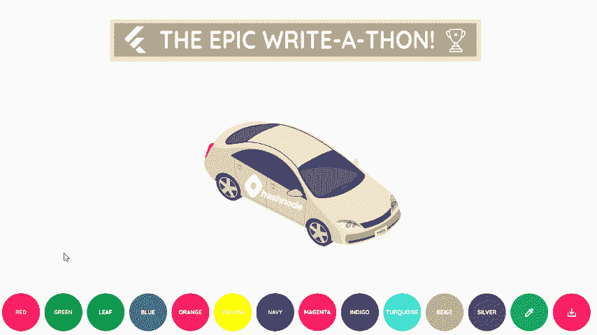

SVG 着色应用程序的演示。

感谢 [Hashnode](http://hashnode.com) 社区，我们目前处于[fill属性描述了颜色的十六进制代码；请参见下面的片段。](https://townhall.hashnode.com/the-epic-hashnode-writeathon#f7ebcb)。在 SVG 中，<code class=)

```
<path d="M525.9,341.22s-1.2-8.4,0-10.6,3.3-5.4,6-3,5.7,9.3,3,15.7S525.9,341.22,525.9,341.22Z" fill="#f7ebcb" />
```

[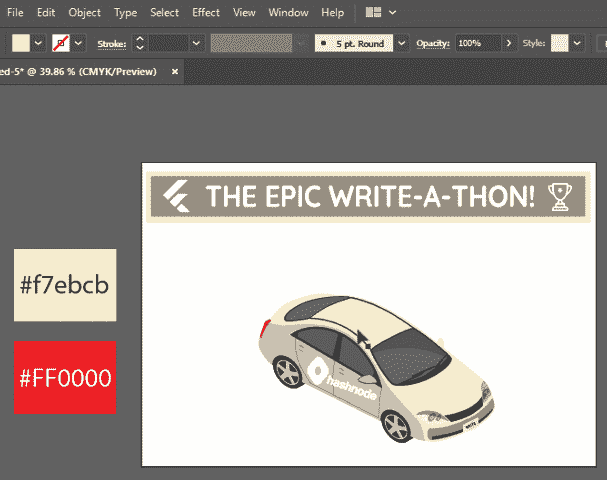](https://townhall.hashnode.com/the-epic-hashnode-writeathon#f7ebcb)。在 SVG 中，<code class=)

[Adobe Illustrator 中手动 SVG 颜色切换的图示。](https://townhall.hashnode.com/the-epic-hashnode-writeathon#f7ebcb)。在 SVG 中，<code class=)

[现在关闭文件，把它放到⁴的 Adobe Illustrator 中，选择你想要改变的颜色。](https://townhall.hashnode.com/the-epic-hashnode-writeathon#f7ebcb)。在 SVG 中，<code class=)

```
<path d="M525.9,341.22s-1.2-8.4,0-10.6,3.3-5.4,6-3,5.7,9.3,3,15.7S525.9,341.22,525.9,341.22Z" fill="#FF0000" />
```

# [项目结构](https://townhall.hashnode.com/the-epic-hashnode-writeathon#f7ebcb)。在 SVG 中，<code class=)

[够理论；让我向你介绍这个应用程序的项目结构。](https://townhall.hashnode.com/the-epic-hashnode-writeathon#f7ebcb)。在 SVG 中，<code class=)

[SVG 彩色化应用程序项目结构。](https://townhall.hashnode.com/the-epic-hashnode-writeathon#f7ebcb)。在 SVG 中，<code class=)

# [必需的 Pubspec 包](https://townhall.hashnode.com/the-epic-hashnode-writeathon#f7ebcb)。在 SVG 中，<code class=)

[您需要在`pubspec.yaml`文件中定义所需的包和资产文件路径。](https://townhall.hashnode.com/the-epic-hashnode-writeathon#f7ebcb)。在 SVG 中，<code class=)

[SVG 着色应用程序 Pubspec Yaml 文件。](https://townhall.hashnode.com/the-epic-hashnode-writeathon#f7ebcb)。在 SVG 中，<code class=)

# [概念编码](https://townhall.hashnode.com/the-epic-hashnode-writeathon#f7ebcb)。在 SVG 中，<code class=)

[这个概念相对简单；您需要:](https://townhall.hashnode.com/the-epic-hashnode-writeathon#f7ebcb)。在 SVG 中，<code class=)

[**步骤一。**提取 SVG 文件数据作为`String`变量`svgCode`；见下图。](https://townhall.hashnode.com/the-epic-hashnode-writeathon#f7ebcb)。在 SVG 中，<code class=)

[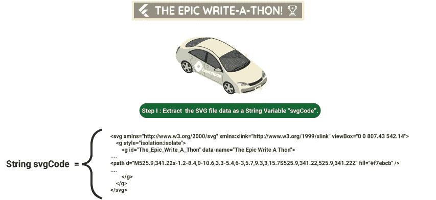](https://townhall.hashnode.com/the-epic-hashnode-writeathon#f7ebcb)。在 SVG 中，<code class=)

[说明 SVG 文件数据提取到字符串 svgCode。](https://townhall.hashnode.com/the-epic-hashnode-writeathon#f7ebcb)。在 SVG 中，<code class=)

[**第二步。**将`previousColor` &中之前的十六进制色码分配给`newColor`中当前选中的十六进制色码；请参见下图。](https://townhall.hashnode.com/the-epic-hashnode-writeathon#f7ebcb)。在 SVG 中，<code class=)

[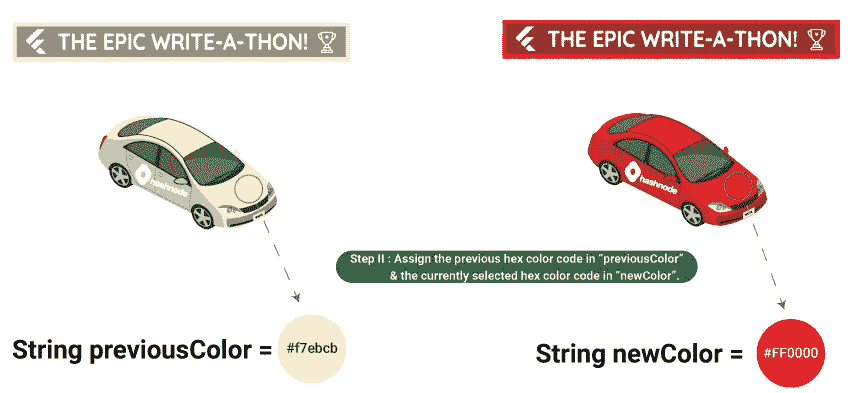](https://townhall.hashnode.com/the-epic-hashnode-writeathon#f7ebcb)。在 SVG 中，<code class=)

[为变量 previousColor & newColor 分配十六进制颜色代码的图示。](https://townhall.hashnode.com/the-epic-hashnode-writeathon#f7ebcb)。在 SVG 中，<code class=)

[**步骤三。**在`svgCode`上应用`String.replaceAll`方法替换颜色，参见下图。](https://townhall.hashnode.com/the-epic-hashnode-writeathon#f7ebcb)。在 SVG 中，<code class=)

[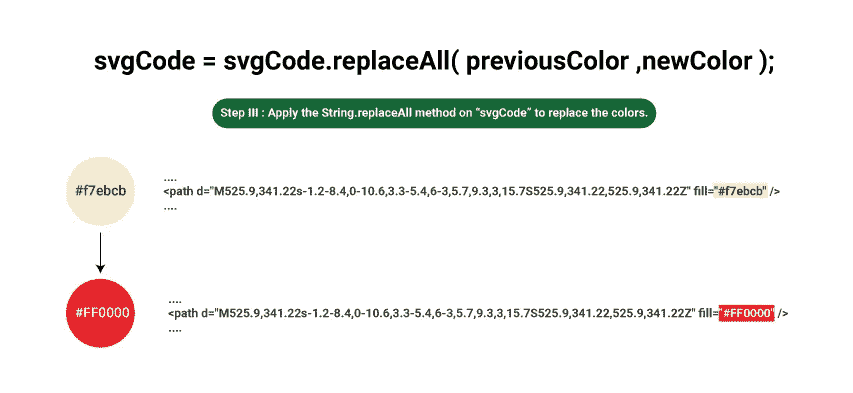](https://townhall.hashnode.com/the-epic-hashnode-writeathon#f7ebcb)。在 SVG 中，<code class=)

[十六进制颜色代码替换图。](https://townhall.hashnode.com/the-epic-hashnode-writeathon#f7ebcb)。在 SVG 中，<code class=)

[**第四步。**更新`previousColor`的值，如下图所示。](https://townhall.hashnode.com/the-epic-hashnode-writeathon#f7ebcb)。在 SVG 中，<code class=)

[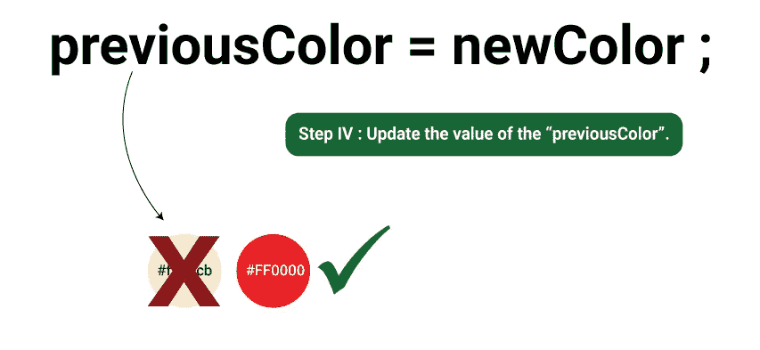](https://townhall.hashnode.com/the-epic-hashnode-writeathon#f7ebcb)。在 SVG 中，<code class=)

[先前颜色值更新的图示。](https://townhall.hashnode.com/the-epic-hashnode-writeathon#f7ebcb)。在 SVG 中，<code class=)

[就 dart 代码而言，使用`main`方法从资产文件中提取所有文本，并使用`MultiProvider`小部件传递这些值。](https://townhall.hashnode.com/the-epic-hashnode-writeathon#f7ebcb)。在 SVG 中，<code class=)

[SVG 着色主文件。](https://townhall.hashnode.com/the-epic-hashnode-writeathon#f7ebcb)。在 SVG 中，<code class=)

[由于 SVG 代码&以前的颜色值在每次用户选择一种颜色时都会更新，所以需要两个`ChangeNotifier`类，如下面的代码片段所示。](https://townhall.hashnode.com/the-epic-hashnode-writeathon#f7ebcb)。在 SVG 中，<code class=)

[SVGData ChangeNotifier 类。](https://townhall.hashnode.com/the-epic-hashnode-writeathon#f7ebcb)。在 SVG 中，<code class=)

[`updateCode`方法搜索`previousColor`，用`newColor`值替换它，并更新 SVG 代码。](https://townhall.hashnode.com/the-epic-hashnode-writeathon#f7ebcb)。在 SVG 中，<code class=)

[以前的 Color ChangeNotifier 类。](https://townhall.hashnode.com/the-epic-hashnode-writeathon#f7ebcb)。在 SVG 中，<code class=)

[`updateValue`方法分配当前的`newValue`来更新先前的颜色。](https://townhall.hashnode.com/the-epic-hashnode-writeathon#f7ebcb)。在 SVG 中，<code class=)

# [小部件分解过程](https://townhall.hashnode.com/the-epic-hashnode-writeathon#f7ebcb)。在 SVG 中，<code class=)

[朱利叶斯·caesar⁵曾经说过，](https://townhall.hashnode.com/the-epic-hashnode-writeathon#f7ebcb)。在 SVG 中，<code class=)

> [分而治之](https://townhall.hashnode.com/the-epic-hashnode-writeathon#f7ebcb)。在 SVG 中，<code class=)

[当你开发一个应用程序时，这个原则非常适合。与其创建庞大的窗口小部件树，不如重构代码，使其看起来更整洁。下图说明了最小的应用程序小部件细分。](https://townhall.hashnode.com/the-epic-hashnode-writeathon#f7ebcb)。在 SVG 中，<code class=)

[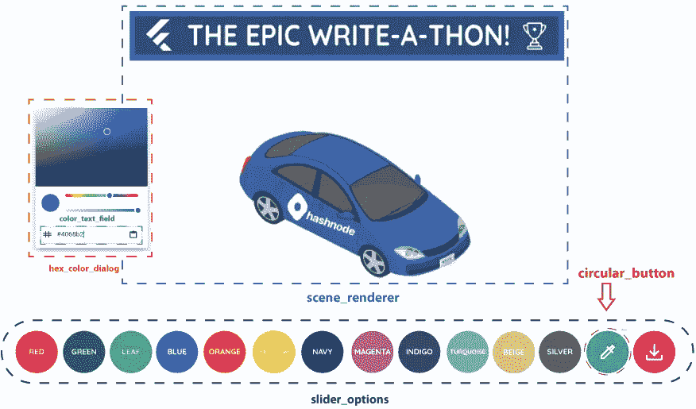](https://townhall.hashnode.com/the-epic-hashnode-writeathon#f7ebcb)。在 SVG 中，<code class=)

[最小应用程序小部件分解图。](https://townhall.hashnode.com/the-epic-hashnode-writeathon#f7ebcb)。在 SVG 中，<code class=)

## [场景渲染器微件](https://townhall.hashnode.com/the-epic-hashnode-writeathon#f7ebcb)。在 SVG 中，<code class=)

[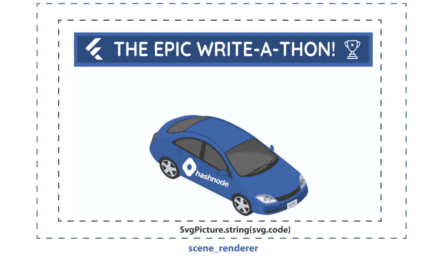](https://townhall.hashnode.com/the-epic-hashnode-writeathon#f7ebcb)。在 SVG 中，<code class=)

[场景渲染小部件分解图。](https://townhall.hashnode.com/the-epic-hashnode-writeathon#f7ebcb)。在 SVG 中，<code class=)

[`SvgPicture`是从](https://townhall.hashnode.com/the-epic-hashnode-writeathon#f7ebcb)。在 SVG 中，<code class=)`[flutter_svg](https://pub.dev/packages/flutter_svg)`包 **⁶** 导入的 widget。使用`string`构造函数分配更新后的`SVGData.code`值。一旦值得到更新，`context.watch`将自动监听变化并重建小部件树。

SceneRenderer 小工具。

## 圆形按钮小部件

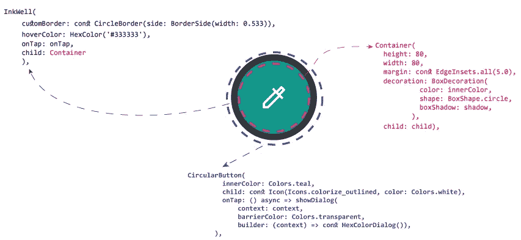

CircularButton 小部件分解图。

要创建圆形的圆形按钮，将`Container`包装在一个`InkWell`小部件中，如下面的代码片段所示。

CircularButton 构件。

## 滑块选项小部件

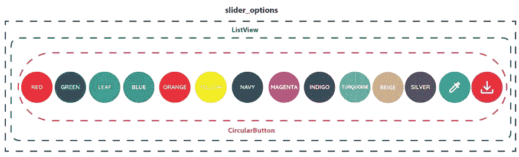

SliderOptions 小部件分解图。

这是一个`Stateless`部件，由以下部件组合而成:

**映射的十六进制彩色键值对:**

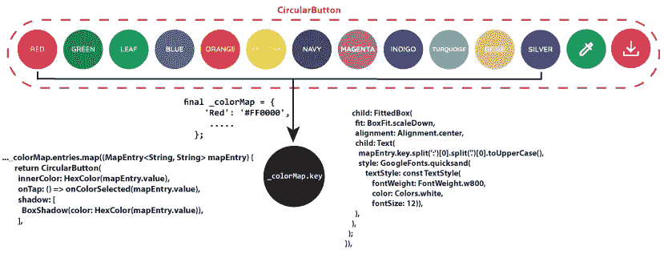

映射颜色条目的图示。

定义一个地图`colorMap`，颜色名称为其`key`，十六进制颜色为`value`。接下来，您将创建一个回调函数`onColorSelected`来在用户点击地图`value`时返回它。

SliderOptions 小部件。

**六色对话框小工具**

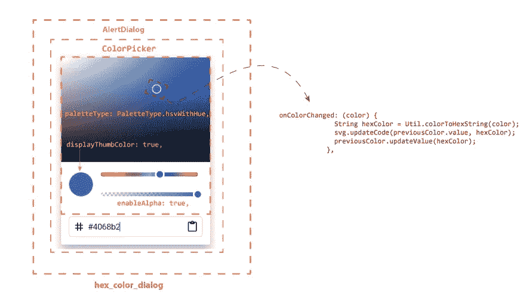

HexColorDialog 小部件分解图。

使用包装在`AlertDialog`小部件中的`ColorPicker`创建`HexColorDialog`。为了更新渲染的 SVG，分别调用`onColorChanged`回调体下的`SVData.updateCode` & `PreviousColor.updateValue`方法。

HexColor 对话框小部件。

**ColorTextField 小工具**

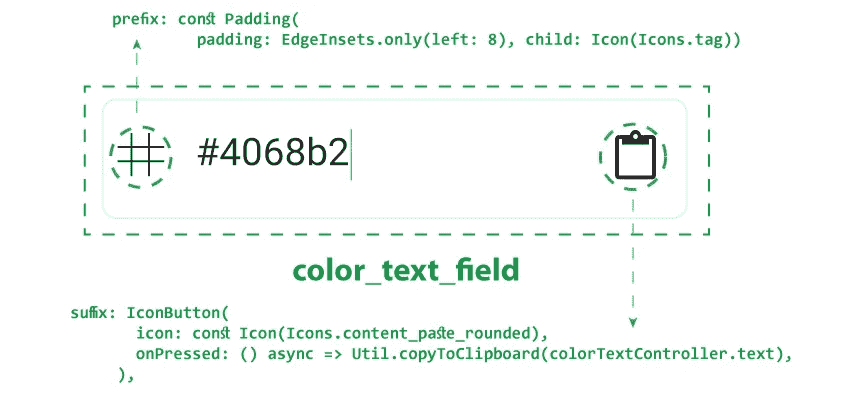

ColorTextField 小部件分解图。

这是一个自定义的`CupertinoTextField`小部件，它使用`TextEditingController`获取选定的颜色值，并在用户点击粘贴图标后将颜色值复制到`ClipBoard`，请参考下面的代码片段。

ColorTextField 小工具。

# Util 类

最佳实践是将业务逻辑从 UI 代码中分离出来。在`lib`文件夹下，创建一个`Util`类来处理基本的实用函数，如下面的代码片段所示。

Util 类。

# 最后一步

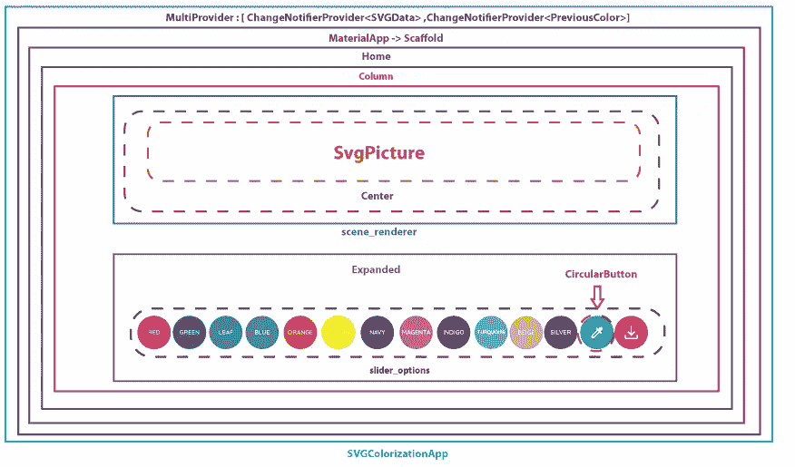

主页部件分解图。

最后，将所有定制小部件包装在`Home`小部件中的`Column`下，如下所示。

主页小部件。

运行代码&🎉瞧，你完成了！

# 你的贡献很重要🤝🏻

你认为你能做得更好吗？去吧，玩玩代码。源代码回购在[github](https://github.com/Zujaj/svg_colorization)t29】⁷上公开。

# 承认

我希望你喜欢这个教程；谢谢你读到这里。特别感谢 [Syed Fazle Rahman](https://hashnode.com/@fazlerocks) 为我提供了与观众分享知识的机会&。

请在这里**随意分享您的想法和反馈。**

# **参考**

****【1】:SVG 上色 App** [https://svg-colorization.web.app/](https://svg-colorization.web.app/)**

****【2】:史诗般的哈希诺德·写森** [https://townhall.hashnode.com/the-epic-hashnode-writeathon](https://townhall.hashnode.com/the-epic-hashnode-writeathon)**

****【3】:Visual Studio 代码** [https://code.visualstudio.com/download](https://code.visualstudio.com/download)**

****【4】:Adobe Illustrator** [https://www . Adobe . com/sea/products/Illustrator/free-trial-download . html](https://www.adobe.com/sea/products/illustrator/free-trial-download.html)**

****【5】:分而治之引用** [https://fearless culture . design/blog-posts/diving-people-is-the-best-way-to-lead](https://fearlessculture.design/blog-posts/dividing-people-is-the-best-way-to-lead)**

****【6】:颤振 _SVG 包** [https://pub.dev/packages/flutter_svg](https://pub.dev/packages/flutter_svg)**

****【7】:SVG 着色| Zujaj 的 GitHub**
[https://github.com/Zujaj/svg_colorization](https://github.com/Zujaj/svg_colorization)**