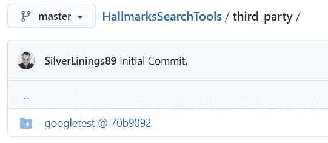
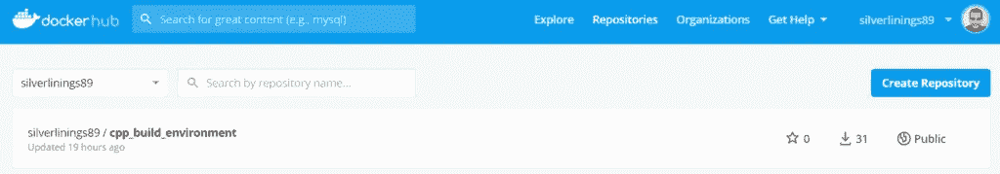
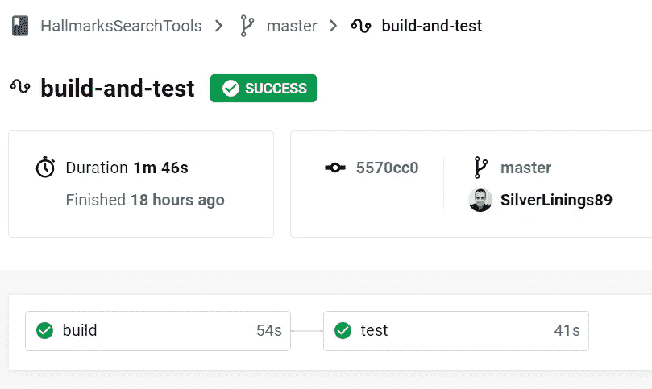
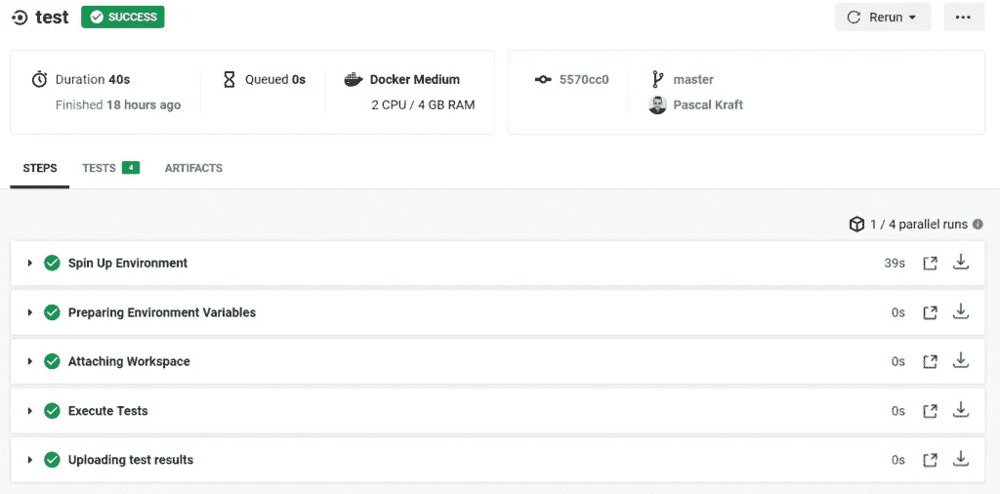

# 如何结合 C++，Cmake，Googletest，CircleCi，Docker，为什么

> 原文：<https://levelup.gitconnected.com/how-to-combine-c-cmake-googletest-circleci-docker-and-why-e02d76c060a3>

我们将运行这些工具的完整设置，我将向您展示为什么它们值得花时间；)我将提供配置文件，并对我们为什么进行这些配置提供一些见解。


# 介绍

有许多文章解释了标题中提到的一些工具的组合。我最近浏览了我的旧项目的源代码，发现了一个我已经很久没看的 C++项目。它是以经典的裸 C++项目方式建立的:

*   很久以前的自述
*   一些。h 和。cpp 文件
*   一个 CmakeLists 文件，它只有使 Boost 集成工作所需的代码，并且污染了主文件夹
*   到处散落着古老的建筑文物

在最近一篇关于 Medium.com 的帖子中，我谈到了将你参与过的每个项目都存入 Github 账户作为备份的想法，所以我考虑先这么做。但后来我感到有点惭愧，因为我意识到这个项目是多么糟糕。尽管这个项目在 Github 上应该是私有的，但我想保留一个正常状态的版本历史，所以我必须先清理它。这个项目有许多明显的问题，我开始一个接一个地解决它们，把这个项目转变成一个可以接受的状态。

如果您在运行本文中列出的命令行指令时遇到任何问题，请尝试通过调用

```
apt-get update
apt-get install git cmake build-essential tar curl g++ gcc-9 clang-10
```

我在我的系统上运行 Ubuntu 20.04。例如，如果您没有 gcc-9，请使用旧版本，或者直接使用默认提供的版本(用 *gcc* 替换 *gcc-9* )。如果你使用低于 9 的编译器版本，记住 Cxx20 对你来说是不可用的，你应该用 C++14 或 C++17 替换 C++20，在你的 *CMakeLists.txt* 中。

# CMake

大多数 C++项目从一个好的 CmakeLists 文件开始。由于 C++是一种独立于平台的语言，每个平台都必须提供构建工具(又名。编译器、连接器等。).如果这种语言要有未来，就必须想办法简化这个过程，这就是 *make* 的用武之地。make 是一个构建自动化工具，主要是调用命令并为它们设置参数。有些人仍然为 *make* (又名。makefile)本身，但是大多数开发人员已经转移到了 *cmake* 上，这反过来自动配置 makefile。CMake 最好的特性是，它可以检测系统上的库和编译器，并自动为您配置它们。

例如，在我的项目中，我想加入 Boost 库，它是最大的 C++库之一。Cmake 提供了检测它是否被安装以及自动告诉编译器它在哪里的可能性。另一个很好的特性是，Cmake 只使用一个配置文件(或者层叠文件，如果您想单独配置子项目的话)。因为它非常紧凑，而且是 C++世界的绝对标准，所以 IDE 集成也很棒。

作为第一步，我清理了项目中的文件夹结构，创建了以下文件夹:

*   src:这个文件夹将包含。h 和。包含项目功能的 cpp 文件。这里可以引入更多的结构，但我不想在这里过多介绍。许多项目只包含 10 个或更少的文件，一个文件夹就足够了。如果你选择进一步细分这个，下面的步骤会完全一样。
*   main:在这个文件夹中，我放置了独立执行项目的入口点。基于这个文件，主二进制文件将被构建。
*   测试:这个文件夹将包含带有单元测试的 c++文件。添加 *gtest* 将在稍后进行，但我马上创建了这个文件夹。
*   third_party:此文件夹将包含外部依赖项。在我的情况下，这只会是谷歌测试。如果 Boost 更小，它也可以放在这里，但由于它非常大，不应该作为我的项目的一部分来构建，我决定将它安装在操作系统级别。

现在我们有了这 4 个文件夹，我们可以开始填充它们了。 *Main* 应该包含 main.cpp 和主二进制代码。src 应该包含一些头(。h)和源文件(。cpp)包含实际的功能。测试现在可以保持为空，稍后我们将填充第三方。目前，我们不需要 googletest，也不使用 Boost，所以我们可以开始用 cmake 配置构建。我建议的 CMakeLists.txt 如下所示:

```
cmake_minimum_required(VERSION 3.0)
project(MyProject)
set(CMAKE_EXPORT_COMPILE_COMMANDS ON)
set(CMAKE_CXX_STANDARD 20)
set(CMAKE_CXX_FLAGS "${CMAKE_CXX_FLAGS} -fopenmp -o3")
add_library(Core src/file1.cpp src/file2.cpp)
add_executable(Main main/main.cpp)
target_link_libraries(Main Core)
```

第一行和第二行是 cmake 基础。我推荐你使用 cmake 3，因为它适用于每一个平台，项目只需简单地命名你的项目。接下来，我们执行 set(变量值)5 次来指定关于构建的细节。第一个是最具体的一个:CMAKE_EXPORT_COMPILE_COMMANDS 使 CMAKE 生成一个名为 compile_commands.json 的文件，只有在您将 Clang 用作编译器或 IDE 中的实用程序时才需要这一行。就个人而言，我使用 clang 是为了在 VSCode 中更好地进行代码自省，如果你没有理由不这样做，我建议你也这样做。有时有点慢，但我认为值得等待。

CMAKE_CXX_STANDARD 在下一行设置为 20，指定我要用 2020 版本的 C++。我的代码使用了 C++20 中的 *std::set* ，它接收了一个有用的 *contains()* 方法，我只想尽可能使用最新版本。这并不是真正需要的，但是如果你的系统上有 *gcc-9* 或 *clang-10* (运行 gcc-version 找出答案)为什么不使用最好的 C++呢？

接下来，我为编译器添加了两个 C++标志，分别是- *fopenmp* 和- *o3* 。第一个使 OpenMP 可用，另一个使编译器在代码上运行一些基本的优化。在这里介绍 OpenMP 是不可能的，因为要说的内容太多了，但是，我可以帮助您决定是否值得研究:如果您曾经有过一个长时间运行的循环，执行某项任务，即使循环的各个运行是独立的，您也要让它并行运行，因为您的计算机有不止一个内核，那么您应该研究 OpenMP。您可以简单地在 for 循环前添加 *#pragma omp parallel for* ，它将使您的系统支持的尽可能多的进程并行运行。这两个命令只会影响代码的性能，如果不需要的话可以删除。

最后三行是 CMake 做一些实际工作的代码:*Add _ library(Libname lib files…)*声明一个库。库是一个可以在包含特定功能的其他代码中使用的模块。我们编译 src 目录中的所有文件，所以我们所有的功能都放在一个名为 Core 的库中。在库的名称之后，您只需写下您的。cpp 文件和任何单一的。h 文件。我的模式总是包含来自源文件的头文件。所以 *a.cpp* 里面有一个 include*a . h*。另外，我通常有包含类型声明和常量值的文件 *constants.h* 和 *types.h* 。既然这些都没有对应的。cpp 文件，我也在这里添加它们。

库本身只声明了一些功能，但并不执行它，所以我们需要一个可执行文件。为此，我们有 main.cpp，它包含一个静态的 void main()方法，声明应用程序的入口点。为了让 cmake 从中构建一个可执行文件，我们用*add _ executable(binary name main/main . CPP)*声明它。这表明应该编译包含 main.cpp 代码的二进制文件。

二进制文件很可能无法独立工作。它会有一些 *#include”../src/someHeader.h"* 引用 src 目录中的代码，因此我们必须为其提供该功能，该功能现在包含在核心库中。为此，我们在最后一个命令中将它们链接在一起，这意味着所谓的链接器将告诉可执行文件在哪里可以找到它从外部源文件中包含的功能。这个功能包含在核心库中，所以我们把它传递给链接器。

作为关于这个主题的最后一点评论，我推荐“源外”构建。这意味着您将所有 Makefiles、二进制文件和库放在一个单独的文件夹中。这可以通过在不同于包含您的 *CMakeLists.txt* 的文件夹中运行 cmake 来实现。如前所述，cmake 只编写 Makefiles，所以在运行 Cmake 之后，我们仍然需要调用 make 来执行我们已经配置的实际操作。将命令提示符导航到项目的根文件夹，只需调用

```
mkdir build
cd build
cmake ..
make
```

首先，我们通过调用 *mkdir* 创建一个构建目录。然后我们进入并运行 *cmake* 。 *cmake* 后面的两个点表示“在父目录中运行 cmake”make 将开始编译所有内容。在这些命令之后，您将在您的构建文件夹中找到一些 CMake-junk 和所有其他的构建文件。git)忽略。

现在，我们已经配置了一个构建，如果您只更改了源文件的一些内容，您只需调用 make 来重新编译它们。这些生成的 Makefiles 的一个很好的特性是，它们包含了关于可以并行执行的步骤的所有信息。因此，您可以调用 make -j4 来并行执行 4 个进程，这会大大加快进程。您也可以使用更多或更少的进程，这取决于您的计算机可以处理的内容。但是，不要使用超过可用内核数量的内核。

# 饭桶

我们已经对项目进行了一点清理，或者，如果您从一个干净的工作区开始，我们现在有了一个基本的结构，可以开始版本控制。在我们项目的根目录中，我们调用 git init。为了确保我们不会提交二进制文件或其他文件，它们不应该是存储库的一部分，我们创建了这个文件。gitignore，它告诉 git 要忽略哪些文件。我建议从这个文件开始:

```
*.com
*.class
*.dll
*.exe
*.a
*.o
*.so
*.7z
*.dmg
*.gz
*.iso
*.jar
*.rar
*.tar
*.zip
*.cbp
*.log
*.sql
*.sqlite
 .DS_Store
.DS_Store?
._*
.Spotlight-V100
.Trashes
ehthumbs.db
Thumbs.db 
*.vtk
*.eps
*.gpl
*.1
*.cmake
Makefile
CMakeFiles/
CMakeCache.txt
.cproject
.settings/
.idea/
build/
.vscode/
*.pc
.clangd/
```

这有点长，但是它包含了很多你不想在你的 VCS 中出现的类型，比如二进制输出。exe，。一个，还有。o)以及 IDE 配置。现在，我们可以创建一个 GitHub repo。它将为您提供一个克隆 URL，您可以使用它来设置您的本地存储库。

```
git init
git add --all
git commit -m "Initiali commit."
git remote add origin YourURLHere
git push -u origin master
```

这会将所有文件添加到初始版本中，这些文件在。gitignore 文件。在 push-command 之后，您还应该在 GitHub 界面中看到在线文件。接下来，我们将开始测试我们的代码！

# Gtest

googletest 框架是我测试 C++代码时的 goto 框架。同样，完整的介绍会超出一篇文章的范围，但是让我们创建文件 unit_tests/SomeTest.cpp 并添加一个简单的测试用例:

```
#include "gtest/gtest.h"
#include "../src/someHeader.h"TEST(SomeTestSuite, SomeTest) {
  MyType obj = new MyType();
  obj->set_the_value(5);
  ASSERT_EQ(obj->get_the_value(), 5);
}
```

在第一行中，我们引用了 Googletest，这样我们就可以使用它的功能。接下来，我们加载我们想要测试的代码的一些部分。测试宏声明一个测试用例。每一个测试用例都属于一个套件(SomeTestSuite)，都有自己的名字(SomeTest)。这些值没有在其他地方定义，您只需将它们传递给测试宏，它就会使用它们。这创建了一个测试用例，所以现在，我们只需要实现那个测试实际上是什么，我们在接下来的 3 行中做。我们从库中的某个部分创建了一个对象。我们对它执行一些操作，然后使用另一个 Googletest 宏:ASSERT_EQ(即“assert equals”)宏意味着，如果第一个和第二个参数具有相同的值，测试将会成功。你可以在这里找到完整的断言列表。

如上所述，我们希望将整个 googletest 项目放入第三方文件夹中。第一种方法是简单地将文件复制到那里。那样的话，你会给自己制造很多问题:

*   你的回购规模会增长很多，因为 googletest 很大。
*   如果发布了新版本的 googletest，您必须手动更新代码。

作为替代，我们可以使用 git 子模块功能。这样，您可以将另一个存储库作为子存储库集成到您的存储库中，然后 git 将能够获取它的更新并从您的存储库中排除文件。在像 [GitHub](https://github.com) 这样的网络用户界面中，当你试图查看文件夹时，它甚至会链接到包含项目的资源库。您必须执行的命令很简单:

```
cd third_party
git submodule add [https://github.com/google/googletest.git](https://github.com/google/googletest.git)
git submodule init
git submodule update
```

进入第三方目录后，通过指定位置来添加 git 子模块。本质上，这将执行存储库的 git 克隆，并将主文件夹标记为子模块。接下来，告诉 git 将其初始化为 git 子模块，并更新其配置。这些步骤只需执行一次。要在以后更新 googletest 的版本，只需执行 git 子模块更新—远程。现在你会在你的 GitHub 账户中看到这个(在你下一次提交和推送之后):



googletest 现在是一个 git 子模块，而不是一个文件夹，所以输入它会将您重定向到 googletest 存储库。

重要的一点是:如果您想要克隆您的 repo，只需在 clone 命令中添加— recurse-submodules。这将告诉 git 也克隆 googletest 子模块。接下来，我们将更新 CMake 来做两件事:

*   编译我们的测试用例:我们已经编写了使用 googletest 宏的测试用例。我们希望编译这些测试，以便能够执行它们。我们必须将测试可执行文件与 googletest 链接起来，以使其功能可用。由于我们只包含了 googletest 项目的源代码，我们还需要
*   编译 googletest。我们通过将整个项目放入 third_party/googletest 文件夹中，将 googletest 直接包含在我们的项目中。仅仅说我们需要它作为依赖是不够的，我们还必须构建它。还有一个选项是在系统范围内安装 googletest 并运行 cmakes 自动检测。这种方法在大多数情况下都是可行的，但是要求你的所有项目都使用相同版本的 googletest，而这个版本又是你的操作系统的包库中的版本，可能是旧的。

我们将下面几行添加到之前的文件中:

```
set (gtest_force_shared_crt ON CACHE BOOL "MSVC defaults to shared CRT" FORCE)
add_subdirectory(third_party/googletest)
target_compile_definitions(gtest
  PUBLIC
    GTEST_LANG_CXX20
    GTEST_HAS_TR1_TUPLE=0
)
add_executable(tests)
target_sources(tests
  PRIVATE
    unit_tests/SomeTests.cpp
)
set_target_properties(tests PROPERTIES COMPILE_FLAGS "${cxx_strict}")
target_link_libraries(tests gtest gtest_main Core)
```

第一行应该简单地复制。它缓解了 Windows 系统上关于编译选项不兼容的一些问题。这迫使 googletest 的默认行为与您自己项目的默认行为兼容。接下来，我们将包含 googletest 的子目录添加到我们的项目中。因为这个文件夹包含一个 CMakeLists.txt，它将在那个项目上运行 CMake，从而为我们设置它。googletest 中的 CMakeLists.txt 定义了一个名为 googletest 的目标，我们现在对其进行配置以满足我们的需求:我们指定它应该是公共的，这意味着我们将能够使用它并根据它链接我们的测试二进制文件。我们还指定 googletest 应该使用最新的 C++标准(GTEST_LANG_CXX20 是 C++ 2020)。GTEST_HAS_TR_TUPLE=0 禁用对某些 STL 元组类的支持，这些类在某些 Windows 环境中会抛出错误，所以只需复制这个命令。Add_executable 声明我们的测试-binary。执行这个二进制文件将为我们运行测试。到目前为止，它是一个没有编译任何源文件的空壳。在下一行中，我们声明目标测试应该从文件*unit _ tests/somests . CPP*中构建，这个文件是我们之前创建的。

倒数第二行只需要设置一些与 googletest 兼容所需的属性，最后一行声明包含我们的测试的二进制文件应该链接到 googletest 以及我们自己的库 Core。在我们的项目上调用 make 之后，我们可以通过执行*来运行我们的测试。/tests* ，或者更详细地说:通过调用 cd build 导航到 build 文件夹。致电 *cmake..*后接*使*。现在，您将在该文件夹中看到一堆文件:

*   Main:这是正常执行代码的二进制文件，即从 main.cpp 中的 int main()开始。
*   测试:这个二进制文件为您执行 googletests，并写出输出。注意:这个二进制文件包含的功能远不止你写的测试用例。比如可以调用*。/tests-help*要获得如何使用它的帮助，您可以指定只运行某个测试，并且可以传递参数 *— gtest_output=XML* 来告诉 googletest 编写一个 CI 系统可以读取的测试输出文件。奔跑的*。/tests* 应该会给出类似这样的输出:

```
[==========] Running 4 tests from 2 test suites.
[----------] Global test environment set-up.
[----------] 3 tests from PaperTests
[ RUN      ] PaperTests.OccuringWordsBase
[       OK ] PaperTests.OccuringWordsBase (0 ms)
[ RUN      ] PaperTests.IllegalChar
[       OK ] PaperTests.IllegalChar (0 ms)
[ RUN      ] PaperTests.OccuringWordsExtended
[       OK ] PaperTests.OccuringWordsExtended (0 ms)
[----------] 3 tests from PaperTests (1 ms total)
[----------] 1 test from HistogramTests
[ RUN      ] HistogramTests.BasicHistogramTests
[       OK ] HistogramTests.BasicHistogramTests (0 ms)
[----------] 1 test from HistogramTests (0 ms total)
[----------] Global test environment tear-down
[==========] 4 tests from 2 test suites ran. (1 ms total)
[  PASSED  ] 4 tests.
```

# 到目前为止我们所做的

喝杯咖啡吧，你真的赚到了！:)

作为到目前为止我们所做工作的简短概述，我们首先创建了一个基本的 C++项目。接下来，我们通过构建一个文件夹结构添加了一些结构，并为该项目配置了 CMake。这使我们能够在不调用编译器的情况下编译项目。然后我们引入了 googletest 来为我们的代码编写测试。我们将 googletest 包含到项目中，指定了如何构建它，并定义了执行测试的测试二进制文件。我们有一个分离主构建的设置，它创建产品二进制文件、我们想要创建的程序，以及我们编写的确保它工作的测试。

该项目由 git 管理，包含作为子模块的 googletst。我们在 GitHub 上有一个备份，我们指定了运行主函数和测试用例的方法。

在接下来的步骤中，我们将添加 CircleCi，以便在我们向 GitHub 推送内容时为我们运行测试。这将为我们提供一个更加现代化的工作环境，因为我们现在能够在平台上进行开发，而我们甚至不能在这些平台上构建或运行测试。测试的优势在于，我们不再需要运行整个项目来检查小功能是否有效。启用 CI 后，我们甚至不需要在本地运行测试——我们可以将更改提交到 repo，并在线查看测试是否有效。

如果我们不再在本地运行测试，我们需要指定在哪里运行它们。为此，我们使用 docker。Docker 在所谓的容器中提供操作系统映像。我们将创建一个容器映像，其中包含项目所需的所有功能，并设置 CircleCi 使用该容器来运行我们的测试。然后，它将检索测试结果，并使它们在 web 界面中可用，并作为一个标记，显示在我们的 GitHub 存储库页面中。

CircleCi 提供了用各种语言建立项目的蓝图——遗憾的是 C++目前不在其中。因为我们需要一个容器来使 CircleCi 运行我们的代码，我们将从创建 Docker 容器开始，然后在 CircleCi 中设置它。

# 码头工人

Docker 已经成为一个庞大的复杂功能生态系统，其核心是操作系统映像的管理。创建这种图像的默认方式称为 Dockerfile。这是我们将使用的一个:

```
FROM ubuntu:focalLABEL maintainer="Pascal Kraft" \
      description="Basic C++ stuff for CircleCi repo." \
      version="0.1.0"ARG DEBIAN_FRONTEND=noninteractive
ENV TZ=Europe/Berlin
RUN apt-get update -y && \
    apt-get install -y tzdataRUN apt-get install -y --no-install-recommends\
                    git \
                    curl \
                    gcc-9 \
                    g++ \
                    clang-10 \
                    build-essential \
                    cmake \
                    unzip \
                    tar \
                    ca-certificates && \
    apt-get autoclean && \
    apt-get autoremove && \
    apt-get clean && \
    rm -rf /var/lib/apt/lists/*
```

第一行是至关重要的:这个 docker 文件使用另一个作为基础，然后只配置系统。ubuntu:focal 的意思是，我们想从 Ubuntu 20.04 开始。然后，我们指定一些关于我们正在创建的 Docker 映像的元信息，比如它的版本、它的用途以及谁在维护它。ARG 和 ENV 行在系统中设置属性。第一条说所有的命令都应该在没有输入设备的情况下运行，也就是说，脚本应该在没有我们干预的情况下运行，所以任何程序都不应该在控制台上询问任何问题。我们将依赖包 *tzdata* ，它包含关于时区的信息。它的默认行为是在安装过程中询问计算机的位置。为了避免这一点，我们提供了变量 TZ 作为环境(EV)的一部分， *tzdata* 将使用它而不是询问。

完成初始设置后，我们可以使用 Docker RUN 语法运行简单的命令行命令。在第一个运行块中，我们从软件包源代码中加载软件包源代码，以便我们可以在以后执行安装。然后我们安装 *tzdata* 。我把它变成了一个单独的块，因为它经常失败，所以我想先执行这一步。

接下来，我们在映像中安装项目的所有基本依赖项。-y 告诉 apt 不要问我们任何问题，只需安装软件包。—no-install-建议将已安装的软件包保持在最少，并将生成的映像保持得稍小一些。此选项可以删除。显然，我们安装的包包含 git、GCC-9 和 Clang、CMake 以及其他一些有用的工具。安装 Ca-certificates 是因为它使我们能够存储工件，否则，我们将会看到未被授权上传工件的错误，这是因为无法建立 https 连接。之后，我们通过执行 *apt-get autoremove* 、 *apt-get clean、*和 *apt-get autoclean* 删除所有不必要的数据，并通过调用*RM-RF/var/lib/apt/lists/**删除下载的包源代码。这些步骤只是减少了 docker 图像的大小，从而减少了加载图像的时间。

一旦我们的 docker 文件准备好了，我们就创建一个新的 GitHub 库，只包含这个文件。你可以称之为 DockerfileRepositoryForCpp。它应该只包含必须命名为 Dockerfile 的 Dockerfile(没有文件结尾)。然后继续前进到 [DockerHub](http://hub.docker.com) 。如果您还没有帐户，请创建一个帐户，并验证您的电子邮件地址。我建议注册你的 GitHub 账户。登录后，选择顶部的*仓库*，点击右上角的*创建仓库*。提供名称和描述，将其公开，并滚动到底部。您应该会看到一个部分*构建设置*和一个 Github 图标。点击它，将您的 GitHub 帐户连接到 Docker 帐户。帐户连接后，您应该会在 Create repository 页面上的 Github 图标下看到绿色的单词 connected。现在单击 Github 图标应该会打开两个输入字段:一个用于组织，您可以在其中选择 GitHub 帐户，另一个用于存储库，您可以在其中选择 DockerfileRepositoryForCpp 存储库。接下来，点击*创建&构建*。

这个过程需要一段时间才能完成，因为现在，Docker 将下载我们在第一行中指定的基本映像，执行我们在 Docker 文件中记录的配置，然后提供最终操作系统的映像。还有其他方法来设置 Docker 映像，例如，您可以在本地机器上使用 Docker CLI 工具，并在本地执行 Docker 构建。之后，您可以将完成的映像推送到存储库。这样做的缺点是需要从你的机器上传完整的图片到 Docker，如果你的网络连接是不对称的(通常是这样)，这将花费很长时间。我上面描述的方法有一个优点，GitHub 和 Docker 服务器只交换 Docker 文件，其他事情都发生在 Docker 服务器上，所以不需要上传。它还向 Dockerfile 引入了版本管理，这在某些时候会派上用场。

# 切尔莱西

我们现在已经完成了代码库，可以在 GitHub 中使用，我们已经进行了测试，我们已经配置了 CMake，我们有一个 Docker 映像来运行所有这些步骤。我们现在需要的是为 CircleCi 设置一个管道，让它执行必要的步骤。

作为第一步，我们使用我们的 GitHub 帐户登录 [CircleCi](https://circleci.com/vcs-authorize/) 。接下来，我们添加一个项目，并选择包含我们在 GitHub 上的代码和测试的项目。目前，CircleCi 还没有 C++项目的模板，所以你可以选择 CircleCi 会向你推荐的 HelloWorld 蓝图。点击*添加配置*。CircleCi 将创建项目，并在您的存储库中添加一个名为 *circleci-project-setup* 的分支。它包含一个具有一个新文件的提交。包含 ci 管道设置的 circleci/config.yml。将来，CircleCi 将被告知所有针对该存储库的提交，并将始终执行 config.yml 文件中列出的步骤。因此，通过更改这个文件，您可以更改 CircleCi 为您执行的步骤。我建议使用这个 config.yml:

```
version: 2.1
executors:
  exectr:
    docker:
      - image: YourGitHubName/YourDockerRepoName:latestjobs:
  build:
    executor: exectr
    steps:
      - checkout
      - run:
          name: Setup gtest child repo
          command: |
            cd third_party
            git submodule init
            git submodule update 
      - run:
          name: Setup cmake and build artifacts
          command: |
            mkdir build
            cd build
            cmake ..
            make
      - persist_to_workspace:
          root: .
          paths: build test:
    executor: exectr
    steps:
      - attach_workspace:
          at: .
      - run:
          name: Execute Tests
          command: |
            cd build
            ./tests --gtest_output=XML
      - store_test_results:
          path: buildworkflows:
  version: 2
  build-and-test:
    jobs:
      - build
      - test:
          requires:
            - build
```

为了解释这个文件，我们从底部开始:它声明了一个工作流。该工作流称为构建和测试，包含两个作业:构建和测试，其中测试依赖于构建。现在，我们需要做的就是声明构建和测试的步骤实际上是什么。

在第 8 行，我们开始定义我们的构建工作。它包含要执行的步骤列表。签出步骤将准备我们的代码(因为 CircleCi 知道它应该使用哪个 repo，所以我们不需要在这里指定存储库)。然而，它不加载子模块，所以我们在签出后立即手动加载。步骤语法非常直观:每一步都由一个名称和一个要在 shell 中执行的命令组成。命令块开头的管道符号(|)意味着将有几个命令应该依次执行。我们进入第三方文件夹，如上所述加载 googletest 存储库。

接下来，我们创建一个构建目录，输入它，用 *cmake 配置我们的代码库..*并开始编译用*制作*。我们可以在这个或随后的命令块中立即运行我们的测试，但是这将有一个主要的缺点:在我们的项目中有两个失败点:代码库不能再编译或者测试不能再工作。如果我们将 CircleCi 管道分成两个作业，我们将有优势，我们将能够在 CircleCi 仪表板上看到哪些作业工作，哪些工作不工作，这将使诊断问题更快。

因此，一旦构建完成，我们就将构建目录的内容保存到我们的工作区，这样我们就可以很容易地在任何其他作业中使用它们。在测试作业中，我们首先加载该工作区，现在又处于构建作业结束时的状态。我们只运行一个命令块，它进入构建目录并运行。/tests-gt est _ output = XML。除了控制台上的测试结果，googletest 现在还将生成一个 XML 文件，其中包含所有运行的测试及其结果。如果我们添加一个 add_test_results 步骤，并使用包含此类 XML 文件的文件夹的路径，CircleCi 可以从文件夹中抓取此类结果。

在我们的工作中，我们都指定了一个执行人。这是运行管道的系统的简称。我们在配置文件的最开始定义了这个执行器。我们定义了一个名为 exectr 的执行器，它使用了我们之前创建的 Docker 映像。要找到您应该放在这里的 URL，请转到 DockerHub 中的[您的存储库列表。您将看到类似这样的内容](https://hub.docker.com/repositories)



在这里，silverlinings 89/CPP _ build _ environment 将是您正在寻找的。要指定应该使用存储库的哪个状态，在名称后面添加【T2:最新的。所以在我的例子中，我会写*—image:silver linings 89/CPP _ build _ environment:latest*

在将这个文件应用到您的项目之后，将它提交到您的存储库，并将提交推送到 GitHub。CircleCi 管道应该立即启动您的管道，构建您的项目，执行测试，并向您显示每个作业的状态。您应该会看到类似这样的内容:



CircleCi 的成功构建和测试运行

如您所见，这两项工作都是 gree，即已经完成，因此构建是成功的。您可以单击测试作业查看更多详细信息:



UI 列出了每个作业中的步骤，您还可以在这里查看控制台输出。

这个视图列出了各个步骤，您可以在中间看到一个标签 TESTS [4]，它列出了我们上传的文件中解析的测试结果。如果你点击测试，你会看到


在这个设置中，我有 4 个测试，它们都是绿色的。测试结果可视化不是最理想的，您可以采取一些步骤来增加测试结果的可读性，但是现在，这个基本的设置应该足以让您的项目继续进行。每当您将提交推送到 GitHub 时，这个管道就会运行，并在 CircleCi 仪表板中显示您的存储库的每个分支的当前状态的管道结果。还有一个更吸引人的地方，可以用来在 GitHub 中集成存储库的状态(无论构建是否通过),并使其可以快速访问:

# README.md

将 Readme.md 添加到您的存储库中总是一个不错的步骤，因为 GitHub 很好地将它可视化，并且它给了从事代码工作的人一个开始的地方。如果你不熟悉语法，GitHub 上有一个很好的[备忘单。在](https://github.com/adam-p/markdown-here/wiki/Markdown-Cheatsheet)[这一页](https://circleci.com/docs/2.0/status-badges/)上，您将看到为您的 Readme.md 创建徽章的介绍，这些徽章可直观显示您的渠道状态。它将显示绿色的通过徽章或红色的失败徽章。它的代号是
！[<ORG _ NAME>](https://circle ci . com/<VCS>/<ORG _ NAME>/<PROJECT _ NAME>。svg？style=svg)]( <链接>)

在我的项目中

```
[](https://app.circleci.com/pipelines/github/SilverLinings89)
```

# 结束语

再来一杯咖啡，这是你应得的！

我希望这对你有指导意义，并且我可以帮助你在你的项目中获得一些结构和自动化。我试图解释为什么这些步骤是必要的。如果你觉得这篇文章很有用，请与其他可能会感兴趣的人分享，如果有任何问题，请给我留言。另外，谢谢你[米盖尔·Á。padrián](https://www.pexels.com/de-de/@padrinan?utm_content=attributionCopyText&utm_medium=referral&utm_source=pexels)在 [Pexels](https://www.pexels.com/de-de/foto/industrie-technologie-fabrik-kreis-3785927/?utm_content=attributionCopyText&utm_medium=referral&utm_source=pexels) 拍摄专题图片。