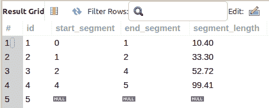
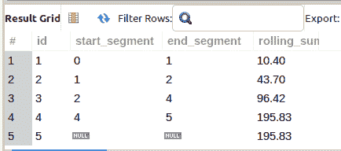
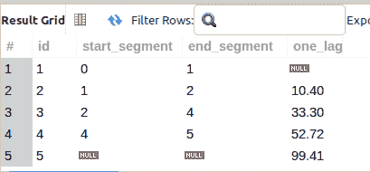
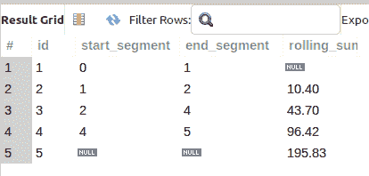
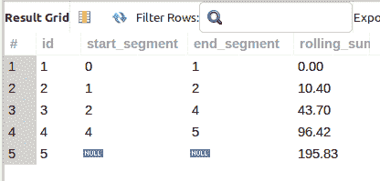

# 如何在 MySQL 中组合窗口函数

> 原文：<https://levelup.gitconnected.com/how-to-combine-window-functions-in-mysql-c4efa608b282>

窗口函数对多组行进行操作，为组中的每一行返回一个值，这与聚合函数不同，聚合函数将行折叠成一个值。有了这么多不同的窗口功能，你能在同一层次上组合它们吗？在这篇文章中了解更多。


图片来自 [Pixabay](https://pixabay.com//?utm_source=link-attribution&utm_medium=referral&utm_campaign=image&utm_content=304970) 的 [Clker-Free-Vector-Images](https://pixabay.com/users/clker-free-vector-images-3736/?utm_source=link-attribution&utm_medium=referral&utm_campaign=image&utm_content=304970)

## 背景故事和推理

我最近使用 Oracle Spatial 函数处理了一些查询，以构建地理空间线字符串。作为其中一个函数参数的一部分，我需要在每个坐标间隔从线串上的起始位置(一个坐标)开始计算跑步距离。

这听起来像是 *cut-n-dry* 使用`SUM()`和`OVER()`进行滚动求和的用例。你说得对，的确如此。

**差不多**。

## 抽样资料

为了简单起见，我将放弃在示例中使用任何复杂的北距、东距或线性参考，而是为博客文章选择这个简单的数据集:

```
SELECT * FROM coords_measure;
```



由于我主要在我开发的大多数 [LAMP stack](https://openlamptech.substack.com/p/openlamptech-report-what-is-the-lamp) 应用程序中撰写和使用 MySQL 或 MariaDB，所以我也将使用 MySQL 作为这些示例(尽管我需要的需求最初是在 Oracle SQL 中)。

您可能会注意到结果集的最后一行对于`start_segment`、`end_segment`和`segment_length`列有`NULL`值。

这是因为该位置是线串上最后一个点(坐标),且没有实际测量长度；基本上就是*‘死胡同’*。

## 用 MySQL 窗口函数滚动求和()

计算滚动和并不困难，因为从 MySQL v8 开始我们就有了窗口函数。

如该查询所示，简单地将`SUM()`聚合函数与`OVER()`子句结合使用，并按照特定的顺序排列，就可以得到以下信息:



虽然我们有一个滚动和计算，但在这种情况下是不正确的。您可以看到最后 2 行的滚动和值为 195.83。

然而，对于这个特定的要求，我们真正需要的是最后一行 ***只有*** 有 195.83 用于滚动和计算，第一行有 0。

在 ***OpenLampTech*** 时事通讯中[投放可负担得起的分类广告，让您的品牌、产品或服务得到应有的关注。谢谢大家的支持！](https://ko-fi.com/s/7dfe9ce108)

***就好像我们需要将所有的滚动和值下移一行。***

但是为什么呢？

对于此地理空间要求，在每个坐标点，距离应从起点或起始坐标(第 1 行)开始计算。

因此，行 1 实际上应该具有测量距离 0，因为它是线串的起点(并且没有距离值— *它是起点*),而行 2 将具有在这两个坐标之间测量的距离值，因为这是回到起点(坐标 1)的距离。

## MySQL LAG()窗口函数

`LAG()`窗口功能允许您从当前操作行访问位于结果集之前行的数据。根据`LAG()`函数调用中提供的第二个参数，您可以访问 1 行(默认)或更多行。

我将在查询中使用`LAG()`,并返回前面每一行的 segment_length 值:



如查询结果所示，在没有前几行值的情况下，`LAG()`返回`NULL`。

根据我的经验，你需要一个 ***有意义的指标*** ，你可以在`LAG()`的`ORDER BY`子句中使用它，如果你依赖于一个特定的订单，它会按照你的期望为你工作。

现在我们简单地执行滚动求和，对吗？

**能不能把 2 个窗口函数合并在同一个级别？**

号码

执行该查询会返回一个特定的错误，指示此处不允许使用`LAG()`:

## MySQL 派生表

在 MySQL 中，在`FROM`子句中生成表的`SELECT`查询被称为[派生表](https://dev.mysql.com/doc/refman/8.0/en/derived-tables.html)。

为了计算`LAG()`函数输出的滚动和，我们应该使用派生表将生成的查询放在`FROM`子句中:



提示:MySQL 派生表应该有别名。然而，`AS`关键字是可选的。

作为一个好的实践，我们应该考虑到在`LAG()`窗口函数调用中的`NULL`，以便在执行计算时，我们在`SUM() OVER()`中的数学是正确的或更安全的。MySQL 中的一个简单方法是使用`IFNULL()`函数。



现在，如查询结果所示，我们有了正确的距离度量，即每个坐标间隔的滚动和。

**推荐阅读:** [**5 本会让你成为 Pro**](https://openlamptech.substack.com/p/5-sql-books-that-will-make-you-a) 的 SQL 书籍。

老实说，绝对可能有其他方法来检索这些查询结果，但这种方法对我来说很适用。在处理这个特定的查询时，我学到了很多关于`LAG()`和用窗口函数进行滚动求和计算的知识，我希望你也学到了。

感谢你阅读这篇文章。请与同样喜欢它的人分享。

[咖啡是我最喜欢的饮料！！！](https://ko-fi.com/joshlovescoffee)

[Josh Otwell](https://joshuaotwell.com/about/) 热衷于成为 PHP 开发人员、SQL 专家和技术博客/作家。

免责声明:本文中的大多数示例都是在个人发展/学习工作站环境中执行的， ***不应被视为生产质量或就绪*** 。您的特定目标和需求可能会有所不同。像往常一样，**你能做某事并不意味着你应该做。我的观点是我自己的。**

***我能帮助的更多方面***

*   开博客？我用 WordPress 写了数字猫头鹰的散文博客。让我们都在提供的计划上省钱。
*   在[***OpenLampTech***简讯](http://openlamptech.substack.com/)中投放价格合理的分类广告，让您的品牌、产品或服务得到应有的关注。
*   需要托管你的下一个网络应用程序或 WordPress 网站吗？我强烈推荐 [Hostinger](https://www.hostg.xyz/aff_c?offer_id=6&aff_id=94641) ，用它们来托管[我的利基鲈鱼钓鱼网站](http://louisianabassnation.com/)。该服务是首屈一指的，他们提供免费的 SSL。
*   [作为一名自学成才的开发人员，我意识到的 5 个事实](https://ko-fi.com/post/5-Truths-Ive-Come-To-Realize-As-a-Self-taught-Dev-R5R2BL9J6)

***披露*** :本帖中的部分服务和产品链接为附属链接。在没有额外费用给你，你应该通过点击其中一个购买，我会收到佣金。

当你[订阅***【OpenLampTech】***时事通讯](http://openlamptech.substack.com)时，收到一本我的电子书*《给每个人的 10 个 MySQL 技巧】****绝对免费*** 。

通过在 ***OpenLampTech*** 时事通讯中投放价格合理的分类广告，让您的品牌、产品或服务得到应有的关注[。谢谢大家的支持！](https://ko-fi.com/s/7dfe9ce108)

*原载于 2022 年 10 月 12 日 https://joshuaotwell.com**[*。*](https://joshuaotwell.com/how-to-combine-window-functions-in-mysql/)*