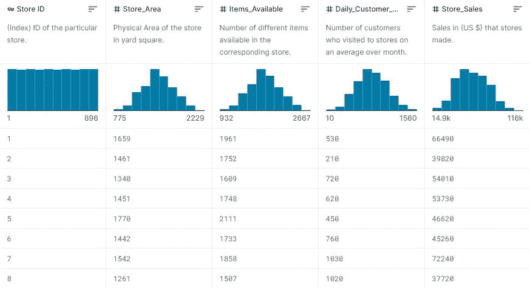
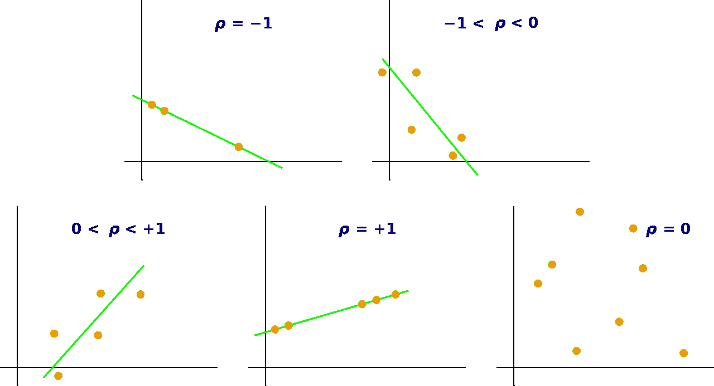
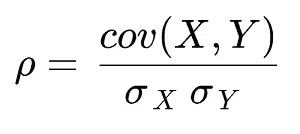
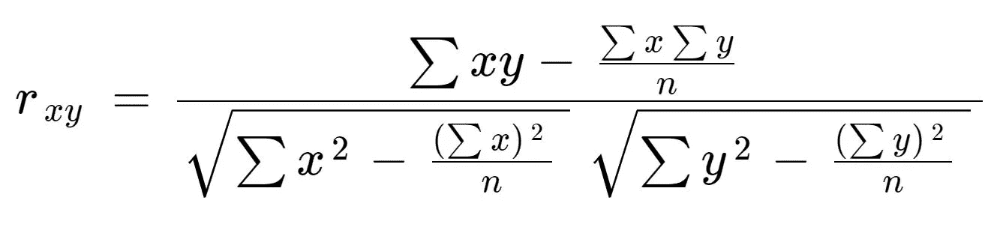

# 如何用 SQL 计算皮尔逊相关系数

> 原文：<https://levelup.gitconnected.com/how-to-compute-pearson-correlation-with-sql-f68bce954f56>

## 以及你能从中学到什么有趣的东西。

当您尝试预测未来数据或估算数据集中缺失的数据时，您可以做出许多假设来提高工作效率。

例如，假设[你想做一个商店分店销售分析](https://www.kaggle.com/datasets/shree1992/housedata)。

您有一个包含以下变量的数据集:

*   商店 ID；
*   商店区(在庭院广场)；
*   可用项目的数量；
*   一个月的平均客户数量；
*   和商店销售；

如果你知道**这些变量如何相互作用**，这个数据集可能会部分回答许多有趣的问题。

现在可以明显看出的是客户和销售的相关性:**客户越多，销售越大，对吗？**😉

但是你认为更多的商品或者更大的商店面积会有助于提高销售额吗？

> 换句话说，这些属性是相关的吗？

# 什么是皮尔逊相关系数？

大概，关于相关性的统计数据比其他任何统计数据都多，所以我将长话短说。

最简单地说，相关性是数据集中成对的值之间的非随机、直接关联的统计度量。

用 *ρ ("rho")* 表示，从-1 到 1 不等，其中:

*   **-1”表示完全逆相关:**回归线从左到右向下；
*   **“0”表示无相关性:**没有回归线；
    只是散点图；
*   **和“1”表示完全正相关:**
    回归线从左向右。

演职员表:[维基媒体](https://commons.wikimedia.org/wiki/File:Correlation_coefficient.svg)

在我们的例子中，我们可以首先考虑商品数量和销售额之间的关系。正如维基百科页面上所说，有许多公式可以计算皮尔逊系数。

我将实现最常用的一个，“乘积-矩相关系数”，它只有在变量正态分布和**且没有缺失值的情况下才有效**。****

这是数学公式:

皮尔逊“积矩”相关系数公式

其中**σ**(“sigma”)是标准差， **cov** 是两个变量之间的协方差。

我就不赘述维基百科上描述的数学演示的细节了。不过，你可以考虑使用一个更简单的公式 *:* 来估计这两个变量**r***之间的 *ρ**

皮尔逊“积差”相关系数公式(近似值)

其中 *n* 是行数。

这个公式对于统计人员来说很难理解，但是对于 SQL 开发人员来说很容易实现，因为所有的 SGBD 都有用于*平方根*和*求和*运算的函数。

例如，以下是上一个公式的 SQL 实现:

如果你使用 Google BigQuery，你可以使用 [CORR()函数](https://cloud.google.com/bigquery/docs/reference/standard-sql/statistical_aggregate_functions?hl=fr#corr)得到相同的结果:

做数学(或 SQL😉)对于数值变量之间的所有关系，我们得到的结果是:

*   带有“商店销售”的“物品可用”:r = 0.098
*   带“店铺销售额”的“店铺面积”:r = 0.097
*   带有“可用项目”的“商店区域”:r = 0.99✅；
*   带有“商店销售额”的“每日客户计数”:r = 0.008😲；

这些数字可能会让您感到惊讶，但是在这个数据集的客户数量和销售额之间没有明显的关系！

> 商店面积和商店销售额之间确实存在关系，但你需要做更多的数据探索，以弄清楚如何*😉*

## 奖励:一个计算皮尔逊相关系数的 SQL 函数

由于 MySQL(和 PostgreSQL)没有任何专用函数，我试图构建并提供一个。以下是 MySQL 版本，需要稍加修改才能在 PostgreSQL 上运行:

以及如何使用它:

## 参考资料和进一步阅读

如果你了解更多关于皮尔逊相关系数背后的理论和假设，你可以看看这篇很棒的文章:

 [## 皮尔逊相关系数解释。

### 我意识到，对于可以在数据集上执行的不同类型的关联，存在很多混淆…

towardsdatascience.com](https://towardsdatascience.com/pearson-coefficient-of-correlation-explained-369991d93404) 

**此外，我没有解释如何用 SQL 检查您的数据是否正态分布**(在我们的例子中，它是正态分布的，我们可以通过查看第一幅图中的分布形状来假设)。

你可以再计算两个统计量:**峰度**和**偏斜度**。

 [## 高性能统计查询——偏度和峰度

### 在描述性统计中，前四个总体矩包括中心、扩散、偏度和峰度或…

learnsql.com](https://learnsql.com/blog/high-performance-statistical-queries-skewness-kurtosis/) 

> 我建议你绘制分布图，而不是仅仅依靠这些统计数据来确认你的数据是正态分布的。

最后，如果您的数据包含 null 值或空值，您可以使用 SQL 来管理它。我专门为你写了一篇文章:

 [## 如何在 SQL 中查找和处理空值

### 配上一张小猫的照片，因为何乐而不为？

levelup.gitconnected.com](/how-to-find-and-deal-with-null-values-in-sql-8404a32d3b37) 

如果你[关注我](https://medium.com/@dataforeveryone)，我会在以后发布文章的时候通知你！

# 分级编码

感谢您成为我们社区的一员！在你离开之前:

*   👏为故事鼓掌，跟着作者走👉
*   📰更多内容请查看[升级编码刊物](https://levelup.gitconnected.com/?utm_source=pub&utm_medium=post)
*   🔔关注我们:[推特](https://twitter.com/gitconnected) | [LinkedIn](https://www.linkedin.com/company/gitconnected) | [时事通讯](https://newsletter.levelup.dev)

🚀👉 [**加入升级人才集体，找到一份神奇的工作**](https://jobs.levelup.dev/talent/welcome?referral=true)