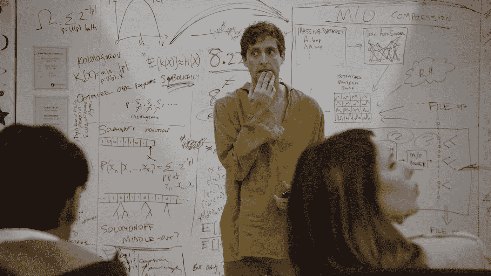

# 如何进行系统设计面试

> 原文：<https://levelup.gitconnected.com/how-to-conduct-a-system-design-interview-9031a261c08e>

系统设计面试是在面试中评估候选人资历的好方法。你可以在网上找到很多关于如何准备设计面试或哪些系统设计面试问题，但很少关于如何进行实际面试。

在这篇文章中，我将描述我面试分布式系统职位高级候选人的经历。如果你偶然发现这篇文章是因为你想知道如何在设计面试中胜出，你应该继续阅读——准备面试的一个好方法是知道面试官是如何看待他们的。

在我继续之前，给你一个建议:这种类型的面试最适合面试有行业工作经验的工程师。刚从学校毕业的工程师，或者只有几年经验的工程师，还不具备在面试中胜出的必要技能。

# 选择一个你熟悉的系统

系统设计面试要求候选人设计一个能解决特定问题的系统。面试通常需要大约一个小时，基本上是一个开放式的对话——目的是了解候选人的经验和解决问题的技能，同时把他们当成你的同事来对待。

你想要选择一个你过去工作过的系统，或者至少是你非常了解的系统。理想情况下，它应该与你的团队或公司的工作相关，这样候选人就有机会看到如果他们加入你的团队，他们将从事的项目类型。不要忘记不仅仅是你在评估他们，他们也在评估你。

选择您非常了解的系统的另一个原因是，您已经花费了相当多的时间来理解它的解决方案空间、可伸缩性限制、权衡和故障模式。这不仅让你更容易准备面试，也让你有能力将他们的解决方案与你或你的团队提出的方案进行比较。谁知道呢，他们甚至会给你一些你错过的见解——我称之为双赢。

**无论你做什么，不要问他们如何设计一个 Twitter 克隆**(除非你在 Twitter 工作)，或者任何其他典型的设计面试问题。当你从事酒店预订业务，并在面试时要求设计一个 Twitter 克隆时，你是在告诉求职者，你工作的地方没有什么有趣的事情发生。对于一名高级工程师来说，这是一个巨大的危险信号，这是理所当然的。

"但是如果我没有推特规模的问题呢？"我听到你问。这很好，你不需要有数百万用户来考虑可伸缩性——另外，这只是设计分布式系统时要解决的众多挑战之一。

# 从小规模设计开始

花前几分钟与候选人交谈，了解他们过去的经历，他们的优势和劣势。然后，挑选一个你面试前准备好的设计问题，呈现给应聘者。**在白板上画出您希望他们设计的系统的基本草图**—这将有助于让他们感到更放松，因为空白板会让人紧张。

当展示他们应该设计的系统时，从小规模开始，并确保候选人在同一页上—稍后将有时间深入了解可扩展性。此外，**不要详细讨论所有的要求**，因为你想让候选人提问，看看他们是否能在进入解决方案之前对他们被要求设计的东西有一个清晰的了解。

最后，询问他们将如何设计系统。但是不要只是静静地坐在角落里，**和候选人交谈，试着理解他们为什么做出这样的决定，以及他们是如何处理这个问题的。在这一阶段，没有必要深入到设计或技术的特定组件中——扩大范围，给候选人空间来设计一个完整的架构。**

如果您觉得有太多活动部件，询问是否有办法在不影响整体解决方案的情况下移除特定组件。此外，请候选人证明他们所做的权衡，例如，他们为什么选择 NoSQL 商店而不是 SQL 商店？

在前 30 分钟结束时，他们应该在白板上画出一个简单的设计草图。

# 调高音阶

既然候选人已经有了一个初步的设计，那就扩大规模吧。增加每秒的请求数、接收的数据量或任何与您的特定问题相关的内容。**无论最初的设计看起来如何，当你增加它承受的负荷时，它肯定会碰壁。**

询问他们，随着规模的扩大，他们认为会出现什么问题，以及他们将如何解决这个问题。如果候选人能够自己指出砖墙，这是一个很好的迹象。一旦他们确定了突破点，与候选人一起消除它们。从最有可能被击中的开始，因为一旦设计发展，其他的可能变得不那么相关。这个阶段是非常迭代的，随着设计的变化，权衡也在变化——讨论它们是什么以及它们是否有意义。

**指出他们遗漏的故障模式**，并询问他们如果该组件或该链路出现故障会发生什么情况。你可以通过一个候选人能多快地发现失败模式，比如单点失败，并想出优雅的方法来解决它们，来了解他们的经历。因为您询问的是您有经验的系统，所以您可以回忆一下过去最典型的问题是什么，以及您是如何减轻这些问题的。

在前 50 分钟结束时，您应该已经详细讨论了可扩展性和可靠性问题。如果有时间，**挑选一部分设计并深入研究**。例如，如果候选人的设计需要复制数据，谈论一致性保证，以及如何具体实施。

这类似于一个问题:“告诉我，当你在浏览器中输入 example.com 时会发生什么，”但这是根据手头的设计量身定制的。如果你正在招聘一名高级系统工程师，你希望他们对基础知识有深刻的理解，比如 TCP、分页、一致性模型等。这些知识在调试和优化复杂系统时至关重要。

到面试结束时，你应该对候选人的优势和劣势以及他们如何处理没有单一最佳答案的问题有一个很好的了解。高级候选人应该能够快速通过面试的第一部分，并且在第二部分对系统进行升级和解决故障模式没有问题。他们应该对他们所做的每个决定有一个好的解释，并且能够列出他们设计的权衡。**当面试优秀的候选人时，你应该在离开面试时感觉自己从他们身上学到了一些东西**。

# 最后的话

系统设计面试是一个很好的方式来感受一个高年级候选人解决问题的能力。然而，用箭头连接盒子只是其中的一部分——而且不是最具挑战性的一部分。棘手的部分是理解需求、故障模式和权衡。这种类型的面试也鼓励活跃的讨论，让你一窥候选人的软技能。他们能把事情解释清楚吗？他们能很好地接受建设性的反馈吗？

如果你有兴趣了解更多关于设计分布式系统的知识，而不仅仅是在面试的背景下，请查阅我的书。它详细讨论了网络基础知识、分布式系统理论、可伸缩系统的架构模式、弹性模式以及如何维护大规模系统的最佳操作实践。

*最初发表于*[*https://robertovitillo.com*](https://robertovitillo.net/how-to-conduct-a-system-design-interview/)*。*