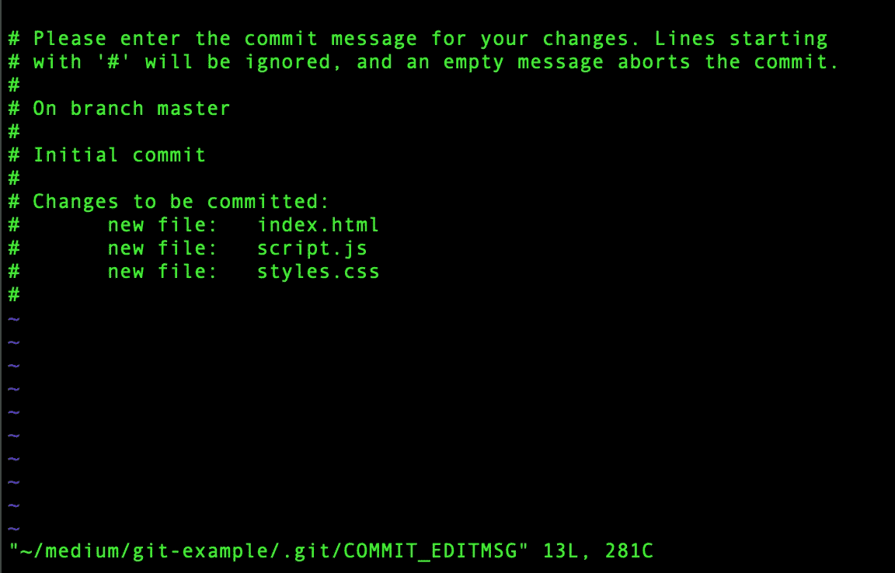
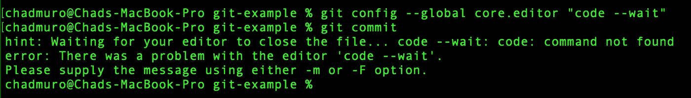
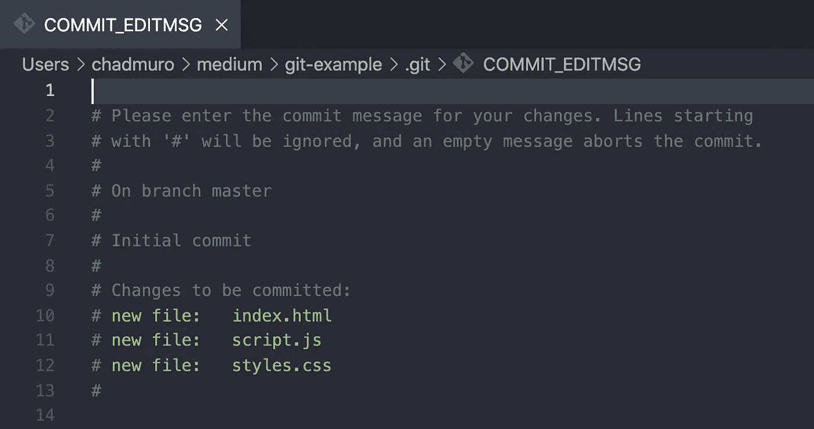
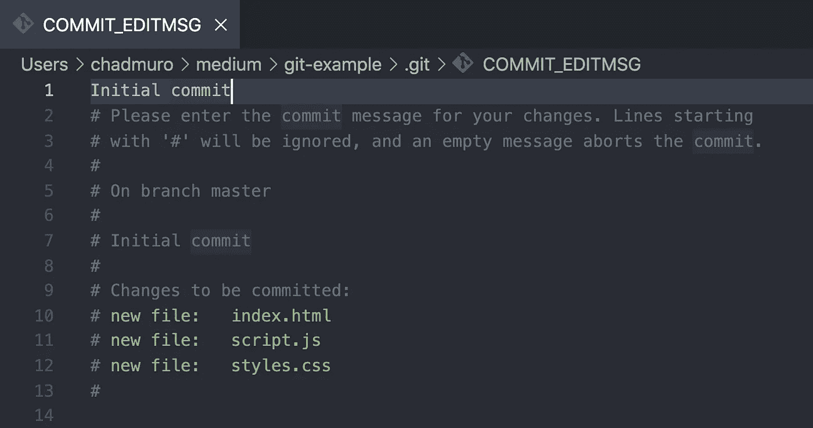
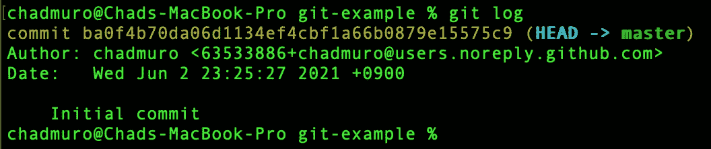
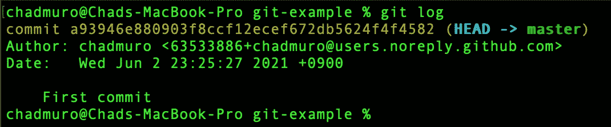

# 如何配置 Git 使用 VS 代码作为默认的文本编辑器

> 原文：<https://levelup.gitconnected.com/how-to-configure-git-to-use-vs-code-as-the-default-text-editor-ea3670ab525a>

## 结束尝试使用 Vim 的斗争


马修·韦林在 [Unsplash](https://unsplash.com?utm_source=medium&utm_medium=referral) 上的照片

如果您是 Git 新手，我相信您以前可能遇到过这种情况。您运行`git add .`然后运行`git commit`，但是忘记添加提交消息。然后突然你被带到下面的编辑器。



你开始打字，但不知道这是如何工作的。当你试图退出时，你被卡住了。

我实话实说。我不知道这个屏幕是什么。我花了足足 10 分钟在谷歌上搜索，才弄明白如何退出这个屏幕。*(顺便说一下，如果你卡在这里，只需键入(:q + enter)退出编辑器)*。

如果你想知道，这是 Vim。Vim 是一个文本编辑器，设计用于命令行。如果我们使用没有任何提交消息的`git commit`,这是打开的默认编辑器。该屏幕提示我们输入提交消息。

不使用 Vim，我们可以使用 VS 代码在 Git 中编写提交消息。如果您需要键入一个很长的提交消息，或者如果您在提交消息中输入了错误并想要修改它，这将特别有用。

在本文中，我们将了解如何配置 Git 以使用 VS 代码作为默认的文本编辑器。

# 配置 Git

我们可以使用`core.editor`命令为 Git 配置默认的文本编辑器。除了 VS 代码，还有许多其他选项可供选择，包括 Atom、Sublime Text、Notepad 等等。您可以在此查看文档[以查看完整列表。](https://git-scm.com/book/en/v2/Appendix-C%3A-Git-Commands-Setup-and-Config)

我们需要做的就是在命令行中键入以下命令:

```
git config --global core.editor "code --wait"
```

这是将 VS 代码配置为 Git 的核心编辑器。`--wait`标志告诉 VS 代码等待，直到我们保存并关闭窗口提交消息。

现在，如果我们键入`git commit`作为命令，它应该会启动 VS 代码。但是，您仍可能遇到以下错误信息。



# 在 VS 代码中安装代码

如果您遇到上面的错误消息，我们还需要采取一个步骤。我们需要在 VS 代码中安装 shell 命令' code'。

为此，打开 VS 代码并键入 *(command + shift + p)* 打开命令面板。

从那里，搜索*‘code’*并选择 **Shell 命令:在路径**中安装‘code’命令。


> 快速提示:安装后，您还可以使用`code .`命令。通过在命令行中键入`code .` this，它将在您所在的任何项目文件夹中启动 VS 代码。

最后，如果我们再次尝试`git commit`，它将打开 VS 代码，窗口如下。



# 输入您的提交消息

我们终于可以在这里输入提交消息了。键入任何消息并保存文件。要将提交发送到 Git，只需关闭文件。



对于我们的例子，我们将输入提交消息*‘初始提交’*。现在，如果我们保存并关闭这个文件，Git 将保存这个提交。我们可以通过在命令行中键入`git log`来确认这一点。



我们将在日志中看到标题为*‘初始提交’*的提交。

如果我们想修改上次提交，这也是有帮助的。例如，如果我们想改变我们最后的提交消息，输入`git commit --amend`。这将再次启动 VS 代码，我们可以编辑之前的提交消息。

在我们的示例中，我将消息更改为*‘第一次提交’*。您可以在下面的 git 日志中看到这些变化。



# 结论

我希望这篇文章对您配置 Git 使用 VS 代码作为默认文本编辑器有所帮助。对我来说，Vim 有点复杂。这就是为什么我更喜欢使用 VS 代码的原因，我觉得这样更舒服。

顺便说一下，如果您不熟悉 Git，键入 Git 提交消息的一个更简单的方法是使用`-m`标志，如下面的代码片段所示:

```
git commit -m "your commit message"
```

如果您需要编写一个长的 commit 或者需要修改以前的消息，我在本文中向您展示的方法非常有用。

感谢阅读！如果你想了解更多关于我学习 Git 的旅程，请查看下面的文章。

[](https://blog.devgenius.io/the-one-thing-i-wish-i-studied-more-before-starting-my-first-job-as-a-developer-edcc14f54e5) [## 我希望在开始我作为开发人员的第一份工作之前多学习一点

### 对此有更深入的了解会让我现在的生活轻松很多

blog.devgenius.io](https://blog.devgenius.io/the-one-thing-i-wish-i-studied-more-before-starting-my-first-job-as-a-developer-edcc14f54e5)