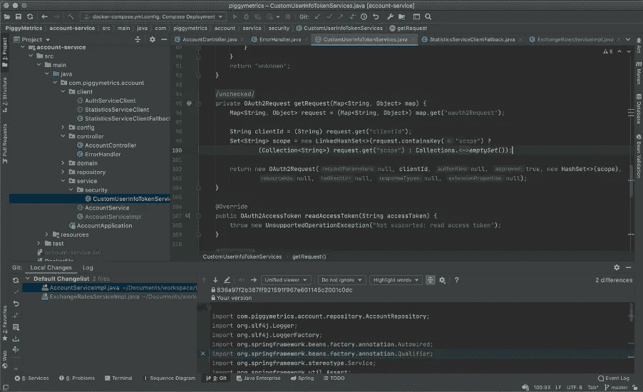
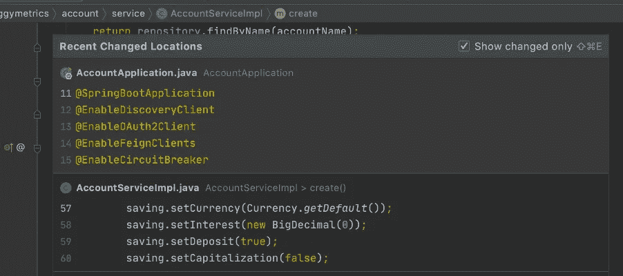
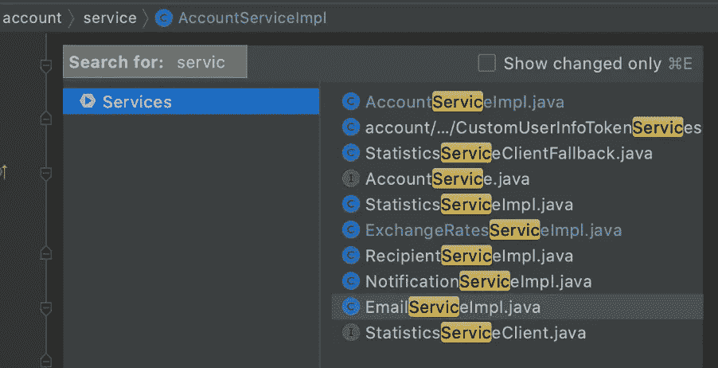
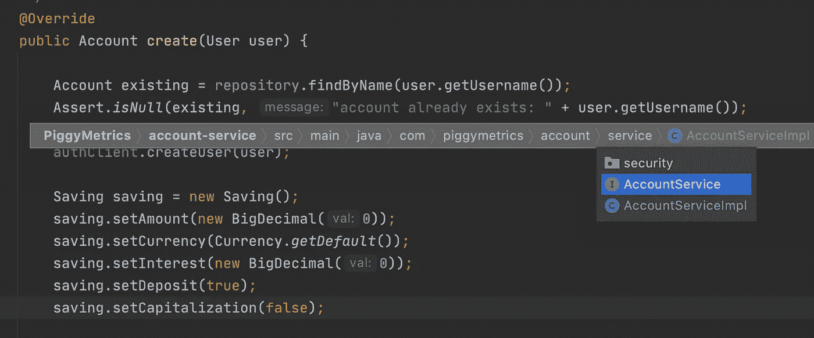
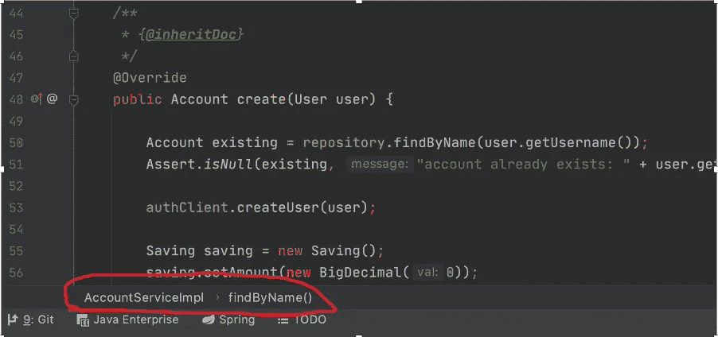
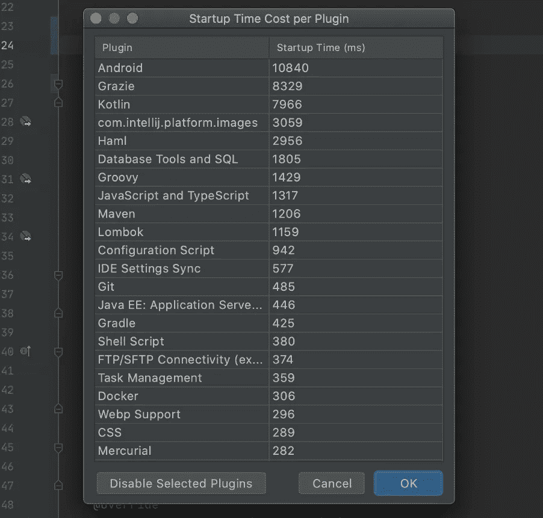

# 如何配置 IntelliJ IDEA 让你保持心流状态

> 原文：<https://levelup.gitconnected.com/how-to-configure-intellij-idea-to-keep-you-in-the-flow-state-ae08fb942a70>

## 控制您的 IDE


由 [Unsplash](https://unsplash.com?utm_source=medium&utm_medium=referral) 上的[谷仓图片](https://unsplash.com/@barnimages?utm_source=medium&utm_medium=referral)拍摄

```
**Table of Contents** 1\. "Being in the zone"
2\. Better alternatives to Tabs
3\. Too many tool windows problem
4\. Snappy Projects
5\. Disabling unused plugins
6\. Tip of the day
Summary
```

# “进入状态”

IntelliJ 理念建立在这样一个原则上，即开发人员在**流程**中度过的每一分钟都是美好的，那些让开发人员脱离流程的事情是不好的，应该避免。

心流状态，也称为**处于**区，是一种精神状态，在这种状态下，一个人在进行某项活动时完全沉浸在一种精力充沛的专注、完全投入和享受活动的感觉中。

本质上，心流的特征是完全专注于自己所做的事情，时间的体验被改变。

花在这个区域的时间与生产力成正比，麦肯锡公司的一项研究告诉我们，在这段时间里，你的生产力可以提高 5 倍。

## IntelliJ IDEA 的常见外观

默认情况下，这是 IntelliJ IDEA 第一次启动时的样子。在这里，我们看到许多事情正在发生。



IntelliJ IDEA 在顶部有一个导航栏，沿着边缘有一系列的工具窗口按钮，可以让你打开一个窗口，主项目在左边。

打开文件时，编辑器会打开文件并在顶部显示一个选项卡。每个新文件都有一个新的选项卡。

此外，编辑器还显示了一个面包屑轨迹，以显示您在文件中的位置。

我们可以使用这些机制在 IntelliJ IDEA 中导航，但所有这些都占用了宝贵的空间**、**和**在它们之间导航可能会分散我们的注意力。**

# 标签的更好替代品

首先，选项卡可能是 IntelliJ IDEA 中最低效的导航方式。如果你有多个标签，你可能需要用鼠标在标签间来回移动。

要在不同类别间导航，您当然可以使用 Mac 版⌘o`(Ctrl + N for Win/Linux)`的前往类别快捷方式。

但是，更重要的是，你可以使用 Mac 的最近文件快捷方式⌘e`(Ctrl + E for Win/Linux)`。它会显示你最近浏览过的文件。



此外，⌘ *⇧* E `(Ctrl + Shift + E for Win/Linux)`向您展示**最近编辑的文件**，因此您可以精确定位您一直在编辑的文件。

此外，您可以使用⌘[或⌘] `(Ctrl + Alt + ➞ or Ctrl + Alt + ➞ for Win/Linux)`在您使用的地方来回导航

因此，请使用 IntelliJ 强大的导航，不要在工作流程中管理所有那些乱七八糟的选项卡。

要禁用选项卡使用搜索动作，⌘*⇧a*，这基本上是一个**动作查找**，然后输入选项卡位置- >无。

# 工具窗口过多的问题

尽管如此，工作区仍然被导航工具栏、项目导航窗口和一系列工具窗口按钮弄得乱七八糟，分散了我们的注意力，而不是集中在代码上。

首先，我喜欢简单地通过使用⌘1 `(Alt + 1 for Win/Linux)`来隐藏项目视图。

同样，对于所有其他工具窗口，您可以使用⌘ +数字来显示或隐藏它。例如，使用⌘9 `(Alt + 9 for Win/Linux)`来查看版本控制系统。

现在，如果我想查找一个文件呢？然后我就用⌘*⇧o*t5】直接去文件。如果我想看项目的概述怎么办？然后我又按下了⌘1.

如果一个窗口没有编号，或者我们忘记了它是什么，我们可以使用⌘E `(Ctrl + E for Win/Linux)`，它会带来最近的文件，还会显示所有可用的窗口，像往常一样，IntelliJ IDEA 允许我们在这里输入进行搜索。



## 导航栏

接下来，顶部似乎有一个默认启用的导航栏。通常，如果我想导航或查看我在项目环境中的位置，我会激活项目视图⌘1 `(Alt + 1 for Win/Linux)`。我个人认为这是多余的，但如果你愿意，你仍然可以使用⌘↑ `(Alt + Home for Win/Linux)`调用它，并从那里导航。



要禁用导航栏，使用⌘*⇧a*然后键入导航栏- >关闭。

**专业提示**，我通常在项目视图中启用“总是选择打开的文件”，这样当我在整个项目中移动时，项目视图总是跟上我，它总是选择我在编辑器中打开的文件。

## 面包屑？

汉瑟和葛丽特会喜欢的！面包屑显示您的当前位置，并允许在文件内导航。然而，如果你不处理大量的 HTML 和 XML，这个特性就没什么用了。



所以，你可能想禁用它使用⌘ *⇧A* `(Ctrl + Shift + A for Win/Linux)`然后输入面包屑- >禁用。

## Zen 工作空间

最后，为了让编辑器一次获得最大的屏幕空间，我们使用 Shift + Control + F12 隐藏/显示所有窗口⌘*⇧f12*t1】

状态栏可能是我在 IntelliJ 中不隐藏的东西之一，因为它显示有用的错误消息、进度指示器和 Git 分支名称。

# 时髦的项目

处理大型多模块项目会影响性能，因为 IntelliJ 需要处理大量文件来进行搜索、检查、重构代码和类似的操作。

当你忙于编码，不想让任何东西打扰你的创作流程时，你最不想要的就是一个一直停滞不前、永远花不完时间打字的 IDE。

为了让 IntelliJ IDEA 工作得更快，可以暂时搁置(卸载)目前不需要的模块，也可以将模块集拆分成多个 IntelliJ 项目。

无论哪种方式，如果你不同时需要所有的模块，建议将它们从 IDEA 的活动中排除，这样你就可以享受平滑的搜索和重构。

# 禁用未使用的插件

IntelliJ IDEA 预装并启用了大量插件。如果使用这些插件的话，它们可能不会在日常生活中使用。当插件执行某些活动时，活动插件的数量会显著影响性能。与未使用的模块一样，一个好的经验法则是，如果您不使用它，就禁用它。

此外，你可以在帮助菜单中查看每个插件的启动成本。

在这里，我看到 Android 插件花了大约 10 秒钟启动，我甚至没有使用它。



您可以检查列表，禁用不使用的内容。

# 共享 JDK 指数


索引是 IntelliJ IDEA 下的一个关键特性，它使 IDE 能够在您开始应用任何更改之前了解您的代码的详细情况。IDE 对类、方法和其他代码元素进行索引，以创建项目的虚拟映射。

关于索引，您可能唯一关心的是速度。IntelliJ IDEA 在最新版本 v.2020.2 中使用共享索引解决了这个问题，如果您愿意，可以启用共享索引。

这允许您下载在另一台机器上准备的索引，而不是在本地构建它们。如果你的网络连接足够快，这个插件可以减少 75%的 Java 项目索引时间。

# 日积月累


当你打开 IntelliJ 时，你会得到一个弹出窗口，显示每日提示。

通常，当启动 IntelliJ 时，可能不是学习技巧和诀窍的最佳时机。尽管如此，您还是想学习新的技巧，这样就不会禁用弹出窗口。然而，在 IntelliJ 中一定有更好的学习新事物的方法。

在帮助菜单中，有一个**生产力指南**选项，它显示了 IntelliJ 中的提示列表以及您使用特定操作的频率。

当然，你可以将这些动作按照你使用的次数进行排序，但更重要的是，你可以发现哪些是有用的**功能，而你从未使用过**，并学习一些新的东西。

这就是我如何找到“环绕”功能的，我以前从未使用过，但后来开始使用它。

# 摘要

IntelliJ IDEA 拥有强大的工具和导航功能，您可以每天使用它们来改进您的代码。

然而，如果你不能控制所有这些事情，那么你的创作流程可能会被打断。

# 掌握 Java 开发人员的 IntelliJ 思想课程

使用下面的链接获得整个课程 60%的折扣。[https://www . udemy . com/course/mastering-intellij-idea-for-Java-devs/？couponCode=LEARNING202201](https://www.udemy.com/course/mastering-intellij-idea-for-java-devs/?couponCode=LEARNING202201)

# 文献学

1.  心流(心理学)[https://en . Wikipedia . org/wiki/Flow _(心理学)【2020 年 9 月](https://en.wikipedia.org/wiki/Flow_(psychology))
2.  共享索引插件[https://blog . jetbrains . com/idea/2020/07/shared-Indexes-Plugin-discovered](https://blog.jetbrains.com/idea/2020/07/shared-indexes-plugin-unveiled/)，2020 年 9 月