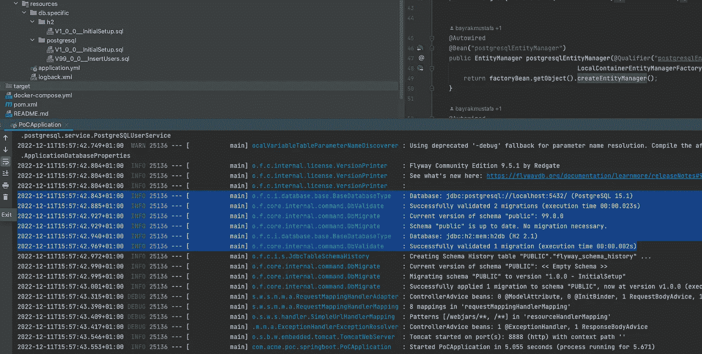

# 如何使用 Spring Boot 配置多个数据库

> 原文：<https://levelup.gitconnected.com/how-to-configure-multiple-databases-with-spring-boot-81414cf4506d>


照片由[马体·米罗什尼琴科](https://www.pexels.com/@tima-miroshnichenko?utm_content=attributionCopyText&utm_medium=referral&utm_source=pexels)从[派克斯](https://www.pexels.com/photo/man-in-red-and-blue-plaid-button-up-shirt-using-silver-macbook-5702300/?utm_content=attributionCopyText&utm_medium=referral&utm_source=pexels)拍摄

***您需要配置 Spring Boot 应用程序来处理多个数据源吗？***

这个 SO 问题的大多数解决方案都有`@Primary`来标记主数据源。这不是我们所需要的，因为我们希望有平等的多个数据库。

***不想要主数据库怎么办？如果您想将迁移应用到多个数据源，该怎么办？***

我们将从这个 POC repo 开始，它可以在[这个 GitHub 链接](https://github.com/kimhrac/poc_springboot_3_multi_databases)上找到。

让我们来看看为 Spring Boot 应用程序配置多个数据库需要什么。

# 您将需要单独的实体管理器

对于每个数据库，我们需要配置实体管理器工厂并填充数据源数据。

这可以用下面的方法来完成。

```
@Configuration  
@EnableTransactionManagement  
@EnableJpaRepositories(  
        basePackages = "com.acme.poc.springboot.backend.database.h2.repository",  
        entityManagerFactoryRef = "h2EntityManagerFactory",  
        transactionManagerRef = "h2UserTransactionManager"  
)  
@EntityScan(basePackages = {  
        "com.acme.poc.springboot.backend.database.h2.entity"  
})  
public class H2SQLPersistence {  
private final Environment env;  
public H2SQLPersistence(Environment env) {  
        this.env = env;  
    }  

    @Autowired  
    @Bean("h2EntityManager")  
    public EntityManager h2EntityManager(@Qualifier("h2EntityManagerFactory")  
                                       LocalContainerEntityManagerFactoryBean factoryBean) {  
        return factoryBean.getObject().createEntityManager();  
    }  
    @Autowired  
    @Bean("h2UserTransactionManager")  
    public PlatformTransactionManager h2UserTransactionManager(@Qualifier("h2EntityManagerFactory")  
                                                                       LocalContainerEntityManagerFactoryBean factoryBean) {  
        return new JpaTransactionManager() {{  
            setEntityManagerFactory(factoryBean.getObject());  
        }};  
    }  
    @Autowired  
    @Bean("h2EntityManagerFactory")  
    public LocalContainerEntityManagerFactoryBean h2UserEntityManagerFactory(@Qualifier("h2UserDataSource")  
                                                                                     DataSource h2UserDataSource) {  
        HibernateJpaVendorAdapter vendorAdapter = new HibernateJpaVendorAdapter() {{  
            setGenerateDdl(true);  
        }};  
        HashMap<String, Object> properties = new HashMap<>() {{  
            put("hibernate.hbm2ddl.auto", env.getProperty("hibernate.hbm2ddl.auto"));  
            put("hibernate.dialect", env.getProperty("application.database.h2.hibernate.dialect"));  
        }};  
        PersistenceProvider provider = new HibernatePersistenceProvider();  
        return new LocalContainerEntityManagerFactoryBean() {{  
            setDataSource(h2UserDataSource);  
            setPackagesToScan("com.acme.poc.springboot.backend.database.h2");  
            setJpaVendorAdapter(vendorAdapter);  
            setJpaPropertyMap(properties);  
            setPersistenceProvider(provider);  
        }};  
    }  
    @Bean("h2UserDataSource")  
    public DataSource h2UserDataSource() {  
        return new DriverManagerDataSource() {{  
            setDriverClassName(env.getProperty("application.database.h2.driverClassName"));  
            setUrl(env.getProperty("application.database.h2.url"));  
            setUsername(env.getProperty("application.database.h2.username"));  
            setPassword(env.getProperty("application.database.h2.password"));  
        }};  
    }  
}
```

我们将读出属性并创建数据源。之后，我们创建实体管理器工厂。工厂 bean 用于设置事务管理器和实体管理器。

在实体服务中，我们将使用相关的事务管理器:

```
@Transactional(transactionManager = "postgresqlUserTransactionManager")
```

# Flyway 怎么样？

***您如何将数据迁移到这些数据库中？***

此解决方案中缺少的部分是 Flyway 迁移。我会把这部分留给你去想。

我会把需要的步骤写在这里。

您需要获取数据源属性，并将它们加载到迁移器类中。然后遍历它们，运行到特定数据库的迁移。

***如果你需要这个项目与 Flyway 你可以支持我的工作，并在这里找到源代码:*** [多数据源/数据库的 Spring Boot 应用](https://zivce.gumroad.com/l/svvxep)

# 了解该解决方案有什么重要的？

*我们根本没有使用* `*@Primary*` *标注。*

这意味着这是一个真正的多数据库项目。您可以拥有不同的数据库，并且可以针对所有这些数据库。此外，您可以关闭某个数据库，转到另一个数据库。

*Flyway 可以运行到每个数据库的迁移。*

如果您已经完成了上面的步骤或者找到了我的解决方案，您可以迁移到每个数据库。使用现成的 flyway，您只能迁移到主数据源。

以下是向 H2 和 PostgreSQL 的迁移:



*Flyway 默认* [*挑选主数据源，只向主数据源迁移*](https://stackoverflow.com/questions/37281229/multiple-datasources-migrations-using-flyway-in-a-spring-boot-application) *。*

如果需要，您还可以插入任何数据库。按照最初的请求，您可以按需删除数据库。项目将继续使用配置好的数据库。

***比恩没有必要压倒一切。***

用`@Primary`你将需要一个覆盖特性。有了这个解决方案，就没有这个必要了。

# 分级编码

感谢您成为我们社区的一员！在你离开之前:

*   👏为故事鼓掌，跟着作者走👉
*   📰查看[升级编码出版物](https://levelup.gitconnected.com/?utm_source=pub&utm_medium=post)中的更多内容
*   🔔关注我们:[Twitter](https://twitter.com/gitconnected)|[LinkedIn](https://www.linkedin.com/company/gitconnected)|[时事通讯](https://newsletter.levelup.dev)

🚀👉 [**加入升级人才集体，找到一份惊艳的工作**](https://jobs.levelup.dev/talent/welcome?referral=true)