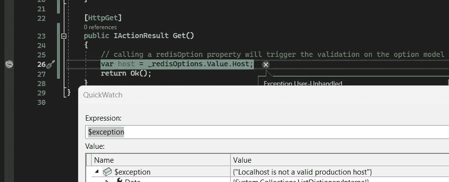

# 如何在 ASP 中配置选项？网

> 原文：<https://levelup.gitconnected.com/how-to-configure-options-in-asp-net-4869f2efd01f>

使用内置方法来配置和验证选项

[rawpixel.com](https://medium.com/u/7ef7644c61e0?source=post_page-----4869f2efd01f--------------------------------)在 [stock.adobe](https://stock.adobe.com/) 的照片

任何 ASP.NET web 应用程序的一个重要部分是我们如何处理我们的项目设置，从我的角度来看，应该非常强调如何验证我们的设置。

想想当你没有设置一个合适的 int 配置值时会发生什么，它的默认值是可以接受的吗？

> *您可以使用以下链接找到演示的链接:*[https://github.com/ramihamati/webapidemos/tree/main/WebApi.演示选项](https://github.com/ramihamati/webapidemos/tree/main/WebApi.DemoOptions)
> 
> 你也可以在我的网站上找到这篇文章[https://digit Teck . com/dot net/aspnetcore/how-to-configure-options-in-ASP/](https://digitteck.com/dotnet/aspnetcore/how-to-configure-options-in-asp/)

## 以下文章部分:

*   使用`Configure`登记一个选项
*   `Configure`方法的背后是什么
*   使用`IConfigureOptions`配置一个选项
*   使用`IValidateOptions`验证选项值
*   用注释验证

## 使用`Configure`注册一个选项

在 Asp.NET 中添加一个配置模型，只需创建一个配置模型，然后使用`Configure`方法即可。

太好了，现在我们可以通过从依赖机制请求`IOptions<OptionMongoDb>`来访问我们的选项:

## `Configure`方法的背后是什么

在上一节中，我们使用`Configure`方法添加了一个选项，它为我们的配置注册了一个选项服务。但是这种方法的背后是什么呢？

反编译这段代码，我们可以看到这个方法使用`AddOptions`注册了选项服务，然后它为我们的选项添加了一个服务作为接口`IConfigureOptions.`

现在这告诉我，我不必自称为方法`services.AddOptions()`，因为它是自动生成的，也不必担心这些服务被多次添加，因为它们在内部使用了`TryAdd`扩展方法。

## 使用`IConfigureOptions`配置一个选项

在上一节中，我们看到在内部配置选项时，框架注册了用于配置选项模型的服务`IConfigureOption<TOption>`。Asp.NET 框架使用服务将选项模型绑定到配置部分。

我们可以定制这个配置服务的实现。

让我们定义一个新的选项模型并实现配置类:

我们应该确保通过调用`services.AddOptions()`来注册选项服务，然后我们可以注册我们的新服务:

## 使用`IValidateOptions`来验证选项值

我们有多种方法来验证我们的配置模型属性。在上一节中，我在`IConfigureOption<>`服务中添加了一些基本的属性验证，但是我们还有一个方便的服务叫做`IValidateOption<>`服务，它也可以用于相同的目的。

> **使用该方法，当调用该对象的属性时(而不是配置该对象时)执行验证**

## 用注释验证

一个很好的特性是使用注释来验证我们的选项模型。

我们必须使用`AddOptions<>`方法，该方法在内部使用了一个`OptionBuilder`，它具有更简洁的功能，比如验证数据注释或启动时验证。我们还可以注册一些谓词验证(不像使用`IValidateOptions`那么酷)

让我们注册新的期权模型，并进行验证

现在，我们可以通过注册以下选项在启动时运行验证:

> 令人恼火的是，我看不出有什么方法可以将`*IValidateOptions*`绑定到`*OptionBuilder*`上，或者让`*IValidateOptions*`在启动时运行，而不是像`*OptionBuilder*`允许的那样在运行时运行
> 
> 同样恼人的是，我们有太多的方式来描述同一件事。只有一种注册、配置和验证的方式不是很好吗？我们必须努力理解所有这些不同的方式和行为，而不是专注于我们的业务逻辑。

# 分级编码

感谢您成为我们社区的一员！在你离开之前:

*   👏为故事鼓掌，跟着作者走👉
*   📰查看[升级编码出版物](https://levelup.gitconnected.com/?utm_source=pub&utm_medium=post)中的更多内容
*   🔔关注我们:[Twitter](https://twitter.com/gitconnected)|[LinkedIn](https://www.linkedin.com/company/gitconnected)|[时事通讯](https://newsletter.levelup.dev)

🚀👉 [**加入升级达人集体，找到一份惊艳的工作**](https://jobs.levelup.dev/talent/welcome?referral=true)