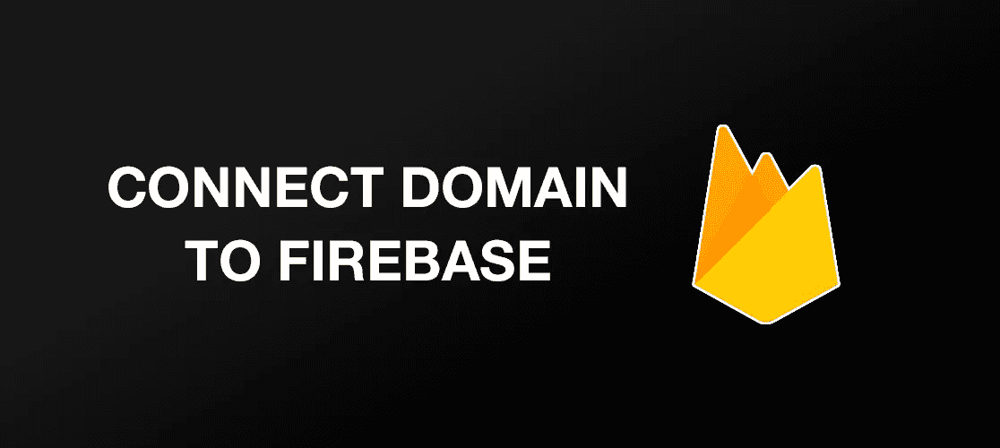
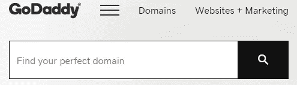
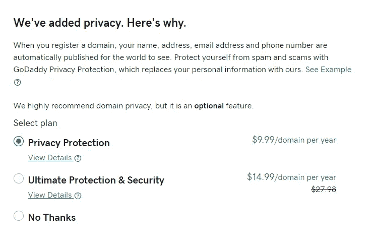
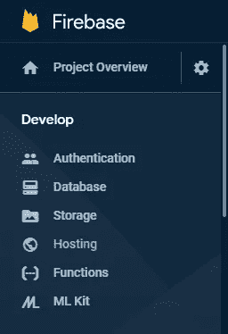
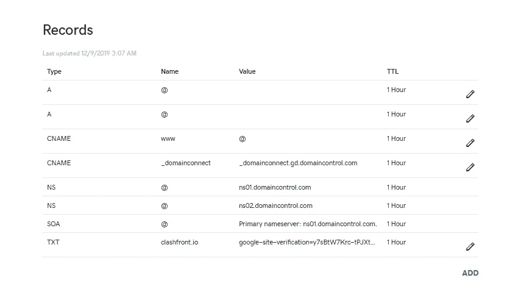
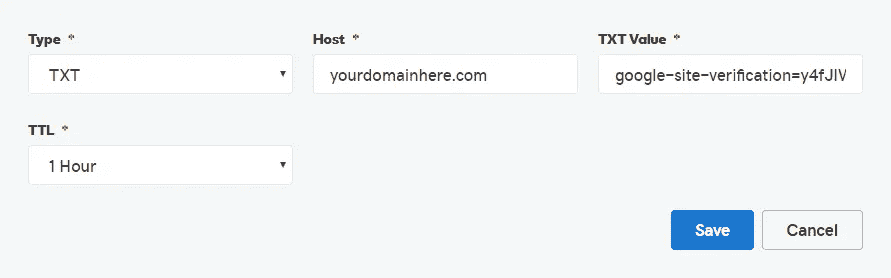
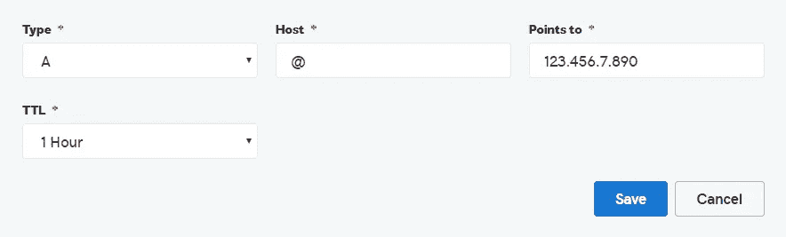
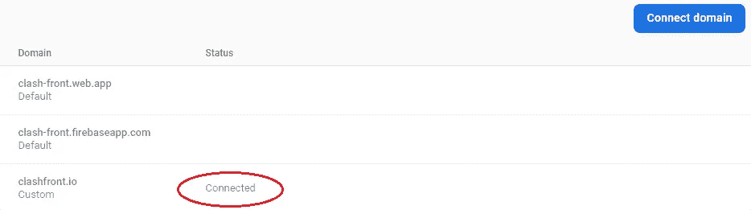

# 如何将自定义域连接到 Firebase 项目

> 原文：<https://levelup.gitconnected.com/how-to-connect-a-domain-to-your-firebase-project-cd47373bad79>

如果你打算在你的 web 应用中使用 Firebase，你可能会像其他网站一样，把它连接到你选择的自定义域。没有自定义域，Firebase 会自动给你分配一个很难记的，一个看起来不太专业的。今天，我们将看看如何用 GoDaddy 购买一个自定义域，以及如何通过 Firebase 托管将它连接到您的项目。

# 使用 GoDaddy 购买自定义域名

在将您的域连接到 Firebase 项目之前，您必须先购买一个自定义域。对于这个例子，我们将使用 [GoDaddy](https://www.godaddy.com/) ，但是如果您已经通过他们或其他人购买了自定义域名，您可以跳到下一部分。首先，去 godaddy.com 搜索一个域名，看看它是否可用。在 GoDaddy 网站主页的搜索栏中输入你想搜索的域名，就可以搜索到。

在搜索栏中输入任意域

如果你想要的域名被占用了，你可以选择他们推荐的一个相似的，或者你可以寻找另一个。一旦你找到一个你喜欢的域名，你就可以进入你的购物车了。进入购物车后，系统会提示您为您的域名购买额外的安全性。我会推荐使用基本的隐私保护计划，如下所示。

从这里，您可以继续使用您的购物车并设置 GoDaddy 帐户。我建议在购买域名前做的最后一件事是安装 chrome 扩展，亲爱的。Honey 将自动对您的订单应用折扣代码，以帮助您节省一些钱(我在我的域名上节省了 10 美元！)并且只需一分钟即可完成设置。

 [## 蜂蜜

### Honey 是一个浏览器扩展，只需点击一下，即可在结账时自动找到并应用优惠券代码。

www.joinhoney.com](https://www.joinhoney.com/) 

购买域后，您就可以将它连接到 Firebase 项目了。

# 将您的域连接到 Firebase 项目

一旦你购买了你的域名，你就可以把它连接到你的 Firebase 项目了。首先，打开你的 Firebase 项目，进入托管页面。

从这里，点击按钮，说连接域名，并进入您的域名，因为它是从你购买它。一旦你点击继续，Firebase 会告诉你把他们给你的 TXT 记录连接到你的 DNS 提供商，这样他们就可以验证你确实是你的域名的所有者。我们可以通过复制 TXT 记录并转到您的特定域名的 DNS 管理页面(在 GoDaddy 上或您购买域名的任何地方)来实现这一点。在那里，您应该会看到一个类似如下的屏幕:

单击添加按钮开始验证过程。

在这里，您需要单击 Add 按钮，将类型更改为 **TXT** ，为主机部分键入**您的域名**名称，粘贴您之前从 Firebase 复制的 **TXT 记录**，并将 **TTL 设置为 1 小时**。你所有的信息应该是这样的。

正确填写所有信息后，单击保存。

保存后，返回 Firebase 并点击 verify(如果 Firebase 给你一个错误，说他们不能验证你的所有权，刷新页面再试一次)。接下来，您将进入一个屏幕，告诉您向 DNS 提供商添加几个 A 记录。在这里，您需要返回到刚才所在的 DNS 管理页面，并再次单击“add”。将 type 设置为 A，将 host 设置为@，将 Points 设置为 Firebase 提供的值之一，并将 TTL 设置为 1 小时。一定要为 Firebase 给你的两个 A 记录 都这样做。完成后，还要确保从 DNS 管理页面中 ***删除任何预先存在的 A 记录*** 。

您的设置应该如下所示。

一旦你做了所有的事情，你可以返回到 Firebase 并点击 finish。从这里，你应该准备好了，现在你唯一要做的就是等待几分钟，直到你的域名的状态从挂起变为连接，如下图所示。

一旦状态显示“已连接”，你的网站就应该在线，让全世界都能看到。

如果你有任何关于如何将你的域名连接到 Firebase 的问题，你可以看看他们的网站，上面详细介绍了如何连接。

 [## 连接自定义域| Firebase

### 你不必放弃你独特的，以品牌为中心的域名与 Firebase 托管。您可以使用自定义域…

firebase.google.com](https://firebase.google.com/docs/hosting/custom-domain) 

# 附加说明

如果你还没有建立一个 Firebase 项目，并且不知道如何去做，下面的谷歌分析视频很好地解释了如何开始。希望这篇文章能帮到你！

*来源*:

[https://www.godaddy.com/](https://www.godaddy.com/)

[https://www.joinhoney.com/](https://www.joinhoney.com/)

[https://firebase.google.com/docs/hosting/custom-domain](https://firebase.google.com/docs/hosting/custom-domain)

[https://youtu.be/6juww5Lmvgo](https://youtu.be/6juww5Lmvgo)