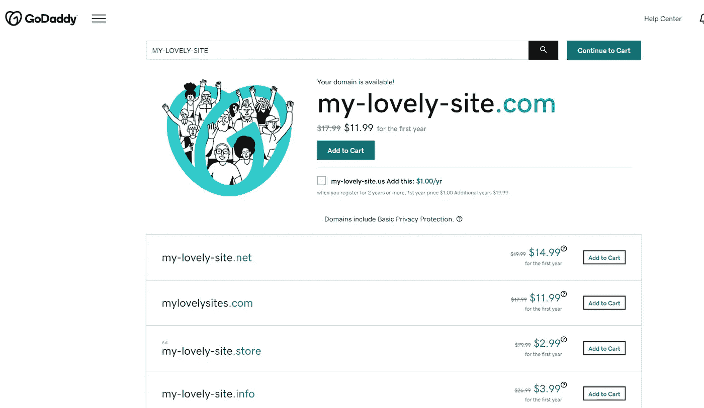

# 如何将 Godaddy 域连接到已部署的 Heroku React 应用程序

> 原文：<https://levelup.gitconnected.com/how-to-connect-a-godaddy-domain-to-a-deployed-heroku-react-app-9b8809d858c0>

## 只需三步。简单！


你是否在 Godaddy 购买了一个新域名，并希望最终将你可爱的应用程序公之于众？欢迎，这篇文章是给你的。

在这篇短文中，我将遵循 3 个简单的步骤，这样你就可以庆祝你的网站了。为此，计划如下:

*   ***在 Heroku*T3 上部署功能 app**
*   ***有一个 Godaddy 域***
*   ***配置***

我假设你已经有你的应用程序工作。我的代码是前端用 React，后端用 Express。我们走吧！

# #1-在 Heroku 上部署一个工作应用？

在 Heroku 上部署你的应用程序非常简单。你所需要做的就是登录你的 Heroku 账户(不需要付费版本)或者创建一个账户。

*   我们需要在您的机器上安装 Heroku CLI([Heroku CLI](https://devcenter.heroku.com/articles/heroku-command-line))
*   在 Heroku 上创建您的应用程序，并指定它是 Node.js 应用程序。
*   在命令行中登录到您的帐户(确保已经安装了 Heroku CLI):

```
$ heroku login
```

*   使用 Git 将***my-lovely-app***的源代码克隆到你的本地机器上。

```
$ heroku git:clone -a my-lovely-app
$ cd my-lovely-app
```

如果您已经将代码推送到 Git 存储库，您可以更改远程 URL:

```
git remote set-url heroku <repo git>
```

或者，通过您的帐户仪表板将 Heroku 连接到 Github。


连接到 Github

*   最后一件事是将您的最终更改部署到 Heroku 上:

```
$ git add .
$ git commit -m "Deploy"
$ git push heroku master
```

如果一切正常，Heroku 将显示:

```
remote: Verifying deploy... done.
```


应用程序已部署

恭喜你。您的网站已经部署，可以在 https://name-of-your-app.herokuapp.com***访问。***

# #2-如果尚未购买 Godaddy 域名，请购买。

我用 Godaddy 是因为它非常好用。很直观，也不贵。我所要做的就是搜索我想要的域名(如果它还没有被占用)它就是你的了\ (•◡•) /



现在，需要一些配置！

# #3-配置 Heroku 和 Godaddy

## Heroku side

我们需要将域添加到您的应用程序中。我们可以在您的 Heroku 仪表板上的“设置”选项卡中进行设置:


添加域

/!\如果您尚未设置信用卡，Heroku 不会允许您添加域名。只是为了账户验证。我什么都没付，ヾ(⌐■_■)ノ♪

这都是为了 Heroku。

## Godaddy 侧

对于 [Godaddy](https://www.godaddy.com/) 域，我们需要添加 2 样东西:

*   配置 CNAME:

转到我的域>域设置> DNS 管理。


更新 www CNAME

点击编辑下面提到的名为“www”的 CNAME，并将该值设置为您的 Heroku 部署地址，无需复制“***”Http://www*** 部分。对于我的应用程序，这将是**my-lovely-app.herokuapp.com。**

就是这样。

*   配置转发:

通常情况下，您的域名现在可以工作，但如果您键入的域名没有***【www】***部分，这将无法工作。让我们来解决这个问题:

总是在 DNS 管理中，在用您的地址值替换地址值后，转到转发阻止并设置如下:


现在，前往 my-lovely-app.com 的地址**T5，将与前往 http://www.my-lovely-app.com[***的地址完全一样。***](http://www.my-lovely-app.com.)**

**/！\** 注意，举例来说，我没有使用 HTTPS 协议。您可以通过将 Heroku 升级到付费版本来切换到安全 HTTP。

# 最后，享受~ ᕕ(ᐛ)ᕗ

全世界都可以看到你的网站。恭喜你。

本文到此为止，谢谢！

我希望你和你的家人无论在哪里都平安无事！坚持住。明天会更好！

**关注我上** [**中**](https://medium.com/@famzil/) **，** [**领英**](https://www.linkedin.com/in/fatima-amzil-9031ba95/) **，** [**脸书**](https://www.facebook.com/The-Front-End-World) **，以及** [**推特**](https://twitter.com/FatimaAMZIL9) **获取更多文章。**

