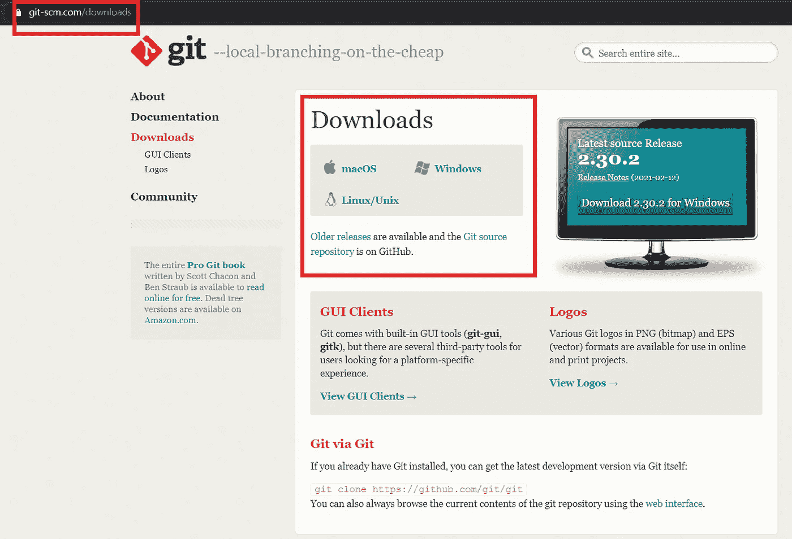
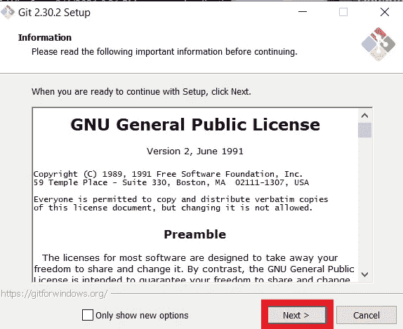
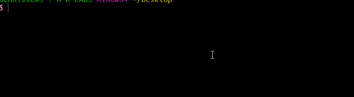
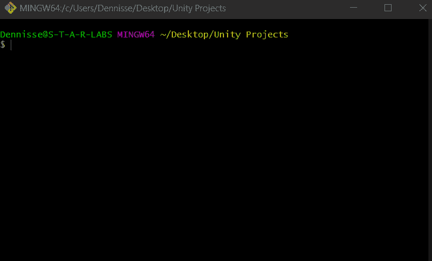
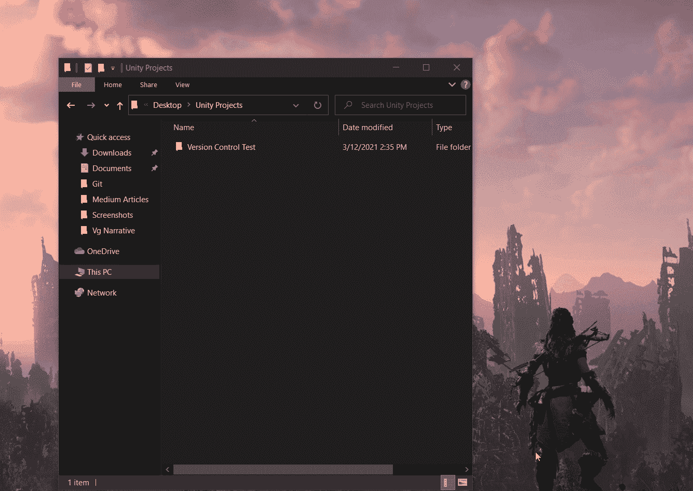
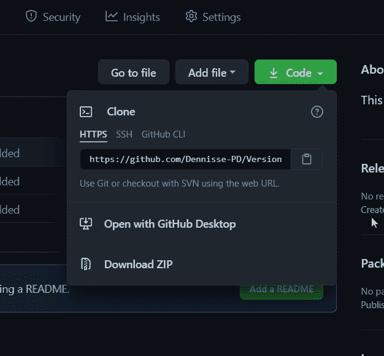

# 如何将 Github 连接到 Unity——快速简单的指南

> 原文：<https://levelup.gitconnected.com/how-to-connect-github-to-unity-a-quick-and-easy-guide-f38f3710c4c0>

**目录**
∘ [快速概述:](#f21f)
∘ [奖金备忘单](#5caa)
∘ [导航中的 Git Bash](#d839)
∘ [如何将 GitHub 连接到你的 Unity 项目](#bd93)
∘ [文档](#6908)

## 快速概述:

*   **Git Bash:** 一个命令行编辑器，在系统中使用命令行启用 Git。Git Bash 将成为 GitHub 和 Unity 之间的纽带。

**如何安装 Git Bash:**

*   跟随链接到安装站点**[**https://git-scm.com/downloads**](https://git-scm.com/downloads)和**确保你点击了各自操作系统**的链接。**

****

*   **下载完成后，按照默认安装设置进行操作。**

****

## **奖金备忘单**

**现在您已经安装了 Git Bash，您可以在您的应用程序/程序目录中访问它，并开始使用它！**

*   **为了让你更容易掌握 Git Bash，这里有一个由 Atlassian [官方提供的**备忘单**](https://www.atlassian.com/git/tutorials/atlassian-git-cheatsheet)**
*   **此外，您始终可以通过 **git - help** 命令在终端内访问**帮助**。**

****

## ****Git Bash 中的导航****

**在 Git Bash 中导航可能看起来有点吓人，但是我将为您提供一些从 A 点到达 B 点的快速简单的方法！**

****让我们通过在桌面中找到一个 Unity 项目文件夹来看看导航。****

1.  **首先，您需要检查您的桌面是否可以从当前目录访问。为此，您可以使用以下命令访问您的目录列表:**

*   ****ls** 是一个命令，它将**列出**当前目录中的所有文件夹和文件，这允许你从你当前所在的位置看到你可以访问的内容。**
*   ****提示**:注意这个命令是如何命名为 ls，list 的缩写。你会发现，命令很容易与它们执行的功能联系起来，从而更容易记忆。**

****

**2.现在你知道桌面在你的目录列表中，你可以通过 **cd** 命令访问它(改变目录)。这允许我们**访问列表上的特定位置**。**

****

*   **提示:你可以通过键入前两个字母，然后点击键盘上的 Tab 键来自动完成你想要的位置的名称。**
*   **您当前位置的名称将以黄色显示。**

**3.在桌面目录中，你可以再次使用 **ls** 来检查你的项目文件夹是否在其中。**

****

*   **你也可以通过名字直接**访问你的文件夹。要写一个带有空格的文件名，请始终使用引号，如下所示。大写不会影响结果。****

****

**4.一旦你进入了存储所有 Unity 项目的文件夹，确保你访问了你想要连接到 GitHub 的项目的特定文件夹。您可以使用 **ls** 来实现这一点。在项目文件夹目录中查看所有存储项目的列表时，您可以使用 **cd** 来访问它，或者甚至通过它的名称来访问它，就像您在前面的示例中看到的那样。**

****

*   **或者，**您可以通过命令**跳过搜索，手动转到您想要的文件夹，在里面单击鼠标右键，然后直接从那里启动 Git Bash。**

****

## **如何将 GitHub 连接到您的 Unity 项目**

**如前所述，Git Bash 将成为 Unity 和 Github 之间的沟通工具。以下是如何使用 Git Bash 将您的 Unity 项目连接到 GitHub。**

1.  **访问您想要的 GitHub 库，并通过点击代码下拉菜单中的剪贴板来复制 **HTTPS URL** 。**

****

**2.通过 Git Bash 使用您喜欢的方法(手动或 Git Bash 命令)访问 Unity 项目文件夹。**

**3.通过 Git Bash 中的 **git init** 命令初始化一个新的存储库。(我的说重新初始化，因为我之前已经完成了这一步)。**所有 git 存储库命令必须以“git”开头****

****

**饭桶**

**4.使用 **git remote add origin(在这里粘贴 HTTPS)**创建你的新的远程仓库**

*   ****git remote** 是指您正在创建的存储库的类型**
*   **添加是让 Git Bash 知道这是一个新的添加**
*   ****Origin** 是远程存储库(GitHub)的名称。您可以给它取任何名字，但是 origin 被认为是一个行业标准名称。**
*   **HTTPS 是您之前从 GitHub 获得的存储库链接。**

****

**您可以使用 **remote -v** 命令来**验证您的远程存储库**是否已经成功添加**

****

*   ****Fetch** 让您知道您可以从 Github 中指定的远程存储库中检索信息。**
*   ****推送**表示能够*将*内容从我们的本地**主**分支(我们的 PC)推送到 GitHub。**

## **证明文件**

**请关注最新的 Git 文档，在这里您可以在一个方便的地方访问完整的命令库，包括完整的解释、视频和教程。
[【https://git-scm.com/doc】T2](https://git-scm.com/doc)**