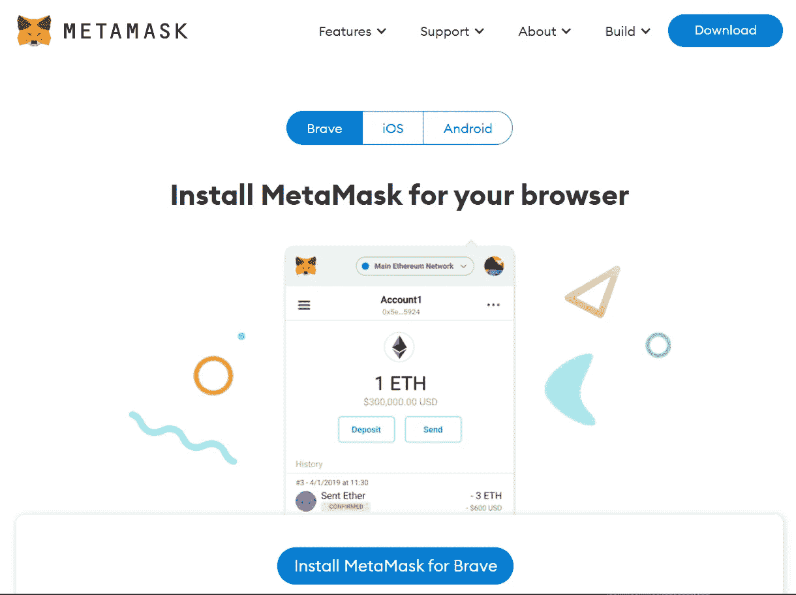
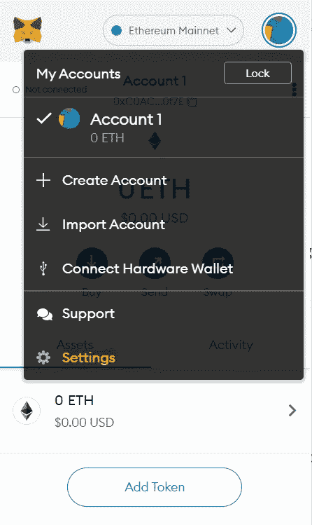
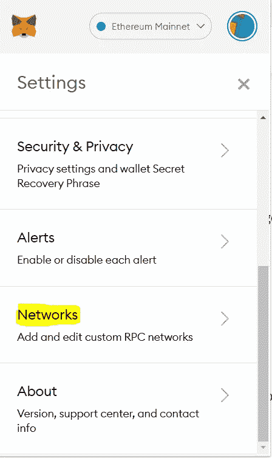
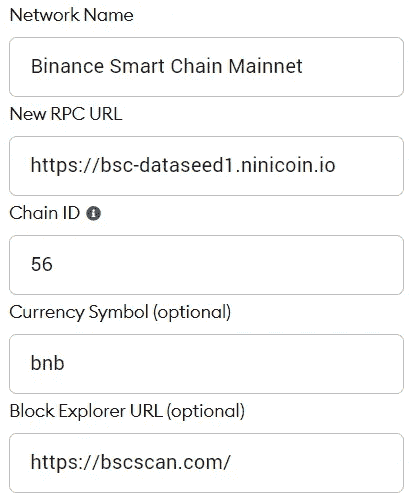

# 如何将元掩码连接到任何网络

> 原文：<https://levelup.gitconnected.com/how-to-connect-metamask-to-any-network-9805f42c687f>

[MetaMask](https://metamask.io/) 是一个加密货币钱包，你可以用它与以太坊区块链进行交互。它在你的网络浏览器和以太坊区块链之间提供了一个用户友好的桥梁，以太坊是许多 dApps 的主机网络。用户可以存储以太或任何其他使用以太坊网络构建的 ERC-20 令牌，然后将该加密货币与他们选择的 dApp 一起使用。

MetaMask 作为浏览器扩展和移动应用程序提供，它为您提供了密钥库、安全登录、令牌钱包和令牌交换等管理数字资产所需的一切。虽然它主要用于与以太坊区块链互动，但你也可以将它连接到另一个区块链。

# 安装元掩码

进入[下载页面](https://metamask.io/download.html)，安装 MetaMask(浏览器扩展或手机应用)。支持的浏览器有 Firefox、Chrome、Brave 和 Edge。

安装应用程序或浏览器插件后，您可以**导入钱包**或**创建钱包**。如果您是第一次使用元掩码，请创建一个新的 wallet。确保将恢复短语复制并保存在安全的地方，不要共享。您需要恢复密码才能访问钱包。

# 连接币安智能链

1.  点击菜单，然后点击 S **设置**

2.向下滚动并点击**网络**

3.点击**添加网络，**添加以下详细信息，点击**保存**

*   网络名称—您可以随意命名
*   新的 RPC URL —此列表中推荐的 URL[RPC URL](https://docs.binance.org/smart-chain/developer/rpc.html)
*   链 ID: 56(如果 56 不行，试试 0x38)
*   货币符号:BNB
*   区块浏览器网址:[https://bscscan.com](https://bscscan.com)

保存后，您的网络将自动更改为币安智能连锁网络。您可以通过检查选定的网络名称来确认这一点。

# 连接火币生态链

网络设置:

*   网络名称—您可以随意命名
*   新 RPC URL—[https://http-mainnet.hecochain.com](https://http-mainnet.hecochain.com)
*   链条编号:128
*   货币符号:HT
*   阻止浏览器网址:[https://hecoinfo.com](https://hecoinfo.com)

# 与 Matic(多边形)连接

网络设置:

*   网络名称—您可以随意命名
*   新的 RPC URL—[https://RPC-mainnet . matic . network](https://rpc-mainnet.matic.network)
*   链条编号:137
*   货币符号:MATIC
*   区块浏览器网址:[https://polygonscan.com](https://polygonscan.com)

# 与 Fantom Opera 联系

网络设置:

*   网络名称—您可以随意命名
*   新建 RPC 网址—[https://RPC capi . fantom . network](https://rpcapi.fantom.network)
*   链条编号:250
*   货币符号:FTM
*   区块浏览器网址:【https://ftmscan.com 

# 用扩展网络连接

网络设置:

*   网络名称—您可以随意命名
*   新的 RPC URL—[https://node . expense . tech](https://node.expanse.tech)
*   链 ID: 2
*   货币符号:EXP
*   block Explorer URL:[https://expense . tech](https://expanse.tech)

# 用 Ubiq 网络连接

网络设置:

*   网络名称—您可以随意命名
*   新的 RPC URL—[https://RPC . sino . dev](https://rpc.octano.dev)
*   链条编号:8
*   货币符号:UBQ
*   阻止浏览器 URL:[https://ubiqscan . io](https://ubiqscan.io)

# 与 Metadium 连接

网络设置:

*   网络名称—您可以随意命名
*   新的 RPC URL—[https://api.metadium.com/prod](https://api.metadium.com/prod)
*   链条编号:11
*   货币符号:元
*   区块浏览器网址:[https://metadium.com](https://metadium.com)

# 与 EOS 连接

网络设置:

*   网络名称—您可以随意命名
*   新的 RPC URL—[https://API . EOS Argentina . io](https://api.eosargentina.io)
*   链条编号:59
*   货币符号:EOS
*   区块浏览器网址:[https://bloks . EOS Argentina . io](https://bloks.eosargentina.io)

# 与 GoChain 连接

网络设置:

*   网络名称—您可以随意命名
*   新的 RPC URL—[https://RPC . go chain . io](https://rpc.gochain.io)
*   链条编号:60
*   货币符号:GO
*   阻止浏览器 URL:[https://Explorer . go chain . io](https://explorer.gochain.io)

# 与 IoTeX 连接

网络设置:

*   网络名称—您可以随意命名
*   新的 RPC URL—[https://babel-API . mainnet . io tex . io](https://babel-api.mainnet.iotex.io)
*   链条编号:4689
*   货币符号:IOTX
*   块浏览器 URL: [https://iotex.io](https://iotex.io)

> **元掩码不验证自定义网络。您负责验证添加到元掩码的任何自定义网络。确保您信任网络提供商。**恶意的网络提供商可以谎报区块链的状态，拒绝交易，并记录您的网络活动和 IP 地址。

**参考文献**

*   [MetaMask](https://metamask.io/)
*   [链表](https://chainlist.org/)