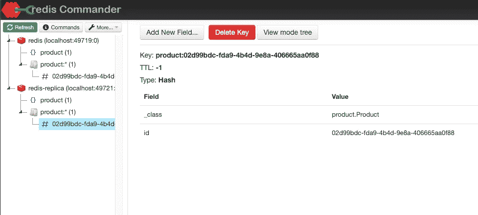

# 如何在 Spring Boot App 中连接 AWS ElastiCache Redis

> 原文：<https://levelup.gitconnected.com/how-to-connect-to-aws-elasticache-redis-in-spring-boot-app-9dd2e0908467>

## 如何在 Spring Boot 用测试容器复制 Redis

照片由[弗拉达·卡尔波维奇](https://www.pexels.com/photo/crop-male-freelancer-drinking-water-while-watching-laptop-in-kitchen-4050445/)

***你需要连接 Spring Boot 的 AWS ElastiCache Redis。此外，您需要准备部署。***

假设你想在本地 Redis 上测试一些东西，并为 AWS ElastiCache Redis 做准备。你可能会遇到几个问题。其中一个可能是 AWS ElastiCache Redis 中的[传输中加密](https://docs.aws.amazon.com/AmazonElastiCache/latest/red-ug/in-transit-encryption.html)。

此外，你会发现大多数教程不涵盖主/副本设置。您可以使用 Spring Data Redis 找到必要的配置。尽管如此，还是有一些缺失的部分。

让我们开始吧。 ***如果要源代码，这里是****。*

# *创建 Spring Boot 应用程序*

**为此需要从依赖关系中得到什么？**

*在本教程中，我将重点介绍如何使用 Spring Data Redis 和 Spring Data JPA。你也可以同时使用 Spring cache 和 Redis，这样你的缓存是独立的。但是对于这个场景，我们将把重点放在使用 Redis 作为数据库，而不是作为缓存。*

*此外，我们还需要测试容器和相关的 JUnit 依赖项。对于 web 测试客户端，您还需要 spring web 和 spring web flux。对于我偶然发现的一些问题，我也添加了一个`reactor-core`。*

*这是该项目的 pom.xml。*

# *创建配置和 Redis 散列实体*

*我创建了一个虚拟控制器，将产品保存在 Redis 中。这里重要的是什么？*

*产品需要`@RedisHash`注释和注释中的一个键。这样，Redis 存储库将实体存储为散列。此外，注释中的名称与 Redis 键的 id 相结合。*

*如果需要你可以添加`@TimeToLive`方法设置需要的时间单位并返回一个数量单位。Redis 存储库将对此进行解析，并在散列上设置 TTL。*

# *为主副本连接配置莴苣*

*下面是配置莴苣连接工厂所需的代码。*

*`RedisStaticMasterReplicaConfiguration`配置从`application.yml`读取的所需密码和端点。*

*然后在`RedisConnectionFactory` bean 中我们配置其他参数。最重要的是`clientConfig`中的`readFrom`。这样，副本更适合于读取，而母版更适合于写入。还有其他选择，但我会留给你去探索。*

*还需要`useSsl`和`disablePeerVerification`。生菜不支持 AWS Elasticcache 上的在途加密连接。如果您确定 Redis 暴露，您可以禁用对等验证。如果 Redis 只暴露在集群中，中间人攻击应该不是问题。即使没有对等验证，您的连接也是安全的，因为 URL 将采用`rediss://`的形式。*

*甚至在 Google Cloud [docs](https://cloud.google.com/memorystore/docs/redis/enabling-in-transit-encryption#configuring_your_client_for_in-transit_encryption) 上，也提到了莴苣和客户端。有了对自签名证书的支持，就可以实现对等验证。使用对等验证，您可能会遇到问题，例如转换为 IP 的证书中的[主机名。](https://stackoverflow.com/questions/64287424/lettuce-cant-connect-to-redis-cluster-using-ssl-but-can-connect-to-same-redis-s/67511216#67511216)*

*您还需要启用 Redis 存储库并传入所需的存储库。出于这个目的，只有一个类是 Redis 存储库，您也可以提供一个包。*

*这是关于代码中的配置。让我们转到配置属性。*

# *配置应用程序属性*

*您在 application.yml 中定义所需的属性。为此，我为主主机输入了`redis`，为 redis 副本主机输入了`redis-replica`。这些名称应该与您的 AWS Redis 端点匹配。或本地码头集装箱的名称。*

*对于本地，您可以禁用 SSL，以避免生成证书。此外，您需要将副本端口更改为`6380`。这是为了避免与主控主机发生冲突。*

*要在本地运行，可以使用 docker-compose.yml。*

*您需要通过文件传递额外的 env 变量。以下是文件的内容。*

*这使得复制成为可能。此外，在各自的 env 文件中设置主服务器和副本服务器。*

*这个规范使用以前的 auth，没有 Redis ACLs。这意味着这将使用默认用户和密码。有关 Redis 和 ACLs 配置的更多信息[请参考配置文件](https://raw.githubusercontent.com/redis/redis/6.2/redis.conf)。*

# *设置测试容器和集成测试*

*下面是使用测试容器的集成测试。这里我们需要创建两个通用容器，两者都将使用 Redis 映像。一个是主服务器，另一个是副本服务器。*

***需要** `**redisNetwork**` **来避免环回。由于两个容器都将暴露 localhost 作为主机名，docker 网络中的副本将尝试联系自己。docker 中的一个副本试图联系`localhost:6379`，并将请求返回。添加网络和网络别名使它们的主机名唯一。***

*如果复制配置良好，这是副本的输出。*

*这是主控器的输出。*

*作为 Redis 客户端，您可以使用 [redis-commander](https://github.com/joeferner/redis-commander) 。您需要将以下配置添加到您的`redis-commander/config`文件夹中。*

*设置完成后，运行测试。主服务器和副本服务器都应该包含哈希。*

**

*请在回复中告诉我你对这个解决方案的看法。*

## *你可以在这里找到源代码[。](https://zivce.gumroad.com/l/mtwtj)*

# *分级编码*

*感谢您成为我们社区的一员！在你离开之前:*

*   *👏为故事鼓掌，跟着作者走👉*
*   *📰查看[升级编码出版物](https://levelup.gitconnected.com/?utm_source=pub&utm_medium=post)中的更多内容*
*   *🔔关注我们:[Twitter](https://twitter.com/gitconnected)|[LinkedIn](https://www.linkedin.com/company/gitconnected)|[时事通讯](https://newsletter.levelup.dev)*

*🚀👉 [**加入升级人才集体，找到一份神奇的工作**](https://jobs.levelup.dev/talent/welcome?referral=true)*