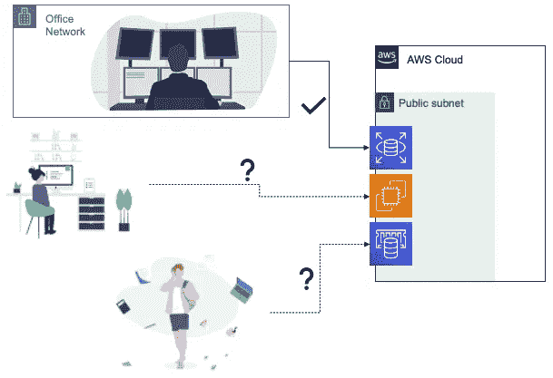
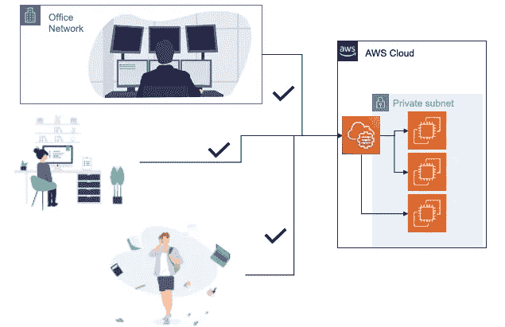
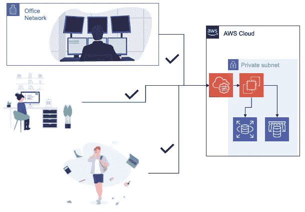

# 如何使用 SSH 隧道和 Bastion 主机连接到私有 AWS 资源

> 原文：<https://levelup.gitconnected.com/how-to-connect-to-private-aws-resources-with-ssh-tunnels-and-bastion-hosts-ac5c2e12e2d3>


# 可公开访问的 AWS 资源的问题是

当您第一次为一个新项目开发基础设施时，您自然会为快速开发进行优化。您希望得到一些东西——任何东西——出门，因此您希望能够快速编写代码和调试问题。

正因为如此，在公共子网中运行服务器和数据库非常诱人，这样您就可以方便地连接到它们以进行调试会话。能够`ssh my-user@my-web-server`进行一些现场代码调试，或者`psql -U my-user -h my-database-instance`评估数据库的当前状态，这很好。

当然，AWS 允许你这么做。你*可以*在你的网络服务器上公开 SSH，你*可以*在互联网上公开你的 AWS 关系数据库服务(RDS)和 Redis/elastic cache 服务器以便于访问。但是你应该吗？公开暴露数据库和服务器会产生一个非常明显的安全问题:互联网上的任何人都可以直接访问您的敏感数据。

你可能会说“没关系；我们锁定了我们的 VPC 安全组，这样只有我们办公室 IP 的人才能访问我们的 EC2、RDS 或 ElastiCache 实例。互联网上的其他人因为他们的 IP 地址而被阻止”。虽然这是真的——以这种方式锁定您的资源总比什么都没有好——但这种策略会产生两个陷阱:

1.  允许来自您办公室 IP 地址的任何人访问您的 AWS 资源仍然是一个安全问题。wifi 上的访客或初级开发人员 John 真的应该访问生产数据库吗？通过公共 IP 锁定您的资源，很难区分 DevOps 用户和您组织的其他人——每个人都可能使用相同的公共 IP 地址。此外，随着组织的发展，会产生更多的攻击媒介。您网络上的单个受损用户就可能对您的生产系统造成严重破坏。
2.  您的远程员工将很难获得资源。如果您的员工在家工作(在这个充满 COVID 的年份，他们很可能在家工作)，您将需要您的员工维护到您办公室的 VPN 连接，或者您将需要维护所有员工家庭 IP 地址的白名单。如果您的员工碰巧对机场或咖啡店的停电做出响应，他们可能会花费几分钟(几小时？)在 VPC 安全小组能够访问以解决停机问题之前，对他们进行人工干预。



这是我工作过的所有地方都必须解决的问题，所以我想这也是其他人必须面对的问题。让我们看看如何正确地做到这一点，同时优化安全性和可访问性。

# 进入 AWS 系统管理器

让我们假设您已经遵循了安全协议，并且已经放置了各种 AWS 资源(EC2、RDS、ElastiCache 等)。)放入私有子网，并取消了对它们的公共访问。您如何安全地授予团队成员(如您的高级开发人员和开发人员)需要的访问权限？AWS 提供了[系统管理器](https://aws.amazon.com/systems-manager/)来让你检查和访问你的 AWS 资源——甚至那些驻留在私有子网中的资源。通过 Systems Manager，用户可以用他们的 AWS 凭证来交换对 ec2 的临时 shell 访问。他们可以通过 CLI 和 AWS web 控制台进行访问。

要启用对 EC2s 的访问，只需将 [AWS SSM 代理](https://docs.aws.amazon.com/systems-manager/latest/userguide/ssm-agent.html)安装到您启动的服务器上。你可能会问,“SSM”中多余的“S”是怎么回事？这是历史——系统管理器过去被称为“简单的系统管理器”,多余的“S”被卡住了——随它去吧。好消息——如果你正在使用亚马逊的 Linux、macOS、Ubuntu Server 或亚马逊提供的一些 Windows 服务器映像来构建你的服务器，SSM 代理已经为你安装好了——你只需要打开一台机器，授予它一个在 AWS 的[文档](https://docs.aws.amazon.com/systems-manager/latest/userguide/ssm-agent.html)中定义的特定角色。

一旦安装了带有 SSM 代理的 EC2，就可以使用`aws` CLI 工具在实例中打开一个 shell:

```
$ aws ssm start-session --target i-0b6c737cc21dc01a9Starting session with SessionId: treece-0bf6ff366c16d651f
sh-4.2$ whoami
ssm-user
sh-4.2$ cat /etc/system-release
Amazon Linux release 2 (Karoo)
```



当你安装了 SSM 代理，你就不需要担心 IP 白名单了。您的系统管理团队可以使用他们的 AWS 凭证从任何地方(办公室、家里，甚至是咖啡店)访问资源。没有 AWS 证书，初级开发人员 John 无法访问生产数据库。对不起，约翰！

# 访问 RDS 或者 ElastiCache 呢？

使用 AWS Systems Manager，您可以远程访问 EC2s，但是像 PostgreSQL/RDS 或 Redis/elastic cache 这样的数据库呢？AWS 不允许您直接 SSH 到运行 RDS 或 ElastiCache 的系统。相反，我建议在您的 VPC 中构建一个名为 **bastion** 的最小 EC2 实例，您可以使用 Systems Manager 远程访问它。你可以远程进入**堡垒，**一旦进入，你就可以访问你的数据库。



确保为您的堡垒分配一个 VPC 安全组，并创建入口规则，以便您的 RDS 和 ElastiCache 安全组允许来自堡垒安全组的访问。一旦您完成了所有的设置，您就可以从 bastion 上的命令行访问您的数据库:

```
$ aws ssm start-session --target i-0b6c737cc21dc01a9Starting session with SessionId: treece-048a3bf2269ad7caf
sh-4.2$ psql -h 10.0.2.88 -U testuser postgres
Password for user testuser: 
SSL connection (cipher: ECDHE-RSA-AES256-GCM-SHA384, bits: 256)
Type "help" for help.postgres=> CREATE TABLE users (id INT, email VARCHAR(40));
CREATE TABLE
```

你可能会问，“难道我不能在公共子网中建立一个堡垒，然后通过 SSH 进入吗？”是也不是。是的，你完全可以这么做。不，这不是一个好主意——这与将您的服务器和数据库留在公共子网中会带来同样的安全漏洞。

# 隧道…到处都是隧道

在这一点上，我们可以选择通过 Systems Manager 直接远程访问 EC2，并且我们可以通过 bastion EC2 间接访问我们的数据库。我想看的最后一件事是利用穿过堡垒的 SSH 隧道来访问数据库资源，就好像它们是本地可访问的一样。这样，您可以将您喜欢的数据库 GUI，如 [pgAdmin](https://www.pgadmin.org/) 连接到您的 RDS 实例。

首先，我们需要将一个 SSH 公钥放入我们的堡垒。我假设您已经在`$HOME/.ssh/id_rsa.pub`中有了一个密钥。我们将使用`aws` CLI 将用户`ssm-user`的密钥临时加载到我们的堡垒中:

```
$ aws ec2-instance-connect \\
    send-ssh-public-key \\
    --availability-zone us-east-1a \\
    --instance-id i-0b6c737cc21dc01a9 \\
    --instance-os-user ssm-user \\
    --ssh-public-key file://$HOME/.ssh/id_rsa.pub
{
    "RequestId": "f8f3db2a-3107-4c0a-ae3d-94e2d7fff620",
    "Success": true
}
```

接下来，我将修改我的笔记本电脑的`$HOME/.ssh/config`文件，这样以`i-`开始的服务器将通过我们之前使用的`aws ssm start-session`命令代理它们的连接。我补充一下:

```
host i-*
    ProxyCommand sh -c "aws ssm start-session --target %h --document-name AWS-StartSSHSession --parameters 'portNumber=%p'"
```

现在，我可以简单地通过`ssh ssm-user@INSTANCE-ID`来访问我的实例:

```
$ ssh ssm-user@i-0b6c737cc21dc01a9
Last login: Tue Dec 15 20:27:34 2020 from localhost __|  __|_  )
       _|  (     /   Amazon Linux 2 AMI
      ___|\\___|___|<https://aws.amazon.com/amazon-linux-2/>
10 package(s) needed for security, out of 22 available
Run "sudo yum update" to apply all updates.
[ssm-user@ip-10-0-0-71 ~]$ ls
file.txt system.log
[ssm-user@ip-10-0-0-71 ~]$
```

现在我可以通过 SSH 访问我的堡垒了(即使它在一个不能从互联网访问的私有网络中！)我可以像对待任何其他 SSH 连接一样建立 SSH 隧道。例如，要创建到我的 RDS 实例的隧道，我只需运行:

```
$ ssh ssm-user@i-0b6c737cc21dc01a9 -NL 5000:10.0.2.88:5432
```

然后从一个单独的 shell 中，我可以在端口 5000 上“本地”访问我的数据库:

```
$ psql -h localhost -p 5000 -U testuser postgres
Password for user testuser: 
SSL connection (protocol: TLSv1.2, cipher: ECDHE-RSA-AES256-GCM-SHA384, bits: 256, compression: off)
Type "help" for help.postgres=> \\dt
         List of relations
 Schema | Name  | Type  |  Owner   
--------+-------+-------+----------
 public | users | table | testuser
(1 row)
```

很酷吧。使用穿过你的堡垒的隧道，你可以访问驻留在你的私有网络中的任何资源，而不需要将它们暴露给互联网上的流氓…或者小约翰。