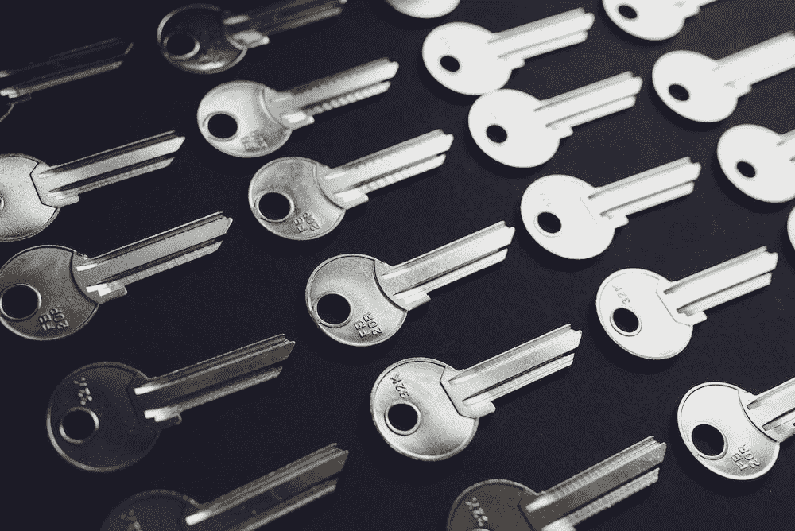

# 如何使用 SSH 进行无密码连接(无密码)

> 原文：<https://levelup.gitconnected.com/how-to-connect-without-password-using-ssh-passwordless-9b8963c828e8>

SSH 安全外壳协议是一个用于安全数据连接和远程命令执行的加密协议。

在本文中，我们将了解如何配置 SSH 以实现远程机器的无密码登录。

# 1.确保 SSH 服务器正在运行

运行以下命令启动 ssh 服务:`$ sudo service sshd start`或`$ sudo systemtcl start sshd`

使用`$ sudo service sshd status`或`$ sudo systemctl status sshd`检查服务状态

运行下面的命令，确保在重启系统时 sshd 服务仍然处于活动状态`$ sudo chkconfig sshd on`

# 2.连接到远程机器

运行命令`$ ssh remote_username@remote_server_ip_address`如果您是第一次登录该主机，您将会看到如下内容:

> **主机 XXXXXX 的真实性无法成立。**
> 
> **RSA 密钥指纹为 7c:E7:51:3b:86:70:07:ab:65:a9:BF:2d:c0:7b:1b:a7。**
> 
> **您确定要继续连接吗(是/否)？**

键入 yes，然后会要求您输入管理员用户登录机器的密码。恭喜你现在已经用密码连接到远程机器了，但是标题说它将是无密码的，不要惊慌，继续阅读这篇文章。

# 3.生成私钥和公钥

让我们回到本地主机，必须用命令创建一个密钥对:`$ ssh-keygen`

可以在 Windows 计算机上使用命令行或像 PuTTy 这样的 SSH 客户端来创建它们。

按下*回车*三次，直到命令结束。一个公钥文件"**~/*。ssh/id_rsa.pub"*** 和一个私钥文件" ***~/。将生成 ssh/id_rsa"*** 。

如果您对使用 ssh 的私有和公共密钥更感兴趣，请参考这篇文章。

# 4.将公钥文件复制到远程机器

现在您已经生成了一个 SSH 密钥对，为了能够在没有密码的情况下登录到您的机器，您需要将公钥复制到您想要管理的服务器。

`$ ssh-copy-id remote_username@remote_server_ip_address`

# 5.使用 SSH 密钥登录您的服务器

按照前面的说明操作后，您应该能够登录到远程服务器，而不需要输入密码。

要测试它，只需尝试通过 SSH 登录到您的服务器:

`$ ssh remote_username@remote_server_ip_address`

使用 ssh 远程用户名复制服务器的 IP 地址
如果一切顺利，您将立即登录。

# 结论

在本教程中，您已经学习了如何设置基于 SSH 密钥的认证，这使您无需输入用户密码就可以连接到远程服务器。同一个密钥可以添加到许多远程服务器上。并且不需要密码就可以连接。

如果您有任何疑问或建议，请留言。

我希望这些信息是有帮助的和有趣的，如果你有任何问题，或者你只是想打个招呼，我很乐意连接并回复你对我的博客的任何问题！欢迎访问我的 [**网站**](https://mohamedkhey.ml/) **了解更多**！

# 分级编码

感谢您成为我们社区的一员！在你离开之前:

*   👏为故事鼓掌，跟着作者走👉
*   📰查看[升级编码出版物](https://levelup.gitconnected.com/?utm_source=pub&utm_medium=post)中的更多内容
*   🔔关注我们:[Twitter](https://twitter.com/gitconnected)|[LinkedIn](https://www.linkedin.com/company/gitconnected)|[时事通讯](https://newsletter.levelup.dev)

🚀👉 [**加入升级人才集体，找到一份神奇的工作**](https://jobs.levelup.dev/talent/welcome?referral=true)