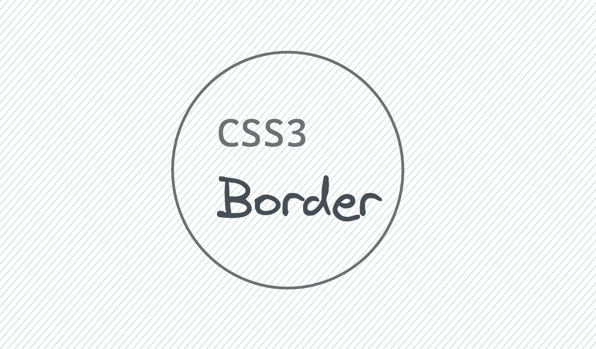
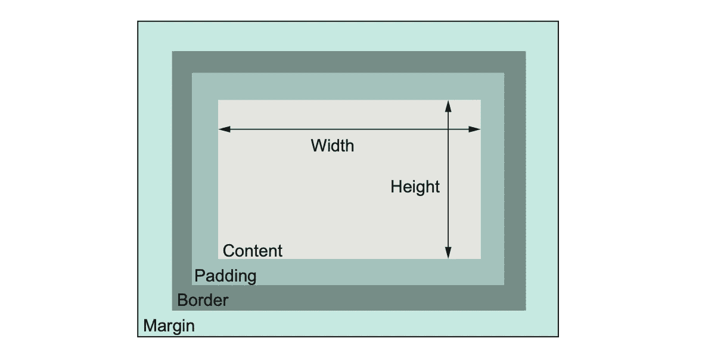
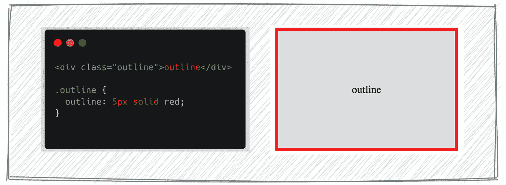
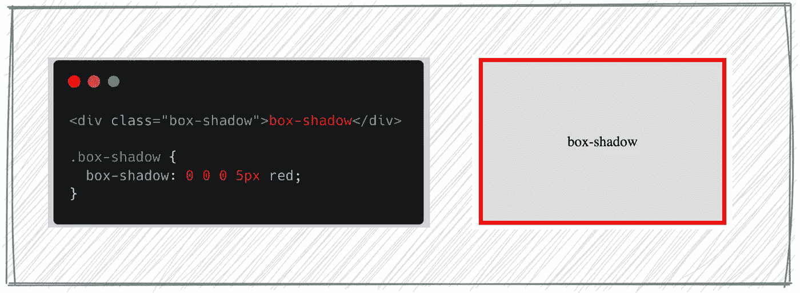
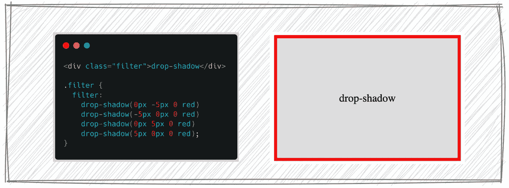
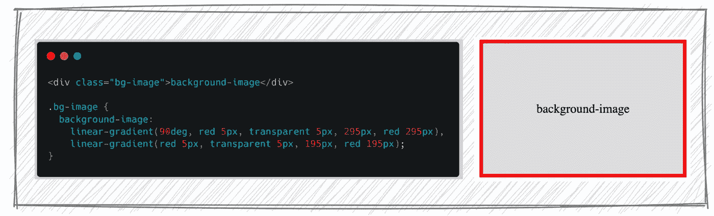

# 如何在不使用 CSS 边框的情况下构造元素边框

> 原文：<https://levelup.gitconnected.com/how-to-construct-an-element-border-without-using-csss-border-4a5c9fc7c9e6>

## 4 实现边框效果的方法

# 介绍

如您所知，每个文档元素都会生成一个名为*元素框的矩形框，*元素框描述了元素在文档布局中占据的空间量。在 CSS 中，我们使用盒子模型来处理元素的边距、填充和边框。

箱状模式

盒子模型的不同部分:

*   **内容** —显示文本和图像的框的内容。当您指定元素的高度或宽度时，默认情况下您正在设置内容大小。
*   **填充** —内容周围作为空白的区域，我们可以通过`padding`来确定其大小
*   **边框** —环绕填充和内容的边框，我们可以通过`border`来调整大小。
*   **Margin** —边框之外的区域，作为这个框和其他元素之间的空白，我们可以通过`margin`来确定它的大小。

我们可以用`border`给盒子添加一个边框，还有很多其他的方法。在这篇文章中，我将向你展示 4 种不用`border`构建元素边框的方法。

# 概述

CSS `outline`属性在不影响布局的元素周围绘制一个边框，使其非常适合突出显示。`outline`的用法与`border`相同:

# 箱形阴影

当我们想给元素添加阴影时,`box-shadow`属性非常有用。`box-shadow`的语法是:

> 框形阴影:插入| x 偏移| y 偏移|模糊半径|扩散半径|颜色

如果我们在没有模糊半径的情况下设置扩散半径，它将看起来像边界。

# 过滤器

属性是一个强大的工具，可以用来实现不同的视觉效果，如模糊，对比度等。它支持`drop-shadow()`功能，该功能将投影效果应用于元素。`drop-shadow()`功能类似于更成熟的`box-shadow`属性，不同的是`drop-shadow()`不支持设置扩散半径。我们可以使用函数来设置每个边元素的边界。

# 背景图像

属性在一个元素上设置一个或多个背景图像。我们可以通过 Photoshop 或其他软件创建边界图像，然后将其用作背景图像。这种方式在过去的几年里工作得很好，但是我们可以使用`[linear-gradient()](https://developer.mozilla.org/en-US/docs/Web/CSS/gradient/linear-gradient)`来创建一个由两种或多种颜色沿着一条直线逐渐过渡组成的图像。我们可以用两种颜色来达到边框的效果。

# 最后

我们通过使用轮廓，框阴影，过滤器，背景图像来实现边界的效果。当我们想要创建多重边界时，这是很有用的。可以在 Codepen.io 上测试一下:

希望这篇文章可以帮助你，你可以通过下面的文章学习更多实用的技巧:

 [## 如何只用 CSS 实现滚动到顶部](/how-to-implement-scroll-to-top-with-only-css-ae27cb9d4678) 

### [布局使用粘性标签，滚动使用](/how-to-implement-scroll-to-top-with-only-css-ae27cb9d4678)标签

levelup.gitconnected.com

 [## 不要使用变换使元素居中

### 一种更好的方法来使我们不知道大小的元素居中

levelup.gitconnected.com](/dont-use-transform-to-center-element-b378587ad1db) 

# 分级编码

感谢您成为我们社区的一员！在你离开之前:

*   👏为故事鼓掌，跟着作者走👉
*   📰查看[升级编码出版物](https://levelup.gitconnected.com/?utm_source=pub&utm_medium=post)中的更多内容
*   🔔关注我们:[Twitter](https://twitter.com/gitconnected)|[LinkedIn](https://www.linkedin.com/company/gitconnected)|[时事通讯](https://newsletter.levelup.dev)

🚀👉 [**加入升级人才集体，找到一份神奇的工作**](https://jobs.levelup.dev/talent/welcome?referral=true)