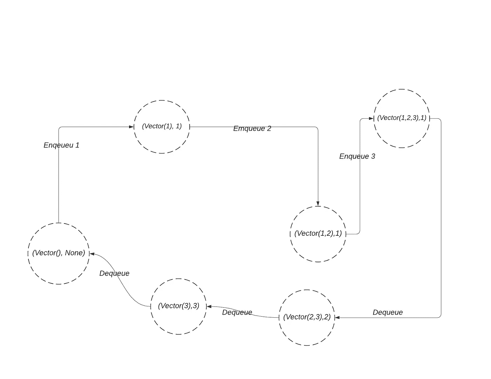

# 如何构造一个不可变的队列

> 原文：<https://levelup.gitconnected.com/how-to-construct-an-immutable-queue-9a8aec86caef>



*最初发表于*[](https://edward-huang.com/scala/functional-programming/algorithm/2020/03/11/how-to-construct-an-immutable-queue/)**。**

*当创建一个不可变的数据结构时，我们经常需要一个包含一些状态的程序，以便在执行过程中发生变化。*

*一个例子是创建一个不可变的队列。在 scala 库中，您初始化了一个不可变队列，如下所示:*

```
*val empty = Queue[Int]()*
```

*然后，您可以将队列入队，这将返回一个包含更新元素的新队列。您还可以使队列出队，这将返回您删除的元素的元组和新队列。*

```
*val one = empty.enqueue(1)
val (one, emptyQ) = one.dequeue()*
```

*但是，如果您想对不可变队列进行一系列操作，您需要将新元素传递给下一个操作。像这样:*

```
*val one = empty.enqueue(1)
val two = one.enqueue(2) *// enqueue from one* val three = two.enqueue(3) *// enqueue from two**
```

*如果您需要通过显式地将一种状态传递给另一种状态来执行许多操作，那么这很容易出错。*

*在本文中，我想分享如何使用 cats 状态单子来构造队列。通过使用状态 monad，构造不可变的数据结构不需要显式地将一个状态传递给另一个状态。因此，它减少了容易出错的样板文件的数量。*

# *执行顺序*

*我们从实现常规不可变队列开始，它展示了常规 scala 不可变队列的相同操作。然后，我们实现相同的不可变队列，但是使用了 Cats 状态单子。*

*声明:队列实现高度*

# *创建常规不可变队列*

*让我们创建队列的构造函数:*

```
*class FunctionalQueue[+A](vector:Vector[A])*
```

*FunctionalQueue 的主类包含一个向量，该向量包含所有排队或出列的元素。*

*让我们实现入队和出队函数:*

```
*def enqueue[B >: A](elmt:B): FunctionalQueue[B] = new FunctionalQueue(vector :+ elmt)
def dequeue: (A, FunctionalQueue[A]) = (vector.head, new FunctionalQueue[A](vector.tail))*
```

*enqueue 和 dequeue 函数只是将值附加到 vector 上，并从 vector 中检索值。*

*现在，通过定义 companion 对象为 FunctionalQueue 构造函数添加一个工厂方法。*

```
*object FunctionalQueue {
  def apply[A]():FunctionalQueue[A] = new FunctionalQueue[A](Vector.empty[A])
}*
```

*您可以调用 main 中的函数，就像这样:*

```
*println(s"creating immutable queue without State monad")
val functionalQueue = FunctionalQueue[Int]
println(s"enqueue 1 immutable queue")
val enqueue1 = functionalQueue.enqueue(1)
println(s"enqueue 2 immutable queue")
val enqueue2 = enqueue1.enqueue(2)
println(s"front ${enqueue2.front}")
val (head, rest) = enqueue2.dequeue
println(s"dequeue head: ${head}  rest : ${rest}")*
```

# *什么是状态单子*

*根据 [Scala with Cats](https://underscore.io/books/scala-with-cats/) ，状态单子允许我们传递额外的状态作为计算的一部分。*

*状态实例的表示是`State[S,A]`，这里表示函数`S => (S,A)`。*

*这意味着它接受某个状态，并返回一个结果以及新计算的状态。*

*让我们试着创建一个简单的状态:*

```
*import cats.data.State
val a = State[Int,String] {integerState =>
  (integerState, s"The state is ${state}")
}*
```

*在第一个输入变量准备好传入之前，状态连接所有的计算。程序全部连线后，可以传入初始状态，执行`run`得到预期的结束状态及其结果。*

```
*val (endState, result) = a.run(2).value *// 2 is the initial input that is passed in
// endState: 2 result : The state is 2**
```

*国家的力量在于地图和平面图功能。它可以将状态从一个实例传递到另一个实例。*

*每个状态代表一个单独的转换，您可以通过使用 flatMap 将它们组合起来，以转换完整的变更序列:*

*在下面的例子中，`plus1`和`plus2`返回计算出的新状态的值和该计算的描述历史。*

```
*import cats.data.State

val plus1 = State[Int, String]{state =>
  (state+1, s"The result of this state is ${state+1}")
}

val plus2 = State[Int,String] {state =>
  (state +2, s"The result of this state is ${state+2}")
}

val program = for {
  historyOne <- plus1 *// historyOne is the String
*  historyTwo <- plus2
} yield List(historyOne, historyTwo)

val (result, history) = program.run(0).value
*// result = 3
// history = List("The result of this state is 1","The result of this state is 3" )**
```

*如你所见，`plus1`和`plus2`是线程化的，即使我们没有为了理解而与之交互。*

# *用状态单子重构函数队列*

*现在你知道了状态单子是如何工作的，让我们通过使用状态单子来重构函数队列。*

*用状态单子实现`enqueue`和`dequeue`。*

```
*type QueueFunc[A] = State[Vector[A], Option[A]]

def enqueue[A](elmt:A): QueueFunc[A] = State[Vector[A], Option[A]]{ oldVector =>
    (oldVector :+ elmt, oldVector.headOption)
  }

def dequeue[A]: QueueFunc[A] = State[Vector[A],Option[A]] { oldVector =>
  (oldVector.tail, oldVector.headOption)
}*
```

*我创建了`QueueFunc`作为代表`State[Vector[A], Option[A]]`的类型别名。状态包含一个向量，该向量包含一个类型`A`和可选的队列头。函数 enqueue 和 dequeue 接受一个旧的向量，并添加或删除向量的头部。*

*现在，我们已经用 State 完成了不可变队列的所有实现！*

*你如何运行这个功能？*

*让我们用我们的新实现执行与`FunctionalQueue`相同的操作。*

*请记住，我们使用 flatMap 来组合每个操作，而没有真正与它的更新状态进行交互。*

*我们提供所有预期的执行步骤。然后，我们给它连接一个程序，提供它的初始状态并执行`run`函数。在这种情况下，初始值是一个空向量。*

```
**// supply our operation* val program = for {
  _ <- enqueue[Int](1)
  _ <- enqueue[Int](2)
  end <- dequeue[Int]
} yield end

val (newState, head) = program.run(Vector.empty[Int]).value
*// newState = Vector(2)
// head = 1**
```

# *外卖食品*

*   *状态单子帮助您消除所有容易出错的样板代码，这些代码将更新后的状态传递给下一个操作。*
*   *状态 monad 实例传入一个状态，并返回结果及其更新后的状态。*
*   *状态单子的能力依赖于`map`和`flatMap`操作，它们将一个实例线程化到另一个实例。每个状态实例代表一个原子转换。它们的组合代表了一系列的变化。你不需要为了理解而与中间状态进行交互。*

*所有信息和示例都在 [Github 中。](https://github.com/edwardGunawan/Blog-Tutorial/blob/master/ScalaTutorial/catsStateMonad/README.md)*

*GitHub 信息有 3 种不同的方法来实现不可变队列。第一个是没有状态 monad 的常规不可变队列(第一个例子)。第二个用状态单子模仿常规的不可变队列接口——最后一个用状态单子实现稳定状态(本文的第二个例子)。*

***感谢阅读！如果你喜欢这篇文章，请随意订阅我的时事通讯中的**[](https://edward-huang.com/subscribe/)****来接收关于科技职业的每周文章、有趣的链接和内容！*****

***你可以关注我，也可以在[媒体](https://medium.com/@edwardgunawan880)上关注我，以获得更多类似的帖子。***