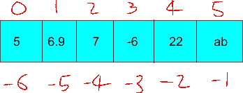
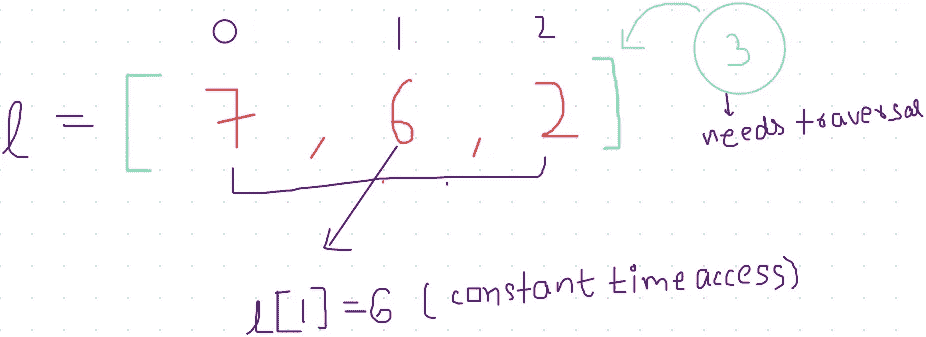
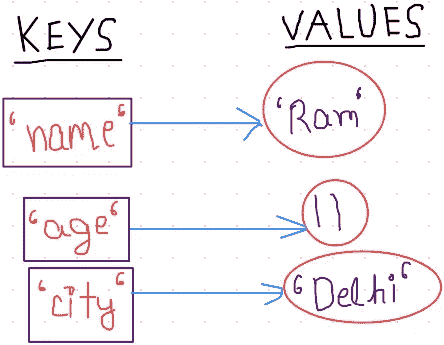
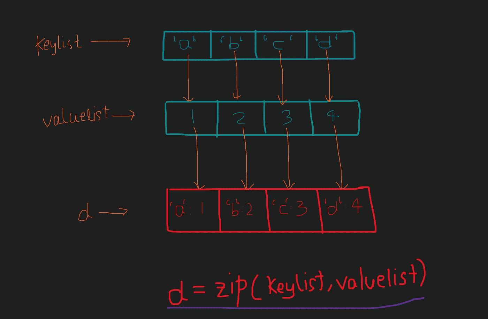

# 如何在 Python 中将列表转换成字典

> 原文：<https://levelup.gitconnected.com/how-to-convert-a-list-to-a-dictionary-in-python-f2c809e808e7>

在我们深入研究列表到字典的转换之前，让我们先了解它们到底代表什么，以及我们为什么要使用它们。

列表和字典是数据结构的一种。你可能会问什么是数据结构？

答案本身就在于名字。数据结构简单地意味着某种用于以高效和有效的方式处理、存储和使用数据的结构。它们有助于组织数据，以便快速完成各种操作，如插入、删除、更新。我们可以把它和我们的房间联系起来。就像在我们的房间里，每样东西都有一个放置的地方，所有的商品都摆放得井井有条，那么我们就很容易在房间里找到任何东西。同样，使用数据结构的主要目的是让我们的工作变得简单高效。

## 目录

列表是一种线性数据结构，能够将不同数据类型的值一起存储在一个位置。python 中列表的一些关键特性是:-

*   它们在本质上是**动态的**，这实质上意味着它们的大小是不固定的。仅这一特性就使它们非常有用。
*   可以使用索引来访问列表的值。
*   单个列表可以存储不同数据类型的数据。



*   指数可以是正数，也可以是负数。

## 列表的不同功能:[运行代码](https://www.interviewbit.com/snippet/f98daeedf4a392aa05be/)

Python 提供了许多与列表相关的函数。让我们通过一些实际的代码来看到它们并逐一理解它们:-

```
# initialize and empty list
l  = []
# insert one single element in the list
l.append(5)# insert multiple elements in the list
l.append(6.9)
l.append(7)
l.append(-6)print("List after insertions: ",l) # l = [5,6.9,7,-6] → current state of the list# access and print an element from the list using both positive and #negative indexes
print("Access element from positive and negative index:",l[3],l[-1]) # -6,-6# removing an element from the list
l.remove(7)
# [5,6.9,-6]# iterating in a list
print("Print list using iteration")
for i in range(0,len(l)):
    print(l[i])Output:-
List after insertions:  [5, 6.9, 7, -6]
Access element from positive and negative index: -6 -6
Print list using iteration
5
6.9
-6
```

*   **append()** :该函数用于在列表末尾插入一个元素
    *语法:* listName.append(element)
*   **remove()** :该函数用于从列表中移除一个元素
    *语法:* listName.remove(element)
*   **len()** :该函数用于查找列表的长度
    *语法:* len(listName)

**列表操作的时间复杂度**

假设一个列表中有 N 个元素，让我们观察一下各种操作的时间复杂度:-

*   **插入**:由于我们必须遍历整个列表以在列表末尾插入/附加一个元素，所以插入的时间复杂度将是 **O(N)** 。
*   **删除**:在这种情况下，我们也必须遍历数组来找到我们想要删除的元素，因此删除的时间复杂度将是 **O(N)** 。
*   **访问 ith 元素**:因为我们可以使用它访问列表中的任何元素，所以这个操作的索引时间复杂度是 **O(1)** 。



## 词典

这是另一种以键值对形式存储数据的数据结构。在内部，他们使用散列的概念来产生这些对。

它们用在需要任何类型的**映射**的地方。它是一种非常强大的数据结构，不仅经常用于优化解决方案，还用于以有意义的方式存储数据。最常见的例子是在 **JSON** 中使用字典。JSON 中的数据存储在键值对中，这使得它易于理解和使用。字典的一些主要特征是:-

*   为了在字典中存储数据，必须始终指定一个键和值。



*   字典的键必须是唯一的和不可变的。
*   字典的值可以是任何数据类型。
*   访问值的方法有很多种，但最简单的方法是通过键，就像列表的值可以通过索引来访问一样，在字典中也可以使用键。

```
def dictionary_operations():
    # Create an dictionary 
    d = {}# Add elements in a dictionary 
    d['a'] = 1
    d['b'] = 2
    d['c'] = 3# Print the dictionary
    print("Print the dictionary")
    print(d)print("Iterate and print the key value pairs in the dictionary")# iterate and print the dictionary
    for i in d:
        print(i,d[i])
dictionary_operations()[OUTPUT](https://www.interviewbit.com/snippet/62694e13bf53e55fa363/)
Print the dictionary
{'c': 3, 'a': 1, 'b': 2}
Iterate and print the key value pairs in the dictionary
c 3
a 1
b 2
```

## 列表到词典的转换:

1.  **两个相同大小的不同列表:**在这个 will 中，我们有两个独立的列表，其中一个列表的元素作为键，另一个作为值。

```
keyList = ['a','b','c','d']
valueList = [1,2,3,4]
d = {}
for i in range(len(keyList)):
    d[keyList[i]] = valueList[i]
print(d)[Output](https://www.interviewbit.com/snippet/4f0ca5aedeea4b3141c4/) : {'d': 4, 'a': 1, 'c': 3, 'b': 2}
```

**注意:**在上面的例子中，因为字典是无序的，所以键-值对将完美地配对，但是它们的顺序没有被保持。为此，我们可以使用 zip()函数。



上面已经演示了 zip()函数的工作方式。

```
keyList = ['a','b','c','d']
valueList = [1,2,3,4]
d = zip(keyList,valueList)
# since zip returns an object we need to change it to dictionary
d = dict(d)
print(d)[Output](https://www.interviewbit.com/snippet/68bcc60bb452396d2614/) : {'a': 1, 'c': 3, 'b': 2, 'd': 4}
```

**2。单列表**

在这种情况下，我们必须用下面给出的键和值从单个列表中创建一个字典:

输入:['x '，1，' y '，2，' z '，3]
输出:{'x': 1，' y': 2，' z': 3}

```
a = ['x', 1, 'y', 2, 'z', 3]# First we have to create an iterable of the array 
# To use the zip function later oniterable = iter(a)
resultantDict = dict(zip(iterable,iterable))
print(resultantDict)[output](https://www.interviewbit.com/snippet/a06208859e4a051e01f3/):{'x': 1, 'y': 2, 'z': 3}
```