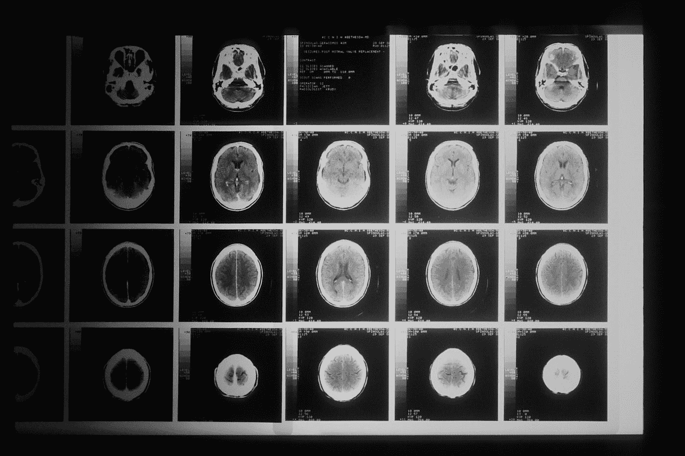

# 如何使用 Python 将 Nifti 文件转换成 Dicom 系列

> 原文：<https://levelup.gitconnected.com/how-to-convert-a-nifti-file-into-dicom-series-using-python-442e0ac39d4e>

## 医学成像

## Nifti 到 Dicom

我网站的原文章是[这里](https://pycad.co/nifti2dicom/)。

[国立癌症研究所](https://unsplash.com/@nci?utm_source=medium&utm_medium=referral)在 [Unsplash](https://unsplash.com?utm_source=medium&utm_medium=referral) 上拍摄的照片

# 摘要

在我计算机视觉硕士学位的实习期间，我参与了一个使用 U-Net 分割全身肿瘤的项目。

这是一个困难的项目；我有很多任务要完成，包括 [*数据准备*](https://pycad.co/preprocessing-3d-volumes-for-tumor-segmentation-using-monai-and-pytorch/) 。因此，在数据准备方面，我尝试了各种方法来提高我的结果。反正这不是我们的话题。我在准备数据时做的一件事是制作小的 nifti 文件，每个文件有 128 个切片。另一方面，我的数据集是一组随机切片的病人。因此，我需要先将这些患者转换成 dicom 文件，然后再创建具有所需切片数量的小 nifti 文件。

我们都知道没有这样的库或者函数可以把 nifti 文件转换成 dicoms，所以我很纠结的用软件 3D slicer 一个一个的手动转换文件。我花了很长时间才完成这一转变。

我当时并没有考虑编写自己的函数来完成转换；也许我懒得去想它。但是现在我决定让任何需要这种转换的人都可以使用它。

甚至创建一个将 nifti 文件转换成 dicom 系列的函数的概念也很简单；所需要做的就是从 nifti 文件中返回帧数据，将其分成切片，然后将每个切片转换成一个 dicom。

这个转换的灵感来自于我写的一个函数 [*将 JPG 或 PNG 图像转换成 DICOM*](https://pycad.co/convert-jpg-or-png-images-into-dicom/)。

因此，在这篇博客中，我将展示创建这样一个函数是多么简单，让您的生活变得更加轻松。

# 台阶

*   使用预先存在的 dicom 文件。
*   我们需要的包裹。
*   从 nifti 文件中提取帧数据。
*   准备要转换的阵列。
*   将一个 nifti 文件转换成 dicom 系列。
*   将多个 nifti 文件转换为多个 dicom 系列。

# 使用预先存在的 dicom 文件

您可能想知道，如果我们试图转换成 dicom，为什么我们需要 dicom 文件。答案可以在我们从 JPG 转换到 dicom 的博客上找到。因为当我们想要创建一个 dicom 文件时，我们不能仅仅把像素数据放进去，因为一个 dicom 文件包含的信息不仅仅是像素的值。没有另一个 dicom 文件的帮助，我们无法提供这些信息。因此，我们必须使用现有的 dicom 文件，并修改其信息以匹配我们所拥有的(需要的)。

如果你没有 dicom 文件，不用担心；我将提供一个 Github 链接，您可以在那里用预先存在的 dicom 文件克隆项目。

# 我们需要的包裹

和其他程序一样，我们需要一些包来完成这个转换，所以在这个项目中，您需要单独安装下面的包。

*   尼巴贝尔:`***pip install nibabel***`
*   pydicom: `***pip install pydicom***`
*   numpy: `***pip install numpy***`
*   tqdm: `***pip install tqdm***`(这个只是打印转换的进度)

# 从 nifti 文件中提取帧数据

首先，我们必须从 nifti 文件中提取帧数据(像素数组)以便转换它。该数组是一个每行有一个切片的矩阵。因此，我们将每个切片(行)转换成 dicom。

要做到这一点，您可以使用 nibabel lib 来加载 nifti 文件，然后有一个名为`***get_fdata***`的函数用于帧数据，这个函数将提取像素数组(它将是一个 numpy 数组)。

# 准备要转换的阵列

提取帧数据后，我们必须对其进行准备，以便将其转换为 dicoms。不要担心准备工作。我们必须先将像素值转换成 16 位的无符号整数，然后再获取一个预先存在的 dicom 文件，并填入一些参数来改变我们的值(宽度、高度等)。
这是我创建的函数(它与用于 jpg 和 png 的函数相同)。

就这样，设置好这些参数后，我们就可以使用 pydicom 库中的 save 函数保存数组了。

> **注意:**这个函数将只转换一个切片，所以要转换一个 nifti 文件，我们必须通过所有的切片传递这个函数(在下一步中)。

# 将一个 nifti 文件转换成 dicom 系列

正如我在上一段提到的，函数`***convertNsave***`将只转换一个切片。

为此，我创建了函数`***nifti2dicom_1file***`,以便您可以使用它直接转换一个 nifti 文件，在下一步中，我将向您展示如何转换多个 nifti 文件。

下面是转换一个文件的函数`***nifti2dicom_1file***`:

正如你所看到的，函数`***convertNsave***`是这个函数的核心。我只在这个函数中添加了一个循环来遍历所有的切片(我知道这很容易，但是我想让它准备好，以便您可以直接使用它)

# 将多个 nifti 文件转换为多个 dicom 系列

现在要转换多个 nifti 文件，我们将只使用函数`***nifti2dicom_1file***`，但是我们使用一个循环多次调用它。下面是实现这一点的脚本:

这就是完成转换所需的所有代码；当然，我将提供 GitHub 链接，这样您就可以简单地克隆存储库并使用这些功能。

 [## GitHub - amine0110/nifti2dicom

### 该库包含将 nifti 文件转换为 dicom 系列的完整代码。我需要这种转换在…

github.com](https://github.com/amine0110/nifti2dicom) 

> 订阅[我的时事通讯](https://astounding-teacher-3608.ck.page/136bdb1fbe)获取所有关于我工作的更新:)。

# 你想学医学影像的深度学习！

即将推出全面的医学成像课程，涵盖使用 Monai 和 PyTorch 的 2D 和 3D 分割，并提供额外支持。加入等候名单以接收任何课程更新的通知。

 [## 医学成像深度学习登录页面- PYCAD

### 使用 Monai 和 PyTorch 的医学成像中的 2D 和 3D 分割。

pycad.co](https://pycad.co/monai-and-pytoch-for-medical-imaging/) 

# 关于作者

> 穆罕默德·艾尔·阿明·莫赫塔里是我的名字。我是计算机视觉领域的研究助理(博士生),从事在线内容的创作。我在 [YouTube](https://www.youtube.com/channel/UCdYyILlPlehK4fKS5DiuMXQ) 上创建视频，在[Udemy](https://www.udemy.com/user/pycad-2/)/[Skillshare](https://www.skillshare.com/user/pycad)上创建课程，并且是 Medium 上的一名作家，此外我还在自己的网站 [Pycad](https://pycad.co/) 上创建了一个作品集，用来分享我所有的知识和作品。有时间的话请看一下:)。

如果你还不是*的中级会员，我建议你马上注册，这样你就可以不受限制地阅读成千上万的文章，包括我的。*

*你可以使用我的 [*推荐链接*](https://pycad.medium.com/membership) ，我会从你的会员资格中收取一小笔佣金:)*