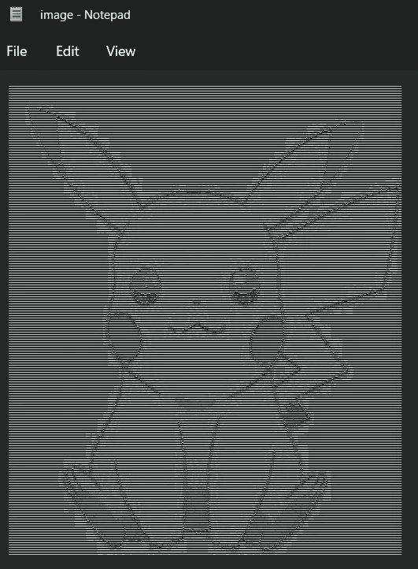

# 如何用 Python 通过 5 个步骤将图像转换成 ASCII 艺术

> 原文：<https://levelup.gitconnected.com/how-to-convert-an-image-to-ascii-art-with-python-in-5-steps-efbac8996d5e>


拿着我的像素走人！

在这篇简单明了的文章中，我们将用 Python 将一幅图像转换成 ASCII 字符。

如果你是一个寻找新挑战的初级开发人员，这可能是一个很好的练习！

## 1.ASCII 字符映射表

首先，我们将创建一个包含所有字符的*字符串*，用于生成 ASCII 艺术

```
ascii_characters_by_surface = "`^\",:;Il!i~+_-?][}{1)(|\\/tfjrxnuvczXYUJCLQ0OZmwqpdbkhao*#MW&8%B@$"
```

这些字符是根据它们在渲染时所占据的表面进行排序的。例如，字符“ **`** ”在屏幕上使用最小的表面，而字符“ **$** ”具有最大的面积。

## 2.计算像素的亮度

像素将被表示为三个整数的元组，其值在 0 到 255 之间，相当于红色、绿色和蓝色值。

这些值越高，像素越亮。例如，一个白色像素将被表示为(255，255，255)。

因此，我们将对三个整数场求和，以决定像素有多亮。

这也意味着我们可以获得的像素亮度的最大值将是 765——白色像素的亮度 *(255 +255 +255)* 。

```
(r, g, b) = pixel
pixel_brightness = r + g + b
max_brightness = 255 * 3
```

## 3.将像素转换为字符

现在，我们可以将像素转换成 ASCII 字符。

首先，我们需要计算亮度权重。为此，我们将 ASCII 字符列表的长度除以最大亮度值。

```
brightness_weight = len(ascii_characters_by_surface) / max_brightness
```

之后，对于给定的像素，我们可以从 ASCII 字符列表中找到其对应的索引，如下所示:

```
index = int(pixel_brightness * brightness_weight) - 1
```

最后，我们可以通过返回对应于该索引的字符来将像素转换为字符:

```
return ascii_characters_by_surface[index]
```

## 4.解析图像

我们将使用 *Pillow* 模块加载一幅图像，读取它的所有像素，并将它们转换成(r，g，b)元组。

首先，我们需要导入模块并读取图像:

```
from PIL import Image

image = Image.open('image.jpg')
(width, height) = image.size
```

之后，我们将遍历所有像素并逐个读取它们:

```
for y in range(0, height - 1):
    for x in range(0, width - 1):
        px = image.getpixel((x, y))
```

我们将这些像素映射到相应的 ASCII 字符，并为图像的每一行创建一个字符串:

最后，我们将把所有内容写入一个文本文件:

让我们在一个代码片段中查看所有代码:

## 5.玩得开心！

在文本编辑器中打开结果文件，缩小以查看更大的图片。

现在，运行应用程序并分享您的最佳结果。



# 分级编码

感谢您成为我们社区的一员！在你离开之前:

*   👏为故事鼓掌，跟着作者走👉
*   📰查看[升级编码出版物](https://levelup.gitconnected.com/?utm_source=pub&utm_medium=post)中的更多内容
*   🔔关注我们:[Twitter](https://twitter.com/gitconnected)|[LinkedIn](https://www.linkedin.com/company/gitconnected)|[时事通讯](https://newsletter.levelup.dev)

🚀👉 [**加入升级达人集体，找到一份惊艳的工作**](https://jobs.levelup.dev/talent/welcome?referral=true)